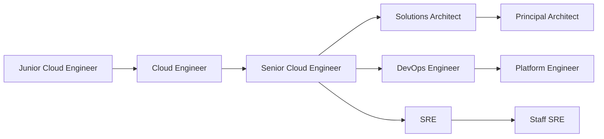

# Career Paths

Guided career paths for cloud engineering roles — from junior to architect.

## Cloud Engineering Roles

## Role Descriptions

| Role | Experience | Focus |
|---|---|---|
| **Junior Cloud Engineer** | 1-2 years | Fundamentals, basic services |
| **Cloud Engineer** | 3-5 years | Core services, automation |
| **Senior Cloud Engineer** | 5-8 years | Architecture, leadership |
| **Solutions Architect** | 5-10 years | System design, cost optimization |
| **DevOps Engineer** | 3-8 years | CI/CD, IaC, automation |
| **SRE** | 5-10 years | Reliability, observability, incident response |

:::tip Coming Soon
Detailed career path guides are being developed. Check the [Roadmap](/reference/roadmap) for timeline.
:::
