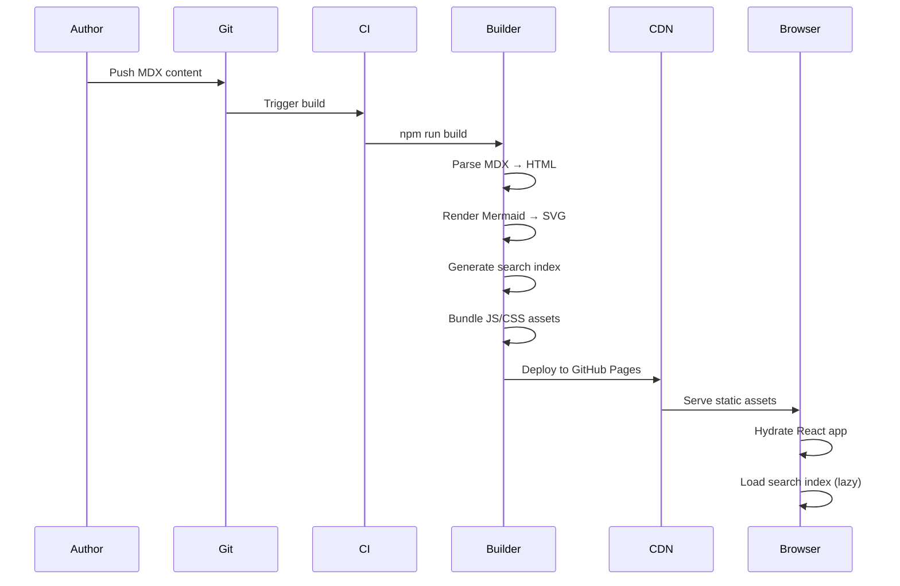
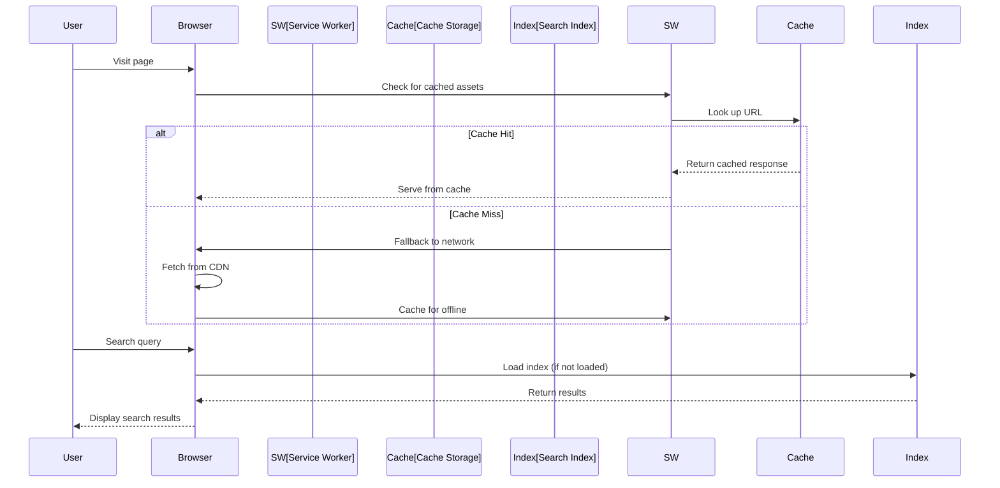

displayed_sidebar: devSidebar

# Data Flow

## Content Pipeline

## Runtime Data Flow

## Build Artifacts

| Artifact           | Location                  | Purpose                |
| ------------------ | ------------------------- | ---------------------- |
| Static HTML        | `build/`                  | SEO, fast initial load |
| JavaScript bundles | `build/assets/js/`        | Interactive features   |
| CSS bundles        | `build/assets/css/`       | Styling                |
| Search index       | `build/search-index.json` | Client-side search     |
| Service worker     | `build/sw.js`             | PWA offline support    |
| Web manifest       | `build/manifest.json`     | PWA installation       |
| Mermaid SVGs       | Inline in HTML            | Diagrams               |
| Optimized images   | `build/assets/images/`    | Responsive images      |
