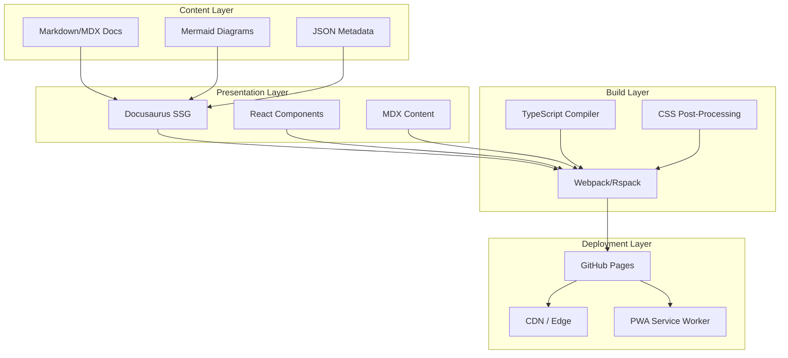

displayed_sidebar: devSidebar

# Architecture Overview

The Cloud Engineering Learning OS is built on a **modular, layered architecture** designed for extensibility and long-term maintainability.

## High-Level Architecture

## Design Principles

### 1. Content-First

All educational content lives in **Markdown/MDX files** with structured frontmatter. This ensures:

- Content is portable and version-controlled
- AI systems can parse and index content
- Contributors need minimal technical knowledge

### 2. Modular by Feature

Each platform feature (curriculum, lessons, labs, career, certifications) is a **self-contained module** with:

- Its own directory structure
- Its own metadata schema
- Its own sidebar configuration
- Loose coupling with other modules

### 3. Progressive Enhancement

The platform works at multiple levels:

1. **Static HTML** — Basic content, no JavaScript required
2. **Enhanced** — Interactive diagrams, search, dark mode
3. **PWA** — Offline access, installable, push notifications

### 4. AI-Ready

All content includes structured **frontmatter metadata** that describes:

- Content category and difficulty
- Learning objectives
- Prerequisites and dependencies
- Estimated time to complete
- Tags and keywords for search/classification

### 5. Future-Proof

The architecture supports future integration of:

- **AI Tutor** — Consumes metadata to provide contextual help
- **Interactive Simulators** — WebAssembly-based cloud sandboxes
- **Knowledge Graph** — Neo4j or graph-based concept relationships
- **Real Labs** — Provisioned cloud environments via API

## Technology Decisions

| Decision                                | Rationale                                                     |
| --------------------------------------- | ------------------------------------------------------------- |
| **Docusaurus over Next.js**             | Purpose-built for documentation; MDX native; plugin ecosystem |
| **TypeScript over JavaScript**          | Type safety for large codebases; better IDE support           |
| **MDX over plain Markdown**             | Embed interactive React components directly in content        |
| **Mermaid over external tools**         | Version-controlled diagrams; rendered at build time           |
| **Local search over Algolia**           | Zero-cost; works offline; no external dependency              |
| **CSS custom properties over Tailwind** | Simpler theming; no build dependency for styles               |
