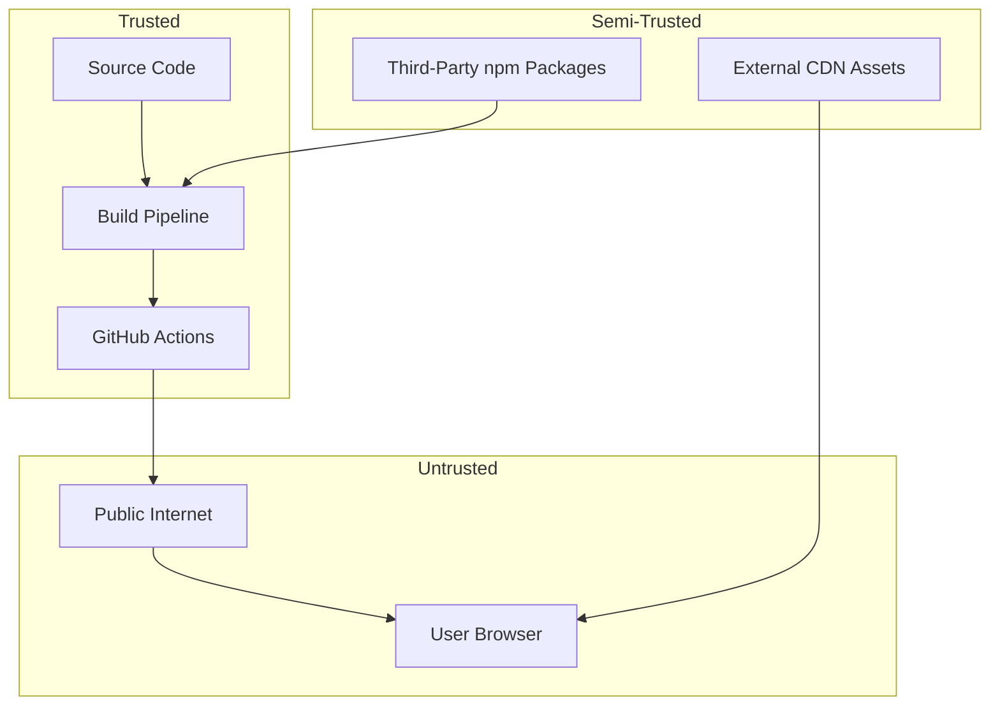

displayed_sidebar: devSidebar

# Security Model

## Overview

As a static site, the Cloud Engineering Learning OS has a **reduced attack surface** compared to server-rendered applications. However, security is still carefully considered.

## Security Boundaries

## Security Measures

### Content Security

- All content is **static** — no server-side execution
- No user-generated content (UGC) in Phase 1
- MDX is processed at **build time**, not runtime
- No eval() or dynamic code execution

### Dependency Security

- Dependencies are pinned to specific versions in `package.json`
- `package-lock.json` ensures reproducible installs
- Regular `npm audit` for vulnerability scanning
- GitHub Dependabot enabled for automated updates

### Transport Security

- GitHub Pages serves all content over **HTTPS**
- HSTS enforced by GitHub Pages
- No mixed content — all assets served over HTTPS

### PWA Security

- Service worker scope is limited to the app's path
- Cache is cleared on new deployments
- No sensitive data stored in client-side caches

### Build Pipeline Security

- GitHub Actions run in isolated environments
- Secrets managed via GitHub Secrets
- Build artifacts are immutable
- No secrets baked into client-side code

## What We Don't Handle (Yet)

| Concern            | Phase   | Plan                                     |
| ------------------ | ------- | ---------------------------------------- |
| **Authentication** | Phase 3 | OAuth2 / OpenID Connect                  |
| **User Data**      | Phase 3 | Serverless backend for progress tracking |
| **API Keys**       | Phase 4 | Backend proxy for third-party APIs       |
| **Payments**       | Phase 5 | Stripe integration for premium content   |

## Reporting Vulnerabilities

If you discover a security vulnerability, please **do not** open a public issue. Instead, email the maintainers directly. See [SECURITY.md](https://github.com/apexdataro-Fin/AEP/security) for details.
