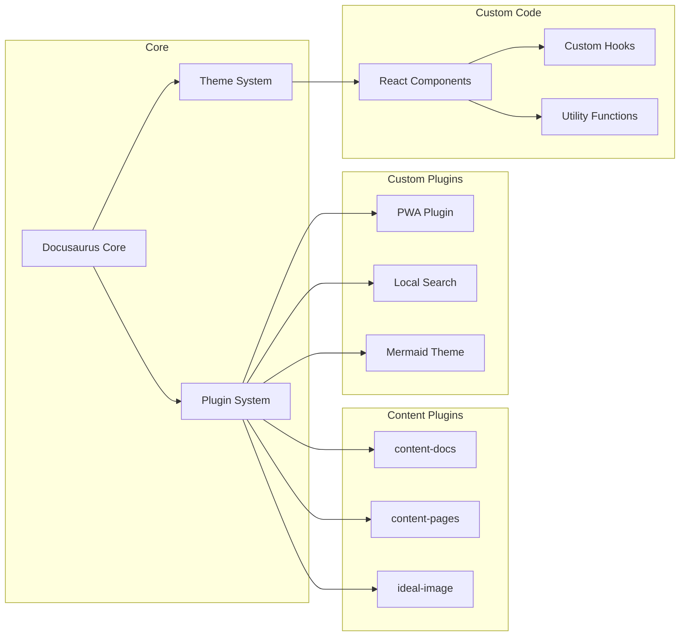

# System Design

## Component Architecture



## Data Flow

### Build Time
1. Docusaurus scans `docs/`, `curriculum/`, `lessons/`, etc.
2. MDX files are parsed — frontmatter extracted, Markdown rendered
3. React components are rendered to static HTML
4. Mermaid diagrams are converted to SVG
5. Search index is generated from page content
6. Service worker and PWA manifest are bundled
7. Static assets are optimized and hashed

### Runtime (Client)
1. Initial HTML loads (fast, SEO-friendly)
2. React hydrates the page (interactive)
3. Service worker caches assets for offline use
4. Search index loads lazily on first search interaction
5. Dark mode preference is read from system or localStorage

## Directory Organization

```
docs/
├── intro.md                    # Landing page (/)
├── architecture/               # Architecture documentation
│   ├── overview.md             #   → /architecture
│   ├── system-design.md        #   → /architecture/system-design
│   ├── data-flow.md            #   → /architecture/data-flow
│   ├── technology-stack.md     #   → /architecture/technology-stack
│   └── security-model.md       #   → /architecture/security-model
├── development/                # Development documentation
│   ├── overview.md
│   ├── getting-started.md
│   ├── environment-setup.md
│   ├── project-structure.md
│   ├── workflows.md
│   ├── testing.md
│   └── deployment.md
├── standards/                  # Standards and conventions
│   ├── overview.md
│   ├── style-guide.md
│   ├── naming-conventions.md
│   ├── code-quality.md
│   ├── documentation-standards.md
│   ├── content-standards.md
│   └── metadata-guide.md
├── guides/                     # How-to guides
│   ├── overview.md
│   ├── mermaid-guide.md
│   ├── ai-integration.md
│   ├── contributing.md
│   └── knowledge-graph-guide.md
└── reference/                  # Reference material
    ├── overview.md
    ├── glossary.md
    ├── roadmap.md
    ├── changelog.md
    ├── quality-standards.md
    └── api-reference.md
```

## Content Schema

Every MDX document follows a standardized frontmatter schema:

```yaml
---
sidebar_position: number
title: string
slug: string
description: string
keywords: string[]
ai_metadata:
  category: string
  difficulty: beginner | intermediate | advanced
  estimated_time_minutes: number
  prerequisites: string[]
  tags: string[]
  learning_objectives: string[]
---
```
