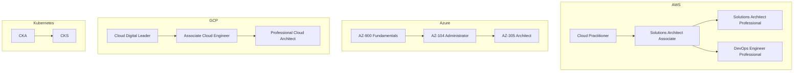

# Certifications

Certification exam preparation — AWS, Azure, GCP, Kubernetes, and more.

## Certification Roadmap

## Available Certifications

| Provider  | Associate                              | Professional                    | Specialty                |
| --------- | -------------------------------------- | ------------------------------- | ------------------------ |
| **AWS**   | Solutions Architect, Developer, SysOps | Solutions Architect, DevOps     | Security, Networking, ML |
| **Azure** | AZ-104 Administrator, AZ-204 Developer | AZ-305 Architect, AZ-400 DevOps | Security, Data, AI       |
| **GCP**   | Associate Cloud Engineer               | Cloud Architect, Data Engineer  | Security, ML, Networking |
| **CNCF**  | CKA, CKAD                              | CKS                             | —                        |

:::tip Coming Soon
Certification preparation guides are being developed. Check the [Roadmap](/docs/reference/roadmap) for timeline.
:::
