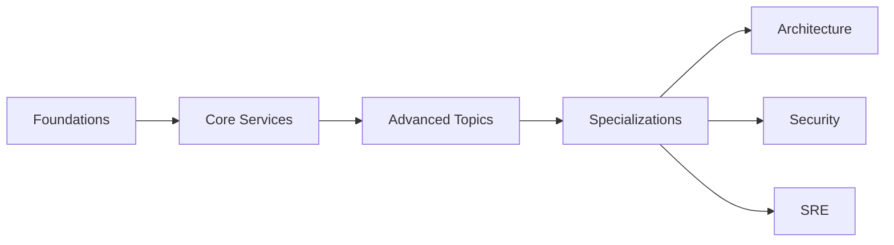

# Curriculum

Structured learning paths to master cloud engineering — from fundamentals to advanced topics.

## Learning Paths

| Path                  | Duration        | Target Role                                 |
| --------------------- | --------------- | ------------------------------------------- |
| **Cloud Foundations** | 4 weeks         | Junior Cloud Engineer                       |
| **Core Services**     | 8 weeks         | Cloud Engineer                              |
| **Advanced Topics**   | 12 weeks        | Senior Cloud Engineer                       |
| **Specializations**   | 8-12 weeks each | Solutions Architect, Security Engineer, SRE |

:::tip Coming Soon
Full curriculum content is being developed. Check the [Roadmap](/docs/reference/roadmap) for timeline.
:::
