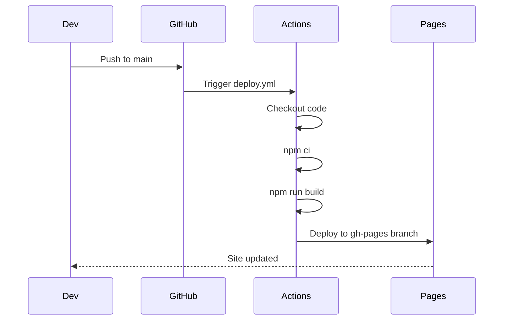

displayed_sidebar: devSidebar

# Deployment

## GitHub Pages

The platform is deployed to **GitHub Pages** via GitHub Actions.

### Automatic Deployment

Every push to `main` triggers the deployment workflow:



### Manual Deployment

```bash
# Build the site
npm run build

# Deploy using Docusaurus
npm run deploy
```

Or using environment variables:

```bash
GIT_USER=<your-github-username> npm run deploy
```

## Environment Configuration

The deployment uses these settings from `docusaurus.config.ts`:

```typescript
url: "https://apexdataro-fin.github.io";
baseUrl: "/AEP/";
organizationName: "apexdataro-Fin";
projectName: "AEP";
```

## Build Output

The `build/` directory contains:

```
build/
├── index.html
├── 404.html
├── manifest.json
├── robots.txt
├── search-index.json
├── sw.js
├── assets/
│   ├── css/
│   ├── js/
│   └── images/
└── (all static HTML pages)
```

## CI/CD Pipeline

The GitHub Actions workflow (`.github/workflows/deploy.yml`):

1. Checks out the repository
2. Sets up Node.js
3. Runs `npm ci` (clean install)
4. Runs `npm run validate` (typecheck + format)
5. Runs `npm run build`
6. Deploys to the `gh-pages` branch

## Post-Deployment Verification

After deployment, verify:

1. **HTTPS** — Site loads over HTTPS
2. **Base URL** — All assets load with correct `/AEP/` prefix
3. **PWA** — Service worker registers, manifest loads
4. **Search** — Search index is generated and functional
5. **Dark Mode** — Color scheme switches correctly
6. **404 Page** — Custom 404 handles invalid URLs
