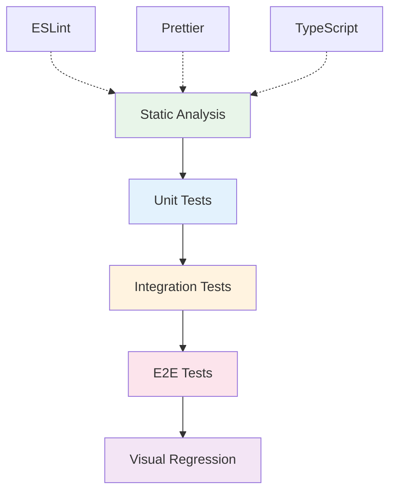

# Testing

## Testing Strategy

The Cloud Engineering Learning OS employs a **layered testing approach**:



## Static Analysis

Run before every commit:

```bash
npm run typecheck   # TypeScript type checking
npm run lint        # ESLint for code quality
npm run format:check # Prettier format validation
npm run validate    # All three at once
```

## Content Validation

```bash
node scripts/validate-content.js
```

Checks:
- All MDX files have required frontmatter
- Links are not broken
- Images have alt text
- Metadata schema compliance

## Build Verification

```bash
npm run build       # Production build
npm run serve       # Serve and visually inspect
```

The build will:
- Catch broken links (`onBrokenLinks: "warn"`)
- Validate Mermaid diagrams
- Check TypeScript compilation
- Generate search index

## Manual Testing Checklist

Before opening a PR:

- [ ] `npm run validate` passes
- [ ] `npm run build` succeeds
- [ ] `npm run serve` renders correctly
- [ ] Dark mode toggle works
- [ ] Search returns relevant results
- [ ] Navigation works on mobile viewport
- [ ] All links resolve to valid pages
- [ ] Mermaid diagrams render correctly
- [ ] PWA install prompt appears
- [ ] Page loads with JavaScript disabled

## Future Test Infrastructure

| Phase | Addition |
|---|---|
| Phase 2 | Jest + React Testing Library for unit tests |
| Phase 3 | Playwright for E2E testing |
| Phase 4 | Percy/Chromatic for visual regression |
| Phase 5 | Load testing for interactive components |
