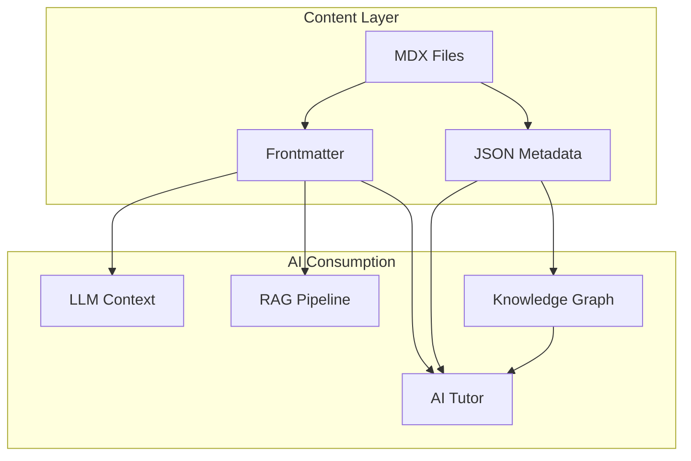

displayed_sidebar: devSidebar

# AI Integration Guide

## Overview

The Cloud Engineering Learning OS is designed from the ground up to be **AI-consumable**. Every piece of content includes structured metadata that enables AI systems to understand, navigate, and reason about the content.

## AI-Ready Architecture



## Metadata for AI

### Content Metadata

Every content file includes `ai_metadata` in its frontmatter:

```yaml
ai_metadata:
  category: compute
  difficulty: intermediate
  estimated_time_minutes: 25
  prerequisites:
    - /lessons/cloud-fundamentals
    - /lessons/networking-basics
  tags:
    - aws
    - ec2
    - compute
    - virtualization
  learning_objectives:
    - Launch and configure an EC2 instance
    - Choose the right instance type for a workload
    - Configure security groups
```

### Taxonomy

The platform uses a controlled taxonomy (`metadata/taxonomy.json`) that defines:

- All valid categories
- All valid tags with descriptions
- Difficulty level definitions
- Content type definitions

### Knowledge Graph

Concepts and their relationships are defined in `knowledge-graph/`:

```json
{
  "nodes": [
    {
      "id": "containers",
      "label": "Containers",
      "type": "concept",
      "description": "Lightweight, portable application packaging",
      "difficulty": "intermediate"
    },
    {
      "id": "docker",
      "label": "Docker",
      "type": "technology",
      "description": "Container runtime and tooling",
      "difficulty": "intermediate"
    }
  ],
  "edges": [
    {
      "from": "containers",
      "to": "docker",
      "relationship": "implemented_by"
    },
    {
      "from": "docker",
      "to": "kubernetes",
      "relationship": "orchestrated_by"
    }
  ]
}
```

## AI Tutor Integration (Future Phase)

The AI tutor will consume:

1. **Content metadata** — To recommend appropriate content
2. **Knowledge graph** — To understand concept relationships
3. **Content text** — Via RAG for contextual answers
4. **User progress** — To personalize recommendations

## Data Formats

| Format                   | Location           | Purpose                 |
| ------------------------ | ------------------ | ----------------------- |
| **Frontmatter YAML**     | Every MDX file     | Inline content metadata |
| **JSON Schema**          | `schemas/`         | Validation schemas      |
| **JSON Taxonomy**        | `metadata/`        | Controlled vocabularies |
| **JSON Knowledge Graph** | `knowledge-graph/` | Concept relationships   |

## Consuming as an AI System

### Static Site Scraping

```bash
# Get all content metadata as JSON
curl https://apexdataro-fin.github.io/AEP/metadata/content-index.json

# Get the knowledge graph
curl https://apexdataro-fin.github.io/AEP/knowledge-graph/graph.json

# Get the taxonomy
curl https://apexdataro-fin.github.io/AEP/metadata/taxonomy.json
```

### Build-Time Extraction

A script at `scripts/generate-ai-index.js` generates a consolidated AI index during the build process, combining all frontmatter into a single JSON artifact.
