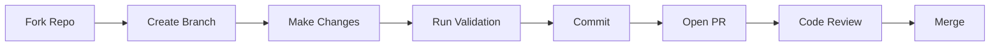

# Contributing Guide

Thank you for your interest in contributing! 🎉

## Ways to Contribute

| Contribution              | Effort     | Impact    |
| ------------------------- | ---------- | --------- |
| **Fix a typo**            | 5 min      | High      |
| **Improve documentation** | 30 min     | High      |
| **Add a lesson**          | 2-4 hours  | High      |
| **Add a project**         | 4-8 hours  | Very High |
| **Build a simulator**     | 8-16 hours | Very High |
| **Fix a bug**             | 1-4 hours  | Medium    |
| **Add a feature**         | 4-16 hours | Medium    |

## Contribution Workflow

## Before You Start

1. **Read the documentation** — Understand the project structure
2. **Check existing issues** — Avoid duplicate work
3. **Read the standards** — Follow style, naming, and content standards

## Pull Request Process

1. **Keep PRs focused** — One PR, one purpose
2. **Write descriptive PR titles** — Follow Conventional Commits
3. **Include a description** — What, why, and how
4. **Add screenshots** — For UI changes
5. **Link issues** — Reference related issues with `Closes #123`
6. **Pass all checks** — TypeScript, linting, format, and build

## Code of Conduct

### Our Pledge

We pledge to make participation in our community a harassment-free experience for everyone.

### Our Standards

- Be respectful and constructive
- Provide helpful feedback
- Accept constructive criticism gracefully
- Focus on what's best for the community

## Getting Help

- **Questions?** Open a [GitHub Discussion](https://github.com/apexdataro-Fin/AEP/discussions)
- **Bug?** Open a [GitHub Issue](https://github.com/apexdataro-Fin/AEP/issues)
- **Security vulnerability?** See our [Security Policy](https://github.com/apexdataro-Fin/AEP/security)
