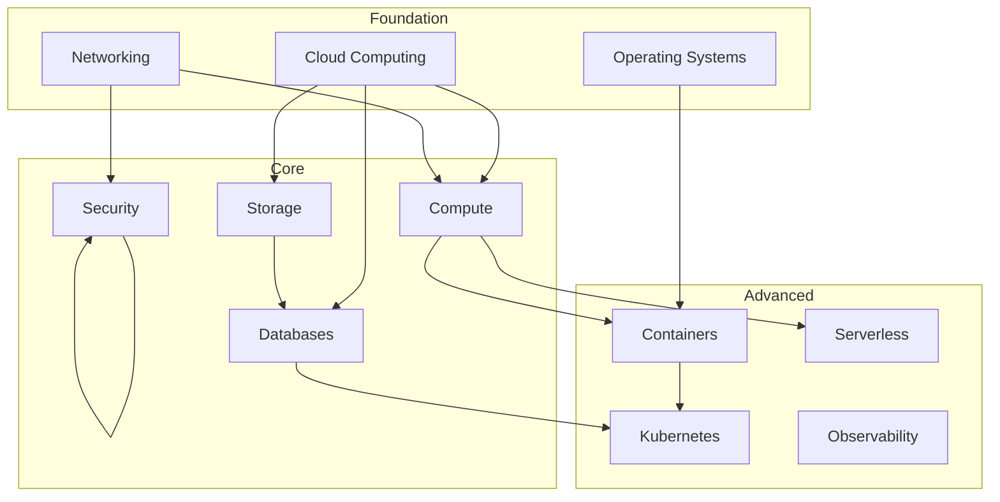

# Knowledge Graph Guide

## Overview

The knowledge graph represents the **relationships between concepts** in the platform. It enables:

- **Prerequisite mapping** — What must you learn before concept X?
- **Concept discovery** — What's related to what you just learned?
- **Gap analysis** — What concepts have no content yet?
- **AI reasoning** — AI systems can traverse the graph for recommendations

## Graph Structure



## Node Types

| Type            | Example                   | Description                |
| --------------- | ------------------------- | -------------------------- |
| `concept`       | "Load Balancing"          | Abstract idea or principle |
| `technology`    | "AWS ELB"                 | Specific tool or service   |
| `skill`         | "Configure an ALB"        | Practical ability          |
| `certification` | "AWS Solutions Architect" | Certification exam         |

## Relationship Types

| Relationship      | Direction      | Example                    |
| ----------------- | -------------- | -------------------------- |
| `prerequisite_of` | A → B          | Networking → VPC Design    |
| `implemented_by`  | Concept → Tech | Containers → Docker        |
| `part_of`         | Part → Whole   | EC2 → AWS Compute          |
| `related_to`      | A ↔ B          | Observability ↔ Monitoring |
| `certified_by`    | Skill → Cert   | Cloud Skills → AWS SA      |

## Adding to the Graph

Create a file in `knowledge-graph/domains/`:

```json
{
  "domain": "compute",
  "version": "1.0.0",
  "nodes": [
    {
      "id": "auto-scaling",
      "label": "Auto Scaling",
      "type": "concept",
      "description": "Automatically adjusting compute capacity based on demand",
      "difficulty": "intermediate",
      "content": ["/lessons/compute/auto-scaling-basics"]
    }
  ],
  "edges": [
    {
      "from": "compute-instances",
      "to": "auto-scaling",
      "relationship": "prerequisite_of"
    }
  ]
}
```

## Validation

```bash
node scripts/validate-kg.js
```

Checks:

- All referenced node IDs exist
- No orphaned edges
- Relationship types are valid
- Content links resolve to existing pages
