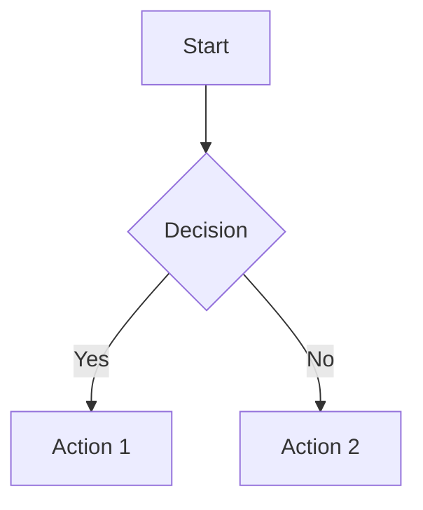
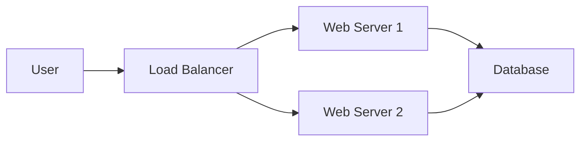
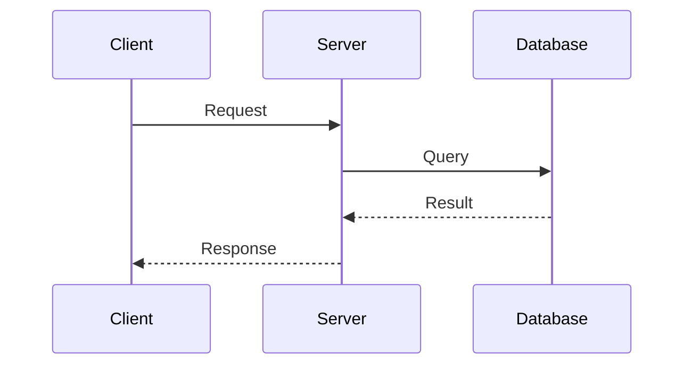
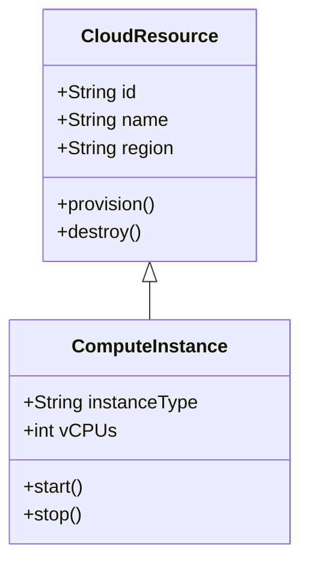
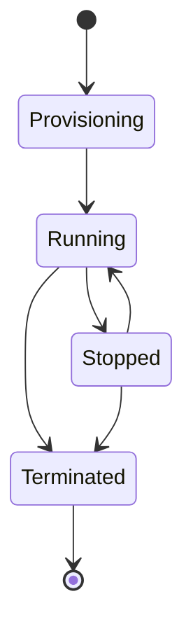
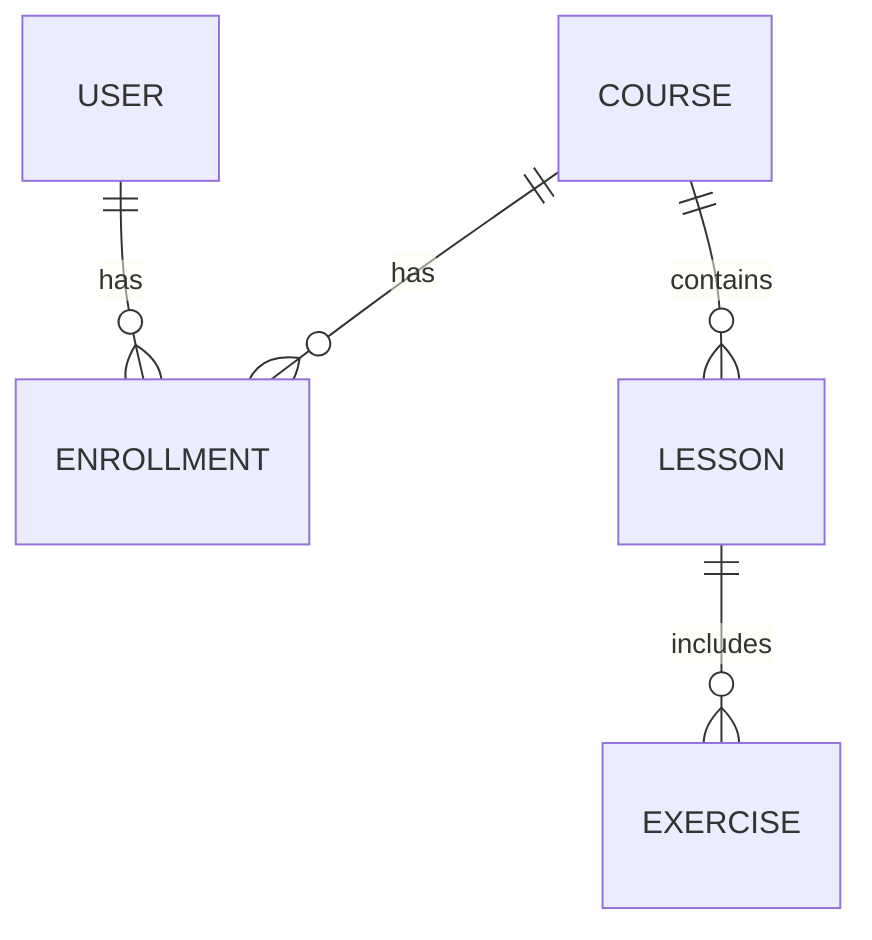

# Mermaid Guide

[Mermaid](https://mermaid.js.org/) is a JavaScript-based diagramming tool that renders text definitions into SVG diagrams. It's built into Docusaurus via `@docusaurus/theme-mermaid`.

## Why Mermaid?

- **Version-controlled** — Diagrams are plain text, diffable in Git
- **Build-time rendered** — No runtime JavaScript cost for diagrams
- **Accessible** — SVG output works with screen readers
- **Consistent** — Applies the site's theme (light/dark) automatically

## Creating a Diagram

Wrap your Mermaid code in a fenced code block with the `mermaid` language identifier:

````markdown

````

## Diagram Types

### Flowchart



### Sequence Diagram



### Class Diagram



### State Diagram



### ER Diagram



## Best Practices

### Do
- ✅ Keep diagrams focused on one concept
- ✅ Use descriptive labels on nodes and edges
- ✅ Add a caption above the diagram explaining what it shows
- ✅ Use consistent direction (LR for sequences, TB for hierarchies)
- ✅ Add comments for complex diagrams

### Don't
- ❌ Create diagrams with more than 15-20 nodes
- ❌ Use Mermaid for simple lists (use Markdown lists instead)
- ❌ Rely on color alone to convey meaning
- ❌ Leave unlabeled arrows or nodes

## Testing Diagrams

During development (`npm run dev`), diagrams render live. If a diagram fails to render:

1. Check for syntax errors in the Mermaid code
2. Ensure the `mermaid` language identifier is correct
3. Run `npm run build` to see build-time errors
