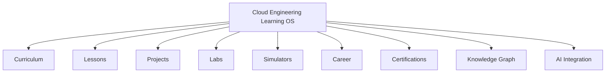

# Cloud Engineering Learning OS

Welcome to the **Cloud Engineering Learning Operating System** — your interactive guide to mastering cloud engineering.

## What This Is

This platform is designed to be the **single source of truth** for learning cloud engineering. It combines:

- **Structured curriculum** with clear learning paths
- **Interactive lessons** with code examples and exercises
- **Hands-on projects** that mirror real-world scenarios
- **Cloud labs** for safe experimentation
- **Career guidance** for every stage of your journey
- **Certification preparation** for major cloud providers

## Who This Is For

| Role                 | Path                                                             |
| -------------------- | ---------------------------------------------------------------- |
| **Beginners**        | Start with the [Curriculum](/docs/curriculum) fundamentals track |
| **Developers**       | Jump into [Projects](/docs/projects) and [Labs](/docs/labs)      |
| **DevOps Engineers** | Explore advanced [Architecture](/docs/architecture) topics       |
| **SREs**             | Focus on reliability, monitoring, and incident response          |
| **Architects**       | Dive deep into [System Design](/docs/architecture/system-design) |

## How to Use This Platform

1. **Pick a path** — Choose your role or learning goal
2. **Follow the curriculum** — Structured, sequential learning
3. **Build projects** — Apply knowledge with real projects
4. **Explore the knowledge graph** — See how concepts connect
5. **Prepare for certifications** — Targeted exam preparation

## Platform Features

## Get Started

- [Architecture Overview](/docs/architecture) — Understand how the platform is built
- [Development Guide](/docs/development) — Set up your local environment
- [Curriculum](/docs/curriculum) — Start learning cloud engineering
