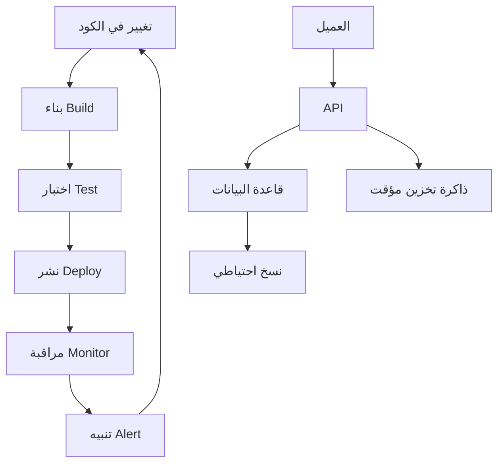

# عقلية المهندس

> **"قبل أن تلمس السحابة، قبل أن تكتب سطراً برمجياً — تعلّم كيف تفكّر كمهندس."**

## ما هي العقلية الهندسية؟

الهندسة ليست مجرد كتابة كود أو تشغيل خوادم. الهندسة هي **حل المشكلات تحت القيود**. كل قرار تقني يتضمن مقايضات:

| القيد         | السؤال الذي تسأله               |
| ------------- | ------------------------------- |
| **الوقت**     | متى يجب أن يُسلّم هذا؟          |
| **التكلفة**   | ما الميزانية المتاحة؟           |
| **الحجم**     | كم عدد المستخدمين؟              |
| **الموثوقية** | كم دقيقة تعطل مسموح بها؟        |
| **الأمان**    | ما نموذج التهديدات؟             |
| **الفريق**    | كم مهندساً متاحاً؟ وما خبراتهم؟ |

### مثال من الواقع

> **الطلب:** "نريد نشر تطبيق ويب يخدم ١٠٠٠٠ مستخدم."

المهندس المبتدئ: يختار Kubernetes فوراً لأنه "الأفضل".

المهندس الحقيقي: يسأل أولاً —

- كم مهندساً في الفريق؟ (إذا كانوا ٢، Kubernetes قد يكون عبئاً)
- ما الميزانية؟ (حلول مُدارة قد تكون أغلى لكن أوفر في وقت الفريق)
- كم مرة سنعدل التطبيق؟ (نشر مرة شهرياً ≠ نشر ١٠ مرات يومياً)
- ما مستوى التوفر المطلوب؟ (99.9% ≠ 99.99%)

## التفكير بالمبادئ الأولى

لا تقبل الحلول الجاهزة دون تفكيكها:

```
"السحابة غالية جداً"
  ↓ حللها للمبادئ الأولى
    ↓ أي موارد بالضبط تكلف؟
      ↓ ٤٠ خادم VM شغالة ٢٤/٧
        ↓ هل كلها ضرورية؟
          ↓ لا — ١٥ منها بيئة تطوير لا تُستخدم ليلاً
            ↓ الحل: إيقاف تلقائي الساعة ٨ مساءً — وفر ٦٠٪
```

## التفكير المنظومي — رؤية الصورة الكاملة

لا تنظر للقطعة وحدها. انظر للنظام كله:



عندما يتعطل شيء ما — المشكلة قد لا تكون في القطعة التي تعطلت. قد يكون السبب قبلها بخطوتين.

## عادات المهندس اليومية

| العادة               | لماذا؟                         | مثال                                                                     |
| -------------------- | ------------------------------ | ------------------------------------------------------------------------ |
| **اقرأ رسائل الخطأ** | تخبرك بالضبط ما المشكلة        | `ERROR: connection refused on port 5432` → قاعدة البيانات على منفذ مختلف |
| **اقرأ التوثيق**     | قبل أن تسأل غيرك               | `man systemctl` قبل سؤال زميلك                                           |
| **اختبر افتراضاتك**  | لا تخمّن — تحقق                | "أعتقد أن DNS يعمل" ← `nslookup` لتتأكد                                  |
| **وثّق حلك**         | إذا حللتها مرة، اكتبها         | صفحة Notion أو ملف README في repo                                        |
| **أتمتة التكرار**    | إذا نفذتها مرتين — اكتب سكريبت | نشر يدوي ← GitHub Actions                                                |
| **سجّل كل شيء**      | لا تعتمد على ذاكرتك            | `script` command يسجل جلسة الطرفية كاملة                                 |

## تمرين CloudNova: فكك المشكلة

> **المهمة:** "صمم ونشر نظام مراقبة لمزرعة خوادم مكونة من ٢٠٠ خادم."

### لا تبدأ بالتنفيذ! فكك أولاً:

1. **ما البيانات التي نجمعها؟**
   - استخدام المعالج والذاكرة
   - مساحة القرص
   - زمن استجابة التطبيقات
   - سجلات الأخطاء

2. **أين نخزن البيانات؟**
   - قاعدة بيانات زمنية (Prometheus / InfluxDB)
   - كم حجم البيانات يومياً؟ (احسب: ٢٠٠ خادم × metrics = ؟)

3. **كيف نعرض البيانات؟**
   - لوحات تحكم (Grafana)
   - تنبيهات (AlertManager → Slack/PagerDuty)

4. **ما خطة التوسع؟**
   - ماذا لو أصبحت ١٠٠٠ خادم؟
   - هل النظام الحالي يتحمل؟

5. **ما خطة الصيانة؟**
   - من يدير نظام المراقبة؟
   - ماذا لو تعطل نظام المراقبة نفسه؟

---

[← العودة للوحدة](index.md) | [🏠 الرئيسية](/)
