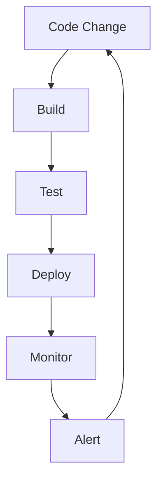

# The Engineering Mindset

Before clouds, containers, or code — you need to **think like an engineer**.

## What You Will Learn

- Break complex problems into manageable parts using first-principles thinking
- See the whole system, not just isolated components
- Develop documentation and learning habits that last a career

## First Principles Thinking

Break problems into fundamental truths:

```
"Cloud is too expensive"
  → Which resources cost money?
    → Unused VMs running 24/7
      → Auto-shutdown at 8 PM saves 60%
```

## Systems Thinking

Everything connects. A code change affects build, test, deploy, monitor, and alert:



## Key Engineering Habits

| Habit                   | Why                                  |
| ----------------------- | ------------------------------------ |
| **Read error messages** | They tell you exactly what's wrong   |
| **Read the docs**       | Before asking for help               |
| **Test assumptions**    | Don't guess — verify                 |
| **Document solutions**  | If you solved it once, write it down |
| **Automate repetition** | If you do it twice, script it        |

## CloudNova Exercise

**Task:** Decompose "Deploy a web app for 10,000 users" into sub-problems.

List at least 5 concerns:

1. **Compute** — How many servers? What size?
2. **Networking** — Load balancer? DNS? Firewall?
3. **Storage** — Database? File storage? Backups?
4. **Security** — Authentication? HTTPS? Access control?
5. **Monitoring** — How do you know if it's working?

---

[← Back to Module](index.md) | [🏠 Home](/)
