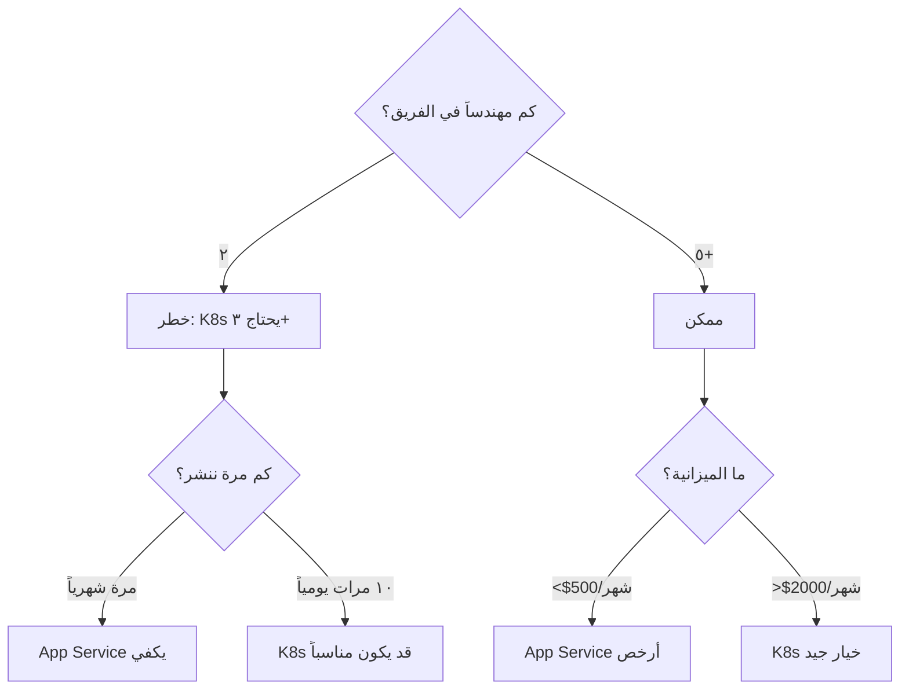
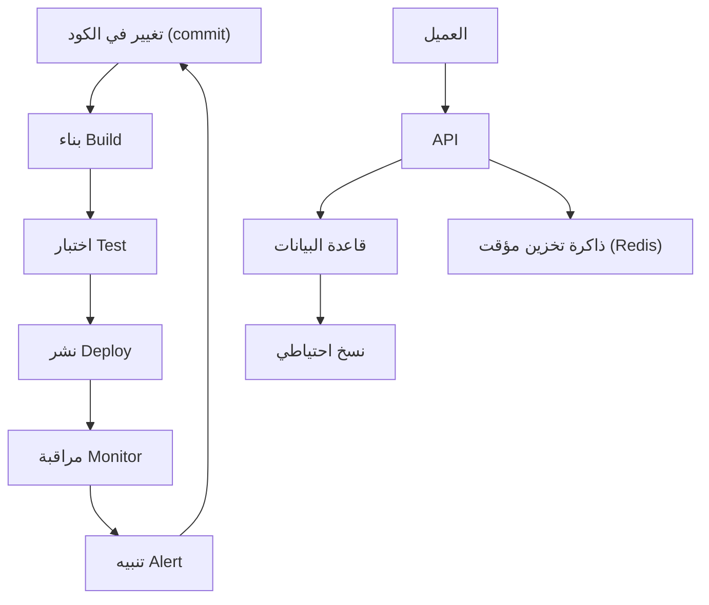
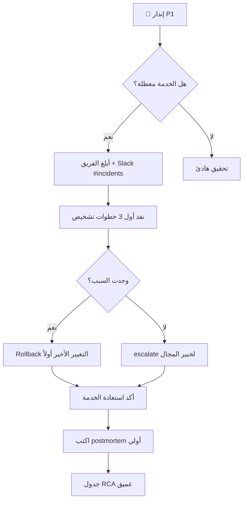

# عقلية المهندس

> **"قبل أن تلمس السحابة، قبل أن تكتب سطراً برمجياً — تعلّم كيف تفكّر كمهندس."**

## 🎯 أهداف التعلم

بعد إكمال هذا الدرس، ستكون قادراً على:

- تحليل المشكلات الهندسية باستخدام المبادئ الأولى
- تقييم المقايضات بين الحلول التقنية المختلفة
- التفكير في الأنظمة ككل وليس كأجزاء منفصلة
- كتابة postmortem احترافي وتحليل الأسباب الجذرية
- تطبيق منهجية حل المشكلات في مواقف الإنتاج

---

## ١. ما هي العقلية الهندسية؟

الهندسة ليست مجرد كتابة كود أو تشغيل خوادم. الهندسة هي **حل المشكلات تحت القيود**. كل قرار تقني يتضمن مقايضات، والمهندس الجيد يعرف كيف يوازن بينها:

| القيد         | السؤال الذي تسأله        | مثال من CloudNova                                                     |
| ------------- | ------------------------ | --------------------------------------------------------------------- |
| **الوقت**     | متى يجب أن يُسلّم هذا؟   | "العميل ينتظر — هل ننشر Docker Swarm الليلة أم Kubernetes بعد أسبوع؟" |
| **التكلفة**   | ما الميزانية المتاحة؟    | "AKS المدار = $200/شهر. إدارته يدوياً = $0 لكن +٢٠ ساعة مهندس"        |
| **الحجم**     | كم عدد المستخدمين؟       | "١٠٠ مستخدم ≠ ١٠٠,٠٠٠ مستخدم. لكل منهما معمارية مختلفة تماماً"        |
| **الموثوقية** | كم دقيقة تعطل مسموح بها؟ | "99.9% = ٨ ساعات تعطل/سنة. 99.99% = ٥٢ دقيقة فقط"                     |
| **الأمان**    | ما نموذج التهديدات؟      | "تطبيق داخلي ≠ تطبيق عمومي على الإنترنت"                              |
| **الفريق**    | كم مهندساً؟ وما خبراتهم؟ | "فريق من ٢ لا يستطيع إدارة ٥٠ microservice"                           |

### 🚨 حالة من الواقع: Kubernetes — نعم أم لا؟

> **الطلب:** "نريد نشر تطبيق ويب يخدم ١٠,٠٠٠ مستخدم."

**المهندس المبتدئ:** يختار Kubernetes فوراً لأنه "الأفضل" والأكثر طلباً في السوق.

**المهندس الحقيقي** يسأل أولاً — ثم يقرر:



**النتيجة:** لفريق من ٢ وميزانية $500 — Kubernetes ليس "الأفضل"، بل عبء سيكلف الفريق ٣٠ ساعة أسبوعياً في الصيانة بدلاً من بناء المنتج.

---

## ٢. التفكير بالمبادئ الأولى

> **"لا تقبل الحلول الجاهزة دون تفكيكها. اسأل: لماذا؟ حتى تصل إلى ما لا يمكن تفكيكه أكثر."**

### 🟢 مثال تطبيقي: "السحابة غالية جداً"

```
"فاتورة Azure الشهرية $12,000 — السحابة غالية جداً!"
  ↓ حللها للمبادئ الأولى
    ↓ أي موارد بالضبط تكلف؟
      ↓ ٤٠ خادم VM — $8,000
      ↓  managed databases — $3,000
      ↓   networking — $1,000
        ↓ من الـ ٤٠ خادم، كم ضروري فعلاً؟
          ↓ ٢٥ خادم إنتاج (ضرورية)
          ↓ ١٥ خادم تطوير واختبار
            ↓ هل تحتاج ١٥ خادم تطوير تشتغل ٢٤/٧؟
              ↓ لا — ١٠ منها لا تُستخدم ليلاً وفي عطلات نهاية الأسبوع
                ↓ الحل: إيقاف تلقائي ٨ مساءً - ٧ صباحاً + عطلة نهاية الأسبوع
                  ↓ وفر ٦٠٪ من تكلفة التطوير
                    ↓ = $3,600/شهر = $43,200/سنة
```

### 🟣 تطبيقها على مشكلة تقنية

```
"الموقع بطيء — نحتاج خادماً أقوى!"
  ↓ لماذا هو بطيء؟ (لا تقفز للحل)
    ↓ معظم وقت الاستغابة في استعلامات قاعدة البيانات
      ↓ لماذا الاستعلامات بطيئة؟
        ↓ لا توجد indexes على الأعمدة المستخدمة في WHERE
          ↓ لماذا لا توجد indexes؟
            ↓ لم يُحلل أحد أداء الاستعلامات من قبل
              ↓ الحل الحقيقي: إضافة ٣ indexes
                ↓ وقت الاستجابة: ٣ ثوانٍ → ٠.٢ ثانية
                ↓ التكلفة: $0 (لم نضف خادماً جديداً)
```

> **"المشكلة الظاهرية نادراً ما تكون المشكلة الحقيقية."**

---

## ٣. التفكير المنظومي — رؤية الصورة الكاملة

لا تنظر للقطعة وحدها. انظر للنظام كله. عندما يسقط قطعة الدومينو الأخيرة، المشكلة ليست فيها — بل في القطعة التي سببت السقوط.



### 🚨 قصة من CloudNova: عندما لا يكون السبب واضحاً

> **الموقف:** فجأة، ٣٠٪ من طلبات API تعود بخطأ `500 Internal Server Error`. الفريق يبحث في كود API — لا يجد شيئاً. يراقب قاعدة البيانات — طبيعية.

**التفكير المنظومي أنقذ الموقف:**

1. **التحقق من كل عقدة في السلسلة:**
   - `العميل` → يرسل طلبات صحيحة ✅
   - `CloudFront CDN` → يمرر الطلبات ✅
   - `API Gateway` → بعض الطلبات تصل، بعضها لا ❌
   - `Load Balancer` → **نصف الخوادم غير مسجلة!**

2. **السبب الجذري:** قبل ساعتين، نشر تلقائي (auto-scaling) أضاف ٤ خوادم جديدة. لكن الـ health check كان على مسار خطأ (`/health` بدلاً من `/api/health`) — فـ ٢ من الخوادم الجديدة اجتازت health check رغم أنها لا تستجيب للـ API.

3. **الدرس:** المشكلة لم تكن في الكود ولا في قاعدة البيانات. كانت في **الربط بين المكونات** — الـ health check و الـ auto-scaling و الـ load balancer.

---

## ٤. ثقافة الـ Postmortem — التعلم من الفشل

> **"في CloudNova، لا نعاقب على الأخطاء. نعاقب على إخفاء الأخطاء وعدم التعلم منها."**

### هيكل Postmortem احترافي

```markdown
# Postmortem: تعطل بوابة الدفع — ١٥ يوليو ٢٠٢٤

## 📊 ملخص

- **المدة:** ٤٧ دقيقة (١٤:١٣ - ١٥:٠٠)
- **التأثير:** ٢٣٤ طلب دفع فشل. $12,450 إيرادات مفقودة
- **السبب الجذري:** شهادة TLS منتهية على خادم بوابة الدفع
- **الكشف:** تنبيه من PagerDuty (status code 502)

## ⏱️ الجدول الزمني

| الوقت | الحدث                                 |
| ----- | ------------------------------------- |
| 14:13 | أول 502 error (شهادة TLS انتهت 14:00) |
| 14:17 | PagerDuty ينبه المهندس on-call        |
| 14:22 | المهندس يبدأ التحقيق                  |
| 14:35 | اكتشاف انتهاء الشهادة                 |
| 14:42 | تجديد الشهادة يدوياً                  |
| 14:50 | الخدمة تعود تدريجياً                  |
| 15:00 | كل الطلبات تعمل                       |

## 🔍 الأسباب الجذرية (5 Why's)

1. لماذا انتهت الشهادة؟ ← لم تُجدد تلقائياً
2. لماذا لم تجدد تلقائياً؟ ← auto-renewal معطل (خطأ في التكوين)
3. لماذا لم يُكتشف الخطأ؟ ← لا يوجد alert على انتهاء الشهادة
4. لماذا لا يوجد alert؟ ← لم يُعتبر TLS في نطاق المراقبة
5. لماذا لم يُعتبر في النطاق؟ ← افتراض أن "Azure Key Vault يديرها"

## ✅ الإجراءات التصحيحية

| #   | الإجراء                                     | المسؤول  | الموعد      |
| --- | ------------------------------------------- | -------- | ----------- |
| 1   | تفعيل auto-renewal في Key Vault             | DevOps   | فوراً       |
| 2   | إضافة alert قبل ٣٠ يوماً من انتهاء أي شهادة | SRE      | هذا الأسبوع |
| 3   | أتمتة فحص الشهادات أسبوعياً                 | Security | هذا الأسبوع |
| 4   | تدقيق كل الشهادات في المؤسسة                | Security | هذا الشهر   |
```

---

## ٥. عادات المهندس اليومية

| العادة                     | لماذا؟                         | مثال                                                                        |
| -------------------------- | ------------------------------ | --------------------------------------------------------------------------- |
| **اقرأ رسائل الخطأ كاملة** | تخبرك بالضبط ما المشكلة        | `ERROR: connection refused on port 5432` ← المشكلة في المنفذ، وليس في الكود |
| **اقرأ التوثيق أولاً**     | قبل أن تسأل غيرك               | `man systemctl` قبل سؤال زميلك في ٣ صباحاً                                  |
| **اختبر افتراضاتك**        | لا تخمّن — تحقق                | "أعتقد أن DNS يعمل" ← `nslookup` لتتأكد                                     |
| **وثّق حلك**               | إذا حللتها مرة، لا تحلها مرتين | صفحة Notion أو ملف README في repo                                           |
| **أتمتة التكرار**          | إذا نفذتها مرتين — اكتب سكريبت | نشر يدوي ← GitHub Actions                                                   |
| **سجّل كل شيء**            | لا تعتمد على ذاكرتك            | `script` command يسجل جلسة الطرفية كاملة                                    |
| **اعرف متى تطلب المساعدة** | ٣٠ دقيقة عالِق = اسأل          | "حاولت A و B و C. هل من فكرة؟" أفضل من "ما الحل؟"                           |

### 🔑 العادة الذهبية: اسأل السؤال الصحيح

| بدلاً من...          | اسأل...                                             |
| -------------------- | --------------------------------------------------- |
| "لماذا لا يعمل؟"     | "ما الذي تغير آخر مرة كان يعمل فيها؟"               |
| "ما الحل؟"           | "ما السبب الجذري؟"                                  |
| "هل نقدر نضيف خادم؟" | "هل المشكلة في المعالج، الذاكرة، القرص، أم الشبكة؟" |
| "مين كسر هذا؟"       | "كيف نمنع هذا من التكرار؟"                          |

---

## ٦. إطار اتخاذ القرار الهندسي

عندما تواجه خياراً صعباً بين حلّين تقنيين، استخدم مصفوفة القرار:

### 🚨 حالة: اختيار قاعدة بيانات لتطبيق CloudNova الجديد

| المعيار              | الوزن | PostgreSQL | MongoDB  | DynamoDB |
| -------------------- | ----- | ---------- | -------- | -------- |
| خبرة الفريق          | ٣٠٪   | ٩          | ٤        | ٢        |
| التكلفة الشهرية      | ٢٥٪   | ٦          | ٦        | ٩        |
| أداء الاستعلامات     | ٢٠٪   | ٨          | ٥        | ٧        |
| قابلية التوسع        | ١٥٪   | ٥          | ٩        | ٩        |
| دعم المعاملات (ACID) | ١٠٪   | ٩          | ٣        | ٤        |
| **المجموع الموزون**  |       | **7.55**   | **5.15** | **5.85** |

**القرار:** PostgreSQL — ليس لأنه "الأفضل" مطلقاً، بل لأنه الأفضل **لهذا الفريق وهذه الظروف**.

---

## ٧. تمرين CloudNova: صمم نظام مراقبة

> **المهمة:** "صمم ونشر نظام مراقبة لمزرعة خوادم مكونة من ٢٠٠ خادم."

### لا تبدأ بالتنفيذ! فكك أولاً — بطريقة المهندس:

```
🧩 الخطوة ١: فهم المتطلبات الحقيقية
├── من سيستخدم النظام؟ (مهندسون on-call, مديرون تقنيون, فريق الأمن)
├── ما المشكلة التي يحلها؟ (اكتشاف الأعطال قبل المستخدمين)
└── ما ميزانية التشغيل؟ ($1,500/شهر)

📊 الخطوة ٢: جمع البيانات
├── ما البيانات التي نجمعها؟
│   ├── استخدام المعالج والذاكرة (كل ١٥ ثانية)
│   ├── مساحة القرص (كل ٥ دقائق)
│   ├── زمن استجابة التطبيقات (كل ٣٠ ثانية)
│   └── سجلات الأخطاء (مستمر)
├── كم حجم البيانات يومياً؟
│   └── ٢٠٠ خادم × ٢٠٠ metrics × ٤ عينات/دقيقة × ٢٤ ساعة
│       ≈ ١٢٠ مليون نقطة بيانات/يوم ≈ ٨GB/يوم
└── أين نخزن؟
    └── Prometheus (قاعدة زمنية) + Thanos (تخزين طويل المدى)

🖥️ الخطوة ٣: العرض والتنبيه
├── لوحات تحكم (Grafana) — منظمة حسب:
│   ├── Overview (نظرة عامة للجميع)
│   ├── Infrastructure (لفريق SRE)
│   ├── Application (للمطورين)
│   └── Business (للمديرين — إيرادات, مستخدمين نشطين)
├── تنبيهات (AlertManager):
│   ├── P1 (حرج): ٥ دقائق → PagerDuty
│   ├── P2 (عالي): ١٥ دقيقة → Slack
│   └── P3 (منخفض): ساعة → Email
└── قواعد silencing (لا توقظ أحداً ٣ صباحاً لخطأ معروف)

📈 الخطوة ٤: التوسع المستقبلي
├── ماذا لو أصبحت ١٠٠٠ خادم؟
│   └── هل Prometheus يتحمل؟ ← أضف federation + Thanos
├── ماذا لو أضفنا Kubernetes؟
│   └── Prometheus Operator + ServiceMonitors
└── ماذا لو تعطل نظام المراقبة نفسه؟
    └── monitoring-of-monitoring (Meta-monitoring)
```

---

## 🧠 أسئلة للمراجعة النشطة (Active Recall)

1. ما هي الأسئلة الستة التي يجب أن تسألها قبل اختيار أي حل تقني؟
2. اشرح "التفكير بالمبادئ الأولى" بمثالك الخاص (ليس مثال السحابة).
3. لماذا Kubernetes ليس دائماً "الحل الأفضل"؟
4. ما هي عناصر الـ postmortem الجيد؟
5. كيف تفرق بين المشكلة الظاهرية والمشكلة الحقيقية؟

## ✍️ تمرين Feynman

اختر مشكلة تقنية واجهتها (أو تتخيلها) واشرحها لشخص غير تقني تماماً — بدون أي مصطلحات تقنية. استخدم تشبيهات من الحياة اليومية. الهدف: إذا فهمها شخص لا يعرف البرمجة، فقد فهمتها أنت حقاً.

## 🎴 بطاقات مراجعة

| السؤال                                | الإجابة                                          |
| ------------------------------------- | ------------------------------------------------ |
| ما هي القيود الستة في أي مشروع هندسي؟ | الوقت، التكلفة، الحجم، الموثوقية، الأمان، الفريق |
| ماذا يعني "التفكير المنظومي"؟         | النظر للنظام ككل وليس كأجزاء منفصلة              |
| لماذا نكتب postmortem؟                | للتعلم من الفشل ومنع تكراره — ليس للوم أحد       |
| ما السؤال الذهبي عند مواجهة مشكلة؟    | "ما الذي تغير آخر مرة كان يعمل فيها؟"            |

## 🎤 أسئلة مقابلة العمل

1. **"احكِ لي عن مرة فشلتَ فيها. ماذا تعلمت؟"** ← استخدم إطار الـ postmortem
2. **"كيف تختار بين حلّين تقنيين؟"** ← اشرح مصفوفة القرار + المقايضات
3. **"ما رأيك في: 'Kubernetes هو الحل لكل مشكلة نشر'؟"** ← اشرح متى يكون مناسباً ومتى لا يكون
4. **"كيف تتعامل مع مشكلة لا تعرف لها حلاً؟"** ← منهجية التشخيص، المبادئ الأولى، متى تطلب المساعدة

---

## 🏛️ طبقة الإنتاج: العقلية الهندسية تحت الضغط

### إدارة الحوادث (Incident Command)

عندما ينهار النظام في الإنتاج، العقلية الهندسية هي الفرق بين ١٠ دقائق تعطل و٣ ساعات:

```
🎯 أدوار فريق الحادثة:
├── Commander: ينسق، لا يلمس الكود
├── Investigator: يشخص المشكلة
├── Fixer: يعد الإصلاح
└── Communicator: يُطلع stakeholders
```

### بروتوكول CloudNova للإنتاج



### قواعد ذهبية للعمل تحت الضغط

| ❌ لا تفعل            | ✅ افعل                                    |
| --------------------- | ------------------------------------------ |
| تبدأ بتغييرات عشوائية | شغّل التشخيص أولاً (logs, metrics, traces) |
| تعمل وحدك في صمت      | أعلن أنك بدأت التحقيق في قناة الفريق       |
| تخفي الخطأ            | أبلغ فوراً — hiding incidents kills trust  |
| تصلح وتنسى            | وثق كل خطوة في الـ ticket                  |
| تلوم أحداً            | ركز على: ماذا حدث؟ كيف نمنع تكراره؟        |

### 🚨 سيناريو CloudNova: ليلة الجمعة

> **الجمعة ٢٣:٤٧ — تنبيه PagerDuty:** "API latency > 5s for 50% of requests". أنت المهندس on-call.

**العقلية الصحيحة:**

1. **تنفس.** لن تحل المشكلة أسرع بالتوتر.
2. **أعلن:** "أنا على الحادثة — سأحقق الآن" في Slack.
3. **شخّص:**
   - Grafana: latency بدأ ٢٣:٣٠ — ما الذي تغير؟
   - GitHub: آخر deployment كان ٢٣:٢٥ — PR #2847 "optimize DB queries"
   - Log Analytics: 500 errors مع `timeout waiting for connection pool`
4. **Rollback:** `git revert` ونشر emergency rollback. ٣ دقائق.
5. **تأكيد:** metrics تعود طبيعية. latency < 200ms.
6. **وثّق:** ticket مع الخطوات. RCA صباح الاثنين.

**المدة الكلية:** ١٢ دقيقة. **الدرس:** لا تصلح ما لا تعرف. ارجع لآخر حالة مستقرة أولاً، ثم حقق.

---

## 🎨 طبقة المعماري: التفكير المنظومي على نطاق واسع

### Anti-Patterns — أخطاء معمارية شائعة

| الخطأ                         | لماذا يحدث                                     | العاقبة                                                   | الحل                                  |
| ----------------------------- | ---------------------------------------------- | --------------------------------------------------------- | ------------------------------------- |
| **Resume-Driven Development** | اختيار التقنية لأنها "جميلة في السيرة الذاتية" | Kubernetes لـ ٢ مطورين = كارثة                            | اختر ما يناسب المشكلة، لا الـ CV      |
| **Cargo Cult**                | تقليد شركة كبيرة دون فهم "لماذا"               | Microservices لـ ٥٠ مستخدم = تعقيد بلا داعٍ               | افهم السياق قبل النسخ                 |
| **Golden Hammer**             | استخدام أداتك المفضلة لكل مشكلة                | "كل شيء يحله Terraform" حتى مشاكل لا تحتاج Infrastructure | اعرف متى لا تستخدم أداتك              |
| **Not Invented Here**         | رفض الحلول الجاهزة وبناء كل شيء داخلياً        | بناء نظام مراقبة من الصفر بدل DataDog                     | اشترِ ما لا يميز منتجك، ابنِ ما يميزه |
| **Premature Optimization**    | تحسين ما لم يثبت أنه بطيء                      | قضاء أسبوع في تحسين latency من 50ms إلى 48ms              | profile أولاً، حسّن ما يهم            |

### متى تقول "لا" — أصعب مهارة هندسية

```
طلب: "نريد إضافة feature X — المنافس يملكها"

المهندس الجيد يسأل:
├── كم مستخدماً سيستخدمها فعلاً؟
│   └── "٢٪ من المستخدمين" ← لا تستحق
├── ما تكلفة بنائها؟
│   └── "٣ أسابيع + تعقيد دائم" ← غالية
├── ما تكلفة صيانتها سنوياً؟
│   └── "٢٠٪ من وقت الفريق" ← عبء مستمر
└── هل يمكننا تحقيق ٨٠٪ من القيمة بـ ٢٠٪ من الجهد؟
    └── "نعم، بساعة واحدة" ← هذا هو الحل
```

### مصفوفة الأولويات (Eisenhower للهندسة)

|              | مهم                                             | غير مهم                                   |
| ------------ | ----------------------------------------------- | ----------------------------------------- |
| **عاجل**     | 🚨 DB down في الإنتاج                           | ⚡ زميل يطلب مراجعة كود عاجلة             |
| **غير عاجل** | 📐 تحسين architecture، 🧪 كتابة tests، 📝 توثيق | 🎨 تغيير لون زر، 💬 اجتماع بلا جدول أعمال |

---

## 🛠️ تدريبات عملية

### تمرين ١: تفكيك مشكلة (سهل)

> تطبيقك بطيء. المستخدمون يشتكون. كيف تشخص المشكلة باستخدام المبادئ الأولى؟
> اكتب خطة تشخيص من ١٠ خطوات.

<details>
<summary>💡 نموذج</summary>

1. حدد: "بطيء" = أي صفحة؟ كم milliseconds؟
2. هل البطء في كل الصفحات أم صفحة محددة؟
3. افتح DevTools Network tab — أين يقضي الوقت؟
4. هل المشكلة في frontend (render) أم backend (API) أم database؟
5. إذا API: سجلات الـ server — أي endpoint بطيء؟
6. إذا Database: شغّل `EXPLAIN ANALYZE` على الاستعلام
7. هل يوجد index مفقود؟
8. هل المشكلة في كل الأوقات أم أوقات الذروة فقط؟
9. هل الـ CPU أو memory أو IO مرتفع على الخادم؟
10. وثّق النتائج واقترح حلاً محدداً

</details>

### تمرين ٢: كتابة Postmortem (متوسط)

> اقرأ السيناريو التالي واكتب postmortem كاملاً:
> "تطبيق CloudNova تعطل ٣ ساعات لأن developer نشر migration wrong على production database."

### تحدي: مصفوفة قرار (متقدم)

> فريقك (٥ مهندسين) يبني منصة جديدة. اختر بين ٣ architectures:
>
> - Monolith على App Service
> - Microservices على AKS
> - Serverless على Azure Functions
>
> ابنِ مصفوفة قرار من ٥ معايير على الأقل مع أوزانها، واحسب النتيجة.

---

## 📝 تقييم المعرفة

### ✅ تحقق من فهمك (5 أسئلة)

1. ما هي القيود الستة التي تحكم كل قرار هندسي؟ أعط مثالاً لكل منها.
2. كيف تفسر "المبادئ الأولى" لشخص جديد في الهندسة؟
3. لماذا التفكير المنظومي أهم من التركيز على مكون واحد؟
4. ما الفرق بين المشكلة الظاهرية والمشكلة الحقيقية؟ أعط مثالاً من عملك.
5. اذكر ٣ عادات يومية تميز المهندس الجيد عن المتوسط.

### 📝 اختبار (3 أسئلة مع الإجابات)

**س١:** أي من التالي يعتبر "مهندساً حقيقياً" وليس مجرد "مُنفذ"؟

- **أ)** يكتب الكود المطلوب منه دون أسئلة
- **ب)** يسأل "لماذا" قبل "كيف"، ويقترح حلولاً بديلة
- **ج)** يستخدم أحدث التقنيات دائماً

<details>
<summary>الإجابة</summary>

**ب)** المهندس الحقيقي يفهم المشكلة قبل أن يحلها. يسأل عن constraints، يقترح trade-offs، ولا يقفز للحل الأول.

</details>

**س٢:** ما هو "5 Whys" ولماذا هو مهم؟

<details>
<summary>الإجابة</summary>

تقنية للوصول للسبب الجذري بسؤال "لماذا؟" ٥ مرات متتالية:

1. لماذا تعطل الموقع؟ ← شهادة TLS انتهت
2. لماذا انتهت؟ ← لم تُجدد
3. لماذا لم تُجدد؟ ← auto-renewal معطل
4. لماذا معطل؟ ← خطأ في التكوين بعد آخر ترقية
5. لماذا لم يُكتشف؟ ← لا توجد مراقبة للشهادات

السبب الحقيقي ليس "انتهاء الشهادة" بل "غياب المراقبة".

</details>

**س٣:** ما الفرق بين complicated و complex system؟

<details>
<summary>الإجابة</summary>

- **Complicated** (معقد): أجزاء كثيرة لكن يمكن فهمها — مثل طائرة. تتبع الخطوات → تصل للسبب.
- **Complex** (مركب): أجزاء متفاعلة بطريقة غير متوقعة — مثل حركة المرور. لا يمكن التنبؤ بكل نتيجة.

معظم أنظمة السحابة معقدة وليست معقدة. لا تبحث عن "سبب واحد" — ابحث عن العوامل المتفاعلة.

</details>

### 🧠 استدعاء نشط (5)

1. ارسم في ذهنك شجرة قرار: متى تختار PaaS ومتى IaaS ومتى Kubernetes؟
2. اشرح الفرق بين "الوقت" و"التكلفة" و"الحجم" كقيود هندسية — بمثال من CloudNova.
3. ما هي عناصر الـ postmortem الجيد؟ (بدون النظر للدرس)
4. كيف تفسر "YAGNI" لمدير منتج يريد بناء كل شيء دفعة واحدة؟
5. اذكر ٣ علامات أنك تبالغ في الهندسة (over-engineering).

### ✍️ تمرين Feynman (موسع)

اختر أحد هذه المفاهيم واشرحه لطفل عمره ١٢ سنة:

- التوفر العالي (High Availability)
- الـ load balancing
- الـ caching

استخدم ONLY تشبيهات من الحياة اليومية. ممنوع استخدام مصطلحات تقنية.

### 🎴 بطاقات تعليمية (8)

| السؤال                                   | الإجابة                                                             |
| ---------------------------------------- | ------------------------------------------------------------------- |
| ما هي القيود الستة؟                      | الوقت، التكلفة، الحجم، الموثوقية، الأمان، الفريق                    |
| ما الفرق بين المشكلة الظاهرية والحقيقية؟ | الظاهرية: العرض (الموقع بطيء). الحقيقية: السبب الجذري (index مفقود) |
| ماذا تعني "المبادئ الأولى"؟              | تفكيك المشكلة لأبسط عناصرها وإعادة بنائها من الصفر                  |
| لماذا نكتب postmortem؟                   | التعلم ومنع التكرار — ليس اللوم                                     |
| ما هو "5 Whys"؟                          | تقنية للوصول للسبب الجذري بسؤال "لماذا" ٥ مرات                      |
| ما هو أهم سؤال عند بدء تحقيق حادثة؟      | "ما الذي تغير آخر مرة كان يعمل فيها؟"                               |
| YAGNI تعني؟                              | You Ain't Gonna Need It — لا تبني ما لا تحتاجه الآن                 |
| متى تطلب المساعدة؟                       | بعد ٣٠ دقيقة من المحاولة الجادة بدون تقدم                           |

---

## 🎤 التحضير للمقابلة (موسع)

### System Design

**"صمم نظاماً لشركة ناشئة تتوقع نمواً من ١٠٠ إلى ١٠٠,٠٠٠ مستخدم خلال سنة."**

<details>
<summary>👀 نموذج التفكير</summary>

```
المرحلة ١: البداية (١٠٠-١٠,٠٠٠ مستخدم)
├── Monolith على App Service (PaaS)
├── Azure SQL (single instance)
├── CDN للـ static files
├── التكلفة: ~$300/شهر
└── الفريق: ٢-٣ مهندسين

المرحلة ٢: النمو (١٠,٠٠٠-٥٠,٠٠٠)
├── أضف Redis cache
├── اقرأ من replica database
├── Background jobs عبر Azure Functions
├── التكلفة: ~$800/شهر
└── الفريق: ٥ مهندسين

المرحلة ٣: النضج (٥٠,٠٠٠-١٠٠,٠٠٠)
├── قسّم monolith لـ 3-5 services (وليس 50!)
├── AKS للـ services الحرجة
├── Event-driven architecture للـ async operations
├── التكلفة: ~$2,500/شهر
└── الفريق: ٨+ مهندسين

المبدأ: لا تبدأ بالمرحلة ٣. ابدأ بالأبسط ثم تطور.
```

</details>

### سؤال تقني متقدم

**"كيف تقنع مديراً تقنياً أن Kubernetes ليس الحل المناسب لفريقكم الصغير؟"**

<details>
<summary>👀 الإجابة</summary>

استخدم البيانات لا الآراء:

1. **التكلفة الحقيقية**: AKS = $400/شهر + ٢٠ ساعة مهندس/أسبوع للصيانة. App Service = $300/شهر + ٠ ساعة.
2. **وقت onboarding**: مطور جديد يحتاج ٤ أسابيع ليفهم K8s. App Service = يوم واحد.
3. **حجم الفريق**: K8s يحتاج minimum ٣ مهندسين DevOps. فريقنا = ٢ مطورين full-stack.
4. **البديل**: ابدأ بـ App Service. صمم الـ Dockerfile ليكون جاهزاً للنقل لـ K8s لاحقاً عندما ينمو الفريق.

الخلاصة: Kubernetes استثمار ممتاز — للمستقبل. اليوم، App Service يحقق نفس النتيجة بربع التعقيد.

</details>

### سؤال سلوكي (STAR موسع)

**"احكِ لي عن مرة اختلفت فيها مع قرار تقني للفريق. كيف تعاملت معه؟"**

> **S**: فريقنا قرر استخدام NoSQL لمشروع يحتاج معاملات مالية (ACID).  
> **T**: إقناع الفريق أن NoSQL خطر على سلامة البيانات المالية.  
> **A**: بنيت prototype صغير يوضح failure mode: ماذا يحدث لنقود العميل إذا فشل الـ write partially؟ عرضت المقارنة: PostgreSQL vs MongoDB تحت simulated failure.  
> **R**: الفريق وافق على PostgreSQL. بعد ٦ أشهر، اكتشف منافس يستخدم NoSQL مشكلة في البيانات المالية. قرارنا حمى سمعة الشركة.

---

## 📚 المراجع والروابط

### دروس مرتبطة

- [DevOps Culture](../16-devops/01-devops-culture) — العقلية الهندسية في ثقافة DevOps
- [CI/CD Pipelines](../15-cicd/01-cicd-pipelines) — تطبيق المبادئ الأولى على pipelines
- [Cloud Career Paths](../33-career/01-cloud-career-paths) — كيف تبني مسيرتك بعقلية هندسية

### كتب مقترحة

- 📖 _The Pragmatic Programmer_ — David Thomas & Andrew Hunt
- 📖 _Site Reliability Engineering_ — Google (خاصة فصل "Postmortem Culture")
- 📖 _Thinking in Systems_ — Donella Meadows
- 📖 _The Phoenix Project_ — Gene Kim (قصة عن التفكير المنظومي)

### مصادر خارجية

- 📺 "First Principles Thinking" — Farnam Street blog
- 📺 "How Complex Systems Fail" — Richard Cook (ورقة بحثية قصيرة — اقرأها!)
- 📺 "Blameless Postmortems" — Etsy Engineering blog

### مصطلحات التقنية في هذا الدرس

| المصطلح                       | التعريف                                      |
| ----------------------------- | -------------------------------------------- |
| **First Principles**          | تفكيك المشكلة لأبسط عناصرها الأساسية         |
| **Trade-off**                 | مقايضة بين خيارين — لا يوجد حل مثالي         |
| **Postmortem**                | تحليل ما بعد الحادثة — للتعلم لا للوم        |
| **RCA (Root Cause Analysis)** | تحليل السبب الجذري                           |
| **YAGNI**                     | You Ain't Gonna Need It — لا تبالغ في البناء |
| **Over-engineering**          | بناء حلول معقدة لمشاكل بسيطة                 |
| **Cargo Cult**                | تقليد ممارسات دون فهم أسبابها                |

---

[→ الدرس التالي: Linux Essentials](../02-linux/01-linux-essentials) | [← العودة للوحدة](01-engineering-mindset) | [🏠 الرئيسية](/)
