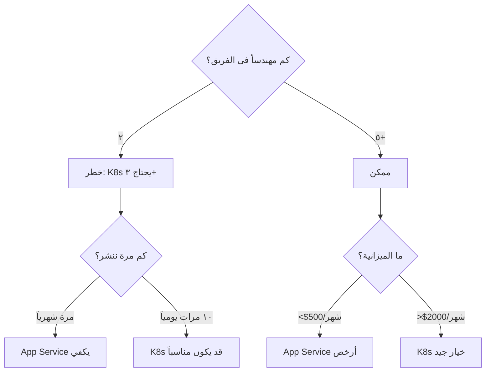
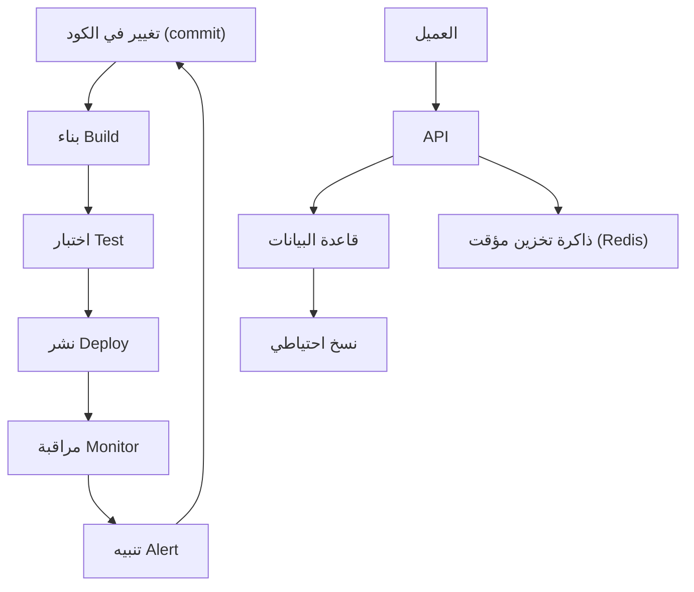

# عقلية المهندس

> **"قبل أن تلمس السحابة، قبل أن تكتب سطراً برمجياً — تعلّم كيف تفكّر كمهندس."**

## 🎯 أهداف التعلم

بعد إكمال هذا الدرس، ستكون قادراً على:
- تحليل المشكلات الهندسية باستخدام المبادئ الأولى
- تقييم المقايضات بين الحلول التقنية المختلفة
- التفكير في الأنظمة ككل وليس كأجزاء منفصلة
- كتابة postmortem احترافي وتحليل الأسباب الجذرية
- تطبيق منهجية حل المشكلات في مواقف الإنتاج

---

## ١. ما هي العقلية الهندسية؟

الهندسة ليست مجرد كتابة كود أو تشغيل خوادم. الهندسة هي **حل المشكلات تحت القيود**. كل قرار تقني يتضمن مقايضات، والمهندس الجيد يعرف كيف يوازن بينها:

| القيد | السؤال الذي تسأله | مثال من CloudNova |
|-------|-------------------|-------------------|
| **الوقت** | متى يجب أن يُسلّم هذا؟ | "العميل ينتظر — هل ننشر Docker Swarm الليلة أم Kubernetes بعد أسبوع؟" |
| **التكلفة** | ما الميزانية المتاحة؟ | "AKS المدار = $200/شهر. إدارته يدوياً = $0 لكن +٢٠ ساعة مهندس" |
| **الحجم** | كم عدد المستخدمين؟ | "١٠٠ مستخدم ≠ ١٠٠,٠٠٠ مستخدم. لكل منهما معمارية مختلفة تماماً" |
| **الموثوقية** | كم دقيقة تعطل مسموح بها؟ | "99.9% = ٨ ساعات تعطل/سنة. 99.99% = ٥٢ دقيقة فقط" |
| **الأمان** | ما نموذج التهديدات؟ | "تطبيق داخلي ≠ تطبيق عمومي على الإنترنت" |
| **الفريق** | كم مهندساً؟ وما خبراتهم؟ | "فريق من ٢ لا يستطيع إدارة ٥٠ microservice" |

### 🚨 حالة من الواقع: Kubernetes — نعم أم لا؟

> **الطلب:** "نريد نشر تطبيق ويب يخدم ١٠,٠٠٠ مستخدم."

**المهندس المبتدئ:** يختار Kubernetes فوراً لأنه "الأفضل" والأكثر طلباً في السوق.

**المهندس الحقيقي** يسأل أولاً — ثم يقرر:



**النتيجة:** لفريق من ٢ وميزانية $500 — Kubernetes ليس "الأفضل"، بل عبء سيكلف الفريق ٣٠ ساعة أسبوعياً في الصيانة بدلاً من بناء المنتج.

---

## ٢. التفكير بالمبادئ الأولى

> **"لا تقبل الحلول الجاهزة دون تفكيكها. اسأل: لماذا؟ حتى تصل إلى ما لا يمكن تفكيكه أكثر."**

### 🟢 مثال تطبيقي: "السحابة غالية جداً"

```
"فاتورة Azure الشهرية $12,000 — السحابة غالية جداً!"
  ↓ حللها للمبادئ الأولى
    ↓ أي موارد بالضبط تكلف؟
      ↓ ٤٠ خادم VM — $8,000
      ↓  managed databases — $3,000
      ↓   networking — $1,000
        ↓ من الـ ٤٠ خادم، كم ضروري فعلاً؟
          ↓ ٢٥ خادم إنتاج (ضرورية)
          ↓ ١٥ خادم تطوير واختبار
            ↓ هل تحتاج ١٥ خادم تطوير تشتغل ٢٤/٧؟
              ↓ لا — ١٠ منها لا تُستخدم ليلاً وفي عطلات نهاية الأسبوع
                ↓ الحل: إيقاف تلقائي ٨ مساءً - ٧ صباحاً + عطلة نهاية الأسبوع
                  ↓ وفر ٦٠٪ من تكلفة التطوير
                    ↓ = $3,600/شهر = $43,200/سنة
```

### 🟣 تطبيقها على مشكلة تقنية

```
"الموقع بطيء — نحتاج خادماً أقوى!"
  ↓ لماذا هو بطيء؟ (لا تقفز للحل)
    ↓ معظم وقت الاستغابة في استعلامات قاعدة البيانات
      ↓ لماذا الاستعلامات بطيئة؟
        ↓ لا توجد indexes على الأعمدة المستخدمة في WHERE
          ↓ لماذا لا توجد indexes؟
            ↓ لم يُحلل أحد أداء الاستعلامات من قبل
              ↓ الحل الحقيقي: إضافة ٣ indexes
                ↓ وقت الاستجابة: ٣ ثوانٍ → ٠.٢ ثانية
                ↓ التكلفة: $0 (لم نضف خادماً جديداً)
```

> **"المشكلة الظاهرية نادراً ما تكون المشكلة الحقيقية."**

---

## ٣. التفكير المنظومي — رؤية الصورة الكاملة

لا تنظر للقطعة وحدها. انظر للنظام كله. عندما يسقط قطعة الدومينو الأخيرة، المشكلة ليست فيها — بل في القطعة التي سببت السقوط.



### 🚨 قصة من CloudNova: عندما لا يكون السبب واضحاً

> **الموقف:** فجأة، ٣٠٪ من طلبات API تعود بخطأ `500 Internal Server Error`. الفريق يبحث في كود API — لا يجد شيئاً. يراقب قاعدة البيانات — طبيعية.

**التفكير المنظومي أنقذ الموقف:**

1. **التحقق من كل عقدة في السلسلة:**
   - `العميل` → يرسل طلبات صحيحة ✅
   - `CloudFront CDN` → يمرر الطلبات ✅
   - `API Gateway` → بعض الطلبات تصل، بعضها لا ❌
   - `Load Balancer` → **نصف الخوادم غير مسجلة!**

2. **السبب الجذري:** قبل ساعتين، نشر تلقائي (auto-scaling) أضاف ٤ خوادم جديدة. لكن الـ health check كان على مسار خطأ (`/health` بدلاً من `/api/health`) — فـ ٢ من الخوادم الجديدة اجتازت health check رغم أنها لا تستجيب للـ API.

3. **الدرس:** المشكلة لم تكن في الكود ولا في قاعدة البيانات. كانت في **الربط بين المكونات** — الـ health check و الـ auto-scaling و الـ load balancer.

---

## ٤. ثقافة الـ Postmortem — التعلم من الفشل

> **"في CloudNova، لا نعاقب على الأخطاء. نعاقب على إخفاء الأخطاء وعدم التعلم منها."**

### هيكل Postmortem احترافي

```markdown
# Postmortem: تعطل بوابة الدفع — ١٥ يوليو ٢٠٢٤

## 📊 ملخص
- **المدة:** ٤٧ دقيقة (١٤:١٣ - ١٥:٠٠)
- **التأثير:** ٢٣٤ طلب دفع فشل. $12,450 إيرادات مفقودة
- **السبب الجذري:** شهادة TLS منتهية على خادم بوابة الدفع
- **الكشف:** تنبيه من PagerDuty (status code 502)

## ⏱️ الجدول الزمني
| الوقت | الحدث |
|-------|-------|
| 14:13 | أول 502 error (شهادة TLS انتهت 14:00) |
| 14:17 | PagerDuty ينبه المهندس on-call |
| 14:22 | المهندس يبدأ التحقيق |
| 14:35 | اكتشاف انتهاء الشهادة |
| 14:42 | تجديد الشهادة يدوياً |
| 14:50 | الخدمة تعود تدريجياً |
| 15:00 | كل الطلبات تعمل |

## 🔍 الأسباب الجذرية (5 Why's)
1. لماذا انتهت الشهادة؟ ← لم تُجدد تلقائياً
2. لماذا لم تجدد تلقائياً؟ ← auto-renewal معطل (خطأ في التكوين)
3. لماذا لم يُكتشف الخطأ؟ ← لا يوجد alert على انتهاء الشهادة
4. لماذا لا يوجد alert؟ ← لم يُعتبر TLS في نطاق المراقبة
5. لماذا لم يُعتبر في النطاق؟ ← افتراض أن "Azure Key Vault يديرها"

## ✅ الإجراءات التصحيحية
| # | الإجراء | المسؤول | الموعد |
|---|---------|---------|--------|
| 1 | تفعيل auto-renewal في Key Vault | DevOps | فوراً |
| 2 | إضافة alert قبل ٣٠ يوماً من انتهاء أي شهادة | SRE | هذا الأسبوع |
| 3 | أتمتة فحص الشهادات أسبوعياً | Security | هذا الأسبوع |
| 4 | تدقيق كل الشهادات في المؤسسة | Security | هذا الشهر |
```

---

## ٥. عادات المهندس اليومية

| العادة | لماذا؟ | مثال |
|--------|--------|------|
| **اقرأ رسائل الخطأ كاملة** | تخبرك بالضبط ما المشكلة | `ERROR: connection refused on port 5432` ← المشكلة في المنفذ، وليس في الكود |
| **اقرأ التوثيق أولاً** | قبل أن تسأل غيرك | `man systemctl` قبل سؤال زميلك في ٣ صباحاً |
| **اختبر افتراضاتك** | لا تخمّن — تحقق | "أعتقد أن DNS يعمل" ← `nslookup` لتتأكد |
| **وثّق حلك** | إذا حللتها مرة، لا تحلها مرتين | صفحة Notion أو ملف README في repo |
| **أتمتة التكرار** | إذا نفذتها مرتين — اكتب سكريبت | نشر يدوي ← GitHub Actions |
| **سجّل كل شيء** | لا تعتمد على ذاكرتك | `script` command يسجل جلسة الطرفية كاملة |
| **اعرف متى تطلب المساعدة** | ٣٠ دقيقة عالِق = اسأل | "حاولت A و B و C. هل من فكرة؟" أفضل من "ما الحل؟" |

### 🔑 العادة الذهبية: اسأل السؤال الصحيح

| بدلاً من... | اسأل... |
|-------------|---------|
| "لماذا لا يعمل؟" | "ما الذي تغير آخر مرة كان يعمل فيها؟" |
| "ما الحل؟" | "ما السبب الجذري؟" |
| "هل نقدر نضيف خادم؟" | "هل المشكلة في المعالج، الذاكرة، القرص، أم الشبكة؟" |
| "مين كسر هذا؟" | "كيف نمنع هذا من التكرار؟" |

---

## ٦. إطار اتخاذ القرار الهندسي

عندما تواجه خياراً صعباً بين حلّين تقنيين، استخدم مصفوفة القرار:

### 🚨 حالة: اختيار قاعدة بيانات لتطبيق CloudNova الجديد

| المعيار | الوزن | PostgreSQL | MongoDB | DynamoDB |
|---------|-------|------------|---------|-----------|
| خبرة الفريق | ٣٠٪ | ٩ | ٤ | ٢ |
| التكلفة الشهرية | ٢٥٪ | ٦ | ٦ | ٩ |
| أداء الاستعلامات | ٢٠٪ | ٨ | ٥ | ٧ |
| قابلية التوسع | ١٥٪ | ٥ | ٩ | ٩ |
| دعم المعاملات (ACID) | ١٠٪ | ٩ | ٣ | ٤ |
| **المجموع الموزون** | | **7.55** | **5.15** | **5.85** |

**القرار:** PostgreSQL — ليس لأنه "الأفضل" مطلقاً، بل لأنه الأفضل **لهذا الفريق وهذه الظروف**.

---

## ٧. تمرين CloudNova: صمم نظام مراقبة

> **المهمة:** "صمم ونشر نظام مراقبة لمزرعة خوادم مكونة من ٢٠٠ خادم."

### لا تبدأ بالتنفيذ! فكك أولاً — بطريقة المهندس:

```
🧩 الخطوة ١: فهم المتطلبات الحقيقية
├── من سيستخدم النظام؟ (مهندسون on-call, مديرون تقنيون, فريق الأمن)
├── ما المشكلة التي يحلها؟ (اكتشاف الأعطال قبل المستخدمين)
└── ما ميزانية التشغيل؟ ($1,500/شهر)

📊 الخطوة ٢: جمع البيانات
├── ما البيانات التي نجمعها؟
│   ├── استخدام المعالج والذاكرة (كل ١٥ ثانية)
│   ├── مساحة القرص (كل ٥ دقائق)
│   ├── زمن استجابة التطبيقات (كل ٣٠ ثانية)
│   └── سجلات الأخطاء (مستمر)
├── كم حجم البيانات يومياً؟
│   └── ٢٠٠ خادم × ٢٠٠ metrics × ٤ عينات/دقيقة × ٢٤ ساعة
│       ≈ ١٢٠ مليون نقطة بيانات/يوم ≈ ٨GB/يوم
└── أين نخزن؟
    └── Prometheus (قاعدة زمنية) + Thanos (تخزين طويل المدى)

🖥️ الخطوة ٣: العرض والتنبيه
├── لوحات تحكم (Grafana) — منظمة حسب:
│   ├── Overview (نظرة عامة للجميع)
│   ├── Infrastructure (لفريق SRE)
│   ├── Application (للمطورين)
│   └── Business (للمديرين — إيرادات, مستخدمين نشطين)
├── تنبيهات (AlertManager):
│   ├── P1 (حرج): ٥ دقائق → PagerDuty
│   ├── P2 (عالي): ١٥ دقيقة → Slack
│   └── P3 (منخفض): ساعة → Email
└── قواعد silencing (لا توقظ أحداً ٣ صباحاً لخطأ معروف)

📈 الخطوة ٤: التوسع المستقبلي
├── ماذا لو أصبحت ١٠٠٠ خادم؟
│   └── هل Prometheus يتحمل؟ ← أضف federation + Thanos
├── ماذا لو أضفنا Kubernetes؟
│   └── Prometheus Operator + ServiceMonitors
└── ماذا لو تعطل نظام المراقبة نفسه؟
    └── monitoring-of-monitoring (Meta-monitoring)
```

---

## 🧠 أسئلة للمراجعة النشطة (Active Recall)

1. ما هي الأسئلة الستة التي يجب أن تسألها قبل اختيار أي حل تقني؟
2. اشرح "التفكير بالمبادئ الأولى" بمثالك الخاص (ليس مثال السحابة).
3. لماذا Kubernetes ليس دائماً "الحل الأفضل"؟
4. ما هي عناصر الـ postmortem الجيد؟
5. كيف تفرق بين المشكلة الظاهرية والمشكلة الحقيقية؟

## ✍️ تمرين Feynman

اختر مشكلة تقنية واجهتها (أو تتخيلها) واشرحها لشخص غير تقني تماماً — بدون أي مصطلحات تقنية. استخدم تشبيهات من الحياة اليومية. الهدف: إذا فهمها شخص لا يعرف البرمجة، فقد فهمتها أنت حقاً.

## 🎴 بطاقات مراجعة

| السؤال | الإجابة |
|--------|---------|
| ما هي القيود الستة في أي مشروع هندسي؟ | الوقت، التكلفة، الحجم، الموثوقية، الأمان، الفريق |
| ماذا يعني "التفكير المنظومي"؟ | النظر للنظام ككل وليس كأجزاء منفصلة |
| لماذا نكتب postmortem؟ | للتعلم من الفشل ومنع تكراره — ليس للوم أحد |
| ما السؤال الذهبي عند مواجهة مشكلة؟ | "ما الذي تغير آخر مرة كان يعمل فيها؟" |

## 🎤 أسئلة مقابلة العمل

1. **"احكِ لي عن مرة فشلتَ فيها. ماذا تعلمت؟"** ← استخدم إطار الـ postmortem
2. **"كيف تختار بين حلّين تقنيين؟"** ← اشرح مصفوفة القرار + المقايضات
3. **"ما رأيك في: 'Kubernetes هو الحل لكل مشكلة نشر'؟"** ← اشرح متى يكون مناسباً ومتى لا يكون
4. **"كيف تتعامل مع مشكلة لا تعرف لها حلاً؟"** ← منهجية التشخيص، المبادئ الأولى، متى تطلب المساعدة

---

[← العودة للوحدة](index.md) | [🏠 الرئيسية](/)
