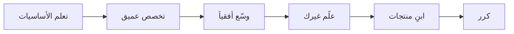

# عقلية المهندس السحابي

> "أسرع 10 سنوات في حياتك المهنية تبدأ الآن. لكن فقط إذا تعلمت كيف تتعلم."

## 🎯 أهداف التعلم

بعد هذا الدرس، ستكون قادراً على:

- بناء عقلية نمو مستدامة (Growth Mindset)
- التخطيط لمسارك المهني في Cloud Engineering
- التعامل مع الإرهاق التقني (Burnout)
- قياس تقدمك وتحديد أهداف SMART
- بناء عادات التعلم اليومي

## ⏱️ الوقت المقدر: 40 دقيقة | المستوى: Junior

---

## ١. لماذا العقلية أهم من الشهادة؟

### قصة CloudNova: مهندسان، مصيران مختلفان

```
أحمد: حصل على AZ-104 في 3 أشهر. توقف عن التعلم.
       بعد سنة: يسأل "كيف أترقى؟" — لكن لم يبنِ شيئاً جديداً.

سلمى: حصلت على AZ-104 في 6 أشهر.
       خلال الدراسة: بنت 3 مشاريع شخصية.
       بعد الشهادة: تعلمت Terraform. ثم Kubernetes. ثم Python.
       بعد سنة: Senior Cloud Engineer — ليس بسبب شهادتها، بل لأنها بنت.
```

**الدرس:** الشهادة تفتح الباب. المشاريع تبني المسيرة.

---

## ٢. عقلية النمو (Growth Mindset)

### الفرق بين العقلية الثابتة والنمو

| الموقف         | عقلية ثابتة           | عقلية نمو                       |
| -------------- | --------------------- | ------------------------------- |
| فشل امتحان     | "أنا لست ذكياً كفاية" | "أحتاج طريقة دراسة مختلفة"      |
| خطأ في الإنتاج | "سأُطرد"              | "ماذا تعلمت؟ كيف أمنع التكرار؟" |
| زميل أفضل مني  | "سأبدو غبياً"         | "ماذا أستطيع أن أتعلم منه؟"     |
| تقنية جديدة    | "لا وقت لدي"          | "سأخصص 20 دقيقة يومياً"         |

### 🧠 تمرين: إعادة صياغة الأفكار

```
بدلاً من: "لا أفهم Kubernetes أبداً"
قل: "لم أفهم Kubernetes بعد"

بدلاً من: "الـ networking صعب جداً"
قل: "الـ networking يحتاج وقتاً أطول"

بدلاً من: "فشلت في المقابلة"
قل: "حصلت على تدريب مجاني لمقابلة حقيقية"
```

---

## ٣. خطة التعلم: من Junior إلى Senior في 3 سنوات

### السنة الأولى: Junior Cloud Engineer

```
🎯 الهدف: فهم الأساسيات + أول شهادة

Q1: Linux + Networking basics
├── 20 دقيقة يومياً على Linux terminal
├── بناء homelab بسيط (3 VMs)
└── أول Bash scripts

Q2: Azure Fundamentals + AZ-900
├── Microsoft Learn modules
├── John Savill YouTube
└── حجز الامتحان (الموعد النهائي يحفز!)

Q3: Python + Automation
├── أتمتة مهمة واحدة يومياً
├── مشروع: CLI tool لفريقك
└── أول GitHub repo منظم

Q4: DevOps mindset + CI/CD
├── أول GitHub Actions pipeline
├── Docker basics
└── AZ-104 التحضير لـ
```

### السنة الثانية: Cloud Engineer

```
🎯 الهدف: الشهادات المهنية + مشاريع حقيقية

Q1: AZ-104 + Terraform
├── دراسة 2 ساعة يومياً
├── Terraform لكل شيء (لا Azure Portal!)
└── مشروع: بنية تحتية كاملة بـ IaC

Q2: Docker + Kubernetes
├── CKA preparation
├── K8s cluster منزلي (k3s)
└── مشروع: نشر تطبيق multi-service

Q3: CI/CD + GitOps
├── GitHub Actions متقدم
├── Argo CD + Helm
└── مشروع: Pipeline كامل

Q4: Monitoring + Security
├── Prometheus + Grafana
├── Trivy + OPA
└── مشروع: منصة CloudNova (المشروع الموحد)
```

### السنة الثالثة: Senior Cloud Engineer

```
🎯 الهدف: منصة كاملة + قيادة تقنية

Q1: AZ-400 (DevOps) + Platform Engineering
├── بناء IDP لفريقك
├── Backstage / Port
└── كتابة Runbooks و Postmortems

Q2: FinOps + Cost Optimization
├── خفض تكاليف السحابة 30%
├── Budgeting + Forecasting
└── تقرير شهري للإدارة

Q3: AI/ML على السحابة
├── MLOps pipeline
├── RAG application
└── AI Infrastructure design

Q4: Mentorship + Leadership
├── تدريب Junior engineers
├── Technical blog posts
└── Conference talks
```

---

## ٤. التعامل مع الإرهاق (Burnout)

### علامات تحذيرية

```
□ لا أستمتع بالكود الذي كنت أحبه
□ صعوبة في التركيز لأكثر من 20 دقيقة
□ أشعر أنني "متأخر" دائماً
□ أقارن نفسي بالآخرين على LinkedIn
□ لا أستطيع النوم بسبب التفكير في العمل
```

### خطة التعافي

```
1. توقف فوراً عن المقارنة على LinkedIn
   └── الناس ينشرون النجاحات فقط، ليس 99 محاولة فاشلة

2. قلل ساعات الدراسة
   ├── 4 ساعات متواصلة < 45 دقيقة مركزة
   └── خذ يوم راحة كامل أسبوعياً

3. غير طريقة التعلم
   ├── بدلاً من الدورات → ابنِ مشروعاً ممتعاً
   └── بدلاً من القراءة → شاهد فيديو أو احضر meetup

4. تمرن
   ├── 30 دقيقة مشي = إعادة شحن للدماغ
   └── بعيداً عن الشاشات

5. تحدث مع أحد
   ├── mentor، صديق، أو مجتمع تقني
   └── "أنا متعب" ليست جملة ضعف
```

---

## ٥. نظام التعلم اليومي

### قاعدة الـ 1%: تحسن 1% يومياً = 37x في سنة

```
اليوم 1: تعلمت أمر Linux جديد
اليوم 2: قرأت صفحة من توثيق Azure
اليوم 3: كتبت 5 أسطر Terraform
...
اليوم 365: 37 ضعف ما كنت عليه

الرياضيات: 1.01^365 = 37.78
```

### جدول أسبوعي نموذجي

| اليوم        | الصباح (30 دقيقة) | المساء (30 دقيقة)    |
| ------------ | ----------------- | -------------------- |
| **الاثنين**  | قراءة توثيق       | Hands-on lab         |
| **الثلاثاء** | دورة فيديو        | مشروع شخصي           |
| **الأربعاء** | قراءة مقال تقني   | كتابة ملاحظات        |
| **الخميس**   | مراجعة Flashcards | تحضير للشهادة        |
| **الجمعة**   | مشروع شخصي        | مشروع شخصي           |
| **السبت**    | دورة فيديو (2h)   | راحة                 |
| **الأحد**    | مراجعة أسبوعية    | تخطيط للأسبوع القادم |

---

## ٦. قياس التقدم

### أهداف SMART

```
❌ "سأتعلم Kubernetes"
✅ "سأحصل على CKA خلال 4 أشهر، بدراسة ساعتين يومياً،
    وبناء 3 مشاريع K8s على GitHub"

S - Specific: CKA certification
M - Measurable: امتحان + 3 مشاريع
A - Achievable: 4 أشهر + ساعتين/يوم
R - Relevant: أساسي لـ Cloud Engineer
T - Time-bound: موعد الامتحان محدد
```

### ماذا تقيس؟

```python
# Weekly Progress Tracker
progress = {
    "study_hours": 8,        # الهدف: 10 ساعات
    "code_commits": 5,       # الهدف: 7 commits
    "labs_completed": 2,     # الهدف: 3 labs
    "cert_progress": "45%",  # الهدف: +10% أسبوعياً
    "projects": ["cli-tool"],# الهدف: مشروع نشط دائماً
    "blog_posts": 0,         # الهدف: مقال شهرياً
}
```

---

## 🏛️ طبقة الإنتاج: الصمود المهني طويل المدى

### كيف تبقى relevant لمدة 20 سنة؟



**T-Shaped Engineer**: عميق في مجال واحد (Azure/Kubernetes)، واسع في المجالات المجاورة (Networking, Security, AI).

### ماذا تفعل عندما تصبح تقنيتك قديمة؟

1. لا داعي للهلع. الأساسيات لا تتغير: Networking, Linux, Security fundamentals
2. تعلم التقنية الجديدة مستخدماً أساسياتك القوية
3. مثال: خبير VMware انتقل إلى Kubernetes — مفاهيم virtualization ساعدته

---

## 🎨 طبقة المعماري: صمم مسيرتك كـ Architecture

### قرارات مصيرية في مسيرتك

| القرار             | الخيار A                      | الخيار B                     |
| ------------------ | ----------------------------- | ---------------------------- |
| **التخصص**         | Generalist (Full-Stack Cloud) | Specialist (Kubernetes فقط)  |
| **الشركة**         | Startup (تعلم سريع، مخاطرة)   | Enterprise (استقرار، عمليات) |
| **الشهادات**       | كثير منها سريعاً              | قليل بعمق + مشاريع           |
| **المصدر المفتوح** | أساهم أسبوعياً                | أركز على عملي فقط            |

**لا يوجد خيار صحيح مطلق.** لكن اعرف trade-offs كل خيار.

---

## 🛠️ تدريبات

### تمرين 1: اكتب خطة 12 شهراً

املأ هذا القالب لخطتك الشخصية:

```
الهدف الرئيسي: _______________
الشهر 1-3: _______________
الشهر 4-6: _______________
الشهر 7-9: _______________
الشهر 10-12: _______________
المشاريع: _______________
الشهادات: _______________
```

### تمرين 2: تدقيق LinkedIn

راجع آخر 10 منشورات شاهدتها على LinkedIn. كم منها جعلك تشعر بالتحفيز؟ كم منها جعلك تشعر أنك "متأخر"؟ توقف عن متابعة النوع الثاني.

### تحدي: ابنِ Learning Habit Tracker

سكربت Bash بسيط يسجل ساعات دراستك اليومية:

```bash
#!/bin/bash
LOG_FILE="$HOME/learning-log.txt"
echo "$(date +%Y-%m-%d): $1 دقيقة - $2" >> "$LOG_FILE"
echo "✅ سُجلت!"
# استخدام: ./log.sh 45 "Kubernetes Services"
```

---

## 📝 تقييم

### ✅ فحص المعرفة (5 أسئلة)

1. ما الفرق بين عقلية النمو والعقلية الثابتة؟ أعط مثالاً شخصياً.
2. اذكر 5 علامات للإرهاق التقني.
3. كيف تصمم هدف SMART لتعلم Terraform؟
4. لماذا "1% يومياً" أقوى من "10 ساعات في عطلة نهاية الأسبوع"؟
5. ما هو T-Shaped Engineer؟

### 📝 اختبار (3 أسئلة)

1. **مهندس لديه 5 شهادات لكن بدون مشاريع. هل توظفه؟**
   - الإجابة: على الأرجح لا. الشهادات بدون مشاريع = معرفة نظرية فقط. أطلب رؤية GitHub.

2. **أي أفضل: التخصص في Kubernetes فقط أم تعلم Kubernetes + Terraform + Azure؟**
   - الإجابة: T-Shaped: تخصص + عرض. لا تضع كل بيضك في سلة Kubernetes فقط.

3. **كيف تتعامل مع زميل يعرف أكثر منك وتشعر بالغيرة؟**
   - الإجابة: تعلم منه! اسأله عن mentor session. الغيرة طبيعية، لكن حولها إلى تعلم.

### 🧠 استدعاء نشط (5 أسئلة)

1. ارسم خريطة مسيرتك المهنية لـ 3 سنوات من الذاكرة
2. اشرح قاعدة 1% لشخص غير تقني
3. ما هي أهداف SMART التي وضعتها لنفسك هذا الشهر؟
4. كيف تفرق بين التعب الطبيعي و burnout؟
5. متى آخر مرة تعلمت شيئاً جديداً خارج منطقة راحتك؟

### 🎓 Feynman: اشرح Growth Mindset لطفل في العاشرة

"تخيل أنك تتعلم ركوب الدراجة. في البداية تقع كثيراً. العقلية الثابتة تقول: 'أنا فاشل، لن أتعلم أبداً.' عقلية النمو تقول: 'كل مرة أقع فيها أتعلم شيئاً جديداً. في المرة القادمة سأحاول بطريقة مختلفة.'"

### 🃏 بطاقات تعليمية (8)

| السؤال              | الإجابة                                                |
| ------------------- | ------------------------------------------------------ |
| SMART               | Specific, Measurable, Achievable, Relevant, Time-bound |
| 1% rule             | 1.01^365 = 37.78 تحسن سنوي                             |
| علاج burnout        | تقليل ساعات + مشاريع ممتعة + رياضة + راحة              |
| Junior → Senior     | 3 سنوات: أساسيات → شهادات → منصة كاملة                 |
| T-Shaped Engineer   | عميق في مجال، واسع في المجالات المجاورة                |
| Fixed vs Growth     | الثابتة: القدرات محدودة. النمو: القدرات تتطور بالجهد   |
| Impostor Syndrome   | شعور أنك "محتال" رغم نجاحاتك — طبيعي جداً              |
| Deliberate Practice | تدريب مركز على نقاط ضعفك، ليس ما تجيده                 |

---

## 🎤 أسئلة المقابلة

### 1. تقني: "كيف تتعلم تقنية جديدة؟"

**الإجابة النموذجية:**

- 20 دقيقة يومياً minimum
- أقرأ التوثيق الرسمي أولاً (وليس tutorials)
- أبني مشروعاً صغيراً في أول أسبوع
- أعلمها لغيري (blog post أو presentation داخل الفريق)
- أحجز امتحان شهادة related خلال 3 أشهر للالتزام

### 2. System Design: "صمم خطة تعلم لفريق مكون من 5 Juniors"

**الإجابة:**

- Week 1-2: Linux + Git fundamentals معpairing
- Week 3-4: Cloud concepts (Azure Fundamentals)
- Week 5-8: كل Junior يختار specialization (Networking, Security, DevOps)
- Week 9-12: مشروع جماعي حقيقي على Azure
- كل أسبوع: 30 دقيقة 1:1 mentoring

### 3. STAR: "احكِ لي عن وقت فشلت فيه في تعلم شيء جديد"

**الإجابة:**

- Situation: حاولت تعلم Kubernetes مباشرة قبل Linux
- Task: كنت أحتاج نشر تطبيق على K8s
- Action: فشلت. تراجعت. تعلمت Docker أولاً. ثم Linux basics. ثم عدت لـ K8s
- Result: نجحت. تعلمت أن الأساسيات شرط أساسي

---

## 📚 المراجع والروابط

| النوع         | الرابط                                                    |
| ------------- | --------------------------------------------------------- |
| **درس مرتبط** | [Engineering Mindset](./01-engineering-mindset)           |
| **درس مرتبط** | [Technical Writing](./03-technical-writing-for-engineers) |
| **درس مرتبط** | [Career Paths](../../33-career/01-cloud-career-paths)     |
| **كتاب**      | "Atomic Habits" — James Clear (بناء العادات)              |
| **كتاب**      | "Mindset" — Carol Dweck (أصل نظرية Growth Mindset)        |
| **فيديو**     | John Savill — Azure Master Class (YouTube)                |
| **شهادة**     | AZ-900 (Azure Fundamentals)                               |
| **شهادة**     | AZ-104 (Azure Administrator)                              |

---

## 🚨 سيناريو CloudNova: يوم في حياة Junior Engineer

> **8:00** — تصل المكتب. تفتح Jira: 3 tickets جديدة.
> **8:30** — Ticket #1: "Dev VM لا يستجيب". تشخص: CPU 100%.
> **9:00** — تكتشف أن cron job علق في infinite loop. توقفه. توثق.
> **10:00** — Daily standup. تشارك progress بثقة.
> **10:30** — Ticket #2: "احتاج NSG rule جديد". تفتح Terraform، تضيف rule، تفتح PR.
> **12:00** — غداء + قراءة مقال عن Kubernetes networking.
> **13:00** — Senior engineer يراجع PR: "أضف description للـ rule". تعدل وتدفع.
> **14:00** — PR يُدمج. Terraform apply ينفذ عبر CI/CD. NSG rule في الإنتاج!
> **15:00** — Ticket #3: تحقيق في alert. تتعلم استعلام KQL جديد.
> **16:00** — توثق الحل في Notion. درس للمستقبل.
> **17:00** — 30 دقيقة دراسة: فيديو عن Helm charts.
> **17:30** — تغلق الـ laptop. ذهبت إلى البيت وأنت تعلمت شيئاً جديداً اليوم.

---

[← Engineering Mindset](./01-engineering-mindset) | [→ Technical Writing](./03-technical-writing-for-engineers) | [🏠 الرئيسية](/)
