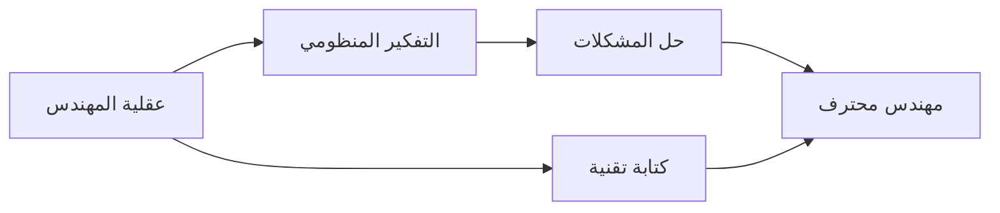

import Tabs from '@theme/Tabs';
import TabItem from '@theme/TabItem';

# 🚀 الأسس الهندسية

> العقلية الهندسية، التفكير المنظومي، والكتابة التقنية — الأساس الذي يُبنى عليه كل شيء.

## 🎯 أهداف التعلم

بعد إكمال هذه الوحدة، ستكون قادراً على:

- [**عقلية المهندس**](01-engineering-mindset) — كيف تفكر كمهندس حقيقي
- [**عقلية المسار السحابي**](02-cloud-career-mindset) — النمو المهني في الهندسة السحابية
- [**الكتابة التقنية**](03-technical-writing-for-engineers) — توثيق احترافي للمهندسين

## 💡 المهارات التي ستكتسبها

التفكير المنظومي • تحليل المشكلات • المبادئ الأولى • كتابة تقنية • اتخاذ القرارات الهندسية

## 📊 معلومات الوحدة

| العنصر           | القيمة                   |
| ---------------- | ------------------------ |
| **المستوى**      | مبتدئ                    |
| **الوقت المقدر** | 3 ساعات                  |
| **المتطلبات**    | لا شيء — هذه البداية     |
| **الشهادات**     | AZ-900                   |
| **المشاريع**     | تقرير Postmortem احترافي |
| **المختبرات**    | —                        |

## 🏛️ مهمة CloudNova

> انضم إلى CloudNova كمهندس مبتدئ. مديرك Marcus Williams ينتظر منك عقلية هندسية قبل أي أداة.

## 🗺️ خريطة الوحدة

## 📖 الدروس

<Tabs>
<TabItem value="all" label="كل الدروس" default>

- [**عقلية المهندس**](01-engineering-mindset) — كيف تفكر كمهندس حقيقي
- [**عقلية المسار السحابي**](02-cloud-career-mindset) — النمو المهني في الهندسة السحابية
- [**الكتابة التقنية**](03-technical-writing-for-engineers) — توثيق احترافي للمهندسين

</TabItem>
</Tabs>

## 🚀 ابدأ التعلم

[▶️ ابدأ الدرس الأول](01-engineering-mindset)
