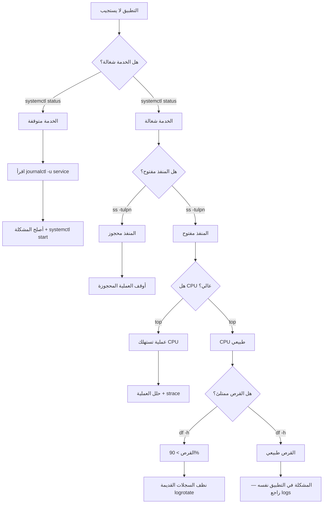
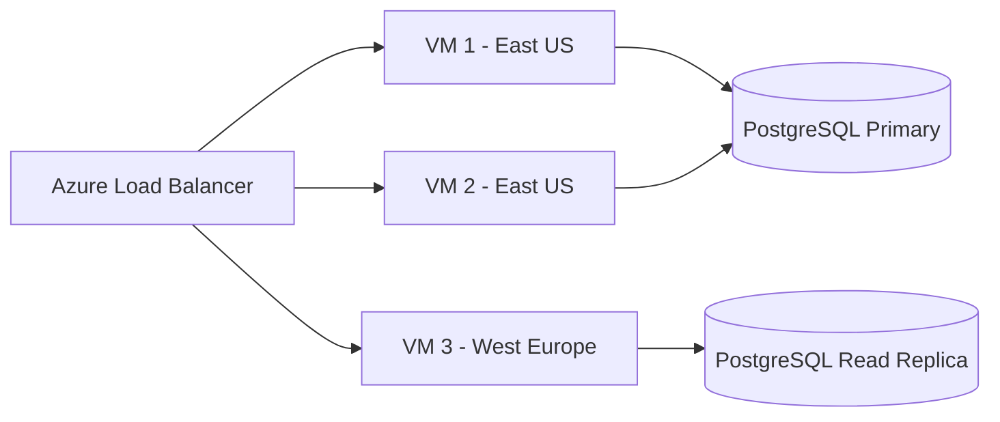
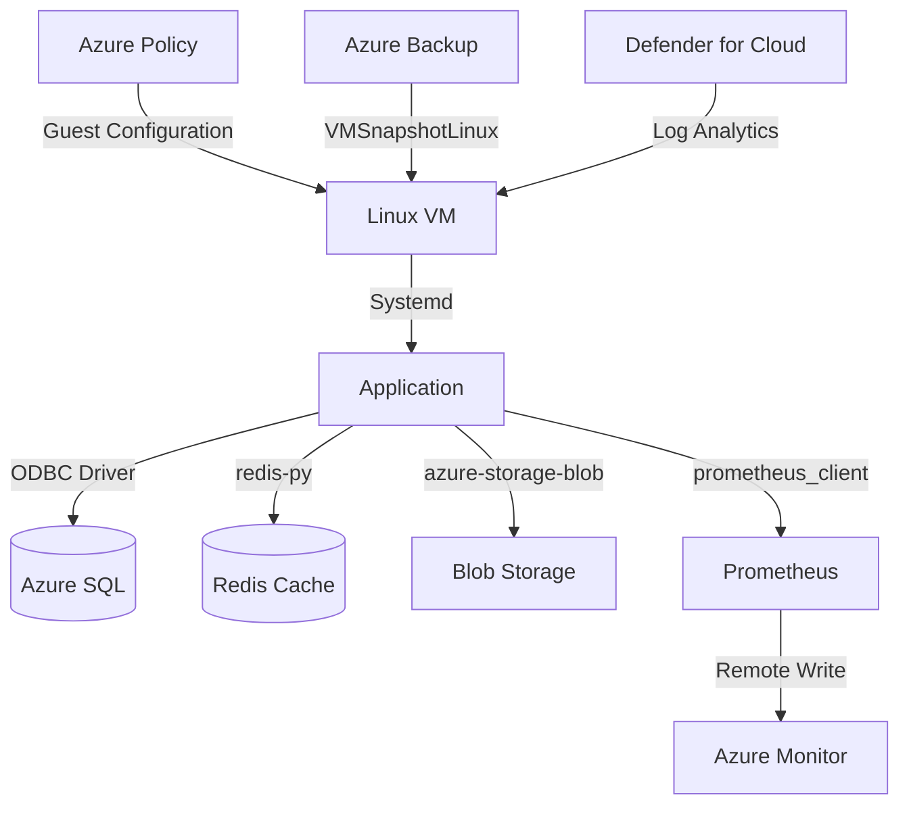

# أساسيات Linux

> **"السحابة تُبنى على Linux. كل خادم، كل حاوية، كل عقدة Kubernetes. تعلمه تتقن السحابة."**

## 🎯 أهداف التعلم

- التنقل في نظام الملفات وتنفيذ الأوامر الأساسية
- إدارة الصلاحيات والمستخدمين
- مراقبة أداء النظام واستكشاف الأخطاء
- كتابة bash scripts للأتمتة
- إنشاء systemd services و cron jobs
- التعامل مع حوادث الإنتاج الحقيقية

---

## 📖 الطبقة الأساسية: لماذا Linux مهم لمهندس السحابة؟

Linux يشغّل أكثر من 90% من خوادم السحابة العامة. Azure، AWS، GCP — جميعها تعتمد على Linux. أي مهارة تتعلمها هنا ستستخدمها يومياً في عملك.

### الأوامر الأساسية — مفاتيحك الأولى

```bash
whoami          # من أنت؟ تحقق من هوية المستخدم
pwd             # أين أنت؟ مسار المجلد الحالي
ls -la          # ماذا هنا؟ عرض كل الملفات بتفاصيلها
cd /var/log     # انتقل إلى مجلد السجلات
cat file.txt    # اقرأ محتوى ملف
tail -f app.log # راقب سجل التطبيق مباشرةً
man ls          # دليل استخدام أي أمر
```

> **نصيحة ذهبية:** `man` هو صديقك الأول. أي أمر لا تعرفه — اكتب `man <الأمر>` واقرأ.

---

## 🧱 الطبقة المهنية: نظام الملفات — شجرة واحدة

```
/              # الجذر — كل شيء يبدأ من هنا
├── /bin       # البرامج الأساسية (ls, cp, mv, cat)
├── /boot      # ملفات الإقلاع والنواة
├── /dev       # ملفات الأجهزة (كل شيء في Linux ملف!)
├── /etc       # ملفات الإعدادات والتكوين — خريطة الخادم
├── /home      # مجلدات المستخدمين الشخصية
├── /var       # بيانات متغيرة: سجلات، قواعد بيانات، طوابير
├── /var/log   # ✨ أهم مجلد للمهندس — كل السجلات هنا
├── /tmp       # ملفات مؤقتة (تُمسح عند إعادة التشغيل)
├── /usr       # برامج المستخدم المثبتة
└── /opt       # برامج خارجية اختيارية
```

### تمرين: استكشف بنفسك

```bash
# تجول في نظام الملفات
cd /
ls -la
cd /etc
ls *.conf          # شاهد ملفات الإعدادات
cd /var/log
ls -lh             # شاهد أحجام السجلات
du -sh * | sort -h # ما أكثر الملفات استهلاكاً للمساحة؟
```

---

## 🏗️ الطبقة الإنتاجية: الصلاحيات — من يقرأ؟ من يكتب؟ من ينفذ؟

```
-rwxr-xr-x  1 ali  dev   4096 Jan 15 14:32 script.sh
│├─┤├─┤├─┤
│ │  │  └── الآخرون: r-x (قراءة + تنفيذ)
│ │  └───── المجموعة: r-x (قراءة + تنفيذ)
│ └──────── المالك: rwx (قراءة + كتابة + تنفيذ)
└────────── النوع: - ملف، d مجلد، l رابط
```

### جدول الصلاحيات الرقمية

| الرقم | الرمز | المعنى       | متى تستخدمه           |
| ----- | ----- | ------------ | --------------------- |
| 7     | rwx   | كل الصلاحيات | للبرامج التنفيذية     |
| 6     | rw-   | قراءة وكتابة | للملفات العادية       |
| 5     | r-x   | قراءة وتنفيذ | للمجلدات والـ scripts |
| 4     | r--   | قراءة فقط    | للملفات الحساسة       |
| 0     | ---   | لا شيء       | لحظر الوصول تماماً    |

```bash
chmod 755 script.sh    # المالك: كل شيء، البقية: قراءة+تنفيذ
chmod 644 config.txt   # المالك: قراءة+كتابة، البقية: قراءة فقط
chmod 600 secret.key   # المالك فقط: قراءة+كتابة — ممتاز للمفاتيح
chown ali:dev file.txt # غيّر المالك إلى ali والمجموعة إلى dev
```

### ACL — صلاحيات متقدمة

```bash
# أعط user معين صلاحية على ملف بدون تغيير المجموعة
setfacl -m u:nginx:r-- /var/log/app.log
getfacl /var/log/app.log   # عرض الصلاحيات الموسعة
```

---

## 🎨 الطبقة المعمارية: إدارة العمليات

```bash
ps aux              # كل العمليات الجارية
ps aux | grep nginx # هل nginx شغال؟
top                 # مراقبة الموارد مباشرة
htop                # نسخة أجمل من top (ثبته: apt install htop)
kill 1234           # إنهاء عملية برقمها
kill -9 1234        # إنهاء فوري (قوي — استخدمه بحذر)
systemctl status nginx  # حالة خدمة
systemctl restart nginx # إعادة تشغيل خدمة
journalctl -u nginx -f  # سجلات الخدمة مباشرة
```

### مراقبة الأداء — أدوات الإنتاج

```bash
# المعالج CPU
top -bn1 | head -5          # لقطة سريعة
mpstat 1 5                  # إحصائيات CPU كل ثانية (5 مرات)

# الذاكرة Memory
free -h                     # نظرة عامة
vmstat 1 10                 # ذاكرة + swap + IO كل ثانية

# القرص Disk
df -h                       # المساحة المستخدمة/المتاحة
iostat -x 1 5               # أداء القرص (IOPS, throughput)
du -sh /var/log/* | sort -h # أكبر المجلدات

# الشبكة Network
iftop                       # مراقبة الاتصالات مباشرة
nethogs                     # أي عملية تستهلك الباندويث
ss -tulpn                   # المنافذ المفتوحة
```

---

## ⚡ الإنتاج وما بعده: systemd — إدارة الخدمات

```ini
# /etc/systemd/system/cloudnova-api.service
[Unit]
Description=CloudNova API Service
After=network.target postgresql.service
Documentation=https://github.com/cloudnova/api

[Service]
Type=simple
User=cloudnova
Group=cloudnova
WorkingDirectory=/opt/cloudnova/api
ExecStart=/opt/cloudnova/api/bin/python app.py
ExecReload=/bin/kill -HUP $MAINPID
Restart=on-failure
RestartSec=10
LimitNOFILE=65536
EnvironmentFile=/etc/cloudnova/api.env

# أمان
NoNewPrivileges=yes
ProtectSystem=strict
ProtectHome=yes
ReadWritePaths=/var/log/cloudnova /var/lib/cloudnova

# سجلات
StandardOutput=journal
StandardError=journal
SyslogIdentifier=cloudnova-api

[Install]
WantedBy=multi-user.target
```

```bash
systemctl daemon-reload       # بعد تعديل ملف الخدمة
systemctl enable cloudnova-api  # تشغيل تلقائي عند الإقلاع
systemctl start cloudnova-api   # تشغيل الآن
systemctl status cloudnova-api  # تحقق من الحالة
journalctl -u cloudnova-api -f  # سجلات مباشرة
```

---

## 📊 رسم بياني: تشخيص مشكلة إنتاجية



---

## 🏛️ Cron Jobs — أتمتة المهام الدورية

```bash
# محرر cron
crontab -e

# كل سطر: دقيقة ساعة يوم شهر يوم_أسبوع الأمر
# ┌─────────── minute (0-59)
# │ ┌───────── hour (0-23)
# │ │ ┌─────── day of month (1-31)
# │ │ │ ┌────── month (1-12)
# │ │ │ │ ┌──── day of week (0-7, 0=Sun)
# │ │ │ │ │
# * * * * * command

# أمثلة من CloudNova:
0 2 * * * /opt/cloudnova/scripts/backup-db.sh           # نسخ احتياطي يومي 2AM
*/5 * * * * /opt/cloudnova/scripts/health-check.sh       # فحص صحة كل 5 دقائق
0 6 * * 1 /opt/cloudnova/scripts/weekly-report.sh        # تقرير أسبوعي كل اثنين 6AM
0 0 1 * * /opt/cloudnova/scripts/rotate-logs.sh          # تدوير السجلات أول الشهر
```

### مشكلة شائعة: cron لا يجد المتغيرات

```bash
# ❌ هذا لن يعمل:
0 2 * * * /opt/cloudnova/scripts/backup.sh
# المشكلة: cron لا يحمّل .bashrc أو .profile

# ✅ الحل: حمّل المتغيرات أولاً أو استخدم المسار الكامل:
0 2 * * * . /home/cloudnova/.profile; /opt/cloudnova/scripts/backup.sh
# أو استخدم المسار المطلق لكل أمر داخل السكريبت:
0 2 * * * /usr/bin/python3 /opt/cloudnova/scripts/backup.py
```

---

## 🚨 سيناريو CloudNova ١: حالة طوارئ الساعة ٣ فجراً

> **الموقف:** هاتفك يرن. تطبيق CloudNova الرئيسي توقف. المستخدمون غاضبون. ماذا تفعل؟

### خطة الطوارئ خطوة بخطوة:

```bash
# 1. هل الخدمة شغالة؟
systemctl status nginx
# النتيجة: inactive (dead) ← الخدمة متوقفة!

# 2. اقرأ آخر السجلات
tail -100 /var/log/nginx/error.log
# النتيجة: "bind() to 0.0.0.0:80 failed (98: Address already in use)"
# المنفذ 80 محجوز من عملية أخرى!

# 3. من يحتل المنفذ 80؟
ss -tlnp | grep :80
# النتيجة: عملية قديمة من Apache (نُسيت شغالة)

# 4. أوقف العملية القديمة
systemctl stop apache2
systemctl disable apache2  # منع تشغيلها تلقائياً

# 5. شغّل nginx مرة أخرى
systemctl start nginx
systemctl status nginx      # ✅ active (running)

# 6. تأكد أن التطبيق يعمل
curl -I http://localhost
# HTTP/1.1 200 OK ← عاد للحياة!
```

---

## 🚨 سيناريو CloudNova ٢: القرص الممتلئ

> **الموقف:** التطبيق بطيء. `df -h` يقول `/` استخدام 99٪. القرص ممتلئ!

```bash
# ١. ما الذي يملأ القرص؟ أكبر 10 مجلدات
du -sh /* 2>/dev/null | sort -rh | head -10
# /var/log = 45GB ← هذا هو المشتبه!

# ٢. أي ملف في /var/log هو الأكبر؟
du -sh /var/log/* | sort -rh | head -5
# /var/log/nginx/access.log = 38GB!

# ٣. ماذا فيه؟
tail -100 /var/log/nginx/access.log
# آلاف الطلبات من IP واحد — هجوم!

# ٤. الحل الفوري: تفريغ الملف
> /var/log/nginx/access.log
# أو:
truncate -s 0 /var/log/nginx/access.log

# ٥. الحل الدائم: logrotate
cat > /etc/logrotate.d/nginx <<EOF
/var/log/nginx/*.log {
    daily
    rotate 7
    compress
    delaycompress
    missingok
    notifempty
    maxsize 100M
    create 640 nginx adm
}
EOF
```

---

## 🚨 سيناريو CloudNova ٣: تحقيق في استهلاك CPU

> **الموقف:** CPU 100٪. الخادم لا يستجيب. من الفاعل؟

```bash
# ١. من يستهلك CPU؟
top -bn1 -o %CPU | head -20
# PID 28471 — python3 يستهلك 98%

# ٢. ماذا تفعل هذه العملية؟
ps -fp 28471
# UID: root ← خطير! Python كـ root؟

# ٣. ماذا تقرأ؟ ماذا تكتب؟
strace -p 28471 -c -t   # ملخص system calls
lsof -p 28471           # كل الملفات المفتوحة
# النتيجة: العملية تقرأ /dev/zero وتكتب لـ /tmp/crypto_miner

# ٤. خريطة الذاكرة
pmap 28471
# العملية محملة بمكتبات crypto غريبة

# ٥. القرار:
kill -9 28471
# ثم: تحقيق أمني — كيف وصل miner للخادم؟
```

---

## 🛠️ Bash Scripting — أتمتة كل شيء

```bash
#!/bin/bash
set -euo pipefail  # توقف عند الخطأ، امنع المتغيرات غير المعرفة

# سكريبت فحص صحة الخادم — CloudNova
# الاستخدام: ./health-check.sh [--slack]

SLACK_WEBHOOK="${SLACK_WEBHOOK_URL:-}"

echo "=== تقرير صحة الخادم ==="
echo "الخادم: $(hostname)"
echo "التاريخ: $(date '+%Y-%m-%d %H:%M:%S')"
echo ""

# 💻 حالة النظام
echo "💻 حالة النظام:"
echo "  - وقت التشغيل: $(uptime -p)"
echo "  - التحميل: $(uptime | awk -F'load average:' '{print $2}')"

# عدد الأسئلة المنطقية
LOAD=$(uptime | awk -F'load average:' '{print $2}' | cut -d, -f1 | tr -d ' ')
CORES=$(nproc)
LOAD_PCT=$(echo "scale=0; $LOAD * 100 / $CORES" | bc)
echo "  - استخدام CPU: ${LOAD_PCT}%"

echo ""
echo "💾 الذاكرة:"
free -h | grep Mem | awk '{print "  - مستخدم: " $3 " / إجمالي: " $2}'

MEM_PCT=$(free | grep Mem | awk '{printf "%.0f", $3/$2 * 100}')
if [ "$MEM_PCT" -gt 90 ]; then
    echo "  ⚠️ تحذير: الذاكرة > 90%!"
fi

echo ""
echo "💿 القرص:"
df -h / | tail -1 | awk '{print "  - مستخدم: " $3 " / إجمالي: " $2 " (" $5 ")"}'

DISK_PCT=$(df / | tail -1 | awk '{print $5}' | tr -d '%')
if [ "$DISK_PCT" -gt 85 ]; then
    echo "  ⚠️ تحذير: القرص > 85%!"
fi

echo ""
echo "🌐 الخدمات الحرجة:"
FAILED=0
for svc in nginx postgresql docker; do
    if systemctl is-active --quiet $svc 2>/dev/null; then
        echo "  ✅ $svc: يعمل"
    else
        echo "  ❌ $svc: متوقف!"
        FAILED=$((FAILED + 1))
    fi
done

# إبلاغ Slack إذا هناك مشاكل
if [ "$FAILED" -gt 0 ] && [ -n "$SLACK_WEBHOOK" ] && [ "$1" = "--slack" ]; then
    curl -s -X POST "$SLACK_WEBHOOK" \
        -H "Content-Type: application/json" \
        -d "{\"text\": \"⚠️ *Health Check Failed* on $(hostname): $FAILED services down!\"}"
fi

echo ""
if [ "$FAILED" -eq 0 ]; then
    echo "✅ كل الخدمات تعمل بشكل طبيعي"
else
    echo "❌ $FAILED خدمة متوقفة — تحقق فوراً!"
    exit 1
fi
```

---

## 🛡️ SSH وإدارة المفاتيح

```bash
# إنشاء مفتاح SSH
ssh-keygen -t ed25519 -C "your_email@example.com"

# نسخ المفتاح للخادم
ssh-copy-id user@server.cloudnova.com

# تكوين ~/.ssh/config
cat >> ~/.ssh/config <<EOF
Host cloudnova-prod
    HostName prod.cloudnova.com
    User cloudnova
    IdentityFile ~/.ssh/cloudnova_prod
    ServerAliveInterval 60

Host cloudnova-*
    User cloudnova
    StrictHostKeyChecking yes
EOF

# الآن بدلاً من:
# ssh -i ~/.ssh/cloudnova_prod cloudnova@prod.cloudnova.com
# اكتب فقط:
ssh cloudnova-prod
```

---

## نصائح الإنتاج — الخلاصة

1. **لا تعمل كـ root أبداً.** أنشئ مستخدم عادي واستخدم `sudo` عند الحاجة
2. **السجلات صديقك.** تعلم قراءة `/var/log` قبل أن تحتاجها في الطوارئ
3. **أتمتة كل شيء.** إذا نفذت أمراً مرتين — اكتبه في سكريبت
4. **النسخ الاحتياطي قبل التعديل.** `cp file.conf file.conf.backup` دائماً
5. **اقرأ قبل التنفيذ.** افهم ما يفعله الأمر قبل أن تضغط Enter
6. **استخدم logrotate.** السجلات تنمو بسرعة — أدرها تلقائياً
7. **راقب عن بُعد.** Netdata, Prometheus Node Exporter, Grafana Agent
8. **وثّق runbooks.** اكتب خطوات التعافي قبل أن تحتاجها في الطوارئ

---

## 🧠 التذكّر النشط

1. ما أول 3 أوامر تنفذها عند توقف خدمة إنتاجية؟
2. كيف تكتشف أن القرص على وشك الامتلاء قبل حدوث المشكلة؟
3. ما الفرق بين `kill` و `kill -9`؟ متى تستخدم كل منهما؟
4. كيف تنشئ systemd service لتبدأ تلقائياً عند إقلاع الخادم؟
5. لماذا من الخطر تشغيل الخدمات كـ root؟

## ✍️ تمرين Feynman

اشرح لشخص غير تقني: "كيف يشبه Linux نظام الملفات في الهاتف أو الكمبيوتر المنزلي؟ وما الذي يجعل `/var/log` بهذه الأهمية؟"

## 📝 بطاقات تعليمية

- **systemd**: نظام إدارة الخدمات في Linux الحديث. يتحكم في بدء/إيقاف الخدمات
- **journalctl**: عارض سجلات systemd. يحل محل `/var/log/messages` التقليدي
- **logrotate**: أداة تدوير السجلات. تضغط القديم وتحذف ما زاد عن الحد
- **cron**: مجدول المهام الدورية. ينفذ أوامر في أوقات محددة
- **ACL**: Access Control List. صلاحيات متقدمة تتجاوز rwx التقليدية
- **strace**: يتتبع system calls لعملية. أداة تشخيص قوية جداً

## 🎤 أسئلة المقابلة

1. **"كيف تشخص مشكلة بطء الخادم؟"**
   - top/htop: من يستهلك CPU؟
   - free/vmstat: هل الذاكرة ممتلئة؟
   - iostat: هل القرص هو المشكلة؟
   - ss/netstat: هل الشبكة مشبعة؟
   - ابدأ بالأكثر احتمالاً وانتقل للأسفل

2. **"كيف تضمن تشغيل خدمة تلقائياً بعد إعادة تشغيل الخادم؟"**
   - `systemctl enable service-name`
   - تأكد من `WantedBy=multi-user.target` في ملف systemd
   - اختبر بإعادة تشغيل الخادم في بيئة آمنة

3. **"حدث وأن الخادم لا يستجيب عبر SSH. ماذا تفعل؟"**
   - Serial console في Azure/AWS Portal
   - تحقق من CPU (هل هو 100٪؟)
   - تحقق من القرص (هل هو ممتلئ؟)
   - تحقق من الذاكرة (هل OOM Killer قتل sshd؟)

---

---

## 🏛️ الطبقة الإنتاجية: Linux في بيئة الإنتاج

### High Availability — كيف تبقي الخدمة شغالة دائماً



```bash
# Keepalived — Virtual IP للـ HA
apt install keepalived

cat > /etc/keepalived/keepalived.conf <<EOF
vrrp_instance VI_1 {
    state MASTER
    interface eth0
    virtual_router_id 51
    priority 100
    advert_int 1
    authentication {
        auth_type PASS
        auth_pass cloudnova2026
    }
    virtual_ipaddress {
        10.0.1.100/24  # الـ VIP — ينتقل بين الخوادم
    }
}
EOF

systemctl enable --now keepalived
```

### Scaling Strategies

```
Vertical Scaling (Scale Up):
├── زيادة CPU/RAM لنفس الخادم
├── سهل: تغيير VM Size في Azure
├── محدود: أقصى حجم VM
└── مناسب: قواعد البيانات، التطبيقات القديمة

Horizontal Scaling (Scale Out):
├── إضافة خوادم جديدة
├── معقد: يحتاج Load Balancer + Shared State
├── لا محدود: أضف خوادم بلا حدود
└── مناسب: تطبيقات الويب، APIs، Microservices

في CloudNova:
├── API: Horizontal (AKS + HPA)
├── Database: Vertical (أضف vCPU/RAM)
└── Cache (Redis): Horizontal (Redis Cluster)
```

### Disaster Recovery — ماذا لو احترق Data Center؟

```bash
# استراتيجية CloudNova للـ DR

# ١. نسخ احتياطي يومي (Azure Backup)
az backup protection enable-for-vm \
  --resource-group prod-rg \
  --vault-name cloudnova-vault \
  --vm cloudnova-api-vm \
  --policy-name DailyBackupPolicy

# ٢. استعادة في منطقة أخرى
az backup restore restore-disks \
  --resource-group prod-rg \
  --vault-name cloudnova-vault \
  --container-name cloudnova-api-vm \
  --item-name cloudnova-api-vm \
  --restore-point "latest" \
  --target-resource-group dr-rg \
  --storage-account drstorage \
  --restore-to-staging-storage-account

# ٣. RPO = 24 ساعة (نسخة احتياطية يومية)
# ٤. RTO = ٤ ساعات (وقت الاستعادة + التكوين)
```

### Monitoring Stack للإنتاج

```yaml
# Prometheus Node Exporter — مراقبة على مستوى الخادم
# /etc/prometheus/prometheus.yml
scrape_configs:
  - job_name: "linux-servers"
    static_configs:
      - targets:
          - "10.0.1.11:9100" # cloudnova-api-01
          - "10.0.1.12:9100" # cloudnova-api-02
          - "10.0.2.21:9100" # cloudnova-db-01

    # Alert Rules
    rule_files:
      - "/etc/prometheus/alerts/linux.yml"

# /etc/prometheus/alerts/linux.yml
groups:
  - name: linux_alerts
    rules:
      - alert: HighCPUUsage
        expr: 100 - (avg(rate(node_cpu_seconds_total{mode="idle"}[5m])) * 100) > 80
        for: 10m
        labels:
          severity: warning
        annotations:
          summary: "CPU usage > 80% on {{ $labels.instance }}"

      - alert: DiskAlmostFull
        expr: (node_filesystem_avail_bytes / node_filesystem_size_bytes) * 100 < 15
        for: 5m
        labels:
          severity: critical
        annotations:
          summary: "Disk usage > 85% on {{ $labels.instance }}"

      - alert: OutOfMemory
        expr: node_memory_MemAvailable_bytes / node_memory_MemTotal_bytes * 100 < 10
        for: 5m
        labels:
          severity: critical
        annotations:
          summary: "Memory available < 10% on {{ $labels.instance }}"
```

### Compliance & Governance

```bash
# CIS Benchmark — هل خادمك آمن؟
# تثبيت أداة الفحص
wget https://github.com/aquasecurity/cis-hardening/releases/latest/download/cis-hardening_linux_amd64.deb
dpkg -i cis-hardening_linux_amd64.deb

# فحص الخادم
cis-hardening audit --level 1

# نتائج مهمة للتطبيق:
# ✓ password expires in 90 days
# ✓ SSH root login disabled
# ✓ firewall enabled
# ✗ auditd not running — خطر!
# ✗ unused filesystems not disabled (cramfs, freevxfs)

# تثبيت auditd للتسجيل الأمني
apt install auditd
systemctl enable --now auditd

# إضافة قواعد تدقيق أساسية
auditctl -w /etc/passwd -p wa -k identity_changes
auditctl -w /etc/shadow -p wa -k identity_changes
auditctl -w /var/log/auth.log -p wa -k auth_logs
auditctl -w /etc/ssh/sshd_config -p wa -k ssh_config
```

---

## 🎨 الطبقة المعمارية: قرارات معمارية كبرى

### Trade-off Analysis — Linux Distro للـ Production

| Distro         | الميزة                   | العيب                    | متى تختاره                 |
| -------------- | ------------------------ | ------------------------ | -------------------------- |
| **Ubuntu LTS** | مجتمع ضخم، دعم طويل      | تحديثات كثيرة            | تطبيقات عامة، فرق صغيرة    |
| **RHEL/Rocky** | استقرار عالي، دعم مؤسسي  | مدفوع (RHEL)، مجتمع أصغر | شركات كبيرة، compliance    |
| **Debian**     | استقرار شديد، حر بالكامل | حزم قديمة أحياناً        | خوادم حرجة لا تتغير كثيراً |
| **Alpine**     | صغير جداً (5MB!)، آمن    | ليس لكل الحزم دعم        | Containers، Docker images  |
| **Flatcar**    | Immutable، مثالي لـ K8s  | تعلم مختلف تماماً        | Kubernetes nodes           |

### متى لا تستخدم Linux؟

```
❌ لا تستخدم Linux عندما:

1. تحتاج Active Directory كامل بدون Azure AD
   → Windows Server هو الأنسب للـ Domain Controller

2. تطبيق .NET Framework قديم (وليس .NET Core)
   → .NET Framework يعمل فقط على Windows

3. تحتاج دعم بائعين معتمدين (بعض برامج المحاسبة/ERP)
   → بعض البرامج المؤسسية تدعم Windows فقط

4. فريقك لا يعرف Linux ويحتاج إنتاجاً فورياً
   → استخدم PaaS (App Service) بدلاً من VMs
   → أو وظف خبير Linux!
```

### Integration مع أنظمة أخرى



### Future Trends

```
1. Immutable Infrastructure:
   الخادم لا يُعدَّل بعد النشر. أي تغيير = خادم جديد.
   الأدوات: Packer + Terraform

2. Container-Optimized Linux:
   Flatcar, Bottlerocket, Azure Linux
   لا package manager. لا shell افتراضياً. فقط containers.

3. eBPF — ثورة في المراقبة والأمان:
   برامج تعمل داخل Linux kernel بدون إعادة تشغيل.
   أدوات: Cilium (شبكات), Falco (أمان), Pixie (مراقبة)

4. Confidential Computing:
   تشفير البيانات أثناء المعالجة في الذاكرة (وليس فقط at rest/in transit)
   Azure DCasv5 / ECasv5 series
```

### Migration Strategy — من Windows لـ Linux

```
الخطة في CloudNova (هاجرنا 12 تطبيقاً):

1. Inventory: صنف التطبيقات — .NET Core؟ Node.js؟ Python؟
2. Containerize: حزم كل تطبيق في Docker
3. Test: بيئة staging على Linux لمدة أسبوعين
4. Canary: 10% حركة → Linux، 90% → Windows
5. Switch: 100% → Linux
6. Decommission: إيقاف Windows servers

النتيجة:
├── توفير $4,200/شهر (Windows licenses)
├── أداء أفضل 30% (Linux kernel أكثر كفاءة)
└── زمن deployment أقل 80% (containers)
```

---

## 🛠️ تدريبات عملية

### تمرين ١: تشخيص خدمة متوقفة

```bash
# الهدف: خدمة nginx متوقفة. شغّلها واكتشف السبب.

# ١. تحقق من حالة nginx
systemctl status nginx

# ٢. إذا كانت متوقفة، شغّلها
systemctl start nginx

# ٣. إذا فشلت، اقرأ السبب
journalctl -u nginx --since "5 minutes ago" | tail -20

# ٤. أصلح المشكلة (غالباً config error أو port conflict)
nginx -t  # اختبر config
```

### تمرين ٢: كتابة systemd service

```bash
# الهدف: أنشئ systemd service لتطبيق Python بسيط

# ١. أنشئ التطبيق
cat > /opt/myapp/app.py << 'EOF'
from http.server import HTTPServer, BaseHTTPRequestHandler

class Handler(BaseHTTPRequestHandler):
    def do_GET(self):
        self.send_response(200)
        self.end_headers()
        self.wfile.write(b"Hello from CloudNova!")

HTTPServer(("0.0.0.0", 9090), Handler).serve_forever()
EOF

# ٢. أنشئ systemd unit
cat > /etc/systemd/system/myapp.service << 'EOF'
[Unit]
Description=My Python App
After=network.target

[Service]
Type=simple
User=nobody
ExecStart=/usr/bin/python3 /opt/myapp/app.py
Restart=always

[Install]
WantedBy=multi-user.target
EOF

# ٣. فعّل وابدأ
systemctl daemon-reload
systemctl enable --now myapp

# ٤. تحقق
curl http://localhost:9090
# Hello from CloudNova! ✅
```

### تحدي: سكريبت تنظيف تلقائي

```
المطلوب: اكتب bash script يقوم بالآتي:

1. إيجاد كل الملفات في /tmp أقدم من 7 أيام
2. عرضها للمستخدم مع تأكيد قبل الحذف
3. تسجيل كل ملف محذوف في /var/log/cleanup.log

Bonus:
- أضف dry-run mode (معاينة فقط)
- احسب المساحة المحررة

بداية الحل:
#!/bin/bash
set -euo pipefail

DRY_RUN=false
if [ "${1:-}" = "--dry-run" ]; then
    DRY_RUN=true
fi

find /tmp -type f -mtime +7 | while read file; do
    echo "Found: $file ($(du -h "$file" | cut -f1))"
    if [ "$DRY_RUN" = true ]; then
        echo "  Would delete (dry-run)"
    else
        rm "$file"
        echo "$(date): Deleted $file" >> /var/log/cleanup.log
    fi
done
```

### CloudNova Project Task

```
مهمتك: إعداد خادم إنتاجي جديد لـ CloudNova

المتطلبات:
1. ✓ Ubuntu 22.04 LTS
2. ✓ إنشاء مستخدم "cloudnova" مع sudo
3. ✓ تثبيت وتكوين:
   - nginx (reverse proxy لـ localhost:3000)
   - Node Exporter (Prometheus metrics)
   - auditd (security auditing)
4. ✓ systemd service لتطبيق Node.js
5. ✓ logrotate لسجلات nginx
6. ✓ cron job لـ backup يومي لـ /opt/cloudnova
7. ✓ جدار ناري (ufw): فقط 22, 80, 443, 9100
```

---

## 📝 تقييم — اختبر معرفتك

### Knowledge Check

1. **ما الأمر لعرض آخر 50 سطراً من ملف سجل؟**
   

<details><summary>الإجابة</summary>`tail -50 /var/log/syslog`</details>


2. **ما الفرق بين `systemctl restart` و `systemctl reload`؟**
   

<details><summary>الإجابة</summary>restart يوقف ثم يبدأ (انقطاع). reload يعيد قراءة config بدون توقف (إذا كانت الخدمة تدعمه).</details>


3. **كيف تجد كل الملفات المعدلة في آخر 24 ساعة؟**
   

<details><summary>الإجابة</summary>`find / -type f -mtime -1 2>/dev/null`</details>


4. **ما معنى `chmod 750`؟**
   

<details><summary>الإجابة</summary>مالك: rwx (7)، مجموعة: r-x (5)، آخرون: --- (0)</details>


5. **كيف تمنع service من التشغيل التلقائي عند الإقلاع؟**
   

<details><summary>الإجابة</summary>`systemctl disable service-name`</details>


### Quiz

1. **أي أمر يظهر استهلاك الذاكرة الحالي؟**
   a) `df -h`
   b) `free -h`
   c) `du -sh`
   

<details><summary>الإجابة</summary>b) `free -h`</details>


2. **كيف تشغل أمراً كل ساعة في cron؟**
   a) `* */1 * * * command`
   b) `0 * * * * command`
   c) `@hourly command`
   

<details><summary>الإجابة</summary>b و c صحيحان. `0 * * * *` في الدقيقة 0 من كل ساعة. `@hourly` اختصار.</details>


3. **أي PID للإشارة لأعلى عملية تستهلك CPU؟**
   a) `kill -9`
   b) `top` ثم sort بـ `P`
   c) `ps aux | grep cpu`
   

<details><summary>الإجابة</summary>b) `top` ثم اضغط P للترتيب حسب CPU</details>


### 5 أسئلة للتذكّر النشط

1. ما أول 5 أوامر تنفذها عند استلام alert "server down"؟
2. ارسم من ذاكرتك هيكل نظام الملفات في Linux — اذكر 7 مجلدات رئيسية
3. كيف تصمم HA لخدمة ويب باستخدام Linux + Azure فقط؟
4. اشرح الفرق بين Vertical و Horizontal scaling — أعط مثالاً لكل منهما من CloudNova
5. كيف تكتشف crypto miner على خادم Linux؟

### ✍️ تمرين Feynman

اشرح لمدير غير تقني: "لماذا ندفع أقل 40% منذ أن انتقلنا من Windows إلى Linux؟ وما هو systemd بالضبط ولماذا يهم؟"

### 🎴 بطاقات تعليمية (Flashcards)

| 🃏 السؤال                      | 🃏 الإجابة                                                 |
| ------------------------------ | ---------------------------------------------------------- |
| أمر عرض الملفات مع التفاصيل    | `ls -la`                                                   |
| أمر مراقبة العمليات مباشرة     | `top` أو `htop`                                            |
| مكان سجلات systemd             | `journalctl -u service-name`                               |
| أمر إنشاء systemd service جديد | ملف في `/etc/systemd/system/` ثم `systemctl daemon-reload` |
| PID 1 في Linux الحديث          | systemd                                                    |
| أداة تدوير السجلات             | logrotate                                                  |
| أمر فحص المنافذ المفتوحة       | `ss -tulpn`                                                |
| أمر تتبع system calls لعملية   | `strace -p PID`                                            |

---

## 🎤 أسئلة مقابلة إضافية

### س ١: System Design — صمم خدمة ويب عالية التوفر

> **السؤال:** "تصمم خدمة API تستقبل 10,000 طلب/ثانية. الميزانية محدودة. كيف تبنيها على Linux؟"

```
الإجابة النموذجية:

1. Frontend: nginx reverse proxy + SSL termination
   - worker_processes = عدد cores
   - keepalive_timeout 65

2. Backend: 3-5 نسخ من تطبيق Node.js/Python
   - systemd services مع Restart=always
   - توزيع الحمل عبر upstream nginx:
     upstream backend {
         server 10.0.1.11:3000 weight=3;
         server 10.0.1.12:3000 weight=2;
     }

3. Caching: Redis على خادم منفصل
   - يخفض الحمل على الـ backend 70%

4. Monitoring:
   - Node Exporter → Prometheus → Grafana
   - Alert: CPU > 80%, Memory > 85%, Disk > 85%

5. Scaling:
   - أفقي: أضف خوادم جديدة لـ upstream
   - عمودي: Upgrade VM size (D2s → D4s)

التكلفة التقديرية: $600-900/شهر (3 VMs + Redis)
```

### س ٢: Behavioral — STAR

> **السؤال:** "حدثني عن وقت شخّصت فيه مشكلة معقدة على خادم Linux."

```
S: في CloudNova، تأخر تطبيق الدفع 5 ثوانٍ لكل طلب.
T: اكتشاف السبب وإصلاحه قبل خسارة عملاء.
A:
  1. top: CPU طبيعي، memory طبيعي — المشكلة ليست موارد
  2. strace -p PID -c: 98% من الوقت في futex() — deadlock!
  3. gdb: تتبع الـ threads — thread pool استنفد
  4. الحل: ضاعف حجم thread pool + أضف timeout
R: latency عاد لـ 200ms. وثّقت العملية كـ runbook.
```

### س ٣: Linux Security

> **السؤال:** "كيف تؤمّن خادم Linux جديد قبل وضعه في الإنتاج؟"

```
١. المستخدمين:
   - تعطيل root login: passwd -l root
   - إنشاء مستخدم خاص مع sudo
   - SSH keys فقط — ممنوع كلمات السر

٢. الشبكة:
   - ufw: فقط المنافذ المطلوبة
   - fail2ban: منع brute force

٣. النظام:
   - تحديث كل الحزم: apt update && apt upgrade
   - إزالة الخدمات غير الضرورية
   - تمكين automatic security updates

٤. التدقيق:
   - auditd للقواعد الأساسية
   - سجلات إلى Azure Monitor

٥. الامتثال:
   - فحص CIS Benchmark
   - Azure Policy Guest Configuration
```

---

## 📚 مراجع وروابط

### دروس ذات صلة

- [Linux المتقدم](/docs/lessons/02-linux/02-linux-advanced) — Bash scripting، networking، security hardening
- [Docker Mastery](/docs/lessons/09-docker/01-docker-mastery) — Containerization على Linux
- [Kubernetes Architecture](/docs/lessons/10-kubernetes/01-kubernetes-architecture) — Linux يشغّل كل Node
- [Monitoring Fundamentals](/docs/lessons/20-monitoring/01-monitoring-fundamentals) — Prometheus + Grafana

### مشاريع ومختبرات

- مشروع: [Linux Server Setup](/projects) — ابنِ خادم إنتاجي من الصفر
- مختبر: [تشخيص أعطال Linux](/labs) — 5 سيناريوهات Troubleshooting
- محاكي: [Linux Terminal](/simulators) — تدرب على الأوامر مباشرة

### شهادات ذات صلة

| الشهادة    | الأهداف المغطاة                     |
| ---------- | ----------------------------------- |
| **AZ-104** | إدارة VMs، Networking، Backup       |
| **AZ-400** | Infrastructure as Code، Automation  |
| **LFCS**   | Linux Foundation Certified Sysadmin |

### مصادر خارجية

- [Linux Journey](https://linuxjourney.com) — دورة تفاعلية مجانية
- [DigitalOcean Community](https://www.digitalocean.com/community/tutorials) — أفضل tutorials
- [Red Hat Documentation](https://docs.redhat.com) — المرجع الرسمي
- [Linux Kernel Map](https://makelinux.github.io/kernel/map/) — خريطة kernel تفاعلية

### مصطلحات تقنية في هذا الدرس

| المصطلح                      | التعريف                                                        |
| ---------------------------- | -------------------------------------------------------------- |
| **systemd**                  | نظام init في Linux الحديث — يدير الخدمات والعمليات             |
| **journalctl**               | عارض سجلات systemd المركزي                                     |
| **cron**                     | مجدول مهام دورية في Unix/Linux                                 |
| **logrotate**                | أداة تدوير وضغط وحذف السجلات القديمة                           |
| **ACL**                      | قائمة تحكم بالوصول — صلاحيات متقدمة                            |
| **strace**                   | متتبع system calls — نافذة على ما تفعله العملية                |
| **Immutable Infrastructure** | خوادم لا تُعدَّل بعد النشر                                     |
| **eBPF**                     | Extended Berkeley Packet Filter — تشغيل برامج آمنة داخل kernel |

---

[← العودة للوحدة](01-linux-essentials) | [🏠 الرئيسية](/)
