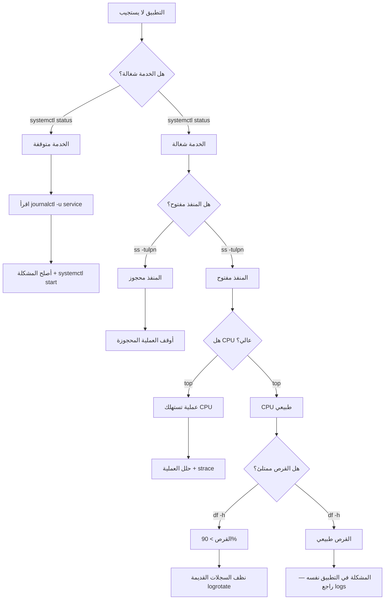

# أساسيات Linux

> **"السحابة تُبنى على Linux. كل خادم، كل حاوية، كل عقدة Kubernetes. تعلمه تتقن السحابة."**

## 🎯 أهداف التعلم

- التنقل في نظام الملفات وتنفيذ الأوامر الأساسية
- إدارة الصلاحيات والمستخدمين
- مراقبة أداء النظام واستكشاف الأخطاء
- كتابة bash scripts للأتمتة
- إنشاء systemd services و cron jobs
- التعامل مع حوادث الإنتاج الحقيقية

---

## 📖 الطبقة الأساسية: لماذا Linux مهم لمهندس السحابة؟

Linux يشغّل أكثر من 90% من خوادم السحابة العامة. Azure، AWS، GCP — جميعها تعتمد على Linux. أي مهارة تتعلمها هنا ستستخدمها يومياً في عملك.

### الأوامر الأساسية — مفاتيحك الأولى

```bash
whoami          # من أنت؟ تحقق من هوية المستخدم
pwd             # أين أنت؟ مسار المجلد الحالي
ls -la          # ماذا هنا؟ عرض كل الملفات بتفاصيلها
cd /var/log     # انتقل إلى مجلد السجلات
cat file.txt    # اقرأ محتوى ملف
tail -f app.log # راقب سجل التطبيق مباشرةً
man ls          # دليل استخدام أي أمر
```

> **نصيحة ذهبية:** `man` هو صديقك الأول. أي أمر لا تعرفه — اكتب `man <الأمر>` واقرأ.

---

## 🧱 الطبقة المهنية: نظام الملفات — شجرة واحدة

```
/              # الجذر — كل شيء يبدأ من هنا
├── /bin       # البرامج الأساسية (ls, cp, mv, cat)
├── /boot      # ملفات الإقلاع والنواة
├── /dev       # ملفات الأجهزة (كل شيء في Linux ملف!)
├── /etc       # ملفات الإعدادات والتكوين — خريطة الخادم
├── /home      # مجلدات المستخدمين الشخصية
├── /var       # بيانات متغيرة: سجلات، قواعد بيانات، طوابير
├── /var/log   # ✨ أهم مجلد للمهندس — كل السجلات هنا
├── /tmp       # ملفات مؤقتة (تُمسح عند إعادة التشغيل)
├── /usr       # برامج المستخدم المثبتة
└── /opt       # برامج خارجية اختيارية
```

### تمرين: استكشف بنفسك

```bash
# تجول في نظام الملفات
cd /
ls -la
cd /etc
ls *.conf          # شاهد ملفات الإعدادات
cd /var/log
ls -lh             # شاهد أحجام السجلات
du -sh * | sort -h # ما أكثر الملفات استهلاكاً للمساحة؟
```

---

## 🏗️ الطبقة الإنتاجية: الصلاحيات — من يقرأ؟ من يكتب؟ من ينفذ؟

```
-rwxr-xr-x  1 ali  dev   4096 Jan 15 14:32 script.sh
│├─┤├─┤├─┤
│ │  │  └── الآخرون: r-x (قراءة + تنفيذ)
│ │  └───── المجموعة: r-x (قراءة + تنفيذ)
│ └──────── المالك: rwx (قراءة + كتابة + تنفيذ)
└────────── النوع: - ملف، d مجلد، l رابط
```

### جدول الصلاحيات الرقمية

| الرقم | الرمز | المعنى       | متى تستخدمه           |
| ----- | ----- | ------------ | --------------------- |
| 7     | rwx   | كل الصلاحيات | للبرامج التنفيذية     |
| 6     | rw-   | قراءة وكتابة | للملفات العادية       |
| 5     | r-x   | قراءة وتنفيذ | للمجلدات والـ scripts |
| 4     | r--   | قراءة فقط    | للملفات الحساسة       |
| 0     | ---   | لا شيء       | لحظر الوصول تماماً    |

```bash
chmod 755 script.sh    # المالك: كل شيء، البقية: قراءة+تنفيذ
chmod 644 config.txt   # المالك: قراءة+كتابة، البقية: قراءة فقط
chmod 600 secret.key   # المالك فقط: قراءة+كتابة — ممتاز للمفاتيح
chown ali:dev file.txt # غيّر المالك إلى ali والمجموعة إلى dev
```

### ACL — صلاحيات متقدمة

```bash
# أعط user معين صلاحية على ملف بدون تغيير المجموعة
setfacl -m u:nginx:r-- /var/log/app.log
getfacl /var/log/app.log   # عرض الصلاحيات الموسعة
```

---

## 🎨 الطبقة المعمارية: إدارة العمليات

```bash
ps aux              # كل العمليات الجارية
ps aux | grep nginx # هل nginx شغال؟
top                 # مراقبة الموارد مباشرة
htop                # نسخة أجمل من top (ثبته: apt install htop)
kill 1234           # إنهاء عملية برقمها
kill -9 1234        # إنهاء فوري (قوي — استخدمه بحذر)
systemctl status nginx  # حالة خدمة
systemctl restart nginx # إعادة تشغيل خدمة
journalctl -u nginx -f  # سجلات الخدمة مباشرة
```

### مراقبة الأداء — أدوات الإنتاج

```bash
# المعالج CPU
top -bn1 | head -5          # لقطة سريعة
mpstat 1 5                  # إحصائيات CPU كل ثانية (5 مرات)

# الذاكرة Memory
free -h                     # نظرة عامة
vmstat 1 10                 # ذاكرة + swap + IO كل ثانية

# القرص Disk
df -h                       # المساحة المستخدمة/المتاحة
iostat -x 1 5               # أداء القرص (IOPS, throughput)
du -sh /var/log/* | sort -h # أكبر المجلدات

# الشبكة Network
iftop                       # مراقبة الاتصالات مباشرة
nethogs                     # أي عملية تستهلك الباندويث
ss -tulpn                   # المنافذ المفتوحة
```

---

## ⚡ الإنتاج وما بعده: systemd — إدارة الخدمات

```ini
# /etc/systemd/system/cloudnova-api.service
[Unit]
Description=CloudNova API Service
After=network.target postgresql.service
Documentation=https://github.com/cloudnova/api

[Service]
Type=simple
User=cloudnova
Group=cloudnova
WorkingDirectory=/opt/cloudnova/api
ExecStart=/opt/cloudnova/api/bin/python app.py
ExecReload=/bin/kill -HUP $MAINPID
Restart=on-failure
RestartSec=10
LimitNOFILE=65536
EnvironmentFile=/etc/cloudnova/api.env

# أمان
NoNewPrivileges=yes
ProtectSystem=strict
ProtectHome=yes
ReadWritePaths=/var/log/cloudnova /var/lib/cloudnova

# سجلات
StandardOutput=journal
StandardError=journal
SyslogIdentifier=cloudnova-api

[Install]
WantedBy=multi-user.target
```

```bash
systemctl daemon-reload       # بعد تعديل ملف الخدمة
systemctl enable cloudnova-api  # تشغيل تلقائي عند الإقلاع
systemctl start cloudnova-api   # تشغيل الآن
systemctl status cloudnova-api  # تحقق من الحالة
journalctl -u cloudnova-api -f  # سجلات مباشرة
```

---

## 📊 رسم بياني: تشخيص مشكلة إنتاجية



---

## 🏛️ Cron Jobs — أتمتة المهام الدورية

```bash
# محرر cron
crontab -e

# كل سطر: دقيقة ساعة يوم شهر يوم_أسبوع الأمر
# ┌─────────── minute (0-59)
# │ ┌───────── hour (0-23)
# │ │ ┌─────── day of month (1-31)
# │ │ │ ┌────── month (1-12)
# │ │ │ │ ┌──── day of week (0-7, 0=Sun)
# │ │ │ │ │
# * * * * * command

# أمثلة من CloudNova:
0 2 * * * /opt/cloudnova/scripts/backup-db.sh           # نسخ احتياطي يومي 2AM
*/5 * * * * /opt/cloudnova/scripts/health-check.sh       # فحص صحة كل 5 دقائق
0 6 * * 1 /opt/cloudnova/scripts/weekly-report.sh        # تقرير أسبوعي كل اثنين 6AM
0 0 1 * * /opt/cloudnova/scripts/rotate-logs.sh          # تدوير السجلات أول الشهر
```

### مشكلة شائعة: cron لا يجد المتغيرات

```bash
# ❌ هذا لن يعمل:
0 2 * * * /opt/cloudnova/scripts/backup.sh
# المشكلة: cron لا يحمّل .bashrc أو .profile

# ✅ الحل: حمّل المتغيرات أولاً أو استخدم المسار الكامل:
0 2 * * * . /home/cloudnova/.profile; /opt/cloudnova/scripts/backup.sh
# أو استخدم المسار المطلق لكل أمر داخل السكريبت:
0 2 * * * /usr/bin/python3 /opt/cloudnova/scripts/backup.py
```

---

## 🚨 سيناريو CloudNova ١: حالة طوارئ الساعة ٣ فجراً

> **الموقف:** هاتفك يرن. تطبيق CloudNova الرئيسي توقف. المستخدمون غاضبون. ماذا تفعل؟

### خطة الطوارئ خطوة بخطوة:

```bash
# 1. هل الخدمة شغالة؟
systemctl status nginx
# النتيجة: inactive (dead) ← الخدمة متوقفة!

# 2. اقرأ آخر السجلات
tail -100 /var/log/nginx/error.log
# النتيجة: "bind() to 0.0.0.0:80 failed (98: Address already in use)"
# المنفذ 80 محجوز من عملية أخرى!

# 3. من يحتل المنفذ 80؟
ss -tlnp | grep :80
# النتيجة: عملية قديمة من Apache (نُسيت شغالة)

# 4. أوقف العملية القديمة
systemctl stop apache2
systemctl disable apache2  # منع تشغيلها تلقائياً

# 5. شغّل nginx مرة أخرى
systemctl start nginx
systemctl status nginx      # ✅ active (running)

# 6. تأكد أن التطبيق يعمل
curl -I http://localhost
# HTTP/1.1 200 OK ← عاد للحياة!
```

---

## 🚨 سيناريو CloudNova ٢: القرص الممتلئ

> **الموقف:** التطبيق بطيء. `df -h` يقول `/` استخدام 99٪. القرص ممتلئ!

```bash
# ١. ما الذي يملأ القرص؟ أكبر 10 مجلدات
du -sh /* 2>/dev/null | sort -rh | head -10
# /var/log = 45GB ← هذا هو المشتبه!

# ٢. أي ملف في /var/log هو الأكبر؟
du -sh /var/log/* | sort -rh | head -5
# /var/log/nginx/access.log = 38GB!

# ٣. ماذا فيه؟
tail -100 /var/log/nginx/access.log
# آلاف الطلبات من IP واحد — هجوم!

# ٤. الحل الفوري: تفريغ الملف
> /var/log/nginx/access.log
# أو:
truncate -s 0 /var/log/nginx/access.log

# ٥. الحل الدائم: logrotate
cat > /etc/logrotate.d/nginx <<EOF
/var/log/nginx/*.log {
    daily
    rotate 7
    compress
    delaycompress
    missingok
    notifempty
    maxsize 100M
    create 640 nginx adm
}
EOF
```

---

## 🚨 سيناريو CloudNova ٣: تحقيق في استهلاك CPU

> **الموقف:** CPU 100٪. الخادم لا يستجيب. من الفاعل؟

```bash
# ١. من يستهلك CPU؟
top -bn1 -o %CPU | head -20
# PID 28471 — python3 يستهلك 98%

# ٢. ماذا تفعل هذه العملية؟
ps -fp 28471
# UID: root ← خطير! Python كـ root؟

# ٣. ماذا تقرأ؟ ماذا تكتب؟
strace -p 28471 -c -t   # ملخص system calls
lsof -p 28471           # كل الملفات المفتوحة
# النتيجة: العملية تقرأ /dev/zero وتكتب لـ /tmp/crypto_miner

# ٤. خريطة الذاكرة
pmap 28471
# العملية محملة بمكتبات crypto غريبة

# ٥. القرار:
kill -9 28471
# ثم: تحقيق أمني — كيف وصل miner للخادم؟
```

---

## 🛠️ Bash Scripting — أتمتة كل شيء

```bash
#!/bin/bash
set -euo pipefail  # توقف عند الخطأ، امنع المتغيرات غير المعرفة

# سكريبت فحص صحة الخادم — CloudNova
# الاستخدام: ./health-check.sh [--slack]

SLACK_WEBHOOK="${SLACK_WEBHOOK_URL:-}"

echo "=== تقرير صحة الخادم ==="
echo "الخادم: $(hostname)"
echo "التاريخ: $(date '+%Y-%m-%d %H:%M:%S')"
echo ""

# 💻 حالة النظام
echo "💻 حالة النظام:"
echo "  - وقت التشغيل: $(uptime -p)"
echo "  - التحميل: $(uptime | awk -F'load average:' '{print $2}')"

# عدد الأسئلة المنطقية
LOAD=$(uptime | awk -F'load average:' '{print $2}' | cut -d, -f1 | tr -d ' ')
CORES=$(nproc)
LOAD_PCT=$(echo "scale=0; $LOAD * 100 / $CORES" | bc)
echo "  - استخدام CPU: ${LOAD_PCT}%"

echo ""
echo "💾 الذاكرة:"
free -h | grep Mem | awk '{print "  - مستخدم: " $3 " / إجمالي: " $2}'

MEM_PCT=$(free | grep Mem | awk '{printf "%.0f", $3/$2 * 100}')
if [ "$MEM_PCT" -gt 90 ]; then
    echo "  ⚠️ تحذير: الذاكرة > 90%!"
fi

echo ""
echo "💿 القرص:"
df -h / | tail -1 | awk '{print "  - مستخدم: " $3 " / إجمالي: " $2 " (" $5 ")"}'

DISK_PCT=$(df / | tail -1 | awk '{print $5}' | tr -d '%')
if [ "$DISK_PCT" -gt 85 ]; then
    echo "  ⚠️ تحذير: القرص > 85%!"
fi

echo ""
echo "🌐 الخدمات الحرجة:"
FAILED=0
for svc in nginx postgresql docker; do
    if systemctl is-active --quiet $svc 2>/dev/null; then
        echo "  ✅ $svc: يعمل"
    else
        echo "  ❌ $svc: متوقف!"
        FAILED=$((FAILED + 1))
    fi
done

# إبلاغ Slack إذا هناك مشاكل
if [ "$FAILED" -gt 0 ] && [ -n "$SLACK_WEBHOOK" ] && [ "$1" = "--slack" ]; then
    curl -s -X POST "$SLACK_WEBHOOK" \
        -H "Content-Type: application/json" \
        -d "{\"text\": \"⚠️ *Health Check Failed* on $(hostname): $FAILED services down!\"}"
fi

echo ""
if [ "$FAILED" -eq 0 ]; then
    echo "✅ كل الخدمات تعمل بشكل طبيعي"
else
    echo "❌ $FAILED خدمة متوقفة — تحقق فوراً!"
    exit 1
fi
```

---

## 🛡️ SSH وإدارة المفاتيح

```bash
# إنشاء مفتاح SSH
ssh-keygen -t ed25519 -C "your_email@example.com"

# نسخ المفتاح للخادم
ssh-copy-id user@server.cloudnova.com

# تكوين ~/.ssh/config
cat >> ~/.ssh/config <<EOF
Host cloudnova-prod
    HostName prod.cloudnova.com
    User cloudnova
    IdentityFile ~/.ssh/cloudnova_prod
    ServerAliveInterval 60

Host cloudnova-*
    User cloudnova
    StrictHostKeyChecking yes
EOF

# الآن بدلاً من:
# ssh -i ~/.ssh/cloudnova_prod cloudnova@prod.cloudnova.com
# اكتب فقط:
ssh cloudnova-prod
```

---

## نصائح الإنتاج — الخلاصة

1. **لا تعمل كـ root أبداً.** أنشئ مستخدم عادي واستخدم `sudo` عند الحاجة
2. **السجلات صديقك.** تعلم قراءة `/var/log` قبل أن تحتاجها في الطوارئ
3. **أتمتة كل شيء.** إذا نفذت أمراً مرتين — اكتبه في سكريبت
4. **النسخ الاحتياطي قبل التعديل.** `cp file.conf file.conf.backup` دائماً
5. **اقرأ قبل التنفيذ.** افهم ما يفعله الأمر قبل أن تضغط Enter
6. **استخدم logrotate.** السجلات تنمو بسرعة — أدرها تلقائياً
7. **راقب عن بُعد.** Netdata, Prometheus Node Exporter, Grafana Agent
8. **وثّق runbooks.** اكتب خطوات التعافي قبل أن تحتاجها في الطوارئ

---

## 🧠 التذكّر النشط

1. ما أول 3 أوامر تنفذها عند توقف خدمة إنتاجية؟
2. كيف تكتشف أن القرص على وشك الامتلاء قبل حدوث المشكلة؟
3. ما الفرق بين `kill` و `kill -9`؟ متى تستخدم كل منهما؟
4. كيف تنشئ systemd service لتبدأ تلقائياً عند إقلاع الخادم؟
5. لماذا من الخطر تشغيل الخدمات كـ root؟

## ✍️ تمرين Feynman

اشرح لشخص غير تقني: "كيف يشبه Linux نظام الملفات في الهاتف أو الكمبيوتر المنزلي؟ وما الذي يجعل `/var/log` بهذه الأهمية؟"

## 📝 بطاقات تعليمية

- **systemd**: نظام إدارة الخدمات في Linux الحديث. يتحكم في بدء/إيقاف الخدمات
- **journalctl**: عارض سجلات systemd. يحل محل `/var/log/messages` التقليدي
- **logrotate**: أداة تدوير السجلات. تضغط القديم وتحذف ما زاد عن الحد
- **cron**: مجدول المهام الدورية. ينفذ أوامر في أوقات محددة
- **ACL**: Access Control List. صلاحيات متقدمة تتجاوز rwx التقليدية
- **strace**: يتتبع system calls لعملية. أداة تشخيص قوية جداً

## 🎤 أسئلة المقابلة

1. **"كيف تشخص مشكلة بطء الخادم؟"**
   - top/htop: من يستهلك CPU؟
   - free/vmstat: هل الذاكرة ممتلئة؟
   - iostat: هل القرص هو المشكلة؟
   - ss/netstat: هل الشبكة مشبعة؟
   - ابدأ بالأكثر احتمالاً وانتقل للأسفل

2. **"كيف تضمن تشغيل خدمة تلقائياً بعد إعادة تشغيل الخادم؟"**
   - `systemctl enable service-name`
   - تأكد من `WantedBy=multi-user.target` في ملف systemd
   - اختبر بإعادة تشغيل الخادم في بيئة آمنة

3. **"حدث وأن الخادم لا يستجيب عبر SSH. ماذا تفعل؟"**
   - Serial console في Azure/AWS Portal
   - تحقق من CPU (هل هو 100٪؟)
   - تحقق من القرص (هل هو ممتلئ؟)
   - تحقق من الذاكرة (هل OOM Killer قتل sshd؟)

---

[← العودة للوحدة](01-linux-essentials) | [🏠 الرئيسية](/)
