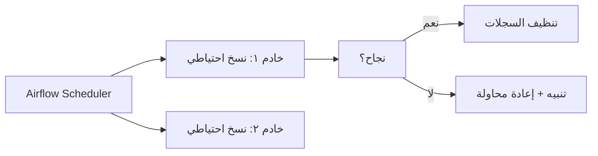

# Linux المتقدم

> **"بعد الأساسيات، حان وقت الأتمتة الحقيقية. حول مهامك اليومية إلى سكريبتات، واجعل الخادم يحمي نفسه."**

## 🎯 أهداف التعلم

بعد إكمال هذا الدرس، ستكون قادراً على:
- إدارة المستخدمين والمجموعات بمستوى مؤسسي
- كتابة وحدات systemd للإنتاج
- جدولة المهام المعقدة مع معالجة الأخطاء
- تشخيص مشاكل الأداء في الإنتاج
- أتمتة مهام الصيانة اليومية

## 📋 المتطلبات السابقة

- أساسيات Linux (الأمر `ls`, `cd`, `chmod`, `ps`, `grep`)
- فهم أساسي للـ shell scripting

---

## ١. إدارة المستخدمين والمجموعات — مستوى مؤسسي

### 🟢 التفسير البسيط

تخيل مبنى شركة CloudNova. كل موظف له بطاقة دخول (حساب مستخدم)، وبطاقته تفتح أبواباً معينة فقط (الصلاحيات). لا يستطيع موظف المالية دخول غرفة الخوادم.

### 🔵 التفسير الأساسي

```bash
# إنشاء مستخدم جديد (انضم أحمد لفريق DevOps في CloudNova)
sudo useradd -m -s /bin/bash ahmed
sudo passwd ahmed

# إضافته للمجموعات المناسبة
sudo usermod -aG docker,dev ahmed
id ahmed
groups ahmed

# حذف مستخدم (عند مغادرة الفريق)
sudo userdel -r ahmed
```

### 🟣 المستوى الإنتاجي — ما يحدث في CloudNova الحقيقية

في شركة حقيقية، لا تُنشئ المستخدمين يدوياً. تستخدم أدوات إدارة الهوية:

```bash
# ليس هكذا في الإنتاج:
sudo useradd -m ahmed    # ❌ يدوي، غير قابل للتكرار

# بل هكذا — عبر Ansible / Terraform / cloud-init:
# cloud-init.yaml
users:
  - name: ahmed
    groups: [docker, dev]
    sudo: ALL=(ALL) NOPASSWD:ALL
    ssh_authorized_keys:
      - ssh-rsa AAAAB3... ahmed@cloudnova
```

### 🏛️ مستوى المعماري

**المبادئ التي تحكم إدارة المستخدمين في المؤسسة:**

| المبدأ | التطبيق |
|--------|---------|
| **لا مستخدمين يدويين** | كل الحسابات عبر LDAP/SSSD أو cloud-init |
| **مبدأ الصلاحيات الدنيا** | كل مستخدم يبدأ بـ zero permissions، ثم يُضاف لما يحتاجه فقط |
| **التدقيق** | كل `sudo` مسجل ومرسل إلى سجل مركزي |
| **الدوران** | مفاتيح SSH تتغير كل ٩٠ يوماً |

---

## ٢. Systemd — المتحكم الحقيقي في Linux الحديث

### لماذا systemd مهم لمهندس السحابة؟

كل خدمة في السحابة — Nginx, Docker, تطبيقك — تُدار عبر systemd. إذا فهمت systemd، فهمت كيف يعيش خادمك.

```bash
# الأساسيات
systemctl status nginx         # ما حالة الخدمة؟
systemctl start/stop/restart   # تحكم يدوي
systemctl enable/disable       # تشغيل تلقائي عند الإقلاع؟
journalctl -u nginx -f         # سجلات حية للخدمة
```

### كتابة وحدة systemd لتطبيق CloudNova

```ini
# /etc/systemd/system/cloudnova-api.service
[Unit]
Description=CloudNova API Service
After=network.target postgresql.service
Requires=postgresql.service

[Service]
Type=simple
User=cloudnova
Group=cloudnova
WorkingDirectory=/opt/cloudnova
ExecStart=/opt/cloudnova/api
Restart=on-failure
RestartSec=5s
# الأمان — لا تشغّل كـ root أبداً
NoNewPrivileges=yes
PrivateTmp=yes
ProtectSystem=strict
ProtectHome=yes
ReadWritePaths=/var/log/cloudnova /var/lib/cloudnova
# حدود الموارد — امنع الخدمة من أكل الخادم كله
MemoryHigh=512M
MemoryMax=1G
CPUQuota=200%

[Install]
WantedBy=multi-user.target
```

```bash
# بعد كتابة الملف:
sudo systemctl daemon-reload       # أعد قراءة الوحدات
sudo systemctl enable cloudnova-api
sudo systemctl start cloudnova-api
sudo systemctl status cloudnova-api
```

> **🔑 نقطة أساسية:** `ProtectSystem=strict` و `NoNewPrivileges=yes` يمنعان الخدمة من تعديل النظام حتى لو اختُرق التطبيق — دفاع متعدد الطبقات.

### 🚨 سيناريو CloudNova: الخدمة لا تقلع بعد نشر جديد

```
الساعة ٢ صباحاً. نشرتَ تحديثاً لـ API. الخدمة لا تعمل.
المستخدمون يشتكون. مديرك يتصل.
```

**خطوات التشخيص المنهجي:**

```bash
# ١. ماذا يقول systemd؟
systemctl status cloudnova-api
# → Active: failed (Result: exit-code)

# ٢. آخر ٥٠ سطر من السجلات
journalctl -u cloudnova-api -n 50 --no-pager

# ٣. هل المنفذ محجوز؟
ss -tlnp | grep 8080
# → ربما عملية قديمة لم تمت

# ٤. هل التطبيق يبدأ يدوياً؟
sudo -u cloudnova /opt/cloudnova/api
# → خطأ: missing config file! المشكلة ليست في systemd

# ٥. الحل — التراجع فوراً
sudo systemctl stop cloudnova-api
# استعد الإصدار السابق
sudo systemctl start cloudnova-api
# أكد أنه يعمل
curl localhost:8080/health
```

---

## ٣. جدولة المهام — Cron بمستوى إنتاجي

### 🟢 التفسير البسيط

كرون هو منبّه ذكي. تقول له: "نفّذ هذا الأمر كل يوم الساعة ٢ صباحاً"، وينفذه. لكن في الإنتاج، تريد أكثر من مجرد تنفيذ — تريد: ماذا لو فشل؟ من يدري؟ أين السجلات؟

### 🔵 Cron التقليدي — وما ينقصه

```bash
# الصيغة: دقيقة ساعة يوم_الشهر شهر يوم_الأسبوع الأمر
# ┌──────── دقيقة (0-59)
# │ ┌──────── ساعة (0-23)
# │ │ ┌──────── يوم الشهر (1-31)
# │ │ │ ┌──────── شهر (1-12)
# │ │ │ │ ┌──────── يوم الأسبوع (0-7, 0=الأحد)
# │ │ │ │ │
# * * * * * الأمر

# نسخ احتياطي يومي ٢ صباحاً
0 2 * * * /backup/db.sh

# فحص صحة كل ٥ دقائق
*/5 * * * * /scripts/health-check.sh
```

### 🟣 المستوى الإنتاجي — Cron مع معالجة الأخطاء

```bash
#!/bin/bash
# /backup/db.sh — نسخ احتياطي يومي لقاعدة بيانات CloudNova
# الإصدار: 2.0 — مع معالجة أخطاء كاملة وتنبيهات

set -euo pipefail  # توقف عند أي خطأ

BACKUP_DIR="/backup/postgres"
DB_NAME="cloudnova"
TIMESTAMP=$(date +%Y%m%d_%H%M%S)
RETENTION_DAYS=7
LOCKFILE="/tmp/db-backup.lock"
SLACK_WEBHOOK="${SLACK_WEBHOOK_URL:-}"

# ── منع التشغيل المتزامن ──
exec 200>"$LOCKFILE"
if ! flock -n 200; then
    echo "❌ Backup already running. Exiting."
    exit 1
fi

# ── تنظيف عند الخروج ──
cleanup() {
    rm -f "$LOCKFILE"
    echo "$(date): Backup script finished with exit code $?"
}
trap cleanup EXIT

# ── التأكد من وجود المجلد ──
mkdir -p "$BACKUP_DIR"

# ── فحص مساحة القرص قبل البدء ──
AVAILABLE_KB=$(df "$BACKUP_DIR" | tail -1 | awk '{print $4}')
if [ "$AVAILABLE_KB" -lt 5000000 ]; then  # أقل من 5GB
    echo "❌ مساحة القرص غير كافية: ${AVAILABLE_KB}KB فقط"
    exit 1
fi

# ── النسخ الاحتياطي ──
echo "$(date): Starting backup of $DB_NAME..."
if pg_dump -U backup_user "$DB_NAME" | gzip > "$BACKUP_DIR/${DB_NAME}_${TIMESTAMP}.sql.gz"; then
    SIZE=$(du -h "$BACKUP_DIR/${DB_NAME}_${TIMESTAMP}.sql.gz" | cut -f1)
    echo "✅ Backup created: ${DB_NAME}_${TIMESTAMP}.sql.gz ($SIZE)"
else
    echo "❌ Backup FAILED at $TIMESTAMP" >&2
    # إرسال تنبيه إلى Slack
    if [ -n "$SLACK_WEBHOOK" ]; then
        curl -s -X POST -H 'Content-type: application/json' \
            --data "{\"text\":\"🚨 فشل النسخ الاحتياطي لقاعدة البيانات $DB_NAME الساعة $TIMESTAMP\"}" \
            "$SLACK_WEBHOOK"
    fi
    exit 1
fi

# ── حذف النسخ القديمة ──
DELETED=$(find "$BACKUP_DIR" -name "*.sql.gz" -mtime +$RETENTION_DAYS -delete -print | wc -l)
echo "🗑 Cleaned $DELETED old backup(s) older than $RETENTION_DAYS days"
```

### 🏛️ مستوى المعماري — لماذا cron لا يكفي للمؤسسات الكبيرة

في CloudNova، عندما وصل عدد الخوادم إلى ٥٠٠، أصبح cron غير كافٍ:

| المشكلة | الحل |
|---------|------|
| **لا مركزية** — كل خادم له cron منفصل | **منسق مركزي** مثل Apache Airflow أو Temporal |
| **لا تبعيات** — لا يمكنك قول: "نفذ X بعد نجاح Y" | **DAGs** — رسوم بيانية للمهام |
| **لا إعادة محاولة** — إذا فشل، ينتظر ٢٤ ساعة | **إعادة محاولة تلقائية مع backoff** |
| **لا رؤية** — لا تعرف ماذا فشل وأين | **لوحة تحكم مركزية** |



---

## ٤. مراقبة متقدمة واستكشاف الأخطاء

### تشخيص الأداء — القصة الكاملة

```bash
# ── ١. النظرة الشاملة ──
top -bn1 | head -5          # لقطة سريعة
htop                         # تفاعلي (أفضل)

# ── ٢. المعالج ──
# من يأكل المعالج؟
ps aux --sort=-%cpu | head -10
# متوسط الحمل (Load Average) — أهم من %CPU أحياناً
uptime
# → load average: 2.5, 1.8, 1.2
#   إذا الرقم > عدد الأنوية → الخادم مختنق

# ── ٣. الذاكرة ──
free -h
#   available ≠ free! Linux يستخدم ذاكرة فارغة للتخزين المؤقت
ps aux --sort=-%mem | head -10

# ── ٤. القرص ──
df -h                       # المساحة المستخدمة
du -sh /var/log/*           # من يأكل المساحة؟
# أداة تفاعلية رائعة:
ncdu /                       # apt install ncdu

# ── ٥. الإدخال/الإخراج ──
iostat -x 1                 # تحديث كل ثانية
#   %util قرب ١٠٠٪؟ القرص هو العنق

# ── ٦. الشبكة ──
ss -tlnp                    # من يستمع على أي منفذ؟
ss -s                       # إحصاءات سريعة
iftop                       # مراقبة النطاق الترددي
```

### 🚨 سيناريو CloudNova: الخادم بطيء — ماذا تفعل؟

> **الموقف:** الساعة ١١ صباحاً. فريق الدعم يتصل: "الموقع بطيء جداً، ٣٠ ثانية لتحميل الصفحة!"

```bash
# ⏱️ الخطوة ١: تأكيد المشكلة (دقيقتان)
curl -w "@curl-format.txt" -o /dev/null -s https://cloudnova.com
#   time_total: 28.5 ثانية ← المشكلة مؤكدة

# 📊 الخطوة ٢: تحديد المصدر (٥ دقائق)
# هل المشكلة في الشبكة؟ المعالج؟ القرص؟ التطبيق؟

# تحقق من Load Average أولاً:
uptime
# → load average: 12.5, 10.2, 8.1  ← الخادم مختنق! (عدد الأنوية: 4)

# من الفاعل؟
ps aux --sort=-%cpu | head -10
# → process "log-aggregator" يستهلك 350% CPU ← مشبوه

# 🛑 الخطوة ٣: احتواء المشكلة (دقيقة واحدة)
sudo systemctl stop log-aggregator
# راقب:
watch -n1 'curl -o /dev/null -s -w "%{time_total}\n" https://cloudnova.com'
# → 0.8s, 0.7s, 0.6s ← عادت السرعة!

# 🔍 الخطوة ٤: تحليل السبب الجذري (لاحقاً)
journalctl -u log-aggregator --since "10:00" --until "11:00"
# → ERROR: infinite loop in log parsing regex
```

### 📝 سجل الحادثة — Postmortem

```markdown
## الحادثة: تباطؤ موقع CloudNova
- **التاريخ:** ٢٠٢٤-٠٧-١٥
- **المدة:** ٢٢ دقيقة (١٠:٤٨ - ١١:١٠)
- **السبب الجذري:** تعبير نمطي (regex) في log-aggregator دخل في حلقة لا نهائية
- **الإجراء:** إيقاف الخدمة مؤقتاً + تصحيح الـ regex
- **الوقاية:** إضافة timeout لجميع regex + alert على CPU > 90%
```

---

## ٥. ضبط الأداء — Performance Tuning

### حدود النظام — ulimits

```bash
# كم ملفاً يستطيع المستخدم فتحه؟
ulimit -n
# → 1024  ← هذا منخفض جداً لتطبيق ويب!

# رفعه (مؤقت):
ulimit -n 65536

# رفعه (دائم) — أضف إلى /etc/security/limits.conf:
# cloudnova    soft    nofile    65536
# cloudnova    hard    nofile    65536
```

### معاملات النواة — sysctl

```bash
# تحسين للشبكة:
# /etc/sysctl.d/99-cloudnova.conf
net.core.somaxconn = 1024       # قائمة انتظار الاتصالات
net.ipv4.tcp_tw_reuse = 1       # إعادة استخدام اتصالات TIME_WAIT
vm.swappiness = 1                # لا تستخدم swap إلا للضرورة القصوى

sudo sysctl -p /etc/sysctl.d/99-cloudnova.conf
```

---

## 🧠 أسئلة للمراجعة النشطة (Active Recall)

1. كيف تمنع تشغيل نسختين من سكريبت النسخ الاحتياطي في نفس الوقت؟ (تلميح: lockfile)
2. ما الفرق بين `systemctl restart` و `systemctl reload`؟
3. لماذا `Load Average = 4` قد يكون طبيعياً على خادم ٨ أنوية لكنه كارثة على خادم ثنائي النواة؟
4. متى تستخدم systemd timer بدلاً من cron؟
5. كيف تحدد أن المشكلة في القرص وليس في المعالج؟

## ✍️ تمرين Feynman

اشرح لزميل جديد في الفريق — باستخدام تشبيه من الحياة اليومية — كيف يعمل `systemd` في إدارة الخدمات. لا تستخدم مصطلحات تقنية. (مثال: systemd كمدير مبنى، الخدمات كسكان الشقق...)

## 🎴 بطاقات مراجعة (Flashcards)

| السؤال | الإجابة |
|--------|---------|
| أمر لعرض أكثر ٥ عمليات استهلاكاً للمعالج | `ps aux --sort=-%cpu \| head -6` |
| كيف تمنع خدمة من التعديل على النظام؟ | `ProtectSystem=strict` في وحدة systemd |
| ماذا يعني Load Average = 8 على خادم ٤ أنوية؟ | الخادم يعاني اختناقاً — ضعف طاقته |
| أمر لمعرفة من يستمع على المنفذ 8080 | `ss -tlnp \| grep 8080` |

## 🎤 أسئلة مقابلة العمل

1. **"تصفّح تطبيق بطيء في الإنتاج. حدثني عن خطوات تشخيصك."** ← اذكر الخطوات الخمس أعلاه
2. **"ما الفرق بين systemd timer و cron؟"** ← timer يدعم التبعيات، التدقيق، العشوائية
3. **"كيف تضمن تشغيل تطبيقك تلقائياً بعد إعادة إقلاع الخادم؟"** ← وحدة systemd مع `WantedBy=multi-user.target`

---

[← العودة للوحدة](index.md) | [🏠 الرئيسية](/)
