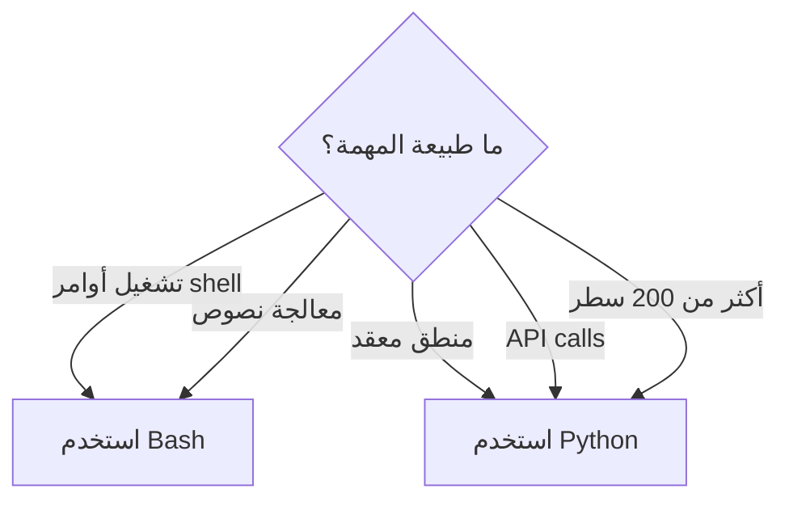

# إتقان Bash Scripting

> "كل مهندس سحابة يحتاج Bash. ليس لكل شيء — لكن عندما تحتاجه، لا بديل عنه."

## 🎯 أهداف التعلم

- كتابة سكريبتات Bash إنتاجية باحترافية
- error handling مع `set -euo pipefail`
- logging احترافي وتدوير الملفات
- traps للتنظيف عند الخروج
- معالجة JSON مع `jq`

## ⏱️ الوقت المقدر: 45 دقيقة | المستوى: Intermediate

---

## ١. الأساسيات — من البسيط للإنتاجي

```bash
#!/bin/bash
set -euo pipefail  # الخطأ الأول = توقف. المتغيرات غير المعرفة = خطأ.

# logging function
log() { echo "[$(date +'%Y-%m-%d %H:%M:%S')] $*"; }

# trap للتنظيف
cleanup() { log "Cleaning up..."; rm -f /tmp/lockfile; }
trap cleanup EXIT

# lockfile لمنع التزامن
exec 200>/tmp/lockfile
flock -n 200 || { log "Another instance running"; exit 1; }

log "Starting backup..."
```

### شرح الأوامر الأساسية

| الأمر | الوظيفة |
|--------|---------|
| `set -e` | توقف عند أول خطأ |
| `set -u` | خطأ عند استخدام متغير غير معرف |
| `set -o pipefail` | فشل الـ pipeline إذا فشل أي جزء منه |
| `trap` | ينفذ أمراً عند exit/error/SIGTERM |
| `flock` | يمنع تشغيل نسختين من نفس السكريبت |

---

## ٢. سيناريو CloudNova: نسخ احتياطي لقواعد البيانات

```bash
#!/bin/bash
# backup-all-dbs.sh — نسخ احتياطي متوازي
set -euo pipefail

log() { echo "[$(date +'%Y-%m-%d %H:%M:%S')] $*"; }
DBS=("cloudnova" "analytics" "logs")
BACKUP_DIR="/backup/postgres/$(date +%Y%m%d)"
mkdir -p "$BACKUP_DIR"

backup_db() {
    local db=$1
    log "Backing up $db..."
    pg_dump -U backup "$db" | gzip > "$BACKUP_DIR/${db}.sql.gz"
    log "$db: $(du -h "$BACKUP_DIR/${db}.sql.gz" | cut -f1)"
}

export -f backup_db
export BACKUP_DIR
printf '%s\n' "${DBS[@]}" | xargs -P 3 -I {} bash -c 'backup_db "$@"' _ {}
log "All databases backed up to $BACKUP_DIR"

# تنظيف النسخ القديمة (أكبر من 30 يوماً)
find /backup/postgres -maxdepth 1 -type d -mtime +30 -exec rm -rf {} \;
log "Cleaned up old backups"
```

---

## ٣. jq — معالجة JSON باحتراف

```bash
# قراءة secret من Azure Key Vault output
SECRET=$(az keyvault secret show --name DB-PASSWORD --vault-name cloudnova-kv -o json)
PASSWORD=$(echo "$SECRET" | jq -r '.value')

# معالجة Azure resource list
az vm list -o json | jq '.[] | {name: .name, location: .location, size: .hardwareProfile.vmSize}'

# تصفية متقدمة
az vm list -o json | jq '[.[] | select(.location == "westeurope") | .name]'
```

### أنماط jq الشائعة

```bash
# استخراج قيم متعددة
az resource list -o json | jq '.[] | "\(.name) — \(.type) — \(.location)"'

# إنشاء CSV
az vm list -o json | jq -r '["Name","Size","Location"], (.[] | [.name, .hardwareProfile.vmSize, .location]) | @csv' > vms.csv

# تحويل JSON إلى متغيرات bash
eval $(az account show -o json | jq -r '@sh "SUB_ID=\(.id) TENANT=\(.tenantId)"')
echo "Subscription: $SUB_ID"
```

---

## 🏛️ طبقة الإنتاج: سكريبتات لا تفشل

### نمط الـ idempotent script

```bash
#!/bin/bash
set -euo pipefail

RESOURCE_GROUP="cloudnova-prod"
VM_NAME="web-server-01"

# idempotent: إذا كانت الـ VM موجودة، لا تنشئها مرة أخرى
if az vm show --resource-group "$RESOURCE_GROUP" --name "$VM_NAME" &>/dev/null; then
    echo "VM $VM_NAME already exists, skipping..."
else
    echo "Creating VM $VM_NAME..."
    az vm create --resource-group "$RESOURCE_GROUP" --name "$VM_NAME" \
        --image Ubuntu2204 --admin-username azureuser --generate-ssh-keys
fi
```

### Retry Logic

```bash
retry() {
    local max_attempts=$1
    local delay=$2
    shift 2
    local attempt=1
    
    until "$@"; do
        if (( attempt >= max_attempts )); then
            echo "Failed after $max_attempts attempts"
            return 1
        fi
        echo "Attempt $attempt failed. Retrying in ${delay}s..."
        sleep "$delay"
        ((attempt++))
    done
}

retry 5 10 az vm start --resource-group cloudnova --name web-01
```

### Health Check Script

```bash
#!/bin/bash
# health-check.sh — يفحص endpoints ويعيد non-zero إذا فشل أي منها
ENDPOINTS=("https://api.cloudnova.com/health" "https://app.cloudnova.com/health")
FAILED=0

for url in "${ENDPOINTS[@]}"; do
    status=$(curl -s -o /dev/null -w "%{http_code}" --max-time 5 "$url")
    if [[ "$status" != "200" ]]; then
        echo "FAIL: $url returned $status"
        ((FAILED++))
    else
        echo "OK: $url"
    fi
done

exit "$FAILED"  # 0 = كل شيء تمام
```

---

## 🎨 طبقة المعماري: Bash vs Python

| المعيار | Bash | Python |
|---------|------|--------|
| **أفضل لـ** | < 100 سطر، عمليات shell | منطق معقد، APIs |
| **السرعة** | فوري (لا interpreter overhead) | أبطأ قليلاً |
| **التبعيات** | لا شيء (POSIX) | pip packages |
| **Error Handling** | بدائي | try/except متقدم |
| **الاختبار** | صعب | pytest + mocking |
| **قابلية القراءة** | تنخفض بعد 100 سطر | ممتازة دائماً |

### شجرة القرار



---

## 🛠️ تدريبات

### تمرين 1: سكريبت تنظيف Docker

اكتب سكريبت يحذف كل Docker images الأقدم من 7 أيام.

### تمرين 2: سكريبت فحص صحة

سكريبت Bash يفحص 5 endpoints ويخزن النتائج في ملف CSV مع timestamp.

### تحدي: سكريبت Azure Inventory

اكتب سكريبت Bash يجمع معلومات كل الموارد في Azure Subscription ويصدرها كـ JSON منظم:

```bash
# المخرجات المتوقعة:
# {
#   "vms": [{"name": "web-01", "size": "Standard_B2s", "location": "westeurope"}],
#   "storage": [{"name": "cloudnovadiag", "kind": "StorageV2"}],
#   "total_resources": 47
# }
```

---

## 📝 تقييم

### ✅ فحص المعرفة (5)

1. ماذا يفعل `set -euo pipefail`؟ — توقف عند خطأ، خطأ عند متغير غير معرف، فشل pipeline عند فشل أي جزء
2. ما وظيفة `trap`؟ — ينفذ أمراً عند exit/error/SIGTERM
3. كيف تمنع تشغيل نسختين من نفس السكريبت؟ — `flock`
4. ما الفرق بين `$@` و `$*`؟ — `$@` يحافظ على quotes كل argument
5. كيف تستخرج قيمة من JSON؟ — `jq -r '.key'`

### 📝 اختبار (3)

1. **متى تستخدم Bash بدلاً من Python؟** — < 100 سطر، عمليات shell كثيرة
2. **كيف تجعل سكريبت idempotent؟** — افحص وجود المورد قبل إنشائه
3. **كيف تتعامل مع خطأ network مؤقت في سكريبت؟** — Retry logic

### 🃏 بطاقات (6)

| السؤال | الإجابة |
|--------|---------|
| `set -e` | توقف عند أول خطأ |
| `set -u` | خطأ عند متغير غير معرف |
| `set -o pipefail` | فشل pipeline عند فشل أي جزء |
| `trap` | ينفذ أمر عند signal |
| `jq` | معالج JSON لسطر الأوامر |
| `flock` | يمنع تشغيل نسختين من نفس السكريبت |

---

## 🎤 مقابلة

### 1. "Bash vs Python للـ automation؟"

→ Bash: < 100 سطر، عمليات shell. Python: منطق معقد، APIs، testing.

### 2. "كيف تتأكد من أن سكريبت Bash آمن في الإنتاج؟"

→ `set -euo pipefail` + `shellcheck` + `trap cleanup` + `flock` + مراجعة زميل

### 3. "اكتب one-liner يجد أكبر 5 ملفات في /var/log"

```bash
find /var/log -type f -exec du -h {} + | sort -rh | head -5
```

---

## 📚 مراجع

| النوع | الرابط |
|-------|--------|
| درس مرتبط | [Linux Advanced](./02-linux-advanced) |
| درس مرتبط | [Linux Troubleshooting](./05-linux-troubleshooting-production) |
| أداة | [shellcheck](https://shellcheck.net) — فحص سكريبتات Bash |
| دليل | [Google Shell Style Guide](https://google.github.io/styleguide/shellguide.html) |

---

[← Linux Advanced](./02-linux-advanced) | [→ Linux Security](./04-linux-security-hardening) | [🏠 الرئيسية](/)
