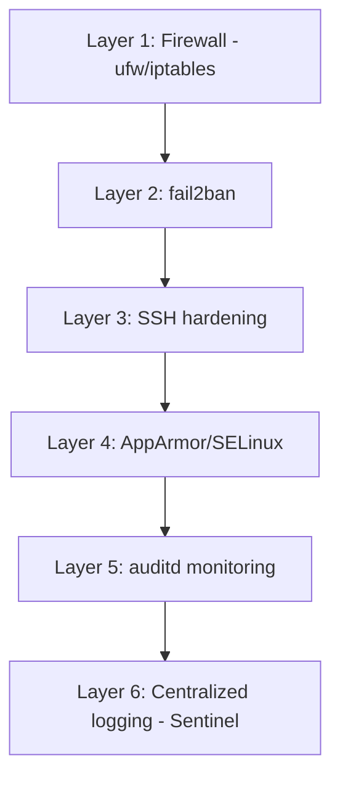

## ١. CIS Benchmark — المعيار الذهبي

CIS (Center for Internet Security) يوفر معايير تأمين لأنظمة التشغيل. يوجد 200+ قاعدة لتأمين Ubuntu Server.

### فحص الامتثال

```bash
# تثبيت Trivy لفحص CIS compliance
wget https://github.com/aquasecurity/trivy/releases/latest/download/trivy_$(uname -s)_amd64.deb
sudo dpkg -i trivy_*.deb

# فحص النظام
trivy fs --security-checks vuln,config --severity HIGH,CRITICAL /

# فحص compliance فقط
trivy conf --compliance cis-ubuntu-22.04 /
```

### أهم قواعد CIS

| # | القاعدة | لماذا؟ |
|---|---------|--------|
| 1 | تعطيل root login | يمنع brute force على root |
| 2 | تغيير default SSH port | يقلل automated scans |
| 3 | تفعيل firewall (ufw/iptables) | يغلق ports غير المستخدمة |
| 4 | تفعيل automatic updates | يسد الثغرات فوراً |
| 5 | تعطيل unused services | يقلل surface area |
| 6 | تفعيل auditd | يسجل كل شيء للتحقيق |

---

## ٢. fail2ban — حماية من brute force

```bash
sudo apt install fail2ban -y

# /etc/fail2ban/jail.local
cat > /etc/fail2ban/jail.local << 'EOF'
[DEFAULT]
bantime = 3600
findtime = 600
maxretry = 3

[sshd]
enabled = true
port = ssh
logpath = %(sshd_log)s

[nginx-http-auth]
enabled = true
port = http,https
logpath = /var/log/nginx/error.log
EOF

sudo systemctl enable --now fail2ban

# التحقق من الحالة
sudo fail2ban-client status sshd
# Status for the jail: sshd
# |- Filter: | | |- Currently failed: 0 | | |- Total failed: 23
# |- Actions: | | |- Currently banned: 3
```

---

## ٣. auditd — تتبع كل شيء

```bash
sudo apt install auditd -y

# مراقبة ملفات حساسة
sudo auditctl -w /etc/passwd -p wa -k identity
sudo auditctl -w /etc/shadow -p wa -k identity
sudo auditctl -w /etc/ssh/sshd_config -p wa -k ssh_config
sudo auditctl -w /var/log/auth.log -p wa -k auth_log

# البحث في السجلات
sudo ausearch -k identity --raw | aureport -f -i
sudo ausearch -m USER_LOGIN --success no -i  # محاولات فاشلة
sudo ausearch -ts today -k identity  # أحداث اليوم فقط
```

---

## ٤. SELinux/AppArmor

### Ubuntu/Debian: AppArmor

```bash
sudo aa-status  # حالة AppArmor
sudo aa-enforce /etc/apparmor.d/usr.bin.nginx  # فرض profile
sudo aa-complain /etc/apparmor.d/usr.bin.nginx  # وضع التعلم
```

### RHEL/CentOS: SELinux

```bash
getenforce  # Enforcing | Permissive | Disabled
sudo setenforce 1  # تفعيل
semanage port -l | grep ssh  # أي ports مسموحة لـ SSH
```

---

## ٥. تأمين SSH

```bash
# /etc/ssh/sshd_config
PermitRootLogin no           # لا root login
PasswordAuthentication no     # مفتاح فقط
PubkeyAuthentication yes
MaxAuthTries 3
ClientAliveInterval 300      # قطع الاتصالات الخاملة
ClientAliveCountMax 2
AllowUsers deploy ops        # مستخدمون محددون فقط
Protocol 2                   # SSH protocol 2 فقط
```

---

## 🏛️ طبقة الإنتاج: استجابة الحوادث

### سيناريو CloudNova: تحقيق في اختراق

```
السبت 2:15AM - تنبيه: 5000 محاولة SSH فاشلة في 5 دقائق

الخطوات:
1. fail2ban حظر 3 IPs تلقائياً ✅
2. فحص auth.log:
   sudo grep "Failed password" /var/log/auth.log | awk '{print $11}' | sort | uniq -c | sort -rn
3. اكتشفنا: مهاجم من IP فيتنامي يجرب كلمات مرور شائعة
4. أضفنا IP range للحظر الدائم:
   sudo ufw deny from 113.161.0.0/16
5. دروس مستفادة:
   - غيرنا SSH port إلى 2222 (security through obscurity ليس كافياً لكنه يساعد)
   - فعّلنا MFA لـ SSH مع google-authenticator
```

### سكريبت فحص أمني يومي

```bash
#!/bin/bash
# daily-security-check.sh
REPORT="/var/log/security-check-$(date +%Y%m%d).log"
echo "=== SECURITY CHECK $(date) ===" > "$REPORT"

echo "--- Failed SSH attempts ---" >> "$REPORT"
grep "Failed password" /var/log/auth.log | tail -20 >> "$REPORT"

echo "--- Currently banned IPs ---" >> "$REPORT"
sudo fail2ban-client status sshd | grep "Banned IP" >> "$REPORT"

echo "--- New users ---" >> "$REPORT"
grep "new user" /var/log/auth.log | tail -5 >> "$REPORT"

echo "--- Modified system files (24h) ---" >> "$REPORT"
sudo find /etc -type f -mtime -1 >> "$REPORT"

echo "Report: $REPORT"
```

---

## 🎨 طبقة المعماري: استراتيجية الأمان الشاملة

### Defense in Depth



### متى تستخدم ماذا؟

| التهديد | الأداة |
|---------|--------|
| Brute force SSH | fail2ban |
| Zero-day exploit | Unattended upgrades |
| Insider threat | auditd |
| Web app attack | WAF (Cloudflare/Azure) |
| Malware | ClamAV |

---

## 🛠️ تدريبات

### تمرين 1: شغّل Trivy واصلح HIGH findings
```bash
trivy fs --severity HIGH /
# أصلح كل finding واحداً تلو الآخر
```

### تمرين 2: أنشئ fail2ban jail لتطبيقك
أنشئ jail مخصص يحظر IPs بعد 5 محاولات فاشلة على `/login`.

### تحدي: سكريبت تدقيق أمني آلي
اكتب سكريبت Bash يفحص:
1. CIS compliance عبر Trivy
2. open ports عبر `ss -tlnp`
3. failed SSH attempts
4. modified system files
ويصدر تقريراً واحداً.

---

## 📝 تقييم

### ✅ فحص المعرفة (5)
1. ما هو CIS Benchmark؟
2. الفرق بين AppArmor و SELinux؟
3. كيف يحمي fail2ban الخادم؟
4. لماذا auditd مهم في التحقيقات؟
5. اذكر 3 إعدادات لتأمين SSH.

### 📝 اختبار (3)
1. **متى تستخدم AppArmor بدلاً من SELinux؟** — Ubuntu/Debian
2. **هل تغيير SSH port أمان حقيقي؟** — لا، لكنه يقلل noise
3. **كيف تكتشف أن خادمك مخترق؟** — auditd + auth.log + عمليات غريبة

### 🃏 بطاقات (6)

| السؤال | الإجابة |
|--------|---------|
| CIS | Center for Internet Security — معايير تأمين |
| fail2ban | يحظر IPs بعد محاولات فاشلة |
| auditd | يسجل أحداث النظام للتحقيق |
| AppArmor | Mandatory Access Control لـ Ubuntu |
| SELinux | Mandatory Access Control لـ RHEL |
| `PermitRootLogin no` | يمنع login كـ root عبر SSH |

---

## 🎤 مقابلة

### 1. "كيف تؤمن خادم Linux من اليوم الأول؟"
→ ufw default deny + SSH key only + fail2ban + unattended upgrades + auditd

### 2. "ما هو Defense in Depth؟"
→ طبقات أمان متعددة. إذا فشلت طبقة، الطبقة التالية تلتقط التهديد.

### 3. "اكتشفت أن خادمك مخترق. ماذا تفعل؟"
→ عزل الخادم (قطع الشبكة) → التقاط صورة للتحقيق → auditd analysis → تدوير كل المفاتيح → إعادة بناء الخادم من الصفر (لا تصلحه!)

---

## 📚 مراجع

| النوع | الرابط |
|-------|--------|
| درس مرتبط | [Linux Troubleshooting](./05-linux-troubleshooting-production) |
| درس مرتبط | [Security Operations](../../04-security/04-security-operations-soc) |
| معيار | [CIS Ubuntu Benchmark](https://www.cisecurity.org/benchmark/ubuntu_linux) |
| أداة | [Lynis](https://cisofy.com/lynis/) — تدقيق أمني شامل |

---

[← Bash Scripting](./03-bash-scripting-mastery) | [→ Troubleshooting](./05-linux-troubleshooting-production) | [🏠 الرئيسية](/)
