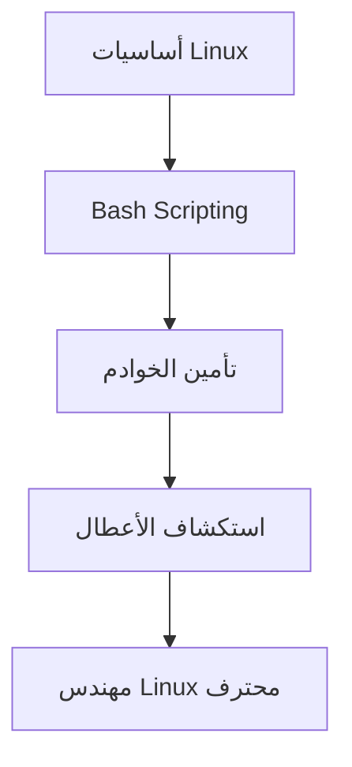

import Tabs from '@theme/Tabs';
import TabItem from '@theme/TabItem';

# 🚀 Linux

> من الصفر إلى إدارة خوادم الإنتاج — Bash scripting، الأمان، استكشاف الأخطاء.

## 🎯 أهداف التعلم

بعد إكمال هذه الوحدة، ستكون قادراً على:

- [**أساسيات Linux**](01-linux-essentials) — الأوامر الأساسية والنظام
- [**Linux متقدم**](02-linux-advanced) — إدارة متقدمة للنظام
- [**إتقان Bash**](03-bash-scripting-mastery) — أتمتة كل شيء
- [**تأمين Linux**](04-linux-security-hardening) — حصّن خوادمك
- [**استكشاف الأعطال**](05-linux-troubleshooting-production) — تشخيص المشاكل في الإنتاج

## 💡 المهارات التي ستكتسبها

Bash scripting • إدارة الخوادم • تأمين Linux • استكشاف الأخطاء • auditd و fail2ban

## 📊 معلومات الوحدة

| العنصر           | القيمة                                 |
| ---------------- | -------------------------------------- |
| **المستوى**      | مبتدئ إلى متوسط                        |
| **الوقت المقدر** | 8 ساعات                                |
| **المتطلبات**    | الأسس الهندسية                         |
| **الشهادات**     | AZ-104, LFCS                           |
| **المشاريع**     | سكريبت تدقيق أمني • سكريبت مراقبة يومي |
| **المختبرات**    | Linux Terminal                         |

## 🏛️ مهمة CloudNova

> أول مهمة لك في CloudNova: تجهيز 20 خادم Linux للإنتاج. الأمان والمراقبة من اليوم الأول.

## 🗺️ خريطة الوحدة

## 📖 الدروس

<Tabs>
<TabItem value="all" label="كل الدروس" default>

- [**أساسيات Linux**](01-linux-essentials) — الأوامر الأساسية والنظام
- [**Linux متقدم**](02-linux-advanced) — إدارة متقدمة للنظام
- [**إتقان Bash**](03-bash-scripting-mastery) — أتمتة كل شيء
- [**تأمين Linux**](04-linux-security-hardening) — حصّن خوادمك
- [**استكشاف الأعطال**](05-linux-troubleshooting-production) — تشخيص المشاكل في الإنتاج

</TabItem>
</Tabs>

## 🚀 ابدأ التعلم

[▶️ ابدأ الدرس الأول](01-linux-essentials)
