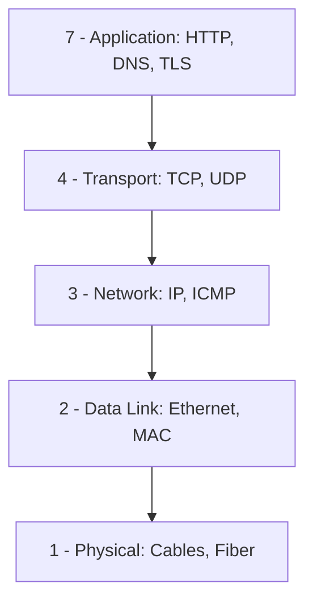
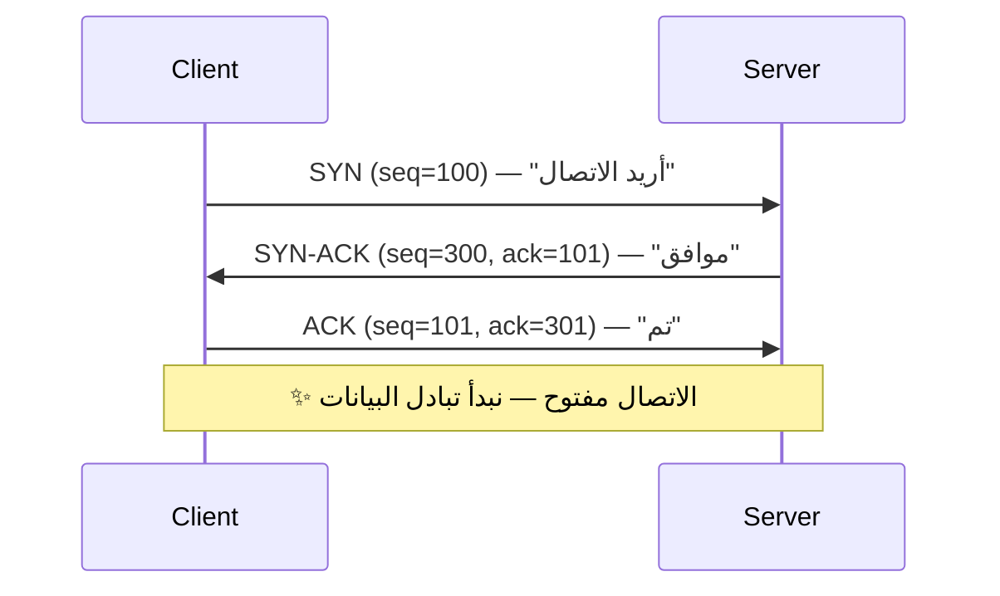

# الشبكات من الصفر

> **"كل خدمة سحابية تبدأ وتنتهي بالشبكة. بدون فهم الشبكات، أنت أعمى في السحابة."**

## 🎯 أهداف التعلم

بعد إكمال هذا الدرس، ستكون قادراً على:
- شرح نموذج OSI وربطه بمشاكل حقيقية
- تصميم VNet احترافي مع Subnets و NSGs
- تشخيص مشاكل الاتصال في السحابة
- اختيار Load Balancer المناسب لكل حالة
- فهم DNS و TLS بعمق

---

## ١. لماذا الشبكات مهمة لمهندس السحابة؟

| إذا كنت لا تفهم... | سيحدث هذا... | قصة حقيقية من CloudNova |
|--------------------|-------------|------------------------|
| TCP vs UDP | تختار البروتوكول الخطأ | استخدمنا TCP لـ video streaming — تأخير ٣ ثوان |
| DNS | لا تشخص مشاكل الاتصال | "التطبيق معطل" — المشكلة: TTL منتهي |
| CIDR | تصمم VNet لا يتسع | أضفنا ٣ Subnets — نفدت العناوين |
| Load Balancers | نقطة فشل واحدة | خادم واحد استقبل ٩٠٪ من الحركة |
| Network Security | مواردك مكشوفة | قاعدة بيانات على الإنترنت ٤ أيام |

---

## ٢. نموذج OSI — ٧ طبقات



### كل طبقة — بمشاكلها الحقيقية

| الطبقة | البروتوكولات | المشكلة الشائعة | أداة التشخيص |
|--------|-------------|----------------|-------------|
| ٧ - Application | HTTP, DNS, TLS | 404, 502, شهادة منتهية | `curl`, `openssl` |
| ٤ - Transport | TCP, UDP | منفذ مغلق، جدار ناري | `nc -zv`, `ss -tlnp` |
| ٣ - Network | IP, ICMP | routing خاطئ، IP متعارض | `ping`, `traceroute` |
| ٢ - Data Link | Ethernet, ARP, MAC | كابل معطوب، VLAN mismatch | `ip link`, `ethtool` |
| ١ - Physical | Cables, Fiber | كابل مفصول، عطل عتاد | فحص بصري، `dmesg` |

### 🟣 المستوى الإنتاجي — تشخيص من الأعلى للأسفل

```bash
# "التطبيق لا يستجيب" — من أين تبدأ؟

# ١. الطبقة ٧: هل HTTP يعمل؟
curl -I https://api.cloudnova.com
# HTTP/2 502 ← المشكلة في الطبقة ٧ (التطبيق)

# ٢. الطبقة ٤: هل المنفذ مفتوح؟
nc -zv api.cloudnova.com 443
# Connection refused ← المنفذ مغلق

# ٣. الطبقة ٣: هل الخادم موجود؟
ping api.cloudnova.com
# 64 bytes from 10.0.1.5 ← الخادم موجود

# التشخيص: الخادم حي لكن الخدمة على المنفذ 443 لا تعمل
# الحل: systemctl restart nginx
```

---

## ٣. TCP vs UDP — بعمق

| الميزة | TCP | UDP |
|--------|-----|-----|
| **الموثوقية** | ✅ مضمون — يعيد إرسال المفقود | ❌ غير مضمون |
| **الاتصال** | Connection-oriented | Connectionless |
| **الترتيب** | يصل بالترتيب | قد يصل معكوساً |
| **السرعة** | أبطأ (overhead أعلى) | أسرع |
| **الاستخدام** | HTTP، SSH، Email، FTP | DNS، VoIP، Streaming، Gaming |
| **تشبيه** | البريد المسجل — توقع بالاستلام | الميكروفون — الصوت يصل فوراً |

### Three-Way Handshake (TCP)



### 🚨 سيناريو CloudNova: TCP أم UDP؟

> **الموقف:** CloudNova تبني نظام مراقبة يجمع metrics من ٢٠٠ خادم كل ١٠ ثوانٍ.

**TCP:** كل metrics مضمونة الوصول ✅ لكن overhead الاتصال لـ ٢٠٠ خادم = ٢٠٠ اتصال دائم ← استهلاك ذاكرة وموارد

**UDP:** لا ضمان وصول ❌ لكن لا overhead اتصال. لو ضاع ١٪ من metrics... في نظام مراقبة، هذا مقبول!

**القرار:** UDP مع تطبيق بسيط لـ acknowledgment للـ metrics الحرجة فقط.

---

## ٤. CIDR — تقسيم الشبكات

```
192.168.1.0/24 → 256 عنواناً (254 قابلة للاستخدام)
10.0.0.0/16    → 65,536 عنواناً
10.0.0.0/8     → 16,777,216 عنواناً
```

| CIDR | عدد العناوين | الاستخدام |
|------|-------------|-----------|
| /32 | ١ | عنوان IP واحد |
| /28 | ١٤ | Azure Gateway Subnet |
| /24 | ٢٥٤ | شبكة تطبيق |
| /16 | ٦٥,٥٣٤ | VNet كامل |
| /8 | ١٦,٧٧٧,٢١٤ | نطاق خاص كامل |

### 🟣 تصميم VNet احترافي

```yaml
# CloudNova Production VNet
VNet: 10.0.0.0/16 (65,536 عنواناً)

Subnets:
  app-subnet:     10.0.1.0/24   (254 عنواناً)  # خوادم التطبيق
  db-subnet:      10.0.2.0/24   (254 عنواناً)  # قواعد البيانات
  gateway-subnet: 10.0.0.0/28   (14 عنواناً)   # Application Gateway
  bastion-subnet: 10.0.0.16/28  (14 عنواناً)   # Azure Bastion
  aks-subnet:     10.0.4.0/22   (1,022 عنواناً) # AKS (يحتاج عناوين كثيرة!)

# مساحة متبقية للتوسع: 10.0.5.0 - 10.0.255.0
```

### لماذا يحتاج AKS مساحة كبيرة؟

```bash
# Kubernetes يستهلك عناوين IP بهذه الطريقة:
# لكل Pod عنوان IP خاص. ٣٠ Pod = ٣٠ عنواناً
# لكل Node عنوان IP خاص. ٥ Nodes = ٥ عناوين
# لكل Service عنوان IP خاص. ١٠ Services = ١٠ عناوين
# المجموع لـ ٥ nodes + ٣٠ pods + ١٠ services = ٤٥ عنواناً
# + احتياطي للتوسع = /22 (1022 عنواناً) آمن
```

---

## ٥. DNS — دليل هاتف الإنترنت

```bash
# استعلام DNS — forward lookup
dig api.cloudnova.com +short
# 20.50.2.10

# استعلام عكسي — reverse lookup
dig -x 20.50.2.10 +short
# api.cloudnova.com

# تتبع مسار DNS
dig api.cloudnova.com +trace
# . (root) → .com (TLD) → cloudnova.com (authoritative)

# أنواع السجلات
dig cloudnova.com A      # IPv4
dig cloudnova.com AAAA   # IPv6
dig cloudnova.com MX     # خوادم البريد
dig cloudnova.com NS     # خوادم الأسماء
dig cloudnova.com TXT    # سجلات SPF, DKIM
dig cloudnova.com CNAME  # الاسم المستعار
```

### 🚨 سيناريو CloudNova: DNS هو المشكلة

> **الموقف:** نصف المستخدمين في آسيا يرون "site not found". النصف الآخر في أوروبا يصل بشكل طبيعي.

```bash
# التشخيص:
dig api.cloudnova.com @8.8.8.8          # Google DNS
# ANSWER: 20.50.2.10 ✅

dig api.cloudnova.com @1.1.1.1          # Cloudflare DNS
# ANSWER: 20.50.2.10 ✅

# لماذا آسيا لا تصل؟
dig api.cloudnova.com @asia-dns.local   # مزود DNS آسيوي
# SERVFAIL ← لا يوجد سجل!

# السبب: غيّرنا DNS قبل ١٠ دقائق. TTL = 3600 ثانية (ساعة).
# بعض مزودي DNS في آسيا يتجاهلون TTL ويخزنون أطول.

# الحل:
# ١. قلل TTL إلى 300 (٥ دقائق) قبل تغيير DNS بأيام
# ٢. انتظر ٤٨ ساعة بعد التغيير
# ٣. استخدم CDN مثل CloudFront لتقليل الاعتماد على DNS
```

---

## ٦. Load Balancers

| النوع | الطبقة | متى تستخدم | مثال Azure | السعر |
|-------|--------|-----------|------------|-------|
| **Layer 4** | TCP/UDP | توزيع بسيط، أداء عالي | Azure Load Balancer | $ |
| **Layer 7** | HTTP/HTTPS | توجيه ذكي، SSL termination | Application Gateway | $$$ |
| **Global** | DNS | توزيع عبر المناطق | Traffic Manager, Front Door | $$ |

### Layer 7 Routing — توجيه ذكي

```yaml
# Application Gateway: توجيه حسب المسار
rules:
  - path: /api/*
    backend: api-backend-pool        # خوادم API
  - path: /images/*
    backend: storage-backend-pool    # خوادم الصور
  - path: /*
    backend: web-backend-pool        # خوادم الويب

# Session Affinity — تثبيت الجلسة
# مستخدم واحد = نفس الخادم دائماً (مهم لـ WebSockets)
sessionAffinity: Enabled
```

---

## ٧. أدوات التشخيص — دليل الميدان

```bash
# "الموقع لا يفتح" — منهجية التشخيص الكاملة

# ١. هل الخادم موجود؟
ping api.cloudnova.com -c 3
# 64 bytes from 20.50.2.10 ← الخادم موجود ✅

# ٢. هل المنفذ مفتوح؟
nc -zv api.cloudnova.com 443
# Connection to api.cloudnova.com 443 port succeeded! ✅

# ٣. هل SSL صحيح؟
openssl s_client -connect api.cloudnova.com:443 -servername api.cloudnova.com </dev/null 2>/dev/null | openssl x509 -noout -dates
# notAfter=Mar 15 00:00:00 2025 GMT ← الشهادة سارية ✅

# ٤. هل HTTP يعمل؟
curl -I https://api.cloudnova.com
# HTTP/2 200 ← الخدمة تعمل ✅

# ٥. هل DNS صحيح؟
nslookup api.cloudnova.com
# Name: api.cloudnova.com
# Address: 20.50.2.10 ← DNS صحيح ✅

# ٦. ما المسار الذي يسلكه الاتصال؟
traceroute api.cloudnova.com
# 1  10.0.0.1 (local gateway)
# 2  51.103.1.1 (Azure edge)
# 3  20.50.2.10 (destination) ← وصلنا!

# ٧. كم سرعة الاستجابة؟
curl -w "@curl-format.txt" -o /dev/null -s https://api.cloudnova.com
# time_namelookup:  0.012s   ← DNS
# time_connect:     0.045s   ← TCP
# time_appconnect:  0.098s   ← TLS
# time_starttransfer: 0.234s ← أول بايت
# time_total:       0.245s   ← الكل
```

---

## ٨. سيناريو CloudNova: 502 Bad Gateway

> **الموقف:** الساعة ٩ صباحاً — بداية الدوام. العملاء يرون 502 Bad Gateway. ذعر.

```bash
# ⏱️ الخطوة ١: تأكيد المشكلة (دقيقة واحدة)
curl -I https://api.cloudnova.com
# HTTP/2 502 ← المشكلة مؤكدة

# 🔍 الخطوة ٢: هل الـ backend حي؟ (٣ دقائق)
ssh app-server-01
systemctl status cloudnova-api
# inactive (dead) since 08:47 ← مات قبل ١٣ دقيقة!

# 📊 الخطوة ٣: لماذا مات؟ (٥ دقائق)
journalctl -u cloudnova-api --since "08:40" --until "08:50"
# FATAL: could not connect to database: Connection refused
# ← لا يصل لقاعدة البيانات

# 🔎 الخطوة ٤: هل قاعدة البيانات شغالة؟ (٣ دقائق)
ssh db-server-01
systemctl status postgresql
# active — لكن على المنفذ 5433!

grep "^port" /etc/postgresql/16/main/postgresql.conf
# port = 5433  ← كان 5432!

# 🛠️ الخطوة ٥: الإصلاح (٥ دقائق)
# تغيير config أعاده تحديث الليلة الماضية
sudo sed -i 's/^port = 5433/port = 5432/' /etc/postgresql/16/main/postgresql.conf
sudo systemctl restart postgresql
sudo systemctl start cloudnova-api

# ✅ الخطوة ٦: تأكيد (دقيقة واحدة)
curl -I https://api.cloudnova.com
# HTTP/2 200 ← عادت الخدمة!

# ⏱️ إجمالي وقت التعطل: ~١٨ دقيقة
# إجمالي وقت التشخيص: ١٢ دقيقة
# إجمالي وقت الإصلاح: ٦ دقائق
```

### 📝 الدروس المستفادة — Postmortem مختصر

1. **تغييرات الـ config يجب أن تكون عبر CI/CD — وليس يدوياً**
2. **الخدمات يجب أن تتحقق من اتصالها بقاعدة البيانات عند البدء — وتفشل بوضوح**
3. **أضف alert على تغيير port في أي خدمة إنتاجية**
4. **Runbook لهذا السيناريو بالضبط سيوفر علينا ١٠ دقائق المرة القادمة**

---

## 🧠 أسئلة للمراجعة النشطة

1. ما الفرق بين Layer 4 و Layer 7 Load Balancer؟ أعط مثال استخدام لكل منهما.
2. كيف تصمم VNet لـ Kubernetes؟ لماذا يحتاج AKS مساحة عناوين كبيرة؟
3. اشرح Three-Way Handshake لـ TCP — ماذا يحدث في كل خطوة؟
4. لماذا قد يرى مستخدمون في آسيا "site not found" بينما يصل مستخدمو أوروبا بشكل طبيعي؟
5. صِف خطوات تشخيص "الموقع لا يفتح" من الأعلى للأسفل.

## ✍️ تمرين Feynman

اشرح DNS لطفل في العاشرة. استخدم تشبيه "دليل الهاتف" — لماذا هو ضروري؟ ماذا يحدث لو اختفى؟

## 🎴 بطاقات مراجعة

| السؤال | الإجابة |
|--------|---------|
| كم عنواناً في /24؟ | ٢٥٦ (٢٥٤ قابلة للاستخدام) |
| أمر لفحص هل المنفذ مفتوح | `nc -zv host port` |
| أداة لتتبع مسار الحزمة | `traceroute` |
| أمر لفحص شهادة SSL | `openssl s_client -connect host:443` |

## 🎤 أسئلة مقابلة العمل

1. **"ما الفرق بين TCP و UDP؟ متى تستخدم كل منهما؟"** ← الموثوقية vs السرعة + أمثلة واقعية
2. **"كيف تصمم VNet لتطبيق إنتاجي؟"** ← Subnets للطبقات، NSG للعزل، مساحة للتوسع
3. **"تشخيص: curl يعطي timeout لكن ping يعمل."** ← المنفذ مغلق أو جدار ناري — استخدم `nc -zv`

---

[← العودة للوحدة](index.md) | [🏠 الرئيسية](/)
