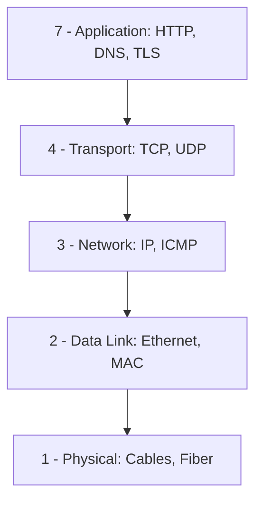
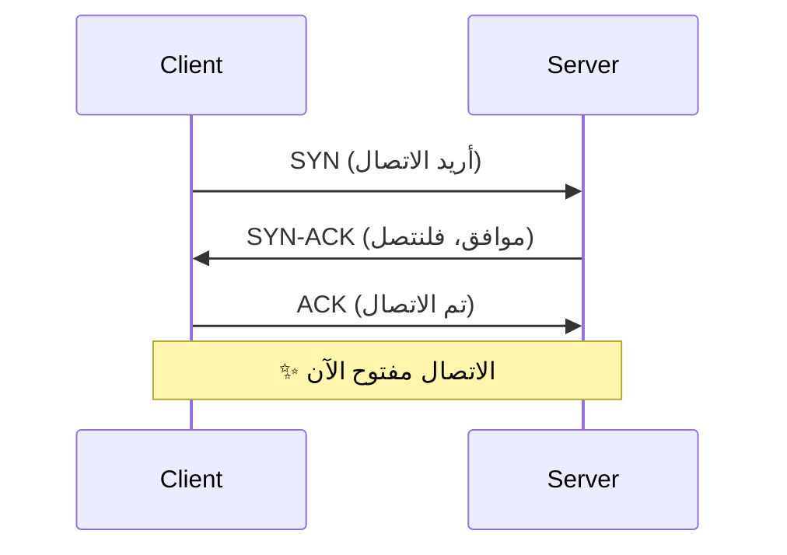

# الشبكات من الصفر

> **"كل خدمة سحابية تبدأ وتنتهي بالشبكة. بدون فهم الشبكات، أنت أعمى في السحابة."**

## لماذا الشبكات مهمة لمهندس السحابة؟

| إذا كنت لا تفهم الشبكات... | سيحدث هذا...                                         |
| -------------------------- | ---------------------------------------------------- |
| لا تعرف TCP vs UDP         | تختار البروتوكول الخطأ — التطبيق بطيء أو يفقد بيانات |
| لا تفهم DNS                | لا تشخص مشاكل الاتصال — "التطبيق لا يصل للخادم"      |
| لا تفهم CIDR               | تصمم VNet لا يتسع — تعيد بناء كل شيء                 |
| لا تفهم Load Balancers     | نقطة فشل واحدة — أول ضغط يقتل التطبيق                |
| لا تفهم Network Security   | مواردك مكشوفة للإنترنت                               |

## نموذج OSI — ٧ طبقات



### كيف يعمل في الواقع؟

عندما تفتح `https://api.cloudnova.com`:

1. **الطبقة ٧ (Application):** المتصفح ينشئ طلب HTTP
2. **الطبقة ٤ (Transport):** TCP يجزئ الطلب ويضمن وصوله
3. **الطبقة ٣ (Network):** IP يضيف عناوين المصدر والوجهة
4. **الطبقة ٢ (Data Link):** Ethernet يرسل الإطارات عبر الكابل

## TCP vs UDP — متى تستخدم ماذا؟

| الميزة        | TCP                            | UDP                          |
| ------------- | ------------------------------ | ---------------------------- |
| **الموثوقية** | ✅ مضمون — يعيد إرسال المفقود  | ❌ غير مضمون                 |
| **الاتصال**   | Connection-oriented            | Connectionless               |
| **الترتيب**   | يصل بالترتيب                   | قد يصل معكوساً               |
| **السرعة**    | أبطأ (overhead أعلى)           | أسرع                         |
| **الاستخدام** | HTTP، SSH، Email، FTP          | DNS، VoIP، Streaming، Gaming |
| **تشبيه**     | البريد المسجل — توقع بالاستلام | الميكروفون — الصوت يصل فوراً |

### Three-Way Handshake (TCP)



## CIDR — تقسيم الشبكات

```
192.168.1.0/24 → 256 عنواناً (254 قابلة للاستخدام)
10.0.0.0/16    → 65,536 عنواناً
10.0.0.0/8     → 16,777,216 عنواناً
```

| CIDR | عدد العناوين | الاستخدام            |
| ---- | ------------ | -------------------- |
| /32  | ١            | عنوان IP واحد        |
| /28  | ١٤           | Azure Gateway Subnet |
| /24  | ٢٥٤          | شبكة تطبيق           |
| /16  | ٦٥,٥٣٤       | VNet كامل            |
| /8   | ١٦,٧٧٧,٢١٤   | نطاق خاص كامل        |

### كيف تحسب؟

```
عدد العناوين = 2^(32 - CIDR)
/24 → 2^(32-24) = 256 عنواناً
256 - 2 = 254 قابلة للاستخدام
  -1 لعنوان الشبكة
  -1 لعنوان broadcast
```

## DNS — دليل هاتف الإنترنت

```bash
# استعلام DNS
nslookup google.com
# Server: 8.8.8.8
# Address: 142.250.185.78

dig google.com +short
# 142.250.185.78

# استعلام عكسي
dig -x 142.250.185.78 +short
# fra16s53-in-f14.1e100.net

# نوع السجل
dig google.com MX     # خوادم البريد
dig google.com NS     # خوادم الأسماء
dig google.com TXT    # سجلات نصية
```

## Load Balancers

| النوع       | الطبقة     | متى تستخدم                 | مثال Azure                  |
| ----------- | ---------- | -------------------------- | --------------------------- |
| **Layer 4** | TCP/UDP    | توزيع بسيط، أداء عالي      | Azure Load Balancer         |
| **Layer 7** | HTTP/HTTPS | توجيه ذكي، SSL termination | Application Gateway         |
| **Global**  | DNS        | توزيع عبر المناطق          | Traffic Manager, Front Door |

## أدوات التشخيص — ماذا تستخدم ومتى

```bash
# "الموقع لا يفتح"
ping api.cloudnova.com           # هل الخادم موجود؟
# Request timeout ← قد يكون محجوب ICMP

# "هل المنفذ مفتوح؟"
nc -zv api.cloudnova.com 443     # TCP
# Connection to api.cloudnova.com 443 port [tcp/https] succeeded!

# "ما المسار الذي يسلكه الاتصال؟"
traceroute api.cloudnova.com
# 1  10.0.0.1 (gateway)
# 2  51.103.1.1 (Azure edge)
# 3  20.50.2.1 (Azure datacenter)

# "DNS صحيح؟"
nslookup api.cloudnova.com
# Name: api.cloudnova.com
# Address: 20.50.2.10

# "HTTP يعمل؟"
curl -I https://api.cloudnova.com
# HTTP/2 200
# server: nginx/1.24

# "SSL صحيح؟"
openssl s_client -connect api.cloudnova.com:443 \
  -servername api.cloudnova.com </dev/null 2>/dev/null | \
  openssl x509 -noout -dates
# notBefore=Jan 15 00:00:00 2024 GMT
# notAfter=Jan 15 00:00:00 2025 GMT
# ← الشهادة تنتهي في يناير!
```

## سيناريو CloudNova: 502 Bad Gateway

> **الموقف:** الساعة ٩ صباحاً — بداية الدوام. العملاء يرون 502. ذعر.

```bash
# ١. تأكد من المشكلة
curl -I https://api.cloudnova.com
# HTTP/2 502

# ٢. هل الـ backend حي؟
ssh backend-01
systemctl status api
# inactive (dead) since 08:47

# ٣. لماذا مات؟
journalctl -u api --since "08:40" --until "08:50"
# FATAL: could not connect to database: Connection refused

# ٤. هل قاعدة البيانات شغالة؟
ssh db-01
systemctl status postgresql
# active — لكن على المنفذ 5433!

# ٥. لماذا تغير المنفذ؟
# تحديث postgresql.conf الليلة الماضية غيّر port
grep "^port" /etc/postgresql/16/main/postgresql.conf
# port = 5433  ← كان 5432!

# ٦. الإصلاح المؤقت
# أعد المنفذ لـ 5432 وأعد تشغيل postgresql
# ثم أعد تشغيل api

# ٧. الإصلاح الدائم
# أضف healthcheck لـ postgresql في المراقبة
# أضف alert إذا تغيير أي config
```

---

[← العودة للوحدة](index.md) | [🏠 الرئيسية](/)
