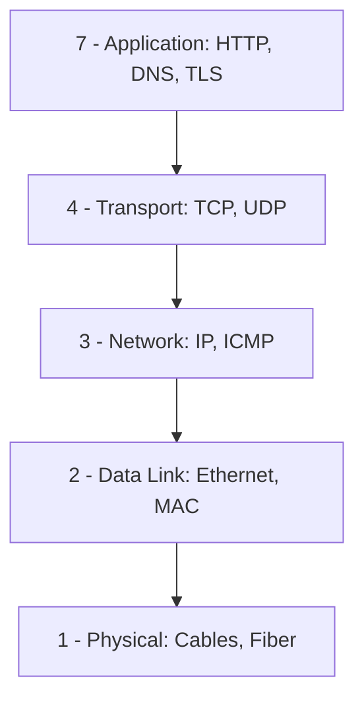
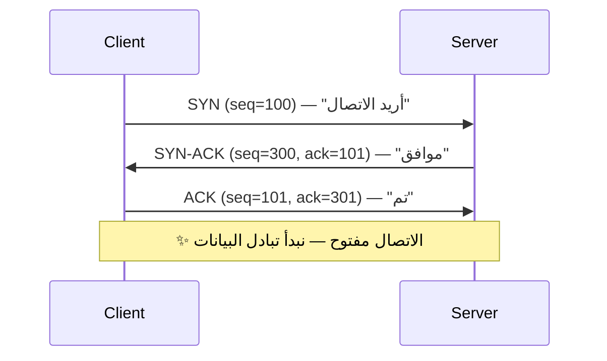
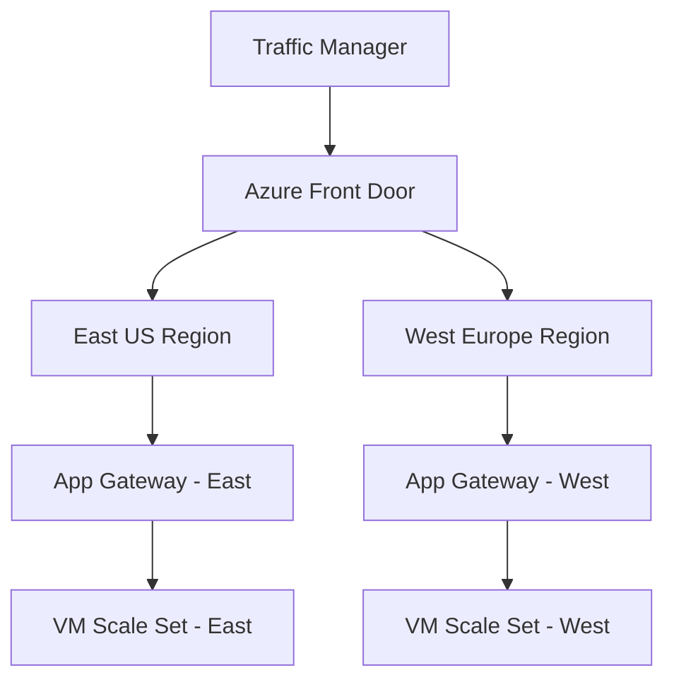

# الشبكات من الصفر

> **"كل خدمة سحابية تبدأ وتنتهي بالشبكة. بدون فهم الشبكات، أنت أعمى في السحابة."**

## 🎯 أهداف التعلم

بعد إكمال هذا الدرس، ستكون قادراً على:

- شرح نموذج OSI وربطه بمشاكل حقيقية
- تصميم VNet احترافي مع Subnets و NSGs
- تشخيص مشاكل الاتصال في السحابة
- اختيار Load Balancer المناسب لكل حالة
- فهم DNS و TLS بعمق

---

## ١. لماذا الشبكات مهمة لمهندس السحابة؟

| إذا كنت لا تفهم... | سيحدث هذا...           | قصة حقيقية من CloudNova                        |
| ------------------ | ---------------------- | ---------------------------------------------- |
| TCP vs UDP         | تختار البروتوكول الخطأ | استخدمنا TCP لـ video streaming — تأخير ٣ ثوان |
| DNS                | لا تشخص مشاكل الاتصال  | "التطبيق معطل" — المشكلة: TTL منتهي            |
| CIDR               | تصمم VNet لا يتسع      | أضفنا ٣ Subnets — نفدت العناوين                |
| Load Balancers     | نقطة فشل واحدة         | خادم واحد استقبل ٩٠٪ من الحركة                 |
| Network Security   | مواردك مكشوفة          | قاعدة بيانات على الإنترنت ٤ أيام               |

---

## ٢. نموذج OSI — ٧ طبقات



### كل طبقة — بمشاكلها الحقيقية

| الطبقة          | البروتوكولات       | المشكلة الشائعة           | أداة التشخيص         |
| --------------- | ------------------ | ------------------------- | -------------------- |
| ٧ - Application | HTTP, DNS, TLS     | 404, 502, شهادة منتهية    | `curl`, `openssl`    |
| ٤ - Transport   | TCP, UDP           | منفذ مغلق، جدار ناري      | `nc -zv`, `ss -tlnp` |
| ٣ - Network     | IP, ICMP           | routing خاطئ، IP متعارض   | `ping`, `traceroute` |
| ٢ - Data Link   | Ethernet, ARP, MAC | كابل معطوب، VLAN mismatch | `ip link`, `ethtool` |
| ١ - Physical    | Cables, Fiber      | كابل مفصول، عطل عتاد      | فحص بصري، `dmesg`    |

### 🟣 المستوى الإنتاجي — تشخيص من الأعلى للأسفل

```bash
# "التطبيق لا يستجيب" — من أين تبدأ؟

# ١. الطبقة ٧: هل HTTP يعمل؟
curl -I https://api.cloudnova.com
# HTTP/2 502 ← المشكلة في الطبقة ٧ (التطبيق)

# ٢. الطبقة ٤: هل المنفذ مفتوح؟
nc -zv api.cloudnova.com 443
# Connection refused ← المنفذ مغلق

# ٣. الطبقة ٣: هل الخادم موجود؟
ping api.cloudnova.com
# 64 bytes from 10.0.1.5 ← الخادم موجود

# التشخيص: الخادم حي لكن الخدمة على المنفذ 443 لا تعمل
# الحل: systemctl restart nginx
```

---

## ٣. TCP vs UDP — بعمق

| الميزة        | TCP                            | UDP                          |
| ------------- | ------------------------------ | ---------------------------- |
| **الموثوقية** | ✅ مضمون — يعيد إرسال المفقود  | ❌ غير مضمون                 |
| **الاتصال**   | Connection-oriented            | Connectionless               |
| **الترتيب**   | يصل بالترتيب                   | قد يصل معكوساً               |
| **السرعة**    | أبطأ (overhead أعلى)           | أسرع                         |
| **الاستخدام** | HTTP، SSH، Email، FTP          | DNS، VoIP، Streaming، Gaming |
| **تشبيه**     | البريد المسجل — توقع بالاستلام | الميكروفون — الصوت يصل فوراً |

### Three-Way Handshake (TCP)



### 🚨 سيناريو CloudNova: TCP أم UDP؟

> **الموقف:** CloudNova تبني نظام مراقبة يجمع metrics من ٢٠٠ خادم كل ١٠ ثوانٍ.

**TCP:** كل metrics مضمونة الوصول ✅ لكن overhead الاتصال لـ ٢٠٠ خادم = ٢٠٠ اتصال دائم ← استهلاك ذاكرة وموارد

**UDP:** لا ضمان وصول ❌ لكن لا overhead اتصال. لو ضاع ١٪ من metrics... في نظام مراقبة، هذا مقبول!

**القرار:** UDP مع تطبيق بسيط لـ acknowledgment للـ metrics الحرجة فقط.

---

## ٤. CIDR — تقسيم الشبكات

```
192.168.1.0/24 → 256 عنواناً (254 قابلة للاستخدام)
10.0.0.0/16    → 65,536 عنواناً
10.0.0.0/8     → 16,777,216 عنواناً
```

| CIDR | عدد العناوين | الاستخدام            |
| ---- | ------------ | -------------------- |
| /32  | ١            | عنوان IP واحد        |
| /28  | ١٤           | Azure Gateway Subnet |
| /24  | ٢٥٤          | شبكة تطبيق           |
| /16  | ٦٥,٥٣٤       | VNet كامل            |
| /8   | ١٦,٧٧٧,٢١٤   | نطاق خاص كامل        |

### 🟣 تصميم VNet احترافي

```yaml
# CloudNova Production VNet
VNet: 10.0.0.0/16 (65,536 عنواناً)

Subnets:
  app-subnet: 10.0.1.0/24   (254 عنواناً) # خوادم التطبيق
  db-subnet: 10.0.2.0/24   (254 عنواناً) # قواعد البيانات
  gateway-subnet: 10.0.0.0/28   (14 عنواناً) # Application Gateway
  bastion-subnet: 10.0.0.16/28  (14 عنواناً) # Azure Bastion
  aks-subnet: 10.0.4.0/22   (1,022 عنواناً) # AKS (يحتاج عناوين كثيرة!)


# مساحة متبقية للتوسع: 10.0.5.0 - 10.0.255.0
```

### لماذا يحتاج AKS مساحة كبيرة؟

```bash
# Kubernetes يستهلك عناوين IP بهذه الطريقة:
# لكل Pod عنوان IP خاص. ٣٠ Pod = ٣٠ عنواناً
# لكل Node عنوان IP خاص. ٥ Nodes = ٥ عناوين
# لكل Service عنوان IP خاص. ١٠ Services = ١٠ عناوين
# المجموع لـ ٥ nodes + ٣٠ pods + ١٠ services = ٤٥ عنواناً
# + احتياطي للتوسع = /22 (1022 عنواناً) آمن
```

---

## ٥. DNS — دليل هاتف الإنترنت

```bash
# استعلام DNS — forward lookup
dig api.cloudnova.com +short
# 20.50.2.10

# استعلام عكسي — reverse lookup
dig -x 20.50.2.10 +short
# api.cloudnova.com

# تتبع مسار DNS
dig api.cloudnova.com +trace
# . (root) → .com (TLD) → cloudnova.com (authoritative)

# أنواع السجلات
dig cloudnova.com A      # IPv4
dig cloudnova.com AAAA   # IPv6
dig cloudnova.com MX     # خوادم البريد
dig cloudnova.com NS     # خوادم الأسماء
dig cloudnova.com TXT    # سجلات SPF, DKIM
dig cloudnova.com CNAME  # الاسم المستعار
```

### 🚨 سيناريو CloudNova: DNS هو المشكلة

> **الموقف:** نصف المستخدمين في آسيا يرون "site not found". النصف الآخر في أوروبا يصل بشكل طبيعي.

```bash
# التشخيص:
dig api.cloudnova.com @8.8.8.8          # Google DNS
# ANSWER: 20.50.2.10 ✅

dig api.cloudnova.com @1.1.1.1          # Cloudflare DNS
# ANSWER: 20.50.2.10 ✅

# لماذا آسيا لا تصل؟
dig api.cloudnova.com @asia-dns.local   # مزود DNS آسيوي
# SERVFAIL ← لا يوجد سجل!

# السبب: غيّرنا DNS قبل ١٠ دقائق. TTL = 3600 ثانية (ساعة).
# بعض مزودي DNS في آسيا يتجاهلون TTL ويخزنون أطول.

# الحل:
# ١. قلل TTL إلى 300 (٥ دقائق) قبل تغيير DNS بأيام
# ٢. انتظر ٤٨ ساعة بعد التغيير
# ٣. استخدم CDN مثل CloudFront لتقليل الاعتماد على DNS
```

---

## ٦. Load Balancers

| النوع       | الطبقة     | متى تستخدم                 | مثال Azure                  | السعر |
| ----------- | ---------- | -------------------------- | --------------------------- | ----- |
| **Layer 4** | TCP/UDP    | توزيع بسيط، أداء عالي      | Azure Load Balancer         | $     |
| **Layer 7** | HTTP/HTTPS | توجيه ذكي، SSL termination | Application Gateway         | $$$   |
| **Global**  | DNS        | توزيع عبر المناطق          | Traffic Manager, Front Door | $$    |

### Layer 7 Routing — توجيه ذكي

```yaml
# Application Gateway: توجيه حسب المسار
rules:
  - path: /api/*
    backend: api-backend-pool # خوادم API
  - path: /images/*
    backend: storage-backend-pool # خوادم الصور
  - path: /*
    backend: web-backend-pool # خوادم الويب

# Session Affinity — تثبيت الجلسة
# مستخدم واحد = نفس الخادم دائماً (مهم لـ WebSockets)
sessionAffinity: Enabled
```

---

## ٧. أدوات التشخيص — دليل الميدان

```bash
# "الموقع لا يفتح" — منهجية التشخيص الكاملة

# ١. هل الخادم موجود؟
ping api.cloudnova.com -c 3
# 64 bytes from 20.50.2.10 ← الخادم موجود ✅

# ٢. هل المنفذ مفتوح؟
nc -zv api.cloudnova.com 443
# Connection to api.cloudnova.com 443 port succeeded! ✅

# ٣. هل SSL صحيح؟
openssl s_client -connect api.cloudnova.com:443 -servername api.cloudnova.com </dev/null 2>/dev/null | openssl x509 -noout -dates
# notAfter=Mar 15 00:00:00 2025 GMT ← الشهادة سارية ✅

# ٤. هل HTTP يعمل؟
curl -I https://api.cloudnova.com
# HTTP/2 200 ← الخدمة تعمل ✅

# ٥. هل DNS صحيح؟
nslookup api.cloudnova.com
# Name: api.cloudnova.com
# Address: 20.50.2.10 ← DNS صحيح ✅

# ٦. ما المسار الذي يسلكه الاتصال؟
traceroute api.cloudnova.com
# 1  10.0.0.1 (local gateway)
# 2  51.103.1.1 (Azure edge)
# 3  20.50.2.10 (destination) ← وصلنا!

# ٧. كم سرعة الاستجابة؟
curl -w "@curl-format.txt" -o /dev/null -s https://api.cloudnova.com
# time_namelookup:  0.012s   ← DNS
# time_connect:     0.045s   ← TCP
# time_appconnect:  0.098s   ← TLS
# time_starttransfer: 0.234s ← أول بايت
# time_total:       0.245s   ← الكل
```

---

## ٨. سيناريو CloudNova: 502 Bad Gateway

> **الموقف:** الساعة ٩ صباحاً — بداية الدوام. العملاء يرون 502 Bad Gateway. ذعر.

```bash
# ⏱️ الخطوة ١: تأكيد المشكلة (دقيقة واحدة)
curl -I https://api.cloudnova.com
# HTTP/2 502 ← المشكلة مؤكدة

# 🔍 الخطوة ٢: هل الـ backend حي؟ (٣ دقائق)
ssh app-server-01
systemctl status cloudnova-api
# inactive (dead) since 08:47 ← مات قبل ١٣ دقيقة!

# 📊 الخطوة ٣: لماذا مات؟ (٥ دقائق)
journalctl -u cloudnova-api --since "08:40" --until "08:50"
# FATAL: could not connect to database: Connection refused
# ← لا يصل لقاعدة البيانات

# 🔎 الخطوة ٤: هل قاعدة البيانات شغالة؟ (٣ دقائق)
ssh db-server-01
systemctl status postgresql
# active — لكن على المنفذ 5433!

grep "^port" /etc/postgresql/16/main/postgresql.conf
# port = 5433  ← كان 5432!

# 🛠️ الخطوة ٥: الإصلاح (٥ دقائق)
# تغيير config أعاده تحديث الليلة الماضية
sudo sed -i 's/^port = 5433/port = 5432/' /etc/postgresql/16/main/postgresql.conf
sudo systemctl restart postgresql
sudo systemctl start cloudnova-api

# ✅ الخطوة ٦: تأكيد (دقيقة واحدة)
curl -I https://api.cloudnova.com
# HTTP/2 200 ← عادت الخدمة!

# ⏱️ إجمالي وقت التعطل: ~١٨ دقيقة
# إجمالي وقت التشخيص: ١٢ دقيقة
# إجمالي وقت الإصلاح: ٦ دقائق
```

### 📝 الدروس المستفادة — Postmortem مختصر

1. **تغييرات الـ config يجب أن تكون عبر CI/CD — وليس يدوياً**
2. **الخدمات يجب أن تتحقق من اتصالها بقاعدة البيانات عند البدء — وتفشل بوضوح**
3. **أضف alert على تغيير port في أي خدمة إنتاجية**
4. **Runbook لهذا السيناريو بالضبط سيوفر علينا ١٠ دقائق المرة القادمة**

---

## 🧠 أسئلة للمراجعة النشطة

1. ما الفرق بين Layer 4 و Layer 7 Load Balancer؟ أعط مثال استخدام لكل منهما.
2. كيف تصمم VNet لـ Kubernetes؟ لماذا يحتاج AKS مساحة عناوين كبيرة؟
3. اشرح Three-Way Handshake لـ TCP — ماذا يحدث في كل خطوة؟
4. لماذا قد يرى مستخدمون في آسيا "site not found" بينما يصل مستخدمو أوروبا بشكل طبيعي؟
5. صِف خطوات تشخيص "الموقع لا يفتح" من الأعلى للأسفل.

## ✍️ تمرين Feynman

اشرح DNS لطفل في العاشرة. استخدم تشبيه "دليل الهاتف" — لماذا هو ضروري؟ ماذا يحدث لو اختفى؟

## 🎴 بطاقات مراجعة

| السؤال                   | الإجابة                              |
| ------------------------ | ------------------------------------ |
| كم عنواناً في /24؟       | ٢٥٦ (٢٥٤ قابلة للاستخدام)            |
| أمر لفحص هل المنفذ مفتوح | `nc -zv host port`                   |
| أداة لتتبع مسار الحزمة   | `traceroute`                         |
| أمر لفحص شهادة SSL       | `openssl s_client -connect host:443` |

## 🎤 أسئلة مقابلة العمل

1. **"ما الفرق بين TCP و UDP؟ متى تستخدم كل منهما؟"** ← الموثوقية vs السرعة + أمثلة واقعية
2. **"كيف تصمم VNet لتطبيق إنتاجي؟"** ← Subnets للطبقات، NSG للعزل، مساحة للتوسع
3. **"تشخيص: curl يعطي timeout لكن ping يعمل."** ← المنفذ مغلق أو جدار ناري — استخدم `nc -zv`

---

---

## 🏛️ الطبقة الإنتاجية: شبكات الإنتاج

### High Availability للشبكة



```bash
# Azure Cross-Region Load Balancer
az network cross-region-lb create \
  --name cloudnova-global-lb \
  --resource-group prod-rg \
  --frontend-ip-name global-frontend \
  --backend-pool-name global-backend

# إضافة مناطق للـ backend pool
az network cross-region-lb address-pool address add \
  --lb-name cloudnova-global-lb \
  --address-pool global-backend \
  --name east-us \
  --frontend-ip-address 20.50.2.10

az network cross-region-lb address-pool address add \
  --lb-name cloudnova-global-lb \
  --address-pool global-backend \
  --name west-europe \
  --frontend-ip-address 51.103.1.10
```

### Network Performance Tuning

```bash
# TCP Tuning للإنتاج
cat >> /etc/sysctl.conf <<EOF
# زيادة حجم buffer للشبكة
net.core.rmem_max = 134217728
net.core.wmem_max = 134217728
net.ipv4.tcp_rmem = 4096 87380 134217728
net.ipv4.tcp_wmem = 4096 65536 134217728

# تمكين TCP Fast Open
net.ipv4.tcp_fastopen = 3

# زيادة backlog
net.core.somaxconn = 65535
net.ipv4.tcp_max_syn_backlog = 65535

# تمكين BBR congestion control
net.core.default_qdisc = fq
net.ipv4.tcp_congestion_control = bbr
EOF

sysctl -p
```

### Network Monitoring

```yaml
# Prometheus Blackbox Exporter — مراقبة من الخارج
modules:
  http_2xx:
    prober: http
    timeout: 5s
    http:
      valid_status_codes: [200, 301, 302]
      method: GET
      no_follow_redirects: false
      fail_if_ssl: false
      fail_if_not_ssl: false
      tls_config:
        insecure_skip_verify: false

  tcp_connect:
    prober: tcp
    timeout: 5s
    tcp:
      ip_protocol_fallback: true

  dns_lookup:
    prober: dns
    dns:
      query_name: "api.cloudnova.com"
      query_type: "A"
      validate_answer_rrs:
        fail_if_matches_regexp:
          - ".*"
```

### Disaster Recovery للشبكة

```
سيناريو: منطقة Azure East US تتعطل بالكامل

استراتيجية CloudNova:

1. DNS Failover (Traffic Manager):
   - Priority: East US (0)، West Europe (1)
   - TTL: 60 seconds
   - Failover تلقائي < 2 دقيقة

2. Azure Front Door:
   - Global anycast — يقود لأقرب منطقة
   - Health probes كل 15 ثانية
   - Automatic failover < 30 ثانية

3. Costs:
   ├── Active-Passive: أرخص — West Europe idle حتى الحاجة
   ├── Active-Active: أغلى — المنطقتان تخدمّان
   └── CloudNova اختارت: Active-Passive للـ DR

4. RTO: 5 دقائق (DNS propagation + app startup)
5. RPO: 0 (database geo-replicated)
```

---

## 🎨 الطبقة المعمارية: قرارات الشبكة الكبرى

### Hub-Spoke vs Mesh Topology

```
Hub-Spoke (توصي Azure به):
├── Hub VNet: Azure Firewall، VPN Gateway، Bastion
│   ├── Spoke 1: Production
│   ├── Spoke 2: Staging
│   └── Spoke 3: Development
├── الميزة: تحكم مركزي، تكلفة أقل
└── العيب: Hub = single point of failure (استخدم AZs)

Mesh (كل VNet متصل بالكل):
├── VNet 1 ↔ VNet 2 ↔ VNet 3
├── الميزة: لا single point of failure
└── العيب: تعقيد N×(N-1)/2 اتصالات، تكلفة أعلى

CloudNova: Hub-Spoke مع Azure Firewall في Hub
```

### متى تستخدم VPN ومتى ExpressRoute؟

```
VPN (Site-to-Site):
├── مناسب: مكاتب صغيرة، بيئات dev/test
├── السرعة: حتى 1.25 Gbps
├── التكلفة: $130/شهر + data transfer
├── SLA: 99.9%
└── الإعداد: ساعات

ExpressRoute:
├── مناسب: مكاتب كبيرة، مراكز بيانات، حركة كثيفة
├── السرعة: حتى 100 Gbps
├── التكلفة: $600-5000/شهر + data transfer
├── SLA: 99.95%
└── الإعداد: أسابيع (عقد مع مزود اتصال)

في CloudNova:
├── Headquarters: ExpressRoute (حركة كبيرة)
├── Regional offices: VPN
└── Remote workers: Azure Bastion أو VPN client
```

### متى لا تستخدم Load Balancer؟

```
❌ لا تستخدم Load Balancer (واستخدم بديلاً):

1. تطبيق stateful بسيط على خادم واحد:
   → لا حاجة — DNS مباشر يكفي

2. Static website:
   → CDN (Azure Front Door, Cloudflare)

3. WebSockets مع sticky sessions معقدة:
   → قد يسبب مشاكل إذا لم يُضبط session affinity

4. حركة قليلة جداً (< 100 req/s):
   → overhead الـ LB لا يستحق. خادم واحد + DNS
```

### Future Trends

```
1. eBPF-based Networking (Cilium):
   - Network Policies في Kubernetes بدون sidecar proxy
   - أداء أفضل 3-5x من iptables

2. Service Mesh (Istio, Linkerd):
   - mTLS تلقائي بين الخدمات
   - Traffic splitting للـ canary deployments

3. HTTP/3 + QUIC:
   - مبني على UDP بدلاً من TCP
   - أسرع في الظروف السيئة (packet loss)

4. Software-Defined WAN (SD-WAN):
   - توجيه ذكي بين MPLS, VPN, Internet
   - Azure Virtual WAN يدمج مع SD-WAN
```

---

## 🛠️ تدريبات عملية

### تمرين ١: تشخيص "الموقع لا يفتح"

```bash
# شخص المشكلة في هذا السيناريو:
curl -I https://app.cloudnova.com
# curl: (7) Failed to connect to app.cloudnova.com port 443

# ١. هل DNS يعمل؟
nslookup app.cloudnova.com
# Server: 8.8.8.8
# Name: app.cloudnova.com
# Address: 20.50.2.10  ← DNS يعمل

# ٢. هل الخادم يرد؟
ping 20.50.2.10
# 64 bytes from 20.50.2.10 ← الخادم موجود

# ٣. هل المنفذ مفتوح؟
nc -zv 20.50.2.10 443
# Connection refused ← المشكلة هنا!

# ٤. تحقق من NSG rules
az network nsg rule list \
  --nsg-name app-nsg \
  --resource-group prod-rg \
  -o table
# لا توجد قاعدة للمنفذ 443!

# ٥. أضف القاعدة
az network nsg rule create \
  --nsg-name app-nsg \
  --name AllowHttps \
  --priority 110 \
  --direction Inbound \
  --source-address-prefixes "*" \
  --destination-port-ranges 443 \
  --access Allow

curl -I https://app.cloudnova.com
# HTTP/2 200 ✅
```

### تمرين ٢: تصميم VNet

```
المهمة: صمم VNet لشركة مالية لديها:
- 3 بيئات (dev, staging, prod)
- 5 تطبيقات مختلفة
- متطلبات PCI-DSS compliance
- مساحة عناوين: 10.50.0.0/16

ارسم التصميم وحدد:
- عدد الـ Subnets ومساحاتها
- NSG rules الأساسية
- كيف تعزل الـ production عن غيره
```

### تحدي: تشخيص مشكلة DNS معقدة

```
الموقف:
- app.cloudnova.com يعمل من أوروبا ومنزلك
- لكنه لا يعمل من شبكة العميل في السعودية
- العميل يستخدم DNS محلي (وليست 8.8.8.8)

ماذا تفعل؟ اكتب خطة التشخيص.

تلميحات:
1. dig @dns-server.local app.cloudnova.com
2. تحقق من DNS propagation (whatsmydns.net)
3. هل هناك CDN؟ هل الـ edge قريب من السعودية؟
4. هل الـ ISP يحجب حركة معينة؟
```

### CloudNova Project Task

```
مهمتك: تأمين شبكة CloudNova

المتطلبات:
1. ✓ VNet Hub-Spoke topology
2. ✓ Azure Firewall في Hub مع policies:
   - السماح: HTTPS (443) من الإنترنت للتطبيقات
   - السماح: SSH (22) فقط من Bastion subnet
   - منع: كل شيء آخر من الإنترنت
3. ✓ NSG على كل Subnet:
   - App subnet: 443 من Application Gateway
   - DB subnet: 5432 من App subnet فقط
4. ✓ Private Endpoints لـ Key Vault و Storage
5. ✓ DDoS Protection Standard
6. ✓ WAF على Application Gateway
```

---

## 📝 تقييم

### Knowledge Check

1. **كم عنواناً في /28؟**
   

<details><summary>الإجابة</summary>16 عنواناً (14 usable). Azure Gateway Subnet يحتاج /27 أو أكبر.</details>


2. **ما الفرق بين NSG و Azure Firewall؟**
   

<details><summary>الإجابة</summary>NSG: Layer 4 filtering، مجاني، لكل subnet/NIC. Firewall: Layer 7 filtering، مدفوع، مركزي مع FQDN و threat intelligence.</details>


3. **كيف تفحص شهادة SSL من الـ CLI؟**
   

<details><summary>الإجابة</summary>`openssl s_client -connect host:443 -servername host | openssl x509 -noout -text`</details>


4. **ما هو TTL في DNS ولماذا يهم؟**
   

<details><summary>الإجابة</summary>Time To Live: كم ثانية يُخزّن الـ resolver السجل. منخفض = تحديث أسرع لكن DNS queries أكثر.</details>


5. **كيف يعمل Three-Way Handshake؟**
   

<details><summary>الإجابة</summary>Client → SYN → Server. Server → SYN-ACK → Client. Client → ACK → Server. اتصال مفتوح!</details>


### Quiz

1. **أي Load Balancer يعمل على Layer 7؟**
   a) Azure Load Balancer
   b) Application Gateway
   c) Traffic Manager
   

<details><summary>الإجابة</summary>b) Application Gateway — يفهم HTTP/HTTPS ويوجه حسب المسار أو الـ hostname</details>


2. **أي عنوان IP للشبكات الخاصة؟**
   a) 172.32.0.1
   b) 192.168.1.1
   c) 11.0.0.1
   

<details><summary>الإجابة</summary>b) 192.168.x.x. النطاقات الخاصة: 10.0.0.0/8, 172.16.0.0/12, 192.168.0.0/16</details>


3. **ماذا يعني HTTP 502؟**
   a) Not Found
   b) Bad Gateway
   c) Internal Server Error
   

<details><summary>الإجابة</summary>b) Bad Gateway — الـ proxy تلقى رداً غير صالح من الـ upstream server</details>


### 5 أسئلة للتذكّر النشط

1. ارسم هيكل OSI Model من ذاكرتك — مع مثال بروتوكول لكل طبقة
2. كيف تصمم VNet لـ Kubernetes مع 50 pod متوقعة؟
3. اشرح سيناريو DNS failure كاملاً — الأعراض، التشخيص، الإصلاح
4. ما الفرق بين Active-Passive و Active-Active DR للشبكة؟
5. كيف تختار بين VPN و ExpressRoute؟

### ✍️ تمرين Feynman

اشرح DNS لشخص غير تقني: "لماذا لا تكتب 20.50.2.10 في المتصفح بدلاً من google.com؟"

### 🎴 بطاقات تعليمية

| 🃏 السؤال                  | 🃏 الإجابة                                    |
| -------------------------- | --------------------------------------------- |
| كم عنواناً في /24؟         | 256 (254 usable)                              |
| أمر فحص منفذ مفتوح         | `nc -zv host port`                            |
| أداة تتبع مسار الحزمة      | `traceroute host`                             |
| فحص شهادة SSL              | `openssl s_client -connect host:443`          |
| بروتوكول البريد الإلكتروني | SMTP (25/587), IMAP (143/993), POP3 (110/995) |

---

## 🎤 أسئلة مقابلة إضافية

### س ١: System Design

> **السؤال:** "صمم نظام توزيع محتوى عالمي (CDN-like) لخدمة فيديو."

```
١. DNS: Traffic Manager أو Route 53 مع Geo-routing
   - مستخدم في آسيا → أقرب edge في Singapore
   - مستخدم في أوروبا → أقرب edge في Amsterdam

٢. CDN: Azure Front Door / CloudFront
   - Cache الفيديوهات القريبة من المستخدم
   - Origin: Blob Storage أو S3

٣. Load Balancer: Layer 7
   - توجيه /api/* لخوادم الـ backend
   - توجيه /videos/* للـ CDN origin

٤. Network:
   - Anycast IPs للـ edges
   - BGP للإعلان عن المسارات

٥. Optimization:
   - HTTP/2 أو HTTP/3 لاتصالات أسرع
   - TCP BBR congestion control
```

### س ٢: Troubleshooting

> **السؤال:** "تطبيقك يرى latency عالي فجأة. ماذا تفعل؟"

```
١. حدد النطاق: هل لكل المستخدمين أم لمنطقة معينة؟
٢. traceroute: أين يحدث التأخير؟
٣. mtr: إحصائيات packet loss + latency لكل hop
٤. تحقق من الـ CDN/edge: هل المشكلة في الـ origin أم الـ edge؟
٥. تحقق من الـ backend: هل قاعدة البيانات بطيئة؟
٦. القرار: expand edge capacity أو optimize backend
```

### س ٣: Behavioral

> **السؤال:** "حدثني عن وقت سببت فيه مشكلة في الشبكة وكيف أصلحتها."

```
S: في CloudNova، أضفت NSG rule بالخطأ منعت كل حركة HTTPS.
T: استعادة الخدمة قبل أن يلاحظ العملاء.
A:
  1. لاحظت alert: "HTTP 5xx rate > 50%" خلال 30 ثانية
  2. راجعت آخر تغييرات: NSG rule برقم priority خطأ
  3. حذفت القاعدة فوراً — عادت الخدمة
  4. أضفت Azure Policy: "لا يمكن إنشاء NSG rule برقم priority < 200"
  5. أضفت Change Lock على NSG production
R: تعطل 90 ثانية فقط. تعلمت: اختبر تغييرات الشبكة في staging أولاً.
```

---

## 📚 مراجع

### دروس ذات صلة

- [Azure Core - Azure Networking](/docs/lessons/07-azure-core/01-azure-fundamentals)
- [Kubernetes Networking](/docs/lessons/10-kubernetes/02-kubernetes-networking)
- [Observability Essentials](/docs/lessons/21-observability/01-observability-essentials)

### شهادات

| الشهادة    | الأهداف                             |
| ---------- | ----------------------------------- |
| **AZ-104** | Configure VNet، DNS، Load Balancers |
| **AZ-700** | Azure Network Engineer Associate    |
| **CCNA**   | Cisco Certified Network Associate   |

### مصادر خارجية

- [Azure Networking Documentation](https://learn.microsoft.com/azure/networking/)
- [Cloudflare Learning Center](https://www.cloudflare.com/learning/)
- [High Performance Browser Networking](https://hpbn.co) — كتاب مجاني

### مصطلحات

| المصطلح     | التعريف                                     |
| ----------- | ------------------------------------------- |
| **CIDR**    | Classless Inter-Domain Routing              |
| **TTL**     | Time To Live — مدة تخزين سجل DNS            |
| **BGP**     | Border Gateway Protocol — توجيه بين الشبكات |
| **Anycast** | عنوان IP يخدم من عدة مواقع                  |
| **mTLS**    | Mutual TLS — تحقق ثنائي الاتجاه             |

---

[← العودة للوحدة](01-networking-fundamentals) | [🏠 الرئيسية](/)
