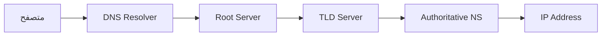

# DNS من الداخل

> "عندما لا يعمل DNS، الإنترنت كله لا يعمل. افهمه جيداً."

## 🎯 أهداف التعلم
- فهم DNS resolution من البداية للنهاية
- إدارة DNS Zones و Records
- DNSSEC للحماية من التسمم
- Azure DNS Private Zones
- تشخيص مشاكل DNS

---

## ١. كيف يعمل DNS؟



## ٢. أوامر التشخيص

```bash
dig cloudnova.com +trace
nslookup cloudnova.com 8.8.8.8
host -t MX cloudnova.com
```

## ٣. Azure DNS Private Zones

```bash
az network private-dns zone create -g prod-rg -n privatelink.database.windows.net
az network private-dns record-set a add-record -g prod-rg -z privatelink.database.windows.net -n db -a 10.0.2.5
```

## 🚨 CloudNova: DNS انقطع 3 ساعات

> TTL set to 86400. تغيير IP → 24 ساعة propagation. الحل: TTL = 300 للإنتاج.

## 🛠️ تمرين
شخّص: `curl api.cloudnova.com` → "Could not resolve host"

## 📝 تقييم
**س١:** A record vs CNAME؟ → A = IP. CNAME = alias لاسم آخر.
**س٢:** TTL؟ → مدة التخزين المؤقت.
**س٣:** DNSSEC؟ → توقيع رقمي يمنع التسمم.

---

[← Networking Fundamentals](./01-networking-fundamentals) | [→ Load Balancing](./03-load-balancing-reverse-proxy) | [🏠 الرئيسية](/)
