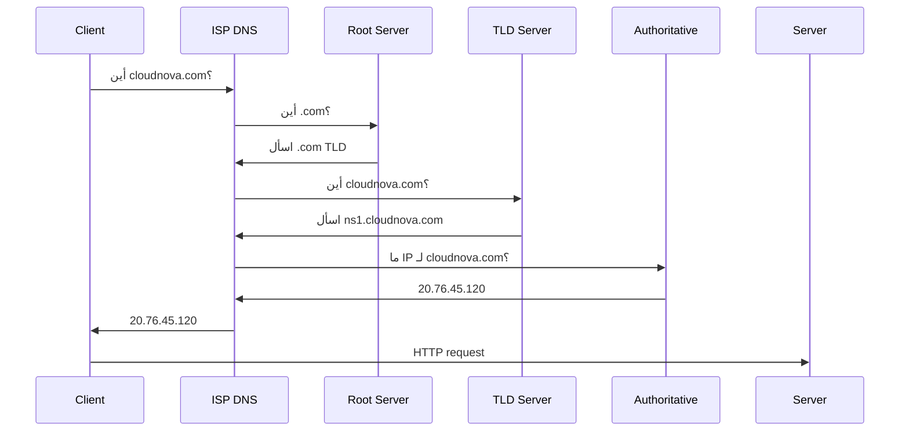

## ١. كيف يعمل DNS؟



### سجلات DNS الأساسية

| النوع | الوظيفة | مثال |
|-------|---------|------|
| **A** | IPv4 address | `cloudnova.com → 20.76.45.120` |
| **AAAA** | IPv6 address | `→ 2603:1030:...` |
| **CNAME** | اسم مستعار | `www → cloudnova.com` |
| **MX** | خادم البريد | `mail.cloudnova.com` |
| **TXT** | بيانات نصية | `v=spf1 ...` (SPF) |
| **NS** | Name Server | `ns1.cloudnova.com` |
| **SRV** | خدمة محددة | `_sip._tcp.cloudnova.com` |

---

## ٢. Azure DNS

```bash
# إنشاء DNS Zone
az network dns zone create \
  --resource-group cloudnova \
  --name cloudnova.com

# إضافة A record
az network dns record-set a add-record \
  --resource-group cloudnova \
  --zone-name cloudnova.com \
  --record-set-name api \
  --ipv4-address 20.76.45.120

# إضافة CNAME
az network dns record-set cname set-record \
  --resource-group cloudnova \
  --zone-name cloudnova.com \
  --record-set-name www \
  --cname cloudnova.com
```

### Private DNS Zones

```bash
az network private-dns zone create \
  --resource-group cloudnova \
  --name internal.cloudnova.com

az network private-dns record-set a add-record \
  --resource-group cloudnova \
  --zone-name internal.cloudnova.com \
  --record-set-name db \
  --ipv4-address 10.0.3.10

# ربط الـ Private Zone بـ VNet
az network private-dns link vnet create \
  --resource-group cloudnova \
  --zone-name internal.cloudnova.com \
  --name link-to-spoke \
  --virtual-network spoke-vnet \
  --registration-enabled true
```

---

## ٣. DNSSEC — توقيع DNS

DNSSEC يمنع DNS spoofing عبر توقيع السجلات رقمياً.

```bash
az network dns zone update \
  --resource-group cloudnova \
  --name cloudnova.com \
  --set properties.dnssecConfig.state="Enabled"
```

---

## 🏛️ سيناريو CloudNova: DNS كارثة

```
الخميس 11:00 — العملاء يبلغون: "الموقع لا يعمل"
التحقيق:
  nslookup cloudnova.com → NXDOMAIN (النطاق غير موجود!)
  السبب: DNS zone على Azure انتهت صلاحيتها (auto-renewal معطل)
  الحل:
    az network dns zone create --name cloudnova.com
    إعادة إنشاء كل السجلات من backup
  الوقت الإجمالي: 45 دقيقة انقطاع كامل
  الدرس: DNS zone لا تنتهي صلاحيتها تلقائياً، لكن الاشتراك قد ينتهي
```

---

## 🛠️ تدريبات

### تمرين 1: استكشاف DNS
```bash
nslookup cloudnova.com          # استعلام أساسي
dig cloudnova.com ANY           # كل السجلات
dig +trace cloudnova.com        # تتبع الـ resolution
dig cloudnova.com MX            # سجلات البريد فقط
```

### تمرين 2: أنشئ Private DNS Zone
أنشئ Private Zone `internal.cloudnova.com` واربطها بـ VNet.

### تحدي: DNS Failover
صمم DNS failover: إذا تعطل الموقع الأساسي، يتحول تلقائياً إلى موقع احتياطي (Azure Traffic Manager).

---

## 📝 تقييم

### ✅ فحص المعرفة
1. ما الفرق بين A record و CNAME؟
2. لماذا Private DNS Zone مهم؟
3. ما فائدة DNSSEC؟
4. اشرح كيف يحل الـ DNS اسم نطاق خطوة بخطوة.
5. ما هو TTL ولماذا مهم؟

### 🃏 بطاقات

| السؤال | الإجابة |
|--------|---------|
| A Record | يربط اسم النطاق بـ IPv4 |
| CNAME | اسم مستعار لنطاق آخر |
| TTL | مدة تخزين السجل في cache |
| Private DNS Zone | DNS داخلي للـ VNet فقط |

---

## 🎤 مقابلة

1. "كيف يعمل DNS Resolution بالتفصيل؟"
2. "صمم DNS Architecture لـ multi-region application"

---

## 📚 مراجع

| النوع | الرابط |
|-------|--------|
| درس مرتبط | [Networking Fundamentals](./01-networking-fundamentals) |
| درس مرتبط | [Load Balancing](./03-load-balancing-reverse-proxy) |
| أداة | [dig](https://linux.die.net/man/1/dig) |

---

[← Networking Fundamentals](./01-networking-fundamentals) | [→ Load Balancing](./03-load-balancing-reverse-proxy) | [🏠 الرئيسية](/)
