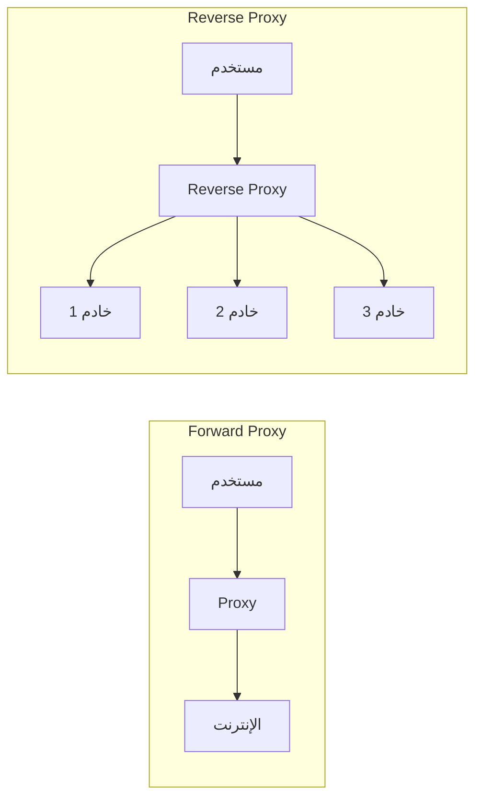
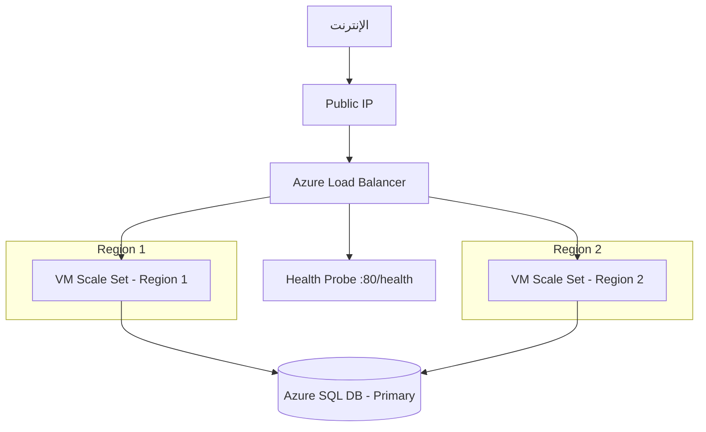

# موازنة الأحمال والبروكسي العكسي

> "لا يوجد تطبيق production بدون Load Balancer. الفرق بين موقع يتحمل 100 مستخدم وموقع يتحمل 100,000 مستخدم هو طبقة واحدة."

## 🎯 أهداف التعلم

- فهم الفرق بين Forward Proxy و Reverse Proxy
- إتقان Layer 4 vs Layer 7 Load Balancing
- تكوين Nginx كـ Reverse Proxy عملي
- تصميم High Availability مع Azure Load Balancer
- استكشاف أخطاء الـ Load Balancer وإصلاحها

## 📋 المتطلبات الأساسية

- Networking Fundamentals
- Linux أساسيات
- فهم HTTP/HTTPS

## ⏱️ الوقت المقدر: 45 دقيقة | المستوى: Intermediate

---

## 🧠 الطبقة البسيطة: تشبيه من الحياة اليومية

تخيل مطعماً مزدحماً في الرياض وقت الغداء. هناك موظف استقبال واحد (هذا هو الـ **Load Balancer**). عندما تدخل:

1. يقول لك: "الطاولة رقم 7 شاغرة، تفضل"
2. إذا كانت كل الطاولات مشغولة: "انتظر دقيقة من فضلك"
3. إذا كانت طاولة معطلة: لا يرسل أحداً إليها أبداً (Health Check)

هذا بالضبط ما يفعله Load Balancer: يوزع الطلبات على الخوادم المتاحة ويتأكد من سلامتها.

---

## 🏗️ الطبقة الأساسية

### Forward Proxy vs Reverse Proxy



| النوع | الغرض | مثال |
|-------|--------|------|
| **Forward Proxy** | إخفاء العميل | شركة تخفي موظفيها عن الإنترنت |
| **Reverse Proxy** | إخفاء الخوادم | Nginx أمام تطبيق Node.js |

### Layer 4 vs Layer 7

| | Layer 4 (TCP/UDP) | Layer 7 (HTTP/HTTPS) |
|---|-------------------|----------------------|
| **ماذا يرى؟** | IP + Port فقط | URL، Headers، Cookies |
| **التوجيه** | حسب IP/Port | حسب `/api` أو `/images` |
| **SSL** | Pass-through | Termination |
| **Caching** | ❌ | ✅ |
| **أمثلة** | Azure LB، HAProxy TCP | Nginx، Traefik، Azure App Gateway |

### خوارزميات التوزيع

```bash
# Round Robin (افتراضي)
upstream backend {
    server 10.0.1.1:3000;
    server 10.0.1.2:3000;
    server 10.0.1.3:3000;
}

# Least Connections
upstream backend {
    least_conn;
    server 10.0.1.1:3000;
    server 10.0.1.2:3000;
}

# IP Hash (للحفاظ على session)
upstream backend {
    ip_hash;
    server 10.0.1.1:3000;
    server 10.0.1.2:3000;
}
```

### تكوين Nginx Reverse Proxy عملي

```nginx
# /etc/nginx/sites-available/api.cloudnova.com
upstream api_backend {
    least_conn;
    server 10.0.1.10:3000 max_fails=3 fail_timeout=30s;
    server 10.0.1.11:3000 max_fails=3 fail_timeout=30s;
    server 10.0.1.12:3000 backup;  # خادم احتياطي
}

server {
    listen 443 ssl http2;
    server_name api.cloudnova.com;

    ssl_certificate /etc/ssl/cloudnova.crt;
    ssl_certificate_key /etc/ssl/cloudnova.key;

    location / {
        proxy_pass http://api_backend;
        proxy_set_header Host $host;
        proxy_set_header X-Real-IP $remote_addr;
        proxy_set_header X-Forwarded-For $proxy_add_x_forwarded_for;
        proxy_set_header X-Forwarded-Proto $scheme;
        
        # Timeouts
        proxy_connect_timeout 5s;
        proxy_read_timeout 60s;
        
        # Buffering
        proxy_buffering on;
        proxy_buffer_size 4k;
    }

    # Health Check endpoint
    location /health {
        proxy_pass http://api_backend/health;
        access_log off;
    }
}
```

---

## 🏛️ طبقة الإنتاج

### Azure Load Balancer Architecture



### سيناريو CloudNova: الجمعة السوداء

في CloudNova، قبل الجمعة السوداء بأسبوعين، حدث التالي:

1. **المشكلة**: الـ health probe كان يفحص `/` بدلاً من `/health`
2. **النتيجة**: التطبيق كان يرد بـ 200 لكنه بطيء جداً (8 ثوانٍ)
3. **الحل**: تغيير الـ probe إلى `/health` الذي يفحص قاعدة البيانات والـ Redis
4. **الدرس**: الـ Health Check يجب أن يكون ذكياً، وليس مجرد "هل الخادم يعمل؟"

```bash
# Health Check سيء
curl -o /dev/null -s -w '%{http_code}' http://server/

# Health Check جيد - يفحص التبعيات
curl -o /dev/null -s -w '%{http_code}' http://server/health
# /health يفحص: DB connection + Redis ping + Disk space + Queue depth
```

### استكشاف الأخطاء

| العَرَض | السبب المحتمل | الحل |
|---------|--------------|------|
| 502 Bad Gateway | الخادم الخلفي معطل | تحقق من عمل الخادم على البورت الصحيح |
| 504 Gateway Timeout | استجابة بطيئة جداً | زد `proxy_read_timeout` أو حسّن الكود |
| توزيع غير متساوٍ | Sticky sessions أو IP Hash | استخدم `least_conn` |
| Health probe fail | التطبيق لا يستجيب على `/health` | أنشئ endpoint صحي |

---

## 🎨 طبقة المعماري

### متى تستخدم ماذا؟

| السيناريو | الأداة المناسبة |
|-----------|----------------|
| تطبيق ويب بسيط | Nginx Reverse Proxy |
| Kubernetes Cluster | Traefik / Nginx Ingress |
| Azure Native | Azure Application Gateway + WAF |
| تطبيقات TCP (مثل MySQL) | HAProxy Layer 4 |
| Global Distribution | Azure Front Door / Cloudflare |
| API Gateway | Azure API Management / Kong |

### متى لا تستخدم Load Balancer؟

- تطبيق بشخص واحد (monolith على VM وحيدة)
- Serverless (Azure Functions تتولى scaling تلقائياً)
- Static Site (Azure CDN يكفي)

---

## 🛠️ تدريبات

### تمرين 1: تكوين Nginx Reverse Proxy

```bash
# على جهاز Linux:
sudo apt install nginx -y

# أنشئ upstream
sudo tee /etc/nginx/conf.d/backend.conf << 'EOF'
upstream myapp {
    server 127.0.0.1:3001;
    server 127.0.0.1:3002;
}
server {
    listen 8080;
    location / {
        proxy_pass http://myapp;
    }
}
EOF

# شغّل تطبيقين وهميين
python3 -m http.server 3001 &
python3 -m http.server 3002 &

# اختبر
curl http://localhost:8080/
```

### تحدي: تصميم High Availability

صمم HA Architecture لـ CloudNova API مع:
- Load Balancer أمام 3 خوادم
- Health Check كل 5 ثوانٍ
- Failover تلقائي إلى Region ثانية
- Session Affinity للمستخدمين المسجلين

---

## 📝 تقييم

### ✅ فحص المعرفة

1. ما الفرق بين Layer 4 و Layer 7 Load Balancer؟
2. متى تستخدم `ip_hash` بدلاً من `least_conn`؟
3. لماذا Health Check مهم جداً في الإنتاج؟

### 📝 اختبار

1. **أي خوارزمية توزيع الأفضل لـ WebSocket؟**
   - أ) Round Robin
   - ب) Least Connections
   - ج) IP Hash ✅ (يحافظ على الاتصال المستمر)

2. **ماذا يحدث عند فشل كل الخوادم الخلفية؟**
   - يعرض Nginx خطأ 502 أو يستخدم `backup` server

### 🧠 Active Recall

- ارسم مكونات Load Balancer على ورقة بيضاء
- اشرح كيف يعمل Health Check لشخص غير تقني
- اكتب Nginx config من الذاكرة

### 🎓 Feynman: اشرح لشخص غير تقني

"تخيل أنك مدير مطعم. الزبائن (المستخدمون) يأتون باستمرار. بدلاً من أن يجلسوا بأنفسهم، أنت توجههم إلى الطاولات الفارغة. إذا طاولة مكسورة، لا ترسل أحداً إليها أبداً."

### 🃏 بطاقات تعليمية

- **س**: ما هو Reverse Proxy؟ **ج**: خادم يقف أمام الخوادم الخلفية ويوزع الطلبات
- **س**: Layer 4 vs Layer 7؟ **ج**: Layer 4 يرى IP/Port، Layer 7 يرى HTTP headers
- **س**: أفضل خوارزمية للتطبيقات عديمة الحالة؟ **ج**: Least Connections
- **س**: ما هو Health Check؟ **ج**: فحص دوري للتأكد من أن الخادم يعمل ويستجيب

---

## 🎤 أسئلة المقابلة

1. **"صمم Load Balancing لتطبيق e-commerce يتعامل مع 50,000 طلب/ثانية"**
   - Global: Azure Front Door للتوزيع الجغرافي
   - Regional: Azure Load Balancer + VM Scale Sets
   - Application: Nginx أو Application Gateway لـ path-based routing
   - Database: Read replicas + connection pooling

2. **"كيف تتعامل مع session في Load Balanced environment؟"**
   - Sticky Sessions (IP Hash / Cookie-based)
   - External Session Store (Redis)
   - Stateless JWT tokens

3. **"احكِ لي عن وقت انهار فيه Load Balancer وكيف أصلحته"**
   - نموذج STAR: Health check كان يفحش صفحة ثابتة بدلاً من فحص حقيقي...

---

## 📚 المراجع

| النوع | الروابط |
|-------|---------|
| دروس مرتبطة | [Networking Fundamentals](./01-networking-fundamentals)، [Kubernetes Networking](../../10-kubernetes/02-kubernetes-networking) |
| شهادات | AZ-104 (Load Balancing)، AZ-700 (Networking) |
| مصادر خارجية | [Nginx Docs](https://nginx.org/en/docs/)، [Azure LB Docs](https://learn.microsoft.com/azure/load-balancer/) |

---

[← DNS Deep Dive](./02-dns-deep-dive) | [→ Network Security & Firewalls](./04-network-security-firewalls) | [🏠 الرئيسية](/)
