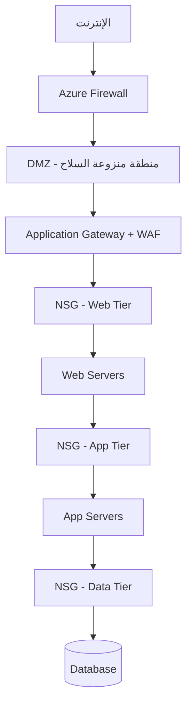

# أمن الشبكات والجدران النارية

> "الشبكة غير المحمية هي دعوة مفتوحة للهجوم. كل بورت مفتوح هو باب خلفي."

## 🎯 أهداف التعلم

- فهم أنواع Firewalls واستخداماتها
- تكوين Azure NSG عملياً
- تصميم Network Segmentation مع DMZ
- حماية تطبيقات الويب بـ WAF
- استكشاف هجمات الشبكة الشائعة

## ⏱️ الوقت المقدر: 45 دقيقة | المستوى: Intermediate

---

## 🧠 الطبقة البسيطة: تشبيه

تخيل مبنى حكومياً. هناك:
- **بوابة خارجية** (Firewall): تفحص كل من يدخل
- **حارس أمن** (NSG): يتحقق من هوية كل شخص عند كل باب
- **كاميرات مراقبة** (Network Watcher): تسجل كل الحركة
- **قائمة الممنوعين** (IP Blocking): تمنع المشبوهين

---

## 🏗️ الطبقة الأساسية

### أنواع الحماية



### Azure NSG — Network Security Group

```bash
# إنشاء NSG
az network nsg create \
  --resource-group cloudnova-prod \
  --name web-tier-nsg \
  --location westeurope

# قاعدة: السماح بـ HTTPS فقط من الإنترنت
az network nsg rule create \
  --resource-group cloudnova-prod \
  --nsg-name web-tier-nsg \
  --name AllowHTTPS \
  --priority 100 \
  --direction Inbound \
  --source-address-prefixes Internet \
  --destination-port-ranges 443 \
  --access Allow \
  --protocol Tcp

# قاعدة: رفض كل شيء آخر (Deny All - ضمني في Azure)
# الأولويات: 100-4096 (الأقل = الأعلى أولوية)

# قاعدة: السماح بـ SSH من مكتب CloudNova فقط
az network nsg rule create \
  --resource-group cloudnova-prod \
  --nsg-name web-tier-nsg \
  --name AllowSSH \
  --priority 200 \
  --direction Inbound \
  --source-address-prefixes 203.0.113.0/24 \
  --destination-port-ranges 22 \
  --access Allow \
  --protocol Tcp
```

### WAF — Web Application Firewall

| الهجوم | كيف يحمي WAF |
|--------|-------------|
| **SQL Injection** | يفحص الـ payloads عن أنماط SQL |
| **XSS** | يمنع `<script>` tags في الـ inputs |
| **DDoS** | Rate limiting لكل IP |
| **Bot attacks** | Bot detection rules |

```bash
# Azure WAF Policy — منع SQL Injection
az network application-gateway waf-policy create \
  --name cloudnova-waf \
  --resource-group cloudnova-prod

# تفعيل managed rule set (OWASP Top 10)
az network application-gateway waf-policy managed-rule set add \
  --policy-name cloudnova-waf \
  --resource-group cloudnova-prod \
  --type OWASP \
  --version 3.2
```

---

## 🏛️ طبقة الإنتاج

### سيناريو CloudNova: هجوم DDoS

الجمعة 11 مساءً. فجأة:
1. **التنبيه**: 500,000 request/sec على الـ API (الطبيعي: 2,000/sec)
2. **الاستجابة**: Azure DDoS Protection Standard تفعّل تلقائياً
3. **التحقيق**: الـ traffic من 50,000 IP موزع عالمياً — Botnet
4. **الإجراء**: WAF rate limiting + Geo-blocking للدول المشبوهة
5. **الدرس**: DDoS Protection Standard ليس ترفاً، إنه ضرورة

### أفضل الممارسات

1. **مبدأ Zero Trust**: لا تثق بأي شيء افتراضياً
2. **Network Segmentation**: 3 tiers على الأقل (Web/App/Data)
3. **Just-In-Time Access**: افتح البورتات فقط عند الحاجة
4. **Logging**: كل شيء مسجل في Azure Monitor + Sentinel

---

## 🎨 طبقة المعماري

### متى تستخدم ماذا؟

| السيناريو | الحل |
|-----------|------|
| حماية بين الـ subnets | NSG |
| حماية محيط الشبكة | Azure Firewall |
| حماية تطبيقات الويب | WAF (App Gateway / Front Door) |
| حماية من DDoS | Azure DDoS Protection Standard |
| فحص SSL/TLS العميق | Azure Firewall Premium (TLS Inspection) |

---

## 🛠️ تدريبات

### تمرين: اكتشف بورتاً مفتوحاً وأغلقه

```bash
# افحص الشبكة
nmap -sV cloudnova-api.westeurope.cloudapp.azure.com

# إذا وجدت port 22 مفتوحاً للإنترنت، أغلقه عبر NSG
az network nsg rule delete \
  --resource-group cloudnova-prod \
  --nsg-name web-tier-nsg \
  --name AllowSSH
```

### تحدي: صمم DMZ لـ CloudNova

صمم network architecture مع:
- DMZ للأجهزة المواجهة للإنترنت
- Web Tier (NSG: 443 فقط)
- App Tier (NSG: من Web Tier فقط)
- Data Tier (NSG: من App Tier فقط، 1433 SQL)
- Azure Firewall للـ outbound filtering

---

## 📝 تقييم

### ✅ فحص المعرفة
1. ما الفرق بين NSG و Azure Firewall؟
2. لماذا Network Segmentation مهم؟
3. متى تستخدم WAF؟

### 📝 اختبار
1. **أي priority هو الأعلى في Azure NSG؟** → 100 (الأقل رقماً)
2. **هل Deny All موجود افتراضياً في Azure NSG؟** → نعم، ضمني

### 🎤 أسئلة مقابلة
1. "كيف تحمي شبكة Azure من الهجمات؟"
2. "صمم network architecture لتطبيق مالي (PCI-DSS)"

---

[← Load Balancing](./03-load-balancing-reverse-proxy) | [→ IAM Fundamentals](../../04-security/01-iam-fundamentals) | [🏠 الرئيسية](/)
