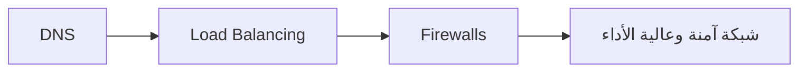

import Tabs from '@theme/Tabs';
import TabItem from '@theme/TabItem';

# 🚀 الشبكات

> DNS، Load Balancing، Firewalls — الشبكة هي العمود الفقري لكل شيء في السحابة.

## 🎯 أهداف التعلم

بعد إكمال هذه الوحدة، ستكون قادراً على:

- [**أساسيات الشبكات**](01-networking-fundamentals) — TCP/IP، Subnets، Routing
- [**DNS بعمق**](02-dns-deep-dive) — كل شيء عن نظام أسماء النطاقات
- [**موازنة الحمل**](03-load-balancing-reverse-proxy) — Azure Load Balancer، Application Gateway
- [**أمن الشبكات**](04-network-security-firewalls) — NSG، ASG، Azure Firewall

## 💡 المهارات التي ستكتسبها

DNS • Load Balancing • Firewalls • VNet Design • Network Security

## 📊 معلومات الوحدة

| العنصر           | القيمة                  |
| ---------------- | ----------------------- |
| **المستوى**      | متوسط                   |
| **الوقت المقدر** | 6 ساعات                 |
| **المتطلبات**    | Linux                   |
| **الشهادات**     | AZ-104, AZ-700          |
| **المشاريع**     | تصميم Hub-Spoke Network |
| **المختبرات**    | —                       |

## 🏛️ مهمة CloudNova

> CloudNova تفتح مكتباً جديداً في سنغافورة. صمم شبكة آمنة تربط المكاتب عبر Azure.

## 🗺️ خريطة الوحدة

## 📖 الدروس

<Tabs>
<TabItem value="all" label="كل الدروس" default>

- [**أساسيات الشبكات**](01-networking-fundamentals) — TCP/IP، Subnets، Routing
- [**DNS بعمق**](02-dns-deep-dive) — كل شيء عن نظام أسماء النطاقات
- [**موازنة الحمل**](03-load-balancing-reverse-proxy) — Azure Load Balancer، Application Gateway
- [**أمن الشبكات**](04-network-security-firewalls) — NSG، ASG، Azure Firewall

</TabItem>
</Tabs>

## 🚀 ابدأ التعلم

[▶️ ابدأ الدرس الأول](01-networking-fundamentals)
