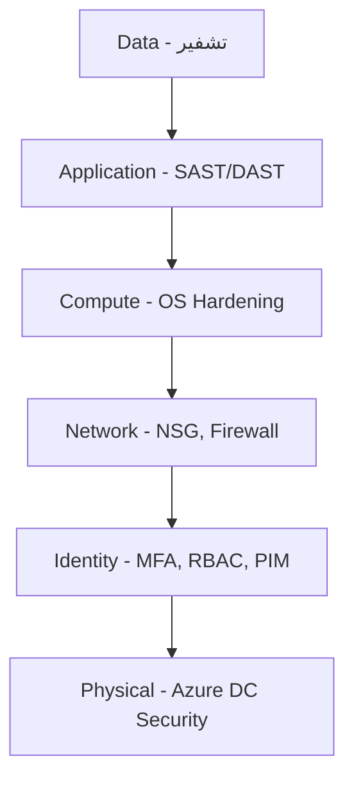

# الأمن في السحابة

> **"الأمان ليس مرحلة أخيرة. إنه جزء من كل طبقة، من أول سطر كود إلى آخر بايت في التخزين."**

## دفاع متعدد الطبقات — Defense in Depth



## Authentication vs Authorization

| المفهوم            | السؤال       | مثال               | أداة Azure    |
| ------------------ | ------------ | ------------------ | ------------- |
| **Authentication** | من أنت؟      | تسجيل دخول، MFA    | Azure AD      |
| **Authorization**  | ماذا تستطيع؟ | الأدوار، الصلاحيات | RBAC          |
| **Auditing**       | ماذا فعلت؟   | سجل النشاطات       | Azure Monitor |

## Principle of Least Privilege

> **لا تُعطِ أحداً أكثر مما يحتاج. أبداً. تحقق كل ٩٠ يوماً.**

```bash
# ❌ خطأ شائع
az role assignment create \
  --assignee developer@cloudnova.com \
  --role "Contributor" \
  --scope /subscriptions/xxx    # الاشتراك كله!

# ✅ الصحيح
az role assignment create \
  --assignee developer@cloudnova.com \
  --role "Contributor" \
  --scope /subscriptions/xxx/resourceGroups/app-dev-rg  # محدد

# ✅ أفضل — أدوار مخصصة
az role definition create --role-definition '{
    "Name": "DevOps Engineer",
    "Description": "Can manage VMs and AKS, cannot touch databases",
    "Actions": [
        "Microsoft.Compute/*",
        "Microsoft.ContainerService/*"
    ],
    "NotActions": [
        "Microsoft.Sql/*"
    ],
    "AssignableScopes": ["/subscriptions/xxx/resourceGroups/app-rg"]
}'
```

## Managed Identity — لا كلمات مرور

```python
# ❌ خطر — كلمات مرور في الكود
# client_secret = "SuperSecret123!"  ← لا تفعل هذا أبداً

# ✅ آمن — Managed Identity
from azure.identity import DefaultAzureCredential

credential = DefaultAzureCredential()
# يحاول بالترتيب:
# ١. Environment Variables (AZURE_CLIENT_ID, etc.)
# ٢. Managed Identity (على Azure VM)
# ٣. Azure CLI (az login)
# ٤. Interactive Browser
```

### لماذا Managed Identity؟

| بدونها                     | معها                 |
| -------------------------- | -------------------- |
| كلمة مرور في الكود ← مسربة | لا كلمة مرور         |
| تجديد الكلمة يدوياً ← منسي | Azure يجدد تلقائياً  |
| مشاركة المفاتيح ← خطيرة    | لكل مورد هوية منفصلة |

## PIM — Just-in-Time Access

بدلاً من صلاحية دائمة مدمرة:

1. المستخدم يطلب تفعيل الدور مع تبرير
2. يمكن اشتراط موافقة مدير
3. الصلاحية تفعّل لمدة محددة (مثلاً ٤ ساعات)
4. تنتهي تلقائياً
5. كل شيء مسجل ومدقق

```bash
# طلب صلاحية Contributor لمدة ٣ ساعات
az role assignment create \
  --assignee oncall@cloudnova.com \
  --role "Contributor" \
  --scope /subscriptions/xxx/resourceGroups/prod-rg \
  --duration PT3H
```

## Conditional Access

```yaml
سياسات الوصول المشروط:
  - الشرط: تسجيل دخول من موقع غير معتاد
    الإجراء: طلب MFA

  - الشرط: جهاز غير مسجل في Intune
    الإجراء: منع الوصول تماماً

  - الشرط: مستخدم له دور Global Admin
    الإجراء: MFA دائماً + جهاز مسجل + موقع معروف

  - الشرط: خطر مرتفع (Azure Identity Protection)
    الإجراء: منع + تنبيه فريق الأمن
```

## Network Security

```bash
# NSG — جدار ناري على مستوى الشبكة
az network nsg rule create \
  --nsg-name cloudnova-nsg \
  --name AllowHttp \
  --priority 100 \
  --direction Inbound \
  --source-address-prefixes Internet \
  --destination-port-ranges 80 443 \
  --access Allow

# قاعدة Whois لـ SSH
az network nsg rule create \
  --nsg-name cloudnova-nsg \
  --name AllowBastionSSH \
  --priority 200 \
  --source-address-prefixes 10.0.0.0/8 \
  --destination-port-ranges 22 \
  --access Allow
```

## سيناريو CloudNova: حذف قاعدة بيانات

> **الموقف:** مطور جديد يحذف قاعدة إنتاج بالخطأ. التحقيق: لديه Contributor على الاشتراك كله.

### كيف نمنع التكرار؟

```bash
# ١. Resource Lock
az lock create \
  --name "prod-db-cant-delete" \
  --lock-type CanNotDelete \
  --resource-group prod-rg \
  --resource-name cloudnova-db

# ٢. RBAC دقيق — ليس Contributor
# دور مخصص: يمكنه إنشاء VMs، لا يمكنه لمس قواعد البيانات

# ٣. PIM — صلاحية الإنتاج مؤقتة فقط

# ٤. Azure Policy — منع حذف الموارد الحرجة
# سياسة: أي Delete على prod-rg يتطلب موافقة

# ٥. Delete Lock + Azure Backup
# حتى لو تم الحذف — النسخة الاحتياطية تنقذك
```

---

[← العودة للوحدة](index.md) | [🏠 الرئيسية](/)
