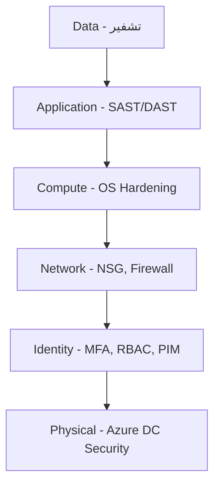
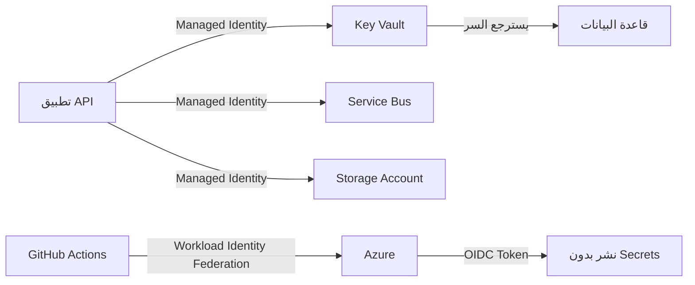

# الأمن في السحابة

> **"الأمان ليس مرحلة أخيرة. إنه جزء من كل طبقة، من أول سطر كود إلى آخر بايت في التخزين."**

## 🎯 أهداف التعلم

بعد إكمال هذا الدرس، ستكون قادراً على:
- تصميم نموذج أمان متعدد الطبقات لمؤسسة حقيقية
- تطبيق RBAC بمستوى دقيق مع أدوار مخصصة
- استخدام Managed Identity بدلاً من كلمات المرور
- تكوين PIM و Conditional Access للوصول المؤقت
- الاستجابة لحادث أمني بمنهجية

---

## ١. دفاع متعدد الطبقات — Defense in Depth

### 🟢 التفسير البسيط

تخيل قلعة من العصور الوسطى. لها خندق (الجدار الناري)، وجسر متحرك (المصادقة)، وحراس عند الأبواب (RBAC)، وخزنة داخل البرج (التشفير). حتى لو عبر المهاجم الخندق، سيجد الجسر. ولو عبر الجسر، سيواجه الحراس. هذه هي فلسفة الدفاع متعدد الطبقات.

### 🔵 التفسير الأساسي



### 🟣 المستوى الإنتاجي — تطبيقها في CloudNova

في CloudNova، كل طبقة لها أدواتها وسياساتها:

| الطبقة | الأداة | السؤال الذي تجيب عليه |
|--------|--------|----------------------|
| **الهوية** | Azure AD + MFA + PIM | "من أنت؟ وهل أنت مخول الآن؟" |
| **الشبكة** | NSG + Azure Firewall + WAF | "من أي عنوان IP؟ وأي منفذ؟" |
| **الحوسبة** | VM Hardening + Antimalware | "هل النظام محدث؟ هل عليه برامج ضارة؟" |
| **التطبيق** | SAST + DAST + Dependency Scan | "هل الكود آمن؟ هل المكتبات محدثة؟" |
| **البيانات** | Encryption at Rest + in Transit | "لو سُرّق القرص، هل البيانات مقروءة؟" |

### 🏛️ مستوى المعماري — Zero Trust

> **"لا تثق بأحد. تحقق من كل شيء. دائماً."**

النموذج التقليدي: "كل من داخل الشبكة موثوق." ← **مات هذا النموذج.**

نموذج Zero Trust الذي تتبناه CloudNova:

```yaml
Zero Trust Principles:
  تحقق صريح:
    - المصادقة دائماً (ليس فقط عند الدخول)
    - التفويض لكل طلب (وليس للجلسة بأكملها)
    - التحقق من صحة الجهاز (هل هو مسجل في Intune؟)
  
  أقل صلاحية:
    - Just-in-Time (صلاحية مؤقتة فقط)
    - Just-Enough-Access (ما يحتاجه فقط، لا أكثر)
  
  افترض الاختراق:
    - راقب كل شيء
    - قسم الشبكة (حتى لو اخترق جزءاً، لا يصل للباقي)
    - شفّر كل البيانات
```

---

## ٢. Authentication vs Authorization — ليسا شيئاً واحداً

| المفهوم | السؤال | مثال | أداة Azure |
|---------|--------|------|------------|
| **Authentication** | من أنت؟ | تسجيل دخول، MFA، بصمة | Azure AD |
| **Authorization** | ماذا تستطيع؟ | الأدوار، الصلاحيات | RBAC |
| **Auditing** | ماذا فعلت؟ | سجل النشاطات | Azure Monitor |

### 🚨 ماذا يحدث عندما تخلط بينهما؟

> **قصة حقيقية من CloudNova:** طُلب من مهندس جديد "صلاحية قراءة سجلات الإنتاج". أُعطي دور Contributor على الاشتراك كله. بعد أسبوعين، حُذفت قاعدة بيانات مراقبة بالخطأ. ساعتين تعطل. $15,000 تكلفة.

الخطأ: **Authentication** نجح (نعرف من هو)، لكن **Authorization** كان فضفاضاً جداً.

---

## ٣. Principle of Least Privilege — بعمق

> **"لا تُعطِ أحداً أكثر مما يحتاج. أبداً. تحقق كل ٩٠ يوماً."**

### 🔴 الخطأ الشائع — وحش الـ Contributor

```bash
# ❌ هذا يحدث كل يوم في شركات حقيقية
az role assignment create \
  --assignee developer@cloudnova.com \
  --role "Contributor" \
  --scope /subscriptions/xxx    # الاشتراك كله!
# ← هذا المهندس يستطيع حذف أي شيء في أي مجموعة موارد
```

### 🟢 الصحيح — نطاق محدد

```bash
az role assignment create \
  --assignee developer@cloudnova.com \
  --role "Contributor" \
  --scope /subscriptions/xxx/resourceGroups/app-dev-rg  # محدد
```

### 🟣 الأفضل — أدوار مخصصة

```bash
az role definition create --role-definition '{
    "Name": "DevOps Engineer - CloudNova",
    "Description": "Can manage VMs, AKS, and read logs. Cannot touch databases or networking.",
    "Actions": [
        "Microsoft.Compute/virtualMachines/*",
        "Microsoft.ContainerService/managedClusters/*",
        "Microsoft.Insights/*/read"
    ],
    "NotActions": [
        "Microsoft.Sql/*",
        "Microsoft.Network/virtualNetworks/*",
        "Microsoft.Resources/subscriptions/resourceGroups/delete"
    ],
    "AssignableScopes": ["/subscriptions/xxx/resourceGroups/app-rg"]
}'
```

### 📊 مصفوفة الصلاحيات في CloudNova

| الدور | يستطيع | لا يستطيع | مدة الصلاحية |
|-------|--------|-----------|-------------|
| Jr Engineer | قراءة كل شيء، كتابة في dev فقط | تعديل الإنتاج | دائمة |
| DevOps Engineer | إدارة VMs + AKS + قراءة السجلات | لمس قواعد البيانات | PIM: تفعيل ٤ ساعات |
| DBA | إدارة SQL + PostgreSQL | لمس الشبكة أو VMs | PIM: تفعيل ٨ ساعات |
| Security Admin | قراءة كل السجلات + إدارة السياسات | تعديل الموارد | PIM: تفعيل ٢ ساعة |

---

## ٤. Managed Identity — عصر بلا كلمات مرور

### 🟢 التفسير البسيط

بدلاً من أن تحمل مفتاحاً (كلمة مرور) قد يُسرق، كل تطبيق له "بطاقة هوية" تتعرف Azure عليها تلقائياً. لا أحد يستطيع سرقة بطاقة هويتك لأنها ليست شيئاً مادياً يُحمل.

### 🔵 الأساسيات

```python
# ❌ خطر — كلمات مرور في الكود
# client_secret = "SuperSecret123!"  ← لا تفعل هذا أبداً
# حتى لو أزلتها لاحقاً → موجودة في تاريخ git!

# ✅ آمن — Managed Identity
from azure.identity import DefaultAzureCredential

credential = DefaultAzureCredential()
# يحاول بالترتيب:
# ١. Environment Variables (AZURE_CLIENT_ID, etc.)
# ٢. Managed Identity (على Azure VM — الأفضل)
# ٣. Azure CLI (az login — للتطوير المحلي)
# ٤. Interactive Browser (آخر خيار)
```

### 🟣 الإنتاج — نظام الهوية الكامل في CloudNova



| بدون Managed Identity | مع Managed Identity |
|----------------------|---------------------|
| كلمة مرور في الكود ← مسربة في git | لا كلمة مرور |
| تجديد الكلمة يدوياً ← يُنسى غالباً | Azure يجدد تلقائياً كل ٤٦ ساعة |
| مشاركة المفاتيح بين الفريق ← خطيرة | كل مورد له هويته الخاصة |
| تدوير المفاتيح = تعطل مؤقت | لا تعطّل — الهوية ثابتة |

### 🚨 حادثة CloudNova: كلمة مرور مسربة

> **الموقف:** مهندس نشر كلمة مرور Storage Account في مستودع GitHub عام. في أقل من ٤ دقائق، بوتات مسح GitHub التقطت المفتاح. بعد ٧ دقائق، شخص مجهول بدأ تحميل بيانات من الحاوية.

**الجدول الزمني للكارثة:**

| الوقت | الحدث |
|-------|-------|
| 14:03 | Push إلى GitHub (نسي .env في commit) |
| 14:07 | بوت GitHub يمسح commits جديدة — يلتقط المفتاح |
| 14:10 | أول access غير مصرح به على Storage Account |
| 14:15 | بدأ تحميل ٥٠٠٠٠ سجل عميل |
| 14:22 | الفريق لاحظ تنبيهاً (Alert على anonymous access) |
| 14:23 | تدوير المفتاح فوراً — توقف التسريب |

**الدروس المستفادة:**
1. **Managed Identity** كانت ستمنع الكارثة — لا يوجد مفتاح ليُسرق
2. **git-secrets scanner** على CI/CD كان سيكتشف المفتاح قبل push
3. **Alert rules** يجب أن تكون على كل حاوية تخزين

---

## ٥. PIM — Just-in-Time Access

> **"الصلاحية الدائمة هي كارثة مؤجلة."**

### كيف يعمل PIM في CloudNova؟

```yaml
سيناريو: مهندس on-call يحتاج Contributor على الإنتاج

الخطوات:
  ١. يفتح Azure Portal → PIM → طلب تفعيل دور
  ٢. يختار المدة: ٣ ساعات (كافية للحادثة)
  ٣. يكتب التبرير: "Ticket #4521 - DB connection pool exhausted"
  ٤. يحتاج موافقة مدير إذا كانت المدة > ٤ ساعات
  ٥. بعد الموافقة: الصلاحية مفعّلة لمدة ٣ ساعات بالضبط
  ٦. بعد ٣ ساعات: الصلاحية تنتهي تلقائياً
  ٧. كل شيء مسجل ومدقق: من طلب، متى، لماذا، ماذا فعل
```

```bash
# طلب صلاحية Contributor لمدة ٣ ساعات
az role assignment create \
  --assignee oncall@cloudnova.com \
  --role "Contributor" \
  --scope /subscriptions/xxx/resourceGroups/prod-rg \
  --duration PT3H
```

---

## ٦. Conditional Access — سياق الوصول

```yaml
سياسات الوصول المشروط في CloudNova:
  
  Base Protection (كل المستخدمين):
    - الشرط: تسجيل دخول من موقع غير معتاد
      الإجراء: طلب MFA إجباري
    - الشرط: جهاز غير مسجل في Intune
      الإجراء: منع الوصول تماماً
    - الشرط: خطر مرتفع من Azure Identity Protection
      الإجراء: منع + تنبيه فريق SOC
  
  Privileged Accounts (المسؤولين):
    - الشرط: أي وصول لدور Global Admin
      الإجراء: MFA + جهاز مسجل + موقع معروف + موافقة ثانية
    - الشرط: خارج ساعات العمل
      الإجراء: اشتراط تبرير + مدير موافق
  
  Guest Users:
    - الشرط: أي وصول
      الإجراء: MFA + مراجعة شهرية للصلاحية
```

---

## ٧. Network Security — جدران الحماية الذكية

```bash
# NSG — جدار ناري على مستوى الشبكة
az network nsg rule create \
  --nsg-name cloudnova-nsg \
  --name AllowHttp \
  --priority 100 \
  --direction Inbound \
  --source-address-prefixes Internet \
  --destination-port-ranges 80 443 \
  --access Allow

# قاعدة SSH — فقط من شبكة Bastion
az network nsg rule create \
  --nsg-name cloudnova-nsg \
  --name AllowBastionSSH \
  --priority 200 \
  --source-address-prefixes 10.0.0.0/8 \
  --destination-port-ranges 22 \
  --access Allow

# ❌ لا تفعل هذا أبداً:
# --source-address-prefixes "*" --destination-port-ranges 22
```

---

## ٨. سيناريو CloudNova المتكامل: حذف قاعدة بيانات الإنتاج

> **الموقف:** مطور جديد (انضم الأسبوع الماضي) يحذف قاعدة بيانات الإنتاج بالخطأ. التحقيق: لديه Contributor على الاشتراك كله — ليس خطأه، خطأ من أعطاه الصلاحية.

### التحقيق — 5 Why's

1. **لماذا استطاع حذف قاعدة البيانات؟** ← كان لديه Contributor على الاشتراك
2. **لماذا كان لديه Contributor على الاشتراك؟** ← مديره طلب "صلاحية كاملة" للفريق
3. **لماذا طلب المدير صلاحية كاملة؟** ← لا توجد أدوار مخصصة جاهزة للفريق
4. **لماذا لا توجد أدوار مخصصة؟** ← لم يُستثمر وقت في تصميم RBAC
5. **لماذا لم يُستثمر وقت؟** ← لا توجد سياسة أمان مكتوبة تُلزم بذلك

### خطة الوقاية — Pancake Stack Defense

```bash
# 🥞 الطبقة ١: Resource Lock
az lock create \
  --name "prod-db-cant-delete" \
  --lock-type CanNotDelete \
  --resource-group prod-rg \
  --resource-name cloudnova-db

# 🥞 الطبقة ٢: RBAC دقيق
# أدوار مخصصة — لا أحد لديه Contributor على الاشتراك

# 🥞 الطبقة ٣: PIM
# صلاحية الإنتاج مؤقتة فقط — تفعيل ٤ ساعات كحد أقصى

# 🥞 الطبقة ٤: Azure Policy
# سياسة: أي Delete على prod-rg يتطلب موافقة مدير
az policy definition create \
  --name "deny-prod-resource-deletion" \
  --rules '{
    "if": {
      "field": "type",
      "equals": "Microsoft.Resources/subscriptions/resourceGroups"
    },
    "then": { "effect": "deny" }
  }'

# 🥞 الطبقة ٥: Delete Lock + Azure Backup
# حتى لو نجح الحذف — النسخة الاحتياطية تنقذك
# Recovery Point Objective = ٥ دقائق
# Recovery Time Objective = ١٥ دقيقة
```

### 📊 تكلفة الحادثة vs تكلفة الوقاية

| البند | بدون حماية | مع حماية |
|-------|-----------|---------|
| وقت التعطل | ساعتين | ١٥ دقيقة |
| تكلفة التعطل | $15,000 | $1,875 |
| بيانات مفقودة | ٤ ساعات | ٥ دقائق |
| سمعة | تضررت | لم تتأثر |
| تكلفة الحماية | $0 | ~$500/شهر |

---

## 🧠 أسئلة للمراجعة النشطة (Active Recall)

1. ما الفرق بين Authentication و Authorization؟ أعط مثالاً من حياتك اليومية.
2. لماذا Managed Identity أكثر أماناً من Service Principal secrets؟
3. كيف يمنع PIM كارثة "الموظف المغادر"؟
4. صِف ٥ طبقات الدفاع المتعدد — وماذا يحدث لو فشلت إحداها؟
5. ماذا تعني Zero Trust؟ كيف تختلف عن النموذج التقليدي؟

## ✍️ تمرين Feynman

اشرح مفهوم "Least Privilege" لشخص غير تقني. استخدم تشبيهاً من الحياة اليومية (مبنى، فندق، مستشفى...). يجب أن يفهم لماذا "الصلاحية الكاملة للجميع" فكرة سيئة.

## 🎴 بطاقات مراجعة

| السؤال | الإجابة |
|--------|---------|
| أداة Azure لإدارة الهوية | Azure Active Directory (Azure AD) |
| الفرق بين RBAC و PIM | RBAC: ماذا تستطيع. PIM: متى تستطيع |
| ما هو Managed Identity؟ | هوية Azure تلقائية للموارد — بلا كلمات مرور |
| كم مرة تتجدد شهادة Managed Identity؟ | كل ٤٦ ساعة تلقائياً |

## 🎤 أسئلة مقابلة العمل

1. **"كيف تؤمن وصول المهندسين إلى بيئة الإنتاج؟"** ← اشرح PIM + Conditional Access + audit logging
2. **"ما الفرق بين NSG و Azure Firewall؟"** ← NSG: طبقة ٤. Firewall: طبقة ٧ مع threat intelligence
3. **"كيف تمنع تسرب أسرار cloud من مستودع git؟"** ← Managed Identity + git-secrets scanner + Key Vault

---

[← العودة للوحدة](01-iam-fundamentals) | [🏠 الرئيسية](/)
