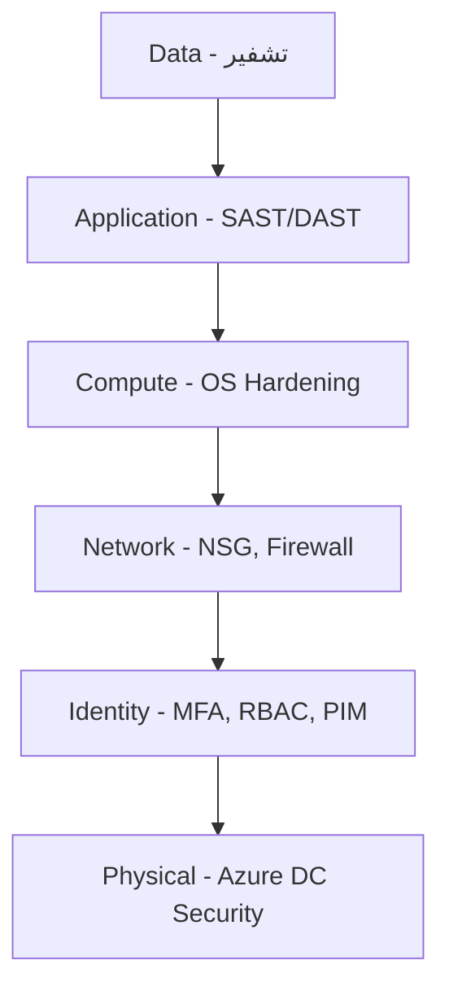
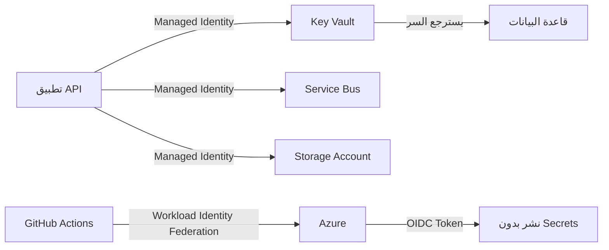
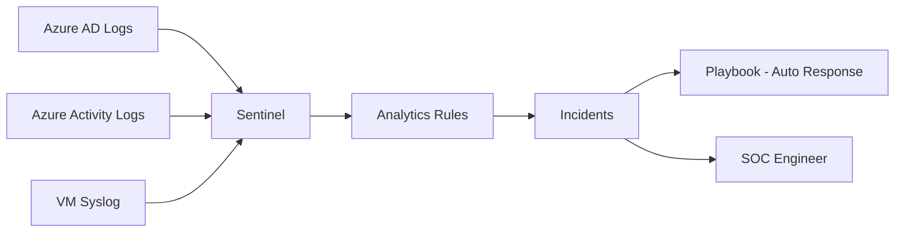

# الأمن في السحابة

> **"الأمان ليس مرحلة أخيرة. إنه جزء من كل طبقة، من أول سطر كود إلى آخر بايت في التخزين."**

## 🎯 أهداف التعلم

بعد إكمال هذا الدرس، ستكون قادراً على:

- تصميم نموذج أمان متعدد الطبقات لمؤسسة حقيقية
- تطبيق RBAC بمستوى دقيق مع أدوار مخصصة
- استخدام Managed Identity بدلاً من كلمات المرور
- تكوين PIM و Conditional Access للوصول المؤقت
- الاستجابة لحادث أمني بمنهجية

---

## ١. دفاع متعدد الطبقات — Defense in Depth

### 🟢 التفسير البسيط

تخيل قلعة من العصور الوسطى. لها خندق (الجدار الناري)، وجسر متحرك (المصادقة)، وحراس عند الأبواب (RBAC)، وخزنة داخل البرج (التشفير). حتى لو عبر المهاجم الخندق، سيجد الجسر. ولو عبر الجسر، سيواجه الحراس. هذه هي فلسفة الدفاع متعدد الطبقات.

### 🔵 التفسير الأساسي



### 🟣 المستوى الإنتاجي — تطبيقها في CloudNova

في CloudNova، كل طبقة لها أدواتها وسياساتها:

| الطبقة       | الأداة                          | السؤال الذي تجيب عليه                 |
| ------------ | ------------------------------- | ------------------------------------- |
| **الهوية**   | Azure AD + MFA + PIM            | "من أنت؟ وهل أنت مخول الآن؟"          |
| **الشبكة**   | NSG + Azure Firewall + WAF      | "من أي عنوان IP؟ وأي منفذ؟"           |
| **الحوسبة**  | VM Hardening + Antimalware      | "هل النظام محدث؟ هل عليه برامج ضارة؟" |
| **التطبيق**  | SAST + DAST + Dependency Scan   | "هل الكود آمن؟ هل المكتبات محدثة؟"    |
| **البيانات** | Encryption at Rest + in Transit | "لو سُرّق القرص، هل البيانات مقروءة؟" |

### 🏛️ مستوى المعماري — Zero Trust

> **"لا تثق بأحد. تحقق من كل شيء. دائماً."**

النموذج التقليدي: "كل من داخل الشبكة موثوق." ← **مات هذا النموذج.**

نموذج Zero Trust الذي تتبناه CloudNova:

```yaml
Zero Trust Principles:
  تحقق صريح:
    - المصادقة دائماً (ليس فقط عند الدخول)
    - التفويض لكل طلب (وليس للجلسة بأكملها)
    - التحقق من صحة الجهاز (هل هو مسجل في Intune؟)

  أقل صلاحية:
    - Just-in-Time (صلاحية مؤقتة فقط)
    - Just-Enough-Access (ما يحتاجه فقط، لا أكثر)

  افترض الاختراق:
    - راقب كل شيء
    - قسم الشبكة (حتى لو اخترق جزءاً، لا يصل للباقي)
    - شفّر كل البيانات
```

---

## ٢. Authentication vs Authorization — ليسا شيئاً واحداً

| المفهوم            | السؤال       | مثال                  | أداة Azure    |
| ------------------ | ------------ | --------------------- | ------------- |
| **Authentication** | من أنت؟      | تسجيل دخول، MFA، بصمة | Azure AD      |
| **Authorization**  | ماذا تستطيع؟ | الأدوار، الصلاحيات    | RBAC          |
| **Auditing**       | ماذا فعلت؟   | سجل النشاطات          | Azure Monitor |

### 🚨 ماذا يحدث عندما تخلط بينهما؟

> **قصة حقيقية من CloudNova:** طُلب من مهندس جديد "صلاحية قراءة سجلات الإنتاج". أُعطي دور Contributor على الاشتراك كله. بعد أسبوعين، حُذفت قاعدة بيانات مراقبة بالخطأ. ساعتين تعطل. $15,000 تكلفة.

الخطأ: **Authentication** نجح (نعرف من هو)، لكن **Authorization** كان فضفاضاً جداً.

---

## ٣. Principle of Least Privilege — بعمق

> **"لا تُعطِ أحداً أكثر مما يحتاج. أبداً. تحقق كل ٩٠ يوماً."**

### 🔴 الخطأ الشائع — وحش الـ Contributor

```bash
# ❌ هذا يحدث كل يوم في شركات حقيقية
az role assignment create \
  --assignee developer@cloudnova.com \
  --role "Contributor" \
  --scope /subscriptions/xxx    # الاشتراك كله!
# ← هذا المهندس يستطيع حذف أي شيء في أي مجموعة موارد
```

### 🟢 الصحيح — نطاق محدد

```bash
az role assignment create \
  --assignee developer@cloudnova.com \
  --role "Contributor" \
  --scope /subscriptions/xxx/resourceGroups/app-dev-rg  # محدد
```

### 🟣 الأفضل — أدوار مخصصة

```bash
az role definition create --role-definition '{
    "Name": "DevOps Engineer - CloudNova",
    "Description": "Can manage VMs, AKS, and read logs. Cannot touch databases or networking.",
    "Actions": [
        "Microsoft.Compute/virtualMachines/*",
        "Microsoft.ContainerService/managedClusters/*",
        "Microsoft.Insights/*/read"
    ],
    "NotActions": [
        "Microsoft.Sql/*",
        "Microsoft.Network/virtualNetworks/*",
        "Microsoft.Resources/subscriptions/resourceGroups/delete"
    ],
    "AssignableScopes": ["/subscriptions/xxx/resourceGroups/app-rg"]
}'
```

### 📊 مصفوفة الصلاحيات في CloudNova

| الدور           | يستطيع                            | لا يستطيع          | مدة الصلاحية       |
| --------------- | --------------------------------- | ------------------ | ------------------ |
| Jr Engineer     | قراءة كل شيء، كتابة في dev فقط    | تعديل الإنتاج      | دائمة              |
| DevOps Engineer | إدارة VMs + AKS + قراءة السجلات   | لمس قواعد البيانات | PIM: تفعيل ٤ ساعات |
| DBA             | إدارة SQL + PostgreSQL            | لمس الشبكة أو VMs  | PIM: تفعيل ٨ ساعات |
| Security Admin  | قراءة كل السجلات + إدارة السياسات | تعديل الموارد      | PIM: تفعيل ٢ ساعة  |

---

## ٤. Managed Identity — عصر بلا كلمات مرور

### 🟢 التفسير البسيط

بدلاً من أن تحمل مفتاحاً (كلمة مرور) قد يُسرق، كل تطبيق له "بطاقة هوية" تتعرف Azure عليها تلقائياً. لا أحد يستطيع سرقة بطاقة هويتك لأنها ليست شيئاً مادياً يُحمل.

### 🔵 الأساسيات

```python
# ❌ خطر — كلمات مرور في الكود
# client_secret = "SuperSecret123!"  ← لا تفعل هذا أبداً
# حتى لو أزلتها لاحقاً → موجودة في تاريخ git!

# ✅ آمن — Managed Identity
from azure.identity import DefaultAzureCredential

credential = DefaultAzureCredential()
# يحاول بالترتيب:
# ١. Environment Variables (AZURE_CLIENT_ID, etc.)
# ٢. Managed Identity (على Azure VM — الأفضل)
# ٣. Azure CLI (az login — للتطوير المحلي)
# ٤. Interactive Browser (آخر خيار)
```

### 🟣 الإنتاج — نظام الهوية الكامل في CloudNova



| بدون Managed Identity              | مع Managed Identity            |
| ---------------------------------- | ------------------------------ |
| كلمة مرور في الكود ← مسربة في git  | لا كلمة مرور                   |
| تجديد الكلمة يدوياً ← يُنسى غالباً | Azure يجدد تلقائياً كل ٤٦ ساعة |
| مشاركة المفاتيح بين الفريق ← خطيرة | كل مورد له هويته الخاصة        |
| تدوير المفاتيح = تعطل مؤقت         | لا تعطّل — الهوية ثابتة        |

### 🚨 حادثة CloudNova: كلمة مرور مسربة

> **الموقف:** مهندس نشر كلمة مرور Storage Account في مستودع GitHub عام. في أقل من ٤ دقائق، بوتات مسح GitHub التقطت المفتاح. بعد ٧ دقائق، شخص مجهول بدأ تحميل بيانات من الحاوية.

**الجدول الزمني للكارثة:**

| الوقت | الحدث                                            |
| ----- | ------------------------------------------------ |
| 14:03 | Push إلى GitHub (نسي .env في commit)             |
| 14:07 | بوت GitHub يمسح commits جديدة — يلتقط المفتاح    |
| 14:10 | أول access غير مصرح به على Storage Account       |
| 14:15 | بدأ تحميل ٥٠٠٠٠ سجل عميل                         |
| 14:22 | الفريق لاحظ تنبيهاً (Alert على anonymous access) |
| 14:23 | تدوير المفتاح فوراً — توقف التسريب               |

**الدروس المستفادة:**

1. **Managed Identity** كانت ستمنع الكارثة — لا يوجد مفتاح ليُسرق
2. **git-secrets scanner** على CI/CD كان سيكتشف المفتاح قبل push
3. **Alert rules** يجب أن تكون على كل حاوية تخزين

---

## ٥. PIM — Just-in-Time Access

> **"الصلاحية الدائمة هي كارثة مؤجلة."**

### كيف يعمل PIM في CloudNova؟

```yaml
سيناريو: مهندس on-call يحتاج Contributor على الإنتاج

الخطوات:
  ١. يفتح Azure Portal → PIM → طلب تفعيل دور
  ٢. يختار المدة: ٣ ساعات (كافية للحادثة)
  ٣. يكتب التبرير: "Ticket #4521 - DB connection pool exhausted"
  ٤. يحتاج موافقة مدير إذا كانت المدة > ٤ ساعات
  ٥. بعد الموافقة: الصلاحية مفعّلة لمدة ٣ ساعات بالضبط
  ٦. بعد ٣ ساعات: الصلاحية تنتهي تلقائياً
  ٧. كل شيء مسجل ومدقق: من طلب، متى، لماذا، ماذا فعل
```

```bash
# طلب صلاحية Contributor لمدة ٣ ساعات
az role assignment create \
  --assignee oncall@cloudnova.com \
  --role "Contributor" \
  --scope /subscriptions/xxx/resourceGroups/prod-rg \
  --duration PT3H
```

---

## ٦. Conditional Access — سياق الوصول

```yaml
سياسات الوصول المشروط في CloudNova:
  Base Protection (كل المستخدمين):
    - الشرط: تسجيل دخول من موقع غير معتاد
      الإجراء: طلب MFA إجباري
    - الشرط: جهاز غير مسجل في Intune
      الإجراء: منع الوصول تماماً
    - الشرط: خطر مرتفع من Azure Identity Protection
      الإجراء: منع + تنبيه فريق SOC

  Privileged Accounts (المسؤولين):
    - الشرط: أي وصول لدور Global Admin
      الإجراء: MFA + جهاز مسجل + موقع معروف + موافقة ثانية
    - الشرط: خارج ساعات العمل
      الإجراء: اشتراط تبرير + مدير موافق

  Guest Users:
    - الشرط: أي وصول
      الإجراء: MFA + مراجعة شهرية للصلاحية
```

---

## ٧. Network Security — جدران الحماية الذكية

```bash
# NSG — جدار ناري على مستوى الشبكة
az network nsg rule create \
  --nsg-name cloudnova-nsg \
  --name AllowHttp \
  --priority 100 \
  --direction Inbound \
  --source-address-prefixes Internet \
  --destination-port-ranges 80 443 \
  --access Allow

# قاعدة SSH — فقط من شبكة Bastion
az network nsg rule create \
  --nsg-name cloudnova-nsg \
  --name AllowBastionSSH \
  --priority 200 \
  --source-address-prefixes 10.0.0.0/8 \
  --destination-port-ranges 22 \
  --access Allow

# ❌ لا تفعل هذا أبداً:
# --source-address-prefixes "*" --destination-port-ranges 22
```

---

## ٨. سيناريو CloudNova المتكامل: حذف قاعدة بيانات الإنتاج

> **الموقف:** مطور جديد (انضم الأسبوع الماضي) يحذف قاعدة بيانات الإنتاج بالخطأ. التحقيق: لديه Contributor على الاشتراك كله — ليس خطأه، خطأ من أعطاه الصلاحية.

### التحقيق — 5 Why's

1. **لماذا استطاع حذف قاعدة البيانات؟** ← كان لديه Contributor على الاشتراك
2. **لماذا كان لديه Contributor على الاشتراك؟** ← مديره طلب "صلاحية كاملة" للفريق
3. **لماذا طلب المدير صلاحية كاملة؟** ← لا توجد أدوار مخصصة جاهزة للفريق
4. **لماذا لا توجد أدوار مخصصة؟** ← لم يُستثمر وقت في تصميم RBAC
5. **لماذا لم يُستثمر وقت؟** ← لا توجد سياسة أمان مكتوبة تُلزم بذلك

### خطة الوقاية — Pancake Stack Defense

```bash
# 🥞 الطبقة ١: Resource Lock
az lock create \
  --name "prod-db-cant-delete" \
  --lock-type CanNotDelete \
  --resource-group prod-rg \
  --resource-name cloudnova-db

# 🥞 الطبقة ٢: RBAC دقيق
# أدوار مخصصة — لا أحد لديه Contributor على الاشتراك

# 🥞 الطبقة ٣: PIM
# صلاحية الإنتاج مؤقتة فقط — تفعيل ٤ ساعات كحد أقصى

# 🥞 الطبقة ٤: Azure Policy
# سياسة: أي Delete على prod-rg يتطلب موافقة مدير
az policy definition create \
  --name "deny-prod-resource-deletion" \
  --rules '{
    "if": {
      "field": "type",
      "equals": "Microsoft.Resources/subscriptions/resourceGroups"
    },
    "then": { "effect": "deny" }
  }'

# 🥞 الطبقة ٥: Delete Lock + Azure Backup
# حتى لو نجح الحذف — النسخة الاحتياطية تنقذك
# Recovery Point Objective = ٥ دقائق
# Recovery Time Objective = ١٥ دقيقة
```

### 📊 تكلفة الحادثة vs تكلفة الوقاية

| البند         | بدون حماية | مع حماية  |
| ------------- | ---------- | --------- |
| وقت التعطل    | ساعتين     | ١٥ دقيقة  |
| تكلفة التعطل  | $15,000    | $1,875    |
| بيانات مفقودة | ٤ ساعات    | ٥ دقائق   |
| سمعة          | تضررت      | لم تتأثر  |
| تكلفة الحماية | $0         | ~$500/شهر |

---

## 🧠 أسئلة للمراجعة النشطة (Active Recall)

1. ما الفرق بين Authentication و Authorization؟ أعط مثالاً من حياتك اليومية.
2. لماذا Managed Identity أكثر أماناً من Service Principal secrets؟
3. كيف يمنع PIM كارثة "الموظف المغادر"؟
4. صِف ٥ طبقات الدفاع المتعدد — وماذا يحدث لو فشلت إحداها؟
5. ماذا تعني Zero Trust؟ كيف تختلف عن النموذج التقليدي؟

## ✍️ تمرين Feynman

اشرح مفهوم "Least Privilege" لشخص غير تقني. استخدم تشبيهاً من الحياة اليومية (مبنى، فندق، مستشفى...). يجب أن يفهم لماذا "الصلاحية الكاملة للجميع" فكرة سيئة.

## 🎴 بطاقات مراجعة

| السؤال                               | الإجابة                                     |
| ------------------------------------ | ------------------------------------------- |
| أداة Azure لإدارة الهوية             | Azure Active Directory (Azure AD)           |
| الفرق بين RBAC و PIM                 | RBAC: ماذا تستطيع. PIM: متى تستطيع          |
| ما هو Managed Identity؟              | هوية Azure تلقائية للموارد — بلا كلمات مرور |
| كم مرة تتجدد شهادة Managed Identity؟ | كل ٤٦ ساعة تلقائياً                         |

## 🎤 أسئلة مقابلة العمل

1. **"كيف تؤمن وصول المهندسين إلى بيئة الإنتاج؟"** ← اشرح PIM + Conditional Access + audit logging
2. **"ما الفرق بين NSG و Azure Firewall؟"** ← NSG: طبقة ٤. Firewall: طبقة ٧ مع threat intelligence
3. **"كيف تمنع تسرب أسرار cloud من مستودع git؟"** ← Managed Identity + git-secrets scanner + Key Vault

---

---

## 🏛️ الطبقة الإنتاجية: أمان الإنتاج

### Security Operations Center (SOC) — كيف تراقب الأمان



```kusto
// Sentinel: كشف محاولات اختراق — أكثر من 5 محاولات فاشلة في 5 دقائق
SigninLogs
| where ResultType == "50057"  // User account is disabled
| summarize FailedAttempts = count() by UserPrincipalName, IPAddress, bin(TimeGenerated, 5m)
| where FailedAttempts > 5
| project TimeGenerated, UserPrincipalName, IPAddress, FailedAttempts

// كشف: Global Admin يستخدم صلاحياته
AuditLogs
| where Category == "RoleManagement"
| where OperationName has "Add member to role"
| where TargetResources has "Global Administrator"
| project TimeGenerated, InitiatedBy, TargetResources
```

### Incident Response Automation

```yaml
# Azure Logic App — استجابة تلقائية لحادث أمني
trigger:
  type: "When_a_Sentinel_incident_is_created"

actions:
  # ١. إبلاغ فريق الأمن فوراً
  - send_teams_message:
      channel: "Security-Alerts"
      message: "🚨 New Sentinel Incident: @{triggerBody()?['title']}"

  # ٢. تعطيل المستخدم تلقائياً إذا كان High severity
  - condition:
      if: "@equals(triggerBody()?['severity'], 'High')"
      then:
        - disable_user:
            user_id: "@triggerBody()?['entities'][0]?['userId']"
            reason: "Automated response to High severity incident"
        - revoke_sessions:
            user_id: "@triggerBody()?['entities'][0]?['userId']"

  # ٣. إنشاء ticket في نظام التذاكر
  - create_jira_ticket:
      project: "SEC"
      type: "Incident"
      summary: "Sentinel: @triggerBody()?['title']"
```

### DR للأمان — ماذا لو اختُرقت الحسابات؟

```
خطة طوارئ أمنية — CloudNova:

المرحلة ١: احتواء (أول 15 دقيقة)
├── تعطيل الحساب المخترق
├── إلغاء جميع refresh tokens
├── عزل الـ VM المصابة (NSG: deny all)
└── أخذ snapshot للتحقيق الجنائي

المرحلة ٢: تحقيق (أول 4 ساعات)
├── مراجعة audit logs لآخر 90 يوماً
├── تحديد: ماذا وصل؟ ماذا فعل؟ ماذا سُرق؟
└── تقرير مبدئي للإدارة

المرحلة ٣: استعادة (24-48 ساعة)
├── استعادة من backup نظيف (قبل الاختراق)
├── تدوير كل المفاتيح والشهادات
├── فرض MFA على كل المستخدمين
└── مراجعة كل Conditional Access policies

المرحلة ٤: تحسين (أسبوع)
├── Postmortem مفصل
├── تحديث playbooks
├── تدريب إضافي للفريق
└── Penetration test للتحقق من الإصلاحات
```

---

## 🎨 الطبقة المعمارية: استراتيجيات الأمان المتقدمة

### Zero Trust Architecture — بالتفصيل

```yaml
Zero Trust Implementation في CloudNova:

Pillar 1 — Identity:
  - Azure AD Conditional Access لكل شيء
  - MFA إجباري للجميع
  - Passwordless للـ privileged accounts
  - PIM لكل الأدوار الحساسة

Pillar 2 — Device:
  - Intune enrollment إجباري
  - Compliance policy: disk encryption, antivirus, updates
  - غير compliant = منع الوصول

Pillar 3 — Network:
  - Micro-segmentation: كل تطبيق له subnet معزول
  - Private Endpoints: لا IPs عامة للـ PaaS
  - JIT VM Access: SSH فقط عند الحاجة

Pillar 4 — Application:
  - OAuth2/OIDC لكل API
  - API Management مع rate limiting
  - WAF أمام كل تطبيق ويب

Pillar 5 — Data:
  - Classification: Public, Internal, Confidential, Secret
  - Encryption at rest + in transit + in use
  - DLP policies لمنع تسرب البيانات
  - Customer Lockbox للموافقة على وصول Microsoft
```

### Trade-off: الأمان vs سهولة الاستخدام

```
معضلة كل مهندس أمان:

الخيار A: أمان مشدد
├── MFA لكل طلب (وليس كل جلسة!) ← أمان عالي
├── 5 دقائق session timeout
├── 3 موافقات لأي تغيير في الإنتاج
└── النتيجة: المطورون يبحثون عن طرق التفافية

الخيار B: توازن CloudNova
├── MFA كل 8 ساعات + عند suspicious activity
├── جلسة 4 ساعات (قابلة للتمديد)
├── موافقة واحدة + PIM auto-approval للمهام الروتينية
└── النتيجة: أمان جيد + إنتاجية مقبولة

المبدأ: "Security should be an enabler, not a blocker"
```

### متى لا تستخدم Azure AD؟

```
❌ لا تستخدم Azure AD (واستخدم بديلاً) عندما:

1. تحتاج Identity على Kubernetes فقط:
   → Dex + OIDC provider خفيف الوزن

2. تطبيق B2C بسيط جداً:
   → Auth0 أو Firebase Auth (أبسط بكثير)

3. تحتاج LDAP خالص لخوادم Linux:
   → FreeIPA أو OpenLDAP

4. ميزانيتك لا تتحمل Azure AD Premium P2:
   → استخدم P1 على الأقل — Conditional Access أساسي
   → P2 يضيف: Identity Protection، PIM، Access Reviews
```

### Future: Passwordless + Passkeys

```
2024: بداية Passwordless في CloudNova
2025: 70% من المستخدمين بدون كلمة سر
2026: 100% Passwordless — صفر كلمات سر في المؤسسة

التقنيات:
├── Windows Hello for Business
├── FIDO2 Security Keys (YubiKey)
├── Microsoft Authenticator (phone sign-in)
└── Passkeys (synced via iCloud/Google)

النتيجة:
├── صفر phishing ناجح (لا كلمة سر لتُسرق)
├── 70% أسرع في تسجيل الدخول
└── 90% أقل في طلبات إعادة تعيين كلمة السر
```

---

## 🛠️ تدريبات عملية

### تمرين ١: اكتشف الثغرة

```bash
# لديك هذا الـ role assignment. ما الخطأ؟
az role assignment list \
  --assignee intern@cloudnova.com \
  --output table

# النتيجة:
# Role: Contributor
# Scope: /subscriptions/prod-subscription-id

# المشكلة:
# ١. Contributor على الاشتراك كله!
# ٢. Intern لا يحتاج كتابة في الإنتاج
# ٣. لا PIM — صلاحية دائمة

# الإصلاح:
az role assignment delete \
  --assignee intern@cloudnova.com \
  --scope /subscriptions/prod-subscription-id

az role assignment create \
  --assignee intern@cloudnova.com \
  --role "Reader" \
  --scope /subscriptions/dev-subscription-id
```

### تمرين ٢: كتابة Azure Policy

```json
{
  "mode": "All",
  "policyRule": {
    "if": {
      "allOf": [
        {
          "field": "type",
          "equals": "Microsoft.Storage/storageAccounts"
        },
        {
          "field": "Microsoft.Storage/storageAccounts/supportsHttpsTrafficOnly",
          "equals": "false"
        }
      ]
    },
    "then": {
      "effect": "deny"
    }
  }
}
```

### تحدي: محاكاة تحقيق أمني

```
السيناريو:
- الساعة 2 AM: تنبيه Sentinel
- User: ali@cloudnova.com سجل دخول من Beijing
- ثم: قرأ 500 سجل من قاعدة بيانات العملاء
- ثم: حمّل ملف CSV بحجم 45MB

مهمتك:
1. هل هذا هجوم حقيقي أم إنذار كاذب؟
2. اكتب خطة التحقيق
3. ما الإجراءات الفورية؟

الحل:
1. حقيقي: Ali في إجازة في دبي، وليس Beijing
2. التحقيق: مراجعة sign-in logs، device info، MFA status
3. فوراً: disable account + revoke sessions + begin forensic investigation
```

### CloudNova Project Task

```
مهمتك: بناء نظام أمان متكامل لـ CloudNova

المطلوب:
1. ✓ تصميم RBAC: 5 أدوار مخصصة (Jr, DevOps, DBA, Security, Admin)
2. ✓ PIM: كل الأدوار الحساسة Eligible (وليس Active)
3. ✓ Conditional Access policies:
   - MFA للجميع
   - منع الدول عالية المخاطر
   - منع الأجهزة غير المسجلة
4. ✓ Azure Policies:
   - منع storage accounts بدون HTTPS
   - فرض tags إجبارية
   - منع public IPs على قواعد البيانات
5. ✓ Monitoring:
   - Sentinel + 3 analytics rules
   - Logic App للاستجابة التلقائية
```

---

## 📝 تقييم

### Knowledge Check

1. **ما الفرق بين RBAC و Azure Policy؟**
   <details><summary>الإجابة</summary>RBAC: من يستطيع فعل ماذا (Authorization). Policy: ما هو مسموح أساساً (Governance).</details>

2. **لماذا Managed Identity أكثر أماناً من Service Principal secrets؟**
   <details><summary>الإجابة</summary>لا secrets لتُسرق. Azure يدير التدوير تلقائياً. الهوية مرتبطة بالمورد نفسه.</details>

3. **ما هو PIM ولماذا هو ضروري؟**
   <details><summary>الإجابة</summary>Privileged Identity Management: صلاحيات مؤقتة بدلاً من دائمة. يمنع misuse ويراقب كل activation.</details>

4. **كيف يعمل Conditional Access؟**
   <details><summary>الإجابة</summary>إذا تحقق شرط (موقع، جهاز، خطر) → نفّذ إجراء (MFA، منع، جلسة محدودة).</details>

5. **ما هي مبادئ Zero Trust الثلاثة؟**
   <details><summary>الإجابة</summary>1. تحقق صريح. 2. أقل صلاحية. 3. افترض الاختراق.</details>

### Quiz

1. **أي خدمة Azure لاستضافة مفاتيح التشفير؟**
   a) Azure Sentinel
   b) Azure Key Vault
   c) Azure Policy
   <details><summary>الإجابة</summary>b) Key Vault. يدير secrets, keys, certificates مع HSM.</details>

2. **ما هو JIT VM Access؟**
   a) Just-in-Time — وصول SSH/RDP مؤقت
   b) Java Integration Toolkit
   c) نوع من VMs السريعة
   <details><summary>الإجابة</summary>a) يفتح NSG rule مؤقتاً (حسب الوقت المطلوب) ثم يغلقها تلقائياً.</details>

3. **أي أداة لتحليل security logs في Azure؟**
   a) Azure Monitor
   b) Azure Sentinel
   c) Azure Advisor
   <details><summary>الإجابة</summary>b) Sentinel = SIEM + SOAR. يجمع logs ويحللها ويكتشف threats.</details>

### 5 أسئلة للتذكّر النشط

1. ارسم نموذج الدفاع متعدد الطبقات من ذاكرتك — اذكر أداة Azure لكل طبقة
2. كيف تصمم RBAC لمؤسسة فيها 50 مهندساً و10 تطبيقات؟
3. اشرح كيف تمنع حادثة "تسرب مفتاح من GitHub" باستخدام الأدوات المتاحة
4. ما الفرق بين NSG و Azure Firewall و WAF؟
5. كيف تبني خطة Incident Response متكاملة؟

### ✍️ تمرين Feynman

اشرح لمدير مالي: "لماذا نحتاج P2 license ب $9/شهر لكل مستخدم؟ ما الذي سيمنعه وكيف يوفر علينا المال؟"

### 🎴 بطاقات تعليمية

| 🃏 السؤال                                | 🃏 الإجابة                           |
| ---------------------------------------- | ------------------------------------ |
| أداة إدارة الهوية في Azure               | Azure Active Directory (Entra ID)    |
| الفرق بين Authentication و Authorization | AuthN = من أنت؟ AuthZ = ماذا تستطيع؟ |
| كم مرة تتجدد Managed Identity cert؟      | كل 46 ساعة                           |
| أداة SIEM في Azure                       | Microsoft Sentinel                   |
| ما هو JIT؟                               | Just-in-Time VM Access — وصول مؤقت   |

---

## 🎤 أسئلة مقابلة إضافية

### س ١: System Design

> **السؤال:** "صمم نظام أمان لمؤسسة لديها 1000 موظف و50 تطبيقاً في Azure."

```
الإجابة:

Identity:
- Azure AD Connect (sync on-prem AD)
- Conditional Access: MFA، compliant device، trusted location
- PIM: كل الـ privileged roles
- Access Reviews: كل 90 يوماً

Network:
- Hub-Spoke with Azure Firewall
- Private Endpoints: no public PaaS
- DDoS Protection Standard
- WAF on Application Gateway

Data:
- Key Vault: كل secrets + certificates
- Encryption at rest: Azure Disk Encryption + Storage Service Encryption
- Encryption in transit: TLS 1.2+ only
- Backup: Azure Backup + Geo-redundant storage

Monitoring:
- Sentinel + all data connectors
- 10 Analytics Rules (custom)
- Logic Apps for auto-remediation
- Monthly penetration tests

التكلفة: ~$8,000/شهر (P2 licenses + Sentinel + Firewall + WAF)
```

### س ٢: Technical

> **السؤال:** "كيف تكتشف أن موظفاً سابقاً ما زال لديه وصول؟"

```
١. Access Reviews ربع سنوية — تراجع كل الصلاحيات
٢. Sentinel rule: Sign-in from disabled account
٣. Automated: Logic App يفحص كل المستخدمين بدون department
٤. Integration: HR system → Azure AD: تعطيل تلقائي عند الخروج
٥. Monthly audit: كل الـ guest users والصلاحيات الدائمة
```

### س ٣: Behavioral

> **السؤال:** "كيف تقنع فريق التطوير بتبني ممارسات أمان أفضل؟"

```
S: في CloudNova، المطورون كانوا يرفضون MFA: "بطيء ويعطلنا".
T: إقناعهم بدون فرض من الأعلى.
A:
  1. عرضت إحصائيات: 99.9% من الاختراقات تبدأ بدون MFA
  2. أظهرت لهم: phone sign-in أسرع من كتابة كلمة السر!
  3. جربت FIDO2 keys مع فريق صغير — أحبوها
  4. جعلتهم champions للأمان — ينشرونها لزملائهم
R: 95% adoption خلال شهرين. صفر شكوى بعد أول أسبوع.
```

---

## 📚 مراجع

### دروس ذات صلة

- [Identity Mastery](/docs/lessons/23-identity/01-identity-mastery) — PIM، Passwordless، Workload Identity
- [DevSecOps Security Pipeline](/docs/lessons/17-devsecops/01-security-pipeline)
- [Networking Fundamentals](/docs/lessons/03-networking/01-networking-fundamentals)

### شهادات

| الشهادة    | الأهداف                                             |
| ---------- | --------------------------------------------------- |
| **AZ-500** | Azure Security Engineer                             |
| **SC-300** | Identity and Access Administrator                   |
| **CISSP**  | Certified Information Systems Security Professional |

### مصادر خارجية

- [Azure Security Benchmark](https://learn.microsoft.com/azure/security/benchmarks/)
- [MITRE ATT&CK Cloud Matrix](https://attack.mitre.org/matrices/enterprise/cloud/)
- [OWASP Top 10](https://owasp.org/www-project-top-ten/)

### مصطلحات

| المصطلح        | التعريف                                         |
| -------------- | ----------------------------------------------- |
| **Zero Trust** | نموذج أمان: لا تثق بأحد، تحقق من كل شيء         |
| **PIM**        | صلاحيات مؤقتة — Just-in-Time access             |
| **SIEM**       | Security Information and Event Management       |
| **SOAR**       | Security Orchestration, Automation and Response |
| **DLP**        | Data Loss Prevention                            |

---

[← العودة للوحدة](01-iam-fundamentals) | [🏠 الرئيسية](/)
