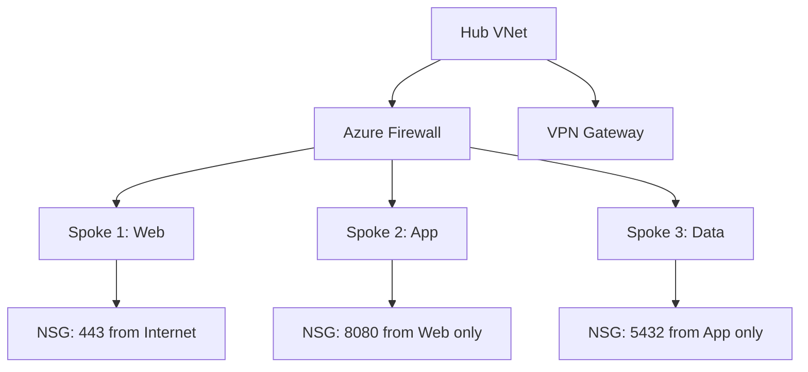

# مجموعات أمن الشبكة والجدران النارية

> "الأمن ليس منتجاً تشتريه، إنه ممارسة تطبقها على كل طبقة."

## 🎯 أهداف التعلم

- إتقان Azure NSG و ASG
- فهم Service Tags و Application Security Groups
- تكوين Azure Firewall Policies
- تصميم Hub-Spoke network security
- استكشاف الثغرات الأمنية في الشبكة

## ⏱️ الوقت المقدر: 45 دقيقة | المستوى: Intermediate

---

## 🧠 الطبقة البسيطة

تخيل فندقاً كبيراً. كل طابق له مفتاح مختلف. النزلاء في الطابق 5 لا يمكنهم دخول الطابق 10. هذا هو **Network Segmentation**: عزل الموارد الشبكية عن بعضها.

### لماذا هذا مهم؟

بدون segmentation، إذا اخترق مهاجم خادم الويب، يمكنه الوصول إلى قاعدة البيانات مباشرة. مع segmentation، حتى لو اخترق طبقة، لا يستطيع الوصول للطبقة التالية.

---

## 🏗️ Application Security Groups (ASG)

بدلاً من إدارة الـ IP addresses يدوياً، استخدم **ASG** لتجميع الخوادم:

```bash
# إنشاء ASG لخوادم الويب
az network asg create \
  --resource-group cloudnova \
  --name WebServers \
  --location westeurope

# ربط VM بالـ ASG
az network nic ip-config update \
  --resource-group cloudnova \
  --nic-name web1-nic \
  --name ipconfig1 \
  --application-security-groups WebServers

# NSG يستخدم ASG بدلاً من IP
az network nsg rule create \
  --nsg-name app-tier-nsg \
  --name AllowFromWebTier \
  --priority 100 \
  --source-asgs WebServers \
  --destination-port-ranges 8080 \
  --access Allow
```

### Service Tags

بدلاً من كتابة عناوين IP لخدمات Azure، استخدم Service Tags:

```bash
# السماح بالوصول من Azure Load Balancer health probes
az network nsg rule create \
  --nsg-name web-tier-nsg \
  --name AllowAzureLB \
  --priority 110 \
  --source-address-prefixes AzureLoadBalancer \
  --destination-port-ranges 80,443 \
  --access Allow
```

Service Tags الشائعة: `Internet`, `AzureCloud`, `AzureLoadBalancer`, `AzureTrafficManager`, `Storage`, `Sql`.

---

## 🏗️ Azure Firewall — Enterprise Grade

| الميزة | NSG | Azure Firewall |
|--------|-----|---------------|
| **النطاق** | Subnet/NIC | VNet بالكامل |
| **FQDN Filtering** | ❌ | ✅ |
| **Threat Intelligence** | ❌ | ✅ |
| **TLS Inspection** | ❌ | Premium tier |
| **التكلفة** | مجاني | ~$900/شهر |

```bash
# إنشاء Azure Firewall في Hub VNet
az network firewall create \
  --name cloudnova-fw \
  --resource-group cloudnova-hub \
  --location westeurope

# Network Rule: السماح بـ DNS فقط
az network firewall network-rule create \
  --firewall-name cloudnova-fw \
  --collection-name AllowDNS \
  --name AllowDNS \
  --protocols UDP \
  --source-addresses 10.0.0.0/8 \
  --destination-addresses 168.63.129.16 \
  --destination-ports 53

# Application Rule: السماح بـ Azure DevOps فقط
az network firewall application-rule create \
  --firewall-name cloudnova-fw \
  --collection-name DevOpsAccess \
  --name AllowDevOps \
  --protocols https=443 \
  --target-fqdns "*.visualstudio.com" "dev.azure.com" \
  --source-addresses 10.1.0.0/24
```

---

## 🏛️ طبقة الإنتاج

### سيناريو CloudNova: ثغرة RDP

أثناء penetration test ربع سنوي، اكتشف الفريق:
1. **الثغرة**: port 3389 (RDP) مفتوح من الإنترنت
2. **السبب**: أحد المطورين فتحه للتجربة ونسي إغلاقه
3. **الإصلاح**: Azure Policy يمنع فتح RDP من الإنترنت + Just-in-Time VM Access
4. **الدرس**: لا تثق أبداً في الإعدادات اليدوية

### Azure Policy للشبكات

```json
{
  "policyRule": {
    "if": {
      "allOf": [
        { "field": "type", "equals": "Microsoft.Network/networkSecurityGroups/securityRules" },
        { "field": "Microsoft.Network/networkSecurityGroups/securityRules/destinationPortRange", "equals": "3389" },
        { "field": "Microsoft.Network/networkSecurityGroups/securityRules/sourceAddressPrefix", "equals": "Internet" }
      ]
    },
    "then": { "effect": "Deny" }
  }
}
```

---

## 🎨 طبقة المعماري: تصميم Hub-Spoke Security



كل الـ outbound traffic يمر عبر Azure Firewall للفحص. كل الـ inbound يمر عبر NSG للتصفية.

---

## 🛠️ تدريبات

### تمرين 1: تدقيق NSG

```bash
# سكربت Python لفحص NSGs المفتوحة للإنترنت
cat > audit_nsg.py << 'EOF'
import subprocess, json

result = subprocess.run(
    ['az', 'network', 'nsg', 'rule', 'list', '--nsg-name', 'web-tier-nsg', '-g', 'cloudnova', '-o', 'json'],
    capture_output=True, text=True
)
rules = json.loads(result.stdout)
for rule in rules:
    if rule.get('sourceAddressPrefix') == 'Internet' and rule.get('access') == 'Allow':
        print(f"⚠️  قاعدة مفتوحة: {rule['name']} → port {rule.get('destinationPortRange')}")
EOF
python3 audit_nsg.py
```

### تمرين 2: أنشئ ASG-based NSG rules

بدلاً من IP addresses، استخدم ASG لربط الـ NSG rules بمجموعة خوادم.

### تحدي: صمم Hub-Spoke مع Azure Firewall

صمم topology كاملة مع Azure Firewall في الـ Hub يتحكم في كل الـ traffic بين الـ spokes.

---

## 📝 تقييم

### ✅ فحص المعرفة
1. ما الفرق بين NSG و ASG؟
2. لماذا نستخدم Service Tags؟
3. متى نختار Azure Firewall بدلاً من NSG؟
4. ما فائدة Network Segmentation؟
5. كيف تمنع فتح RDP من الإنترنت؟

### 🃏 بطاقات

| السؤال | الإجابة |
|--------|---------|
| ASG | Application Security Group — تجميع NICs منطقياً |
| Service Tag | اسم يمثل مجموعة IPs لخدمة Azure |
| Azure Firewall | جدار ناري مُدار على مستوى VNet |
| JIT | Just-in-Time VM Access — فتح ports مؤقتاً |

---

## 🎤 مقابلة

1. "كيف تؤمن شبكة Azure؟"
   → NSG + ASG + Azure Firewall + WAF + DDoS Protection + Network Segmentation

2. "ما الفرق بين NSG و Azure Firewall؟"
   → NSG: مجاني، subnet/NIC level. Firewall: مدفوع، VNet level، FQDN filtering، threat intel

3. "صمم شبكة آمنة لتطبيق مالي"
   → Hub-Spoke + 3 tiers + Private Endpoints + WAF + Sentinel monitoring

---

## 📚 مراجع

| النوع | الرابط |
|-------|--------|
| درس مرتبط | [Encryption & TLS](../03-encryption-tls-pki) |
| درس مرتبط | [Security Operations](../04-security-operations-soc) |
| شهادة | AZ-500 (Azure Security) |
| دليل | [Azure NSG Docs](https://learn.microsoft.com/azure/virtual-network/network-security-groups-overview) |

---

[← Network Security](../../03-networking/04-network-security-firewalls) | [→ Encryption & TLS](./03-encryption-tls-pki) | [🏠 الرئيسية](/)
