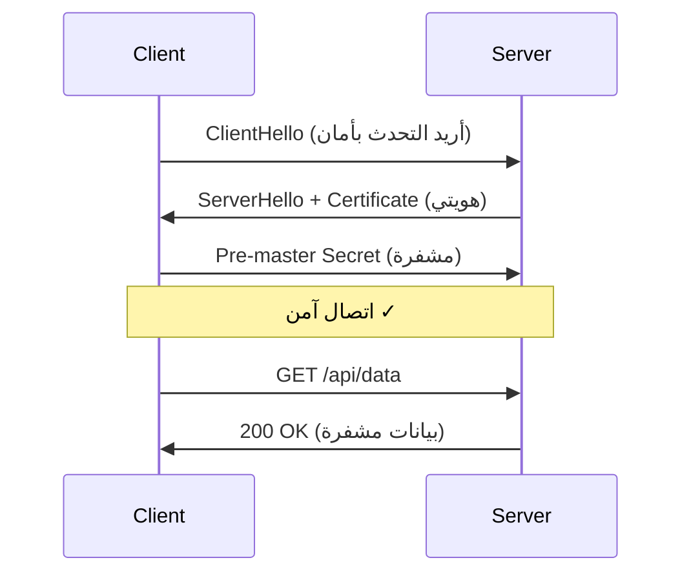

# التشفير و TLS/PKI

> "إذا كانت بياناتك لا تستحق التشفير، فلماذا تخزنها أصلاً؟"

## 🎯 أهداف التعلم

- فهم TLS Handshake خطوة بخطوة
- إدارة الشهادات مع Azure Key Vault
- أتمتة تجديد الشهادات مع Let's Encrypt
- تكوين mTLS للاتصالات الداخلية
- استكشاف أخطاء الشهادات

## ⏱️ الوقت المقدر: 45 دقيقة | المستوى: Intermediate

---

## 🧠 الطبقة البسيطة

تخيل أنك ترسل رسالة سرية لصديقك. تضعها في صندوق، تقفله بقفل (مفتاح عام)، وترسله. هو فقط من يملك المفتاح الخاص لفتحه. هذا هو **TLS**: قفل ومفتاح للإنترنت.



---

## 🏗️ الطبقة الأساسية

### TLS 1.3 Handshake

| الخطوة | ماذا يحدث |
|--------|-----------|
| **ClientHello** | يرسل支持的 cipher suites |
| **ServerHello** | يختار cipher + يرسل الشهادة |
| **Finished** | اتصال آمن (1-RTT فقط في TLS 1.3!) |

### إدارة الشهادات في Azure

```bash
# إنشاء Key Vault
az keyvault create --name cloudnova-kv --resource-group cloudnova

# استيراد شهادة
az keyvault certificate import \
  --vault-name cloudnova-kv \
  --name api-cloudnova-com \
  --file cloudnova.pfx

# أتمتة التجديد مع App Gateway
az network application-gateway ssl-cert update \
  --gateway-name cloudnova-ag \
  --name api-cert \
  --key-vault-secret-id "https://cloudnova-kv.vault.azure.net/secrets/api-cloudnova-com"
```

### mTLS — Mutual TLS

في mTLS، **الطرفان** يتحققان من بعضهما:

```nginx
server {
    listen 443 ssl;
    
    ssl_certificate /etc/ssl/server.crt;
    ssl_certificate_key /etc/ssl/server.key;
    
    # طلب شهادة العميل
    ssl_verify_client on;
    ssl_client_certificate /etc/ssl/ca.crt;
    
    # رفض الشهادات غير الصالحة
    ssl_verify_depth 2;
}
```

---

## 🏛️ طبقة الإنتاج

### سيناريو CloudNova: انتهاء الشهادة

2:30 صباحاً. PagerDuty:

1. **المشكلة**: شهادة `api.cloudnova.com` انتهت بدون سابق إنذار
2. **التأثير**: كل الـ mobile apps توقفت عن العمل
3. **السبب**: Key Vault auto-renewal غير مفعل
4. **الحل الفوري**: إصدار شهادة يدوية + إعادة تشغيل App Gateway
5. **الحل الدائم**: تفعيل auto-renew + alert قبل 30 يوماً

### أفضل الممارسات

1. **Key Vault Auto-Renewal**: دائماً مفعّل
2. **Monitoring**: تنبيه قبل 30 يوماً من انتهاء الشهادة
3. **HSTS**: `Strict-Transport-Security` header
4. **Cipher Suites**: استخدم TLS 1.3 حصراً في الإنتاج

---

## 🎨 طبقة المعماري

### Public CA vs Private CA

| | Public CA | Private CA |
|---|----------|-----------|
| **التكلفة** | مجاني (Let's Encrypt) | Azure Private CA ~$40/شهر |
| **الاستخدام** | مواقع الإنترنت العامة | اتصالات داخلية mTLS |
| **التجديد** | 90 يوماً | حسب التكوين |

---

## 🛠️ تدريبات

```bash
# فحص شهادة موقع
openssl s_client -connect cloudnova.com:443 -servername cloudnova.com | openssl x509 -noout -dates -subject

# إنشاء self-signed certificate للتطوير
openssl req -x509 -newkey rsa:4096 -keyout key.pem -out cert.pem -days 365 -nodes
```

---

## 📝 تقييم

### ✅ فحص المعرفة
1. ما الفرق بين TLS 1.2 و TLS 1.3؟
2. لماذا mTLS أفضل للاتصالات الداخلية؟
3. متى تستخدم Private CA بدلاً من Public CA؟

### 🎤 أسئلة مقابلة
1. "اشرح TLS Handshake لطفل في الخامسة"
2. "كيف تؤمن اتصالات microservices؟"

---

[← Network Security](./02-network-security-groups-firewalls) | [→ Security Operations](./04-security-operations-soc) | [🏠 الرئيسية](/)
