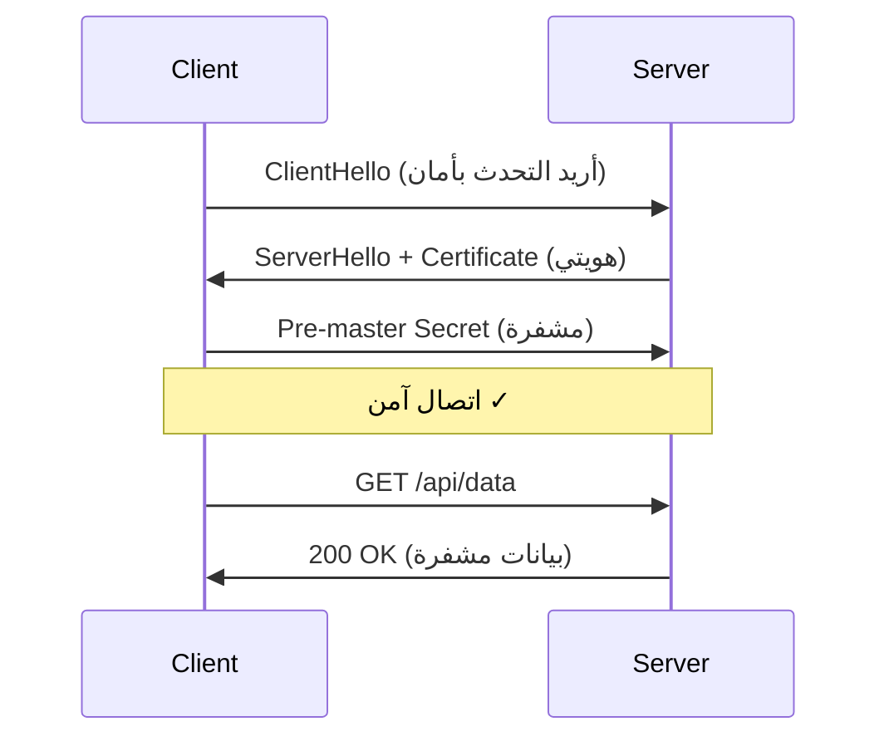

# التشفير و TLS/PKI

> "إذا كانت بياناتك لا تستحق التشفير، فلماذا تخزنها أصلاً؟"

## 🎯 أهداف التعلم

- فهم TLS Handshake خطوة بخطوة
- إدارة الشهادات مع Azure Key Vault
- أتمتة تجديد الشهادات مع Let's Encrypt
- تكوين mTLS للاتصالات الداخلية
- استكشاف أخطاء الشهادات

## ⏱️ الوقت المقدر: 45 دقيقة | المستوى: Intermediate

---

## ١. الطبقة البسيطة: تشبيه

تخيل أنك ترسل رسالة سرية لصديقك. تضعها في صندوق، تقفله بقفل (مفتاح عام)، وترسله. هو فقط من يملك المفتاح الخاص لفتحه. هذا هو **TLS**: قفل ومفتاح للإنترنت.



---

## ٢. TLS 1.3 Handshake

| الخطوة | ماذا يحدث |
|--------|-----------|
| **ClientHello** | يرسل cipher suites المدعومة |
| **ServerHello** | يختار cipher + يرسل الشهادة |
| **Finished** | اتصال آمن (1-RTT فقط في TLS 1.3!) |

### TLS 1.2 vs 1.3

| | TLS 1.2 | TLS 1.3 |
|---|---------|---------|
| **Handshake** | 2-RTT | 1-RTT |
| **Cipher Suites** | ~300 | 5 فقط (آمنة كلها) |
| **Forward Secrecy** | اختياري | إلزامي |
| **السرعة** | أبطأ | أسرع بـ 30% |

---

## ٣. إدارة الشهادات في Azure

```bash
# إنشاء Key Vault
az keyvault create --name cloudnova-kv --resource-group cloudnova

# استيراد شهادة
az keyvault certificate import \
  --vault-name cloudnova-kv \
  --name api-cloudnova-com \
  --file cloudnova.pfx

# أتمتة التجديد مع App Gateway
az network application-gateway ssl-cert update \
  --gateway-name cloudnova-ag \
  --name api-cert \
  --key-vault-secret-id "https://cloudnova-kv.vault.azure.net/secrets/api-cloudnova-com"
```

### Let's Encrypt + Certbot

```bash
sudo certbot certonly --nginx -d cloudnova.com -d www.cloudnova.com
# الشهادة الآن في /etc/letsencrypt/live/cloudnova.com/

# تجديد تلقائي
sudo certbot renew --dry-run
echo "0 3 * * * certbot renew --quiet" | sudo crontab -
```

---

## ٤. mTLS — Mutual TLS

في mTLS، **الطرفان** يتحققان من بعضهما:

```nginx
server {
    listen 443 ssl;
    ssl_certificate /etc/ssl/server.crt;
    ssl_certificate_key /etc/ssl/server.key;
    
    # طلب شهادة العميل
    ssl_verify_client on;
    ssl_client_certificate /etc/ssl/ca.crt;
    ssl_verify_depth 2;
}
```

### متى تستخدم mTLS؟

- اتصالات service-to-service داخل Kubernetes mesh
- API endpoints الحساسة (دفع، بيانات شخصية)
- Zero Trust networking

---

## 🏛️ طبقة الإنتاج

### سيناريو CloudNova: انتهاء الشهادة

2:30 صباحاً. PagerDuty:

1. **المشكلة**: شهادة `api.cloudnova.com` انتهت بدون سابق إنذار
2. **التأثير**: كل الـ mobile apps توقفت عن العمل
3. **السبب**: Key Vault auto-renewal غير مفعل
4. **الحل الفوري**: إصدار شهادة يدوية + إعادة تشغيل App Gateway
5. **الحل الدائم**: تفعيل auto-renew + alert قبل 30 يوماً

### أفضل الممارسات

1. **Key Vault Auto-Renewal**: دائماً مفعّل
2. **Monitoring**: تنبيه قبل 30 يوماً من انتهاء الشهادة
3. **HSTS**: `Strict-Transport-Security` header
4. **Cipher Suites**: استخدم TLS 1.3 حصراً في الإنتاج
5. **Certificate Transparency**: سجّل كل الشهادات

---

## 🎨 طبقة المعماري

### Public CA vs Private CA

| | Public CA | Private CA |
|---|----------|-----------|
| **التكلفة** | مجاني (Let's Encrypt) | Azure Private CA ~$40/شهر |
| **الاستخدام** | مواقع الإنترنت العامة | اتصالات داخلية mTLS |
| **التجديد** | 90 يوماً | حسب التكوين |
| **Chain of trust** | متصفحات معروفة | تثق بها مؤسستك فقط |

### متى تستخدم Private CA؟

- اتصالات mTLS داخل Kubernetes cluster
- شهادات لأجهزة IoT داخلية
- بيئات development لا تحتاج شهادات عامة

---

## 🛠️ تدريبات

### تمرين 1: فحص شهادة موقع

```bash
openssl s_client -connect cloudnova.com:443 -servername cloudnova.com | openssl x509 -noout -dates -subject -issuer
```

### تمرين 2: إنشاء self-signed certificate

```bash
openssl req -x509 -newkey rsa:4096 -keyout key.pem -out cert.pem -days 365 -nodes -subj "/CN=localhost"
```

### تحدي: أتمتة مراقبة الشهادات

اكتب سكريبت Bash يفحص تواريخ انتهاء الشهادات في Azure Key Vault ويرسل alert إذا كانت ستنتهي خلال 30 يوماً.

---

## 📝 تقييم

### ✅ فحص المعرفة
1. ما الفرق بين TLS 1.2 و TLS 1.3؟
2. لماذا mTLS أفضل للاتصالات الداخلية؟
3. متى تستخدم Private CA بدلاً من Public CA؟
4. ما هو HSTS؟
5. كيف تمنع انتهاء الشهادات بدون سابق إنذار؟

### 📝 اختبار

1. **متى يكون mTLS ضرورياً؟**
   → Service-to-service communication في Zero Trust environment

2. **لماذا TLS 1.3 أسرع من 1.2؟**
   → 1-RTT handshake بدلاً من 2-RTT

### 🃏 بطاقات

| السؤال | الإجابة |
|--------|---------|
| TLS | Transport Layer Security — تشفير الاتصالات |
| mTLS | Mutual TLS — الطرفان يتحققان من بعضهما |
| HSTS | HTTP Strict Transport Security — إجبار HTTPS |
| Let's Encrypt | CA مجاني بشهادات لمدة 90 يوماً |

---

## 🎤 مقابلة

1. **"اشرح TLS Handshake لطفل في الخامسة"**
   → "تخيل أنك تريد إرسال رسالة سرية. أولاً تطلب من صديقك إثبات هويته. ثم تتفقان على لغة سرية. ثم ترسل الرسالة."

2. **"كيف تؤمن اتصالات microservices؟"**
   → mTLS + Service Mesh (Istio/Linkerd) + Network Policies

3. **"كيف تكتشف أن شهادة على وشك الانتهاء؟"**
   → Azure Monitor alert على Key Vault certificate expiry + Prometheus blackbox exporter

---

## 📚 مراجع

| النوع | الرابط |
|-------|--------|
| درس مرتبط | [NSG & Firewalls](./02-network-security-groups-firewalls) |
| درس مرتبط | [Security Operations](./04-security-operations-soc) |
| شهادة | AZ-500 (Security) |
| موقع | [SSL Labs](https://ssllabs.com/ssltest/) — فحص تكوين TLS |

---

[← NSG & Firewalls](./02-network-security-groups-firewalls) | [→ Security Operations](./04-security-operations-soc) | [🏠 الرئيسية](/)
