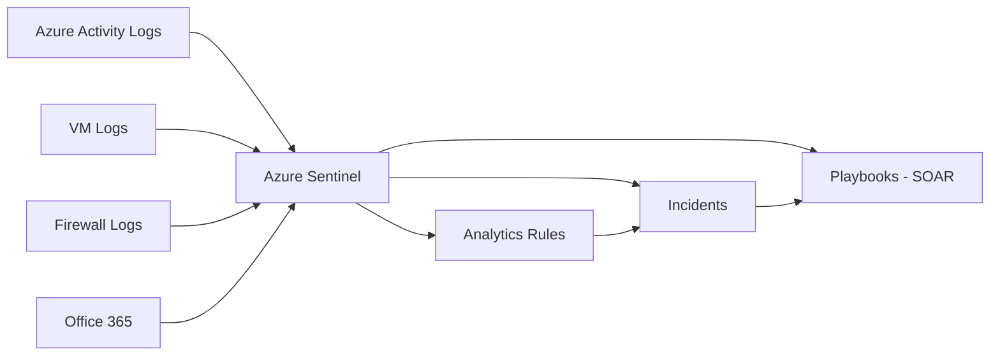

# عمليات الأمن (SOC)

> "الأمن ليس منتجاً. إنه عملية مستمرة من Detect → Respond → Recover → Learn."

## 🎯 أهداف التعلم

- بناء SOC حديث مع Azure Sentinel
- كتابة KQL queries لاكتشاف التهديدات
- Incident Response Plan عملي
- Threat Hunting باستخدام MITRE ATT&CK
- أتمتة الاستجابة الأمنية (SOAR)

## ⏱️ الوقت المقدر: 45 دقيقة | المستوى: Advanced

---

## 🧠 الطبقة البسيطة

تخيل كاميرات مراقبة في مول تجاري. عندما يحدث شيء غريب (شخص يجري، حقيبة متروكة)، فريق الأمن يتحقق فوراً. SOC هو نفسه: يراقب كل شيء، ويكتشف الشذوذ، ويتحرك فوراً.

---

## 🏗️ الطبقة الأساسية

### Azure Sentinel Architecture



### KQL — لغة الاستعلام

```kql
// اكتشاف محاولات Brute Force RDP
SecurityEvent
| where EventID == 4625  // فشل تسجيل الدخول
| where AccountType == "User"
| summarize FailedAttempts = count() by Account, IPAddress = IpAddress, bin(TimeGenerated, 10m)
| where FailedAttempts > 10
| project TimeGenerated, Account, IPAddress, FailedAttempts

// اكتشاف إنشاء VMs غريبة
AzureActivity
| where OperationNameValue == "MICROSOFT.COMPUTE/VIRTUALMACHINES/WRITE"
| where ActivityStatusValue == "Succeeded"
| project TimeGenerated, Caller, ResourceId

// اكتشاف تغييرات NSG
AzureActivity
| where OperationNameValue contains "NETWORKSECURITYGROUPS"
| where ActivityStatusValue == "Succeeded"
| project TimeGenerated, Caller, ResourceId, OperationNameValue
```

### Incident Response Plan

| المرحلة | المدة المستهدفة | الأنشطة |
|---------|---------------|---------|
| **Detect** | 5 دقائق | تنبيه Sentinel |
| **Triage** | 15 دقيقة | هل هو هجوم حقيقي؟ |
| **Contain** | 30 دقيقة | عزل الموارد المتأثرة |
| **Eradicate** | ساعتين | إزالة التهديد |
| **Recover** | 4 ساعات | إعادة الخدمة |
| **Post-Mortem** | 24 ساعة | ماذا تعلمنا؟ |

---

## 🏛️ طبقة الإنتاج: سيناريو CloudNova

### Incident: Data Exfiltration

1. **الخميس 3:15 صباحاً**: Sentinel ينبه: 5GB بيانات خرجت من SQL Database في 10 دقائق
2. **Triage**: الآيبي المستقبل في روسيا (لم نتعامل مع روسيا أبداً)
3. **Contain**: 
   ```bash
   az sql db update --name cloudnova-db --resource-group cloudnova --set denyPublicNetworkAccess=true
   ```
4. **التحقيق**: أحد المطورين استخدم connection string في repo عام على GitHub (تم تسريبه)
5. **Eradicate**: تدوير كل المفاتيح + حذف المستخدم المخترق
6. **الدرس**: أبداً لا تضع secrets في الكود. استخدم Managed Identity + Key Vault

### Automation: SOAR Playbook

```json
{
  "type": "Microsoft.Logic/workflows",
  "properties": {
    "definition": {
      "triggers": {
        "When_Sentinel_incident_created": {
          "type": "ApiConnection",
          "inputs": {
            "body": {
              "IncidentId": "@triggerBody()?['IncidentId']"
            }
          }
        }
      },
      "actions": {
        "Block_IP": {
          "type": "Http",
          "inputs": {
            "method": "POST",
            "uri": "https://management.azure.com/.../nsg/securityRules",
            "body": {
              "properties": {
                "sourceAddressPrefix": "@{triggerBody()?['IPAddress']}",
                "access": "Deny"
              }
            }
          }
        },
        "Send_Teams_Message": {
          "type": "ApiConnection",
          "inputs": {
            "body": {
              "text": "🚨 Incident #{@triggerBody()?['IncidentId']}: IP @{triggerBody()?['IPAddress']} blocked"
            }
          }
        }
      }
    }
  }
}
```

---

## 🛠️ تدريبات

### تمرين: كتابة Detection Rule

اكتب KQL query يكتشف:
- إنشاء أكثر من 3 VMs في أقل من 5 دقائق
- تغيير NSG rules للسماح بـ 0.0.0.0/0
- حذف Key Vault secrets بشكل مشبوه

### تحدي: بناء Incident Response Runbook

صمم runbook لحادث ransomware يضرب Azure Files. حدد الخطوات الدقيقة من detection إلى recovery.

---

## 🎤 أسئلة مقابلة

1. **"كيف تبني SOC من الصفر؟"**
2. **"احكِ عن Incident خطير تعاملت معه"**

---

[← Encryption & TLS](./03-encryption-tls-pki) | [→ Python Automation](../../05-python/01-python-cloud-automation) | [🏠 الرئيسية](/)
