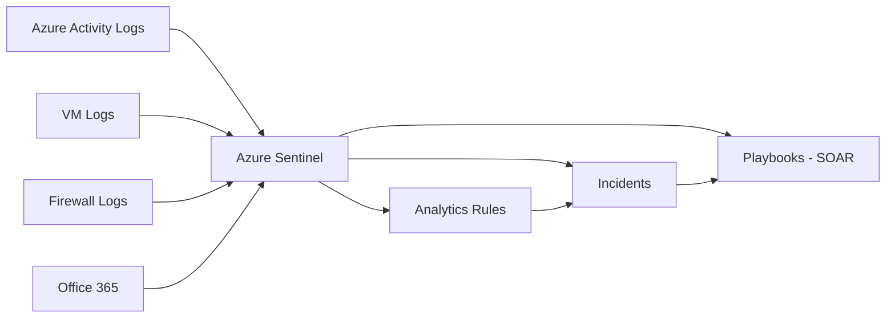

## ١. الطبقة البسيطة

تخيل كاميرات مراقبة في مول تجاري. عندما يحدث شيء غريب (شخص يجري، حقيبة متروكة)، فريق الأمن يتحقق فوراً. SOC هو نفسه: يراقب كل شيء، ويكتشف الشذوذ، ويتحرك فوراً.

---

## ٢. Azure Sentinel Architecture



### KQL — لغة الاستعلام

```kql
// اكتشاف محاولات Brute Force RDP
SecurityEvent
| where EventID == 4625  // فشل تسجيل الدخول
| where AccountType == "User"
| summarize FailedAttempts = count() by Account, IPAddress = IpAddress, bin(TimeGenerated, 10m)
| where FailedAttempts > 10

// اكتشاف إنشاء VMs غريبة
AzureActivity
| where OperationNameValue == "MICROSOFT.COMPUTE/VIRTUALMACHINES/WRITE"
| where ActivityStatusValue == "Succeeded"
| project TimeGenerated, Caller, ResourceId

// اكتشاف تغييرات NSG مشبوهة
AzureActivity
| where OperationNameValue contains "NETWORKSECURITYGROUPS"
| where ActivityStatusValue == "Succeeded"
| where Caller !in ("platform-engineering@cloudnova.com")
| project TimeGenerated, Caller, ResourceId, OperationNameValue

// اكتشاف Key Vault access غير طبيعي
AzureDiagnostics
| where ResourceType == "VAULTS"
| where OperationName == "SecretGet"
| summarize SecretAccesses = count() by CallerIPAddress, bin(TimeGenerated, 1h)
| where SecretAccesses > 50
```

### Incident Response Plan

| المرحلة | المدة المستهدفة | الأنشطة |
|---------|---------------|---------|
| **Detect** | 5 دقائق | تنبيه Sentinel |
| **Triage** | 15 دقيقة | هل هو هجوم حقيقي؟ |
| **Contain** | 30 دقيقة | عزل الموارد المتأثرة |
| **Eradicate** | ساعتين | إزالة التهديد |
| **Recover** | 4 ساعات | إعادة الخدمة |
| **Post-Mortem** | 24 ساعة | ماذا تعلمنا؟ |

---

## 🏛️ طبقة الإنتاج: سيناريوهات حقيقية

### سيناريو ١: Data Exfiltration

الخميس 3:15 صباحاً — Sentinel ينبه: 5GB بيانات خرجت من SQL Database في 10 دقائق.

```bash
# 1. Triage
az monitor activity-log list --start-time 2026-07-17T03:00:00 \
  | jq '.[] | select(.resourceType == "Microsoft.Sql/servers")'

# 2. Contain
az sql db update --name cloudnova-db --resource-group cloudnova --set denyPublicNetworkAccess=true

# 3. Eradicate: تدوير كل المفاتيح
az keyvault key rotate --name encryption-key --vault-name cloudnova-kv

# 4. Recovery: مراجعة كل connection strings
az monitor log-analytics query -w cloudnova-law --analytics-query "
  AzureDiagnostics | where ResourceType == 'VAULTS' | where TimeGenerated > ago(24h)
"
```

**الدرس**: أبداً لا تضع connection strings في الكود. استخدم Managed Identity.

### سيناريو ٢: Automation (SOAR Playbook)

```json
{
  "triggers": {
    "When_Sentinel_incident_created": {
      "inputs": { "body": { "IncidentId": "@triggerBody()?['IncidentId']" } }
    }
  },
  "actions": {
    "Block_IP": {
      "inputs": {
        "method": "POST",
        "uri": "https://management.azure.com/.../nsg/securityRules",
        "body": {
          "properties": {
            "sourceAddressPrefix": "@{triggerBody()?['IPAddress']}",
            "access": "Deny"
          }
        }
      }
    },
    "Send_Teams": {
      "inputs": {
        "body": { "text": "🚨 Incident blocked IP @{triggerBody()?['IPAddress']}" }
      }
    }
  }
}
```

---

## 🎨 طبقة المعماري: تصميم SOC

### Team Structure

| Role | المسؤولية |
|------|-----------|
| **Tier 1 Analyst** | فرز التنبيهات الأولية |
| **Tier 2 Analyst** | تحقيق متقدم |
| **Incident Responder** | احتواء واستعادة |
| **Threat Hunter** | بحث استباقي عن التهديدات |
| **SOC Manager** | مقاييس وتحسين |

### MITRE ATT&CK Mapping

```kql
// Mapping alerts to MITRE ATT&CK
SecurityAlert
| extend Tactic = case(
    AlertName contains "Brute", "TA0006 - Credential Access",
    AlertName contains "Malware", "TA0002 - Execution",
    AlertName contains "Exfil", "TA0010 - Exfiltration",
    "Unknown"
)
| summarize count() by Tactic
```

---

## 🛠️ تدريبات

### تمرين 1: كتابة KQL Detection Rule

اكتب KQL query يكتشف:
- إنشاء أكثر من 3 VMs في أقل من 5 دقائق
- تغيير NSG rules للسماح بـ 0.0.0.0/0
- حذف Key Vault secrets بشكل مشبوه

### تمرين 2: Runbook لحادث Ransomware

صمم runbook لحادث ransomware يضرب Azure Files. حدد الخطوات من detection إلى recovery.

### تحدي: ابنِ SOAR Playbook

أنشئ playbook في Azure Logic Apps يقوم بـ:
1. استقبال alert من Sentinel
2. حظر IP المصدر في NSG
3. إرسال إشعار Teams
4. فتح ticket في Jira

---

## 📝 تقييم

### ✅ فحص المعرفة
1. ما الفرق بين SIEM و SOAR؟
2. لماذا KQL مهم في Azure Sentinel؟
3. اشرح مراحل Incident Response
4. ما هو Threat Hunting؟
5. كيف تربط alerts بـ MITRE ATT&CK؟

### 🃏 بطاقات

| السؤال | الإجابة |
|--------|---------|
| SIEM | Security Information & Event Management |
| SOAR | Security Orchestration, Automation & Response |
| KQL | Kusto Query Language — لغة استعلام Sentinel |
| MITRE ATT&CK | إطار تصنيف تكتيكات المهاجمين |

---

## 🎤 مقابلة

1. **"كيف تبني SOC من الصفر؟"**
   → Sentinel onboarding → Data connectors → Analytics rules → Playbooks → Team training

2. **"احكِ عن Incident خطير تعاملت معه"**
   → STAR: Data exfiltration incident — detection → containment → recovery → lessons learned

3. **"ما الفرق بين Detection و Threat Hunting؟"**
   → Detection: استجابة لتنبيه. Hunting: بحث استباقي عن تهديدات غير مكتشفة

---

## 📚 مراجع

| النوع | الرابط |
|-------|--------|
| درس مرتبط | [Encryption & TLS](./03-encryption-tls-pki) |
| درس مرتبط | [Identity Mastery](../../23-identity/01-identity-mastery) |
| شهادة | SC-200 (Security Operations) |
| إطار | [MITRE ATT&CK](https://attack.mitre.org) |

---

[← Encryption & TLS](./03-encryption-tls-pki) | [→ Python Automation](../../05-python/01-python-cloud-automation) | [🏠 الرئيسية](/)
