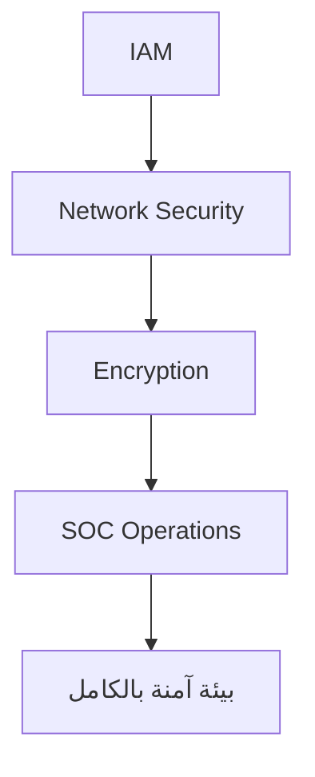

import Tabs from '@theme/Tabs';
import TabItem from '@theme/TabItem';

# 🚀 الأمن

> IAM، التشفير، TLS/PKI، SOC — الأمن ليس طبقة، إنه ثقافة.

## 🎯 أهداف التعلم

بعد إكمال هذه الوحدة، ستكون قادراً على:

- [**أساسيات IAM**](01-iam-fundamentals) — الهوية والوصول
- [**مجموعات أمن الشبكة**](02-network-security-groups-firewalls) — NSG و ASG
- [**التشفير و TLS/PKI**](03-encryption-tls-pki) — حماية البيانات
- [**عمليات الأمن**](04-security-operations-soc) — SOC و Sentinel

## 💡 المهارات التي ستكتسبها

IAM و RBAC • التشفير • TLS/PKI • SOC • Incident Response

## 📊 معلومات الوحدة

| العنصر           | القيمة                 |
| ---------------- | ---------------------- |
| **المستوى**      | متوسط إلى متقدم        |
| **الوقت المقدر** | 7 ساعات                |
| **المتطلبات**    | الشبكات                |
| **الشهادات**     | AZ-500, SC-200, SC-300 |
| **المشاريع**     | تطبيق Zero Trust       |
| **المختبرات**    | —                      |

## 🏛️ مهمة CloudNova

> حادثة أمنية في CloudNova! قُد فريق الاستجابة واحتوِ الاختراق قبل أن يصل للعملاء.

## 🗺️ خريطة الوحدة

## 📖 الدروس

<Tabs>
<TabItem value="all" label="كل الدروس" default>

- [**أساسيات IAM**](01-iam-fundamentals) — الهوية والوصول
- [**مجموعات أمن الشبكة**](02-network-security-groups-firewalls) — NSG و ASG
- [**التشفير و TLS/PKI**](03-encryption-tls-pki) — حماية البيانات
- [**عمليات الأمن**](04-security-operations-soc) — SOC و Sentinel

</TabItem>
</Tabs>

## 🚀 ابدأ التعلم

[▶️ ابدأ الدرس الأول](01-iam-fundamentals)
