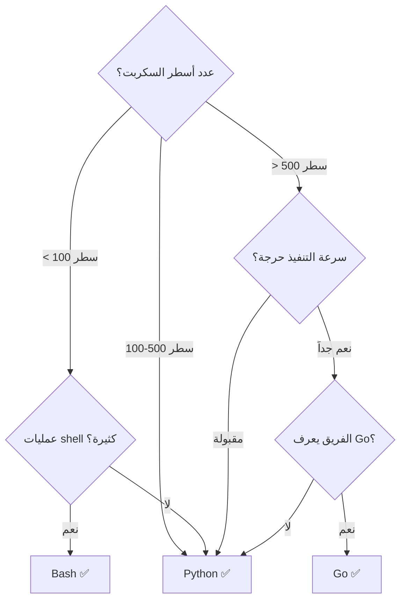

# Python لأتمتة السحابة

> "Python هي سكين الجيش السويسري لمهندس السحابة. من السكربتات السريعة إلى أدوات الإنتاج."

## 🎯 أهداف التعلم

- إتقان Azure Python SDK
- كتابة أدوات CLI احترافية
- أتمتة مهام السحابة المتكررة
- التعامل مع REST APIs
- كتابة اختبارات لأدوات الأتمتة

---

## 📖 الطبقة الأساسية: لماذا Python لمهندس السحابة؟

```
Python + Cloud Engineering:

├── أتمتة متكررة
│   ├── تنظيف الموارد غير المستخدمة
│   ├── نسخ احتياطي تلقائي
│   └── تقارير دورية
│
├── Integration
│   ├── ربط خدمات متعددة
│   ├── Webhooks ومعالجة الأحداث
│   └── ETL (استخراج وتحويل وتحميل البيانات)
│
├── Infrastructure as Code
│   ├── Pulumi (Python)
│   ├── CDK for Terraform (Python)
│   └── Custom automation scripts
│
└── Observability
    ├── Custom metrics exporters
    ├── Log parsing
    └── Alert automation
```

---

## 🧱 الطبقة المهنية: Azure Python SDK

### إدارة الموارد

```python
from azure.identity import DefaultAzureCredential
from azure.mgmt.compute import ComputeManagementClient
from azure.mgmt.resource import ResourceManagementClient
from datetime import datetime, timedelta, timezone

credential = DefaultAzureCredential()
subscription_id = "your-subscription-id"

# 1.Resource Groups
resource_client = ResourceManagementClient(credential, subscription_id)

def create_rg(name: str, location: str, tags: dict):
    return resource_client.resource_groups.create_or_update(
        name,
        {
            "location": location,
            "tags": tags
        }
    )

# 2. Virtual Machines
compute_client = ComputeManagementClient(credential, subscription_id)

def list_vms():
    """قائمة بكل VMs في الاشتراك"""
    vms = []
    for vm in compute_client.virtual_machines.list_all():
        vms.append({
            "name": vm.name,
            "location": vm.location,
            "size": vm.hardware_profile.vm_size,
            "os": vm.storage_profile.os_disk.os_type
        })
    return vms

def stop_idle_vms(rg_name: str, max_cpu_percent: float = 5.0):
    """إيقاف VMs التي استهلاكها منخفض"""
    # هذه تحتاج Azure Monitor metrics
    pass

# 3. البحث عن الموارد غير المستخدمة
def find_unused_disks():
    """إيجاد Managed Disks غير مرتبطة بأي VM"""
    unused = []
    for disk in compute_client.disks.list():
        if disk.managed_by is None:
            unused.append({
                "name": disk.name,
                "size_gb": disk.disk_size_gb,
                "created": disk.time_created
            })
    return unused
```

### المسح الدوري والتنظيف

```python
import schedule
import time

def cleanup_job():
    """مهمة تنظيف أسبوعية"""

    print(f"[{datetime.now()}] Starting cleanup...")

    # 1. حذف Snapshots أقدم من 30 يوماً
    thirty_days_ago = datetime.now(timezone.utc) - timedelta(days=30)
    for snapshot in compute_client.snapshots.list():
        if snapshot.time_created < thirty_days_ago:
            compute_client.snapshots.begin_delete(
                snapshot.resource_group,
                snapshot.name
            )
            print(f"Deleted old snapshot: {snapshot.name}")

    # 2. إزالة Public IPs غير المرتبطة
    network_client = NetworkManagementClient(credential, subscription_id)
    for ip in network_client.public_ip_addresses.list_all():
        if ip.ip_configuration is None:
            network_client.public_ip_addresses.begin_delete(
                resource_group_name_from_id(ip.id),
                ip.name
            )
            print(f"Deleted orphan IP: {ip.name}")

    print(f"[{datetime.now()}] Cleanup complete!")

# جدولة أسبوعية
schedule.every().sunday.at("03:00").do(cleanup_job)

while True:
    schedule.run_pending()
    time.sleep(60)
```

---

## 🏗️ الطبقة الإنتاجية: أدوات CLI احترافية

### هيكل أداة CLI

```
cloudnova-cli/
├── cloudnova/
│   ├── __init__.py
│   ├── main.py          # نقطة الدخول
│   ├── commands/
│   │   ├── __init__.py
│   │   ├── deploy.py    # نشر الموارد
│   │   ├── cleanup.py   # تنظيف
│   │   ├── report.py    # تقارير
│   │   └── diagnose.py  # تشخيص
│   ├── core/
│   │   ├── __init__.py
│   │   ├── azure_client.py
│   │   └── config.py
│   └── utils/
│       ├── __init__.py
│       ├── logging_config.py
│       └── validators.py
├── tests/
├── setup.py
└── requirements.txt
```

### CLI مع click

```python
import click
from azure.identity import DefaultAzureCredential
from rich.console import Console
from rich.table import Table
from rich.progress import Progress

console = Console()

@click.group()
@click.option("--subscription", envvar="AZURE_SUBSCRIPTION_ID", required=True)
@click.pass_context
def cli(ctx, subscription):
    """CloudNova CLI - أداة إدارة السحابة"""
    ctx.ensure_object(dict)
    ctx.obj["subscription"] = subscription
    ctx.obj["credential"] = DefaultAzureCredential()

@cli.command()
@click.option("--resource-group", "-g", required=True)
@click.option("--output", "-o", type=click.Choice(["table", "json"]), default="table")
@click.pass_context
def list_vms(ctx, resource_group, output):
    """قائمة بكل الآلات الافتراضية"""
    credential = ctx.obj["credential"]
    subscription = ctx.obj["subscription"]

    compute_client = ComputeManagementClient(credential, subscription)
    vms = compute_client.virtual_machines.list(resource_group)

    if output == "table":
        table = Table(title=f"VMs in {resource_group}")
        table.add_column("Name", style="cyan")
        table.add_column("Size", style="green")
        table.add_column("OS", style="yellow")
        table.add_column("State", style="magenta")

        for vm in vms:
            table.add_row(
                vm.name,
                vm.hardware_profile.vm_size,
                vm.storage_profile.os_disk.os_type,
                "Running"  # تحتاج Instance View للحالة الحقيقية
            )
        console.print(table)
    else:
        import json
        click.echo(json.dumps([{"name": vm.name} for vm in vms], indent=2))

@cli.command()
@click.argument("environment", type=click.Choice(["dev", "staging", "prod"]))
@click.option("--dry-run", is_flag=True, help="معاينة دون تنفيذ")
@click.pass_context
def cleanup(ctx, environment, dry_run):
    """تنظيف الموارد غير المستخدمة"""
    console.print(f"[bold yellow]تنظيف بيئة: {environment}[/bold yellow]")

    if dry_run:
        console.print("[dim]وضع المعاينة - لن يتم حذف أي شيء[/dim]")

    with Progress() as progress:
        task = progress.add_task("[cyan]جاري المسح...", total=100)

        # البحث عن الموارد غير المستخدمة
        progress.update(task, advance=50)
        unused_resources = find_unused_resources(environment)

        progress.update(task, advance=50)

    if unused_resources:
        console.print(f"[red]تم العثور على {len(unused_resources)} موارد غير مستخدمة[/red]")
        for res in unused_resources:
            console.print(f"  • {res['type']}: {res['name']}")
    else:
        console.print("[green]لا توجد موارد غير مستخدمة ✓[/green]")

if __name__ == "__main__":
    cli()
```

---

## 🎨 الطبقة المعمارية: أنماط متقدمة

### Retry مع exponential backoff

```python
import time
from functools import wraps
from azure.core.exceptions import ServiceRequestError

def retry_with_backoff(max_retries=3, base_delay=1):
    def decorator(func):
        @wraps(func)
        def wrapper(*args, **kwargs):
            for attempt in range(max_retries):
                try:
                    return func(*args, **kwargs)
                except ServiceRequestError as e:
                    if attempt == max_retries - 1:
                        raise
                    delay = base_delay * (2 ** attempt)
                    print(f"Retry {attempt+1}/{max_retries} in {delay}s...")
                    time.sleep(delay)
            return None
        return wrapper
    return decorator

@retry_with_backoff(max_retries=3)
def create_vm_with_retry(params):
    return compute_client.virtual_machines.begin_create_or_update(**params)
```

### Pagination helper

```python
def list_all_paginated(paginator, max_results=None):
    """استخراج كل العناصر من paginated response"""
    results = []
    for item in paginator:
        results.append(item)
        if max_results and len(results) >= max_results:
            break
    return results

# استخدام
all_vms = list_all_paginated(
    compute_client.virtual_machines.list_all()
)
```

---

## 🏥 سيناريو CloudNova: أتمتة تقرير أسبوعي

```python
def generate_weekly_report():
    """توليد تقرير أسبوعي تلقائي"""

    report = {
        "week": datetime.now().isocalendar()[1],
        "generated_at": datetime.now().isoformat(),
        "resources": {},
        "costs": {},
        "recommendations": []
    }

    # 1. إحصاء الموارد
    report["resources"] = {
        "vms": count_vms(),
        "databases": count_databases(),
        "storage_accounts": count_storage_accounts(),
        "aks_clusters": count_aks_clusters()
    }

    # 2. التكاليف الأسبوعية
    report["costs"] = get_weekly_costs()

    # 3. توصيات التوفير
    if find_unused_disks():
        report["recommendations"].append(
            "⚠️ توجد Managed Disks غير مستخدمة — احذفها لتوفير التكاليف"
        )

    if find_underutilized_vms(threshold_cpu=10):
        report["recommendations"].append(
            "💡 توجد VMs باستهلاك أقل من 10% —可以考虑 right-sizing"
        )

    # 4. إرسال التقرير
    send_to_teams(report)
    save_to_storage(report, f"reports/weekly-{report['week']}.json")

    return report
```

---

## ⚡ الإنتاج وما بعده

### أفضل ممارسات Python للسحابة

| الممارسة             | مثال                                                          |
| -------------------- | ------------------------------------------------------------- |
| **Type hints**       | `def get_vm(name: str) -> VirtualMachine:`                    |
| **Async/await**      | `async for vm in compute_client.virtual_machines.list_all():` |
| **Logging**          | `logging.getLogger(__name__)` وليس `print()`                  |
| **خطأ لطيف**         | `try/except` مع رسائل واضحة للمستخدم                          |
| **Config من البيئة** | `os.getenv("AZURE_SUBSCRIPTION_ID")`                          |
| **اختبارات**         | `pytest` مع `unittest.mock` لـ Azure SDK                      |

---

## 🧠 التذكّر النشط

1. كيف تتعامل مع pagination في Azure Python SDK؟
2. لماذا نستخدم `DefaultAzureCredential` بدلاً من hardcoded keys؟
3. كيف تبني CLI أداة احترافية لفريقك؟
4. متى تستخدم async/await في أتمتة السحابة؟
5. كيف تختبر كوداً يتعامل مع Azure APIs؟

## 📝 بطاقات تعليمية

- **DefaultAzureCredential**: سلسلة اعتماد تحاول عدة طرق (Managed Identity → Environment → CLI → VS Code)
- **Pagination**: آلية Azure لتقسيم النتائج الكبيرة إلى صفحات
- **Click/Typer**: مكتبات Python لبناء CLI
- **Rich**: مكتبة لتنسيق مخرجات الطرفية (جداول، ألوان، progress bars)
- **Mock**: محاكاة Azure APIs في الاختبارات دون اتصال حقيقي

## 🎤 أسئلة المقابلة

1. **"كيف تؤمّن أداة CLI تتصل بـ Azure؟"**
   - `DefaultAzureCredential` — لا hardcoded secrets
   - Managed Identity في Azure
   - Environment variables للتطوير المحلي
   - Azure CLI credential كحل أخير

2. **"كيف تبني أداة أتمتة قابلة للتوسع؟"**
   - Plugin architecture
   - Configuration-driven (YAML config)
   - Events/hooks system
   - Logging + metrics مدمجة

3. **"متى تستخدم Python ومتى تستخدم Bash؟"**
   - Bash: سكربتات بسيطة (< 50 سطر)، عمليات shell
   - Python: منطق معقد، API calls، error handling، testing

---

## 🏛️ طبقة الإنتاج: أتمتة لا تسقط

### High Availability لأدوات الأتمتة

عندما تعتمد المؤسسة على سكربتات Python في عملياتها اليومية — النسخ الاحتياطي، التنظيف، المراقبة — يصبح السكربت نفسه **خدمة إنتاجية**. يجب تصميمه ليتحمل الفشل:

```python
import signal
import sys
from datetime import datetime
from azure.storage.queue import QueueClient

class ResilientAutomation:
    """إطار أتمتة يتحمل الفشل ويتعافى تلقائياً"""

    def __init__(self, job_name: str):
        self.job_name = job_name
        self.checkpoint = None
        self.heartbeat_queue = QueueClient.from_connection_string(
            conn_str=os.getenv("STORAGE_CONNECTION"),
            queue_name="automation-heartbeats"
        )
        signal.signal(signal.SIGTERM, self.graceful_shutdown)
        signal.signal(signal.SIGINT, self.graceful_shutdown)

    def run_with_retry_policy(self, func, max_attempts: int = 5):
        """تنفيذ دالة مع retry وتخزين checkpoint للاستئناف"""
        for attempt in range(max_attempts):
            try:
                self.send_heartbeat(f"بدء المحاولة {attempt+1}")
                result = func()
                self.save_checkpoint()  # علامة نجاح
                return result
            except Exception as e:
                logger.error(f"محاولة {attempt+1} فشلت: {e}")
                if attempt == max_attempts - 1:
                    self.alert_failure(e)
                    raise
                time.sleep(min(2 ** attempt * 10, 300))  # max 5 min

    def save_checkpoint(self):
        """حفظ نقطة استئناف في Azure Storage"""
        blob_client = BlobClient.from_connection_string(
            conn_str=os.getenv("STORAGE_CONNECTION"),
            container_name="automation-state",
            blob_name=f"{self.job_name}/checkpoint.json"
        )
        blob_client.upload_data(json.dumps({
            "last_success": datetime.now().isoformat(),
            "status": "completed"
        }), overwrite=True)

    def send_heartbeat(self, message: str):
        """إرسال إشارة حياة للمراقبة"""
        self.heartbeat_queue.send_message(
            f"{self.job_name}|{datetime.now().isoformat()}|{message}"
        )

    def graceful_shutdown(self, signum, frame):
        """إغلاق نظيف عند استلام SIGTERM (مثلاً أثناء deployment)"""
        logger.warning(f"استلام إشارة {signum} — حفظ الحالة وإغلاق...")
        self.save_checkpoint()
        sys.exit(0)
```

### مراقبة أدوات الأتمتة (Monitoring)

```python
from prometheus_client import Counter, Histogram, Gauge, start_http_server

# Metrics لأداة الأتمتة
JOBS_TOTAL = Counter('automation_jobs_total', 'إجمالي مهام الأتمتة', ['job', 'status'])
JOB_DURATION = Histogram('automation_job_duration_seconds', 'مدة تنفيذ المهمة', ['job'])
JOB_LAST_SUCCESS = Gauge('automation_job_last_success_timestamp', 'آخر تنفيذ ناجح', ['job'])
ORPHAN_RESOURCES = Gauge('azure_orphan_resources', 'الموارد اليتيمة المكتشفة', ['type'])

@JOB_DURATION.labels(job='cleanup').time()
def monitored_cleanup():
    try:
        result = cleanup_job()
        JOBS_TOTAL.labels(job='cleanup', status='success').inc()
        JOB_LAST_SUCCESS.labels(job='cleanup').set(time.time())
        ORPHAN_RESOURCES.labels(type='disks').set(len(result.get('disks', [])))
        ORPHAN_RESOURCES.labels(type='ips').set(len(result.get('ips', [])))
        return result
    except Exception as e:
        JOBS_TOTAL.labels(job='cleanup', status='failure').inc()
        raise

# ابدأ metrics server على port 8000
start_http_server(8000)
```

### Disaster Recovery للسكربتات

```
استراتيجية DR لأدوات الأتمتة:
├── 📋 كل State في Azure Blob Storage (وليس محلياً)
├── 🔄 Geo-replication للـ storage account
├── 📝 سجلات كل تنفيذ في Azure Monitor / Log Analytics
├── 🚨 Alert إذا لم تكتمل المهمة في وقتها المتوقع
│   └── مثال: cleanup الساعة 3am لم ينتهِ عند 4am → Alert
├── 🔐 كل credentials من Key Vault (0 hardcoded secrets)
└── 🧪 اختبار DR شهرياً: شغّل السكربت من Region مختلفة
```

---

## 🎨 طبقة المعماري: قرارات صعبة

### Python vs Go vs Bash — متى تختار ماذا؟



| المعيار | Python | Go | Bash |
|---------|--------|-----|------|
| **سرعة التطوير** | ⭐⭐⭐⭐⭐ | ⭐⭐⭐ | ⭐⭐⭐⭐ |
| **سرعة التنفيذ** | ⭐⭐⭐ | ⭐⭐⭐⭐⭐ | ⭐⭐ |
| **معالجة الأخطاء** | ⭐⭐⭐⭐ | ⭐⭐⭐⭐⭐ | ⭐ |
| **مكتبات Azure** | ⭐⭐⭐⭐⭐ | ⭐⭐⭐ | ⭐⭐ |
| **اختبارات** | ⭐⭐⭐⭐⭐ | ⭐⭐⭐⭐ | ⭐ |
| **توزيع (binary)** | ⭐⭐ | ⭐⭐⭐⭐⭐ | ⭐⭐⭐⭐ |
| **منحنى التعلم** | ⭐⭐⭐⭐⭐ | ⭐⭐⭐ | ⭐⭐⭐⭐ |

### متى لا تستخدم Python للأتمتة؟

- **أداء عالٍ جداً مطلوب**: معالجة ملايين الملفات في ثوانٍ → Go أو Rust
- **توزيع binary واحد**: تحتاج أداة تعمل بدون تثبيت Python runtime → Go
- **عمليات shell خالصة**: 20 سطر من `grep | awk | sed` → Bash أفضل وأسرع
- **Real-time systems**: 需要 microsecond latency → C++ أو Rust

### استراتيجية الترحيل من Bash إلى Python

```
المرحلة ١: ابدأ صغيراً
├── اكتب السكربتات الجديدة في Python
├── اترك القديمة في Bash (إذا كانت تعمل)
└── المؤشر: إذا عدّلت سكربت Bash أكثر من ٣ مرات → أعد كتابته في Python

المرحلة ٢: وحد الأدوات
├── انقل كل السكربتات المتشابهة إلى Python package واحد
├── أضف CLI موحد (`cloudnova` command)
└── وحد logging، error handling، config

المرحلة ٣: أتمتة الاختبار
├── أضف pytest لكل سكربت
├── mock Azure APIs
└── CI/CD pipeline يشغّل الاختبارات تلقائياً
```

---

## 🛠️ تدريبات عملية

### تمرين ١: بناء منظف موارد (سهل)

> اكتب سكربت Python يمسح resource groups التي تحمل tag `AutoDelete: true` وانتهى عمرها (أقدم من تاريخ محدد في tag آخر `DeleteAfter: 2024-12-31`).

**متطلبات:**
- استخدم `azure-mgmt-resource`
- اعرض الموارد التي ستحذف قبل الحذف (`--dry-run`)
- سجّل كل عملية حذف

<details>
<summary>💡 تلميح</summary>

```python
from datetime import datetime
from azure.mgmt.resource import ResourceManagementClient

def cleanup_auto_delete_rgs(credential, subscription_id, dry_run=False):
    client = ResourceManagementClient(credential, subscription_id)
    today = datetime.now().date()
    
    for rg in client.resource_groups.list():
        tags = rg.tags or {}
        if tags.get('AutoDelete') == 'true':
            delete_after = datetime.strptime(
                tags.get('DeleteAfter', '2000-01-01'), '%Y-%m-%d'
            ).date()
            if today >= delete_after:
                print(f"🗑️ حذف: {rg.name}")
                if not dry_run:
                    client.resource_groups.begin_delete(rg.name)
```
</details>

### تمرين ٢: مراقب الشهادات (متوسط)

> اكتب أداة تفحص كل App Service Certificates في الاشتراك وترسل إنذاراً (إلى Teams webhook) إذا كانت أي شهادة ستنتهي خلال ٣٠ يوماً.

### تحدي (متقدم)

> ابني أداة `cloudnova cost` التي:
> 1. تستخرج فاتورة الشهر الحالي من Azure Cost Management API
> 2. تقارنها بالشهر السابق
> 3. تحدّد أكبر 5 أسباب لارتفاع التكلفة
> 4. تقترح توصيات توفير محددة (مع المبلغ المتوقع)
> 5. ترسل تقريراً منسقاً إلى Microsoft Teams

### مشروع CloudNova

> **Ticket #CN-428:** "فاتورة Azure ارتفعت فجأة من $15,000 إلى $23,000 هذا الشهر. نبني أداة تحقيق آلي."

---

## 📝 تقييم المعرفة

### ✅ تحقق من فهمك (5 أسئلة)

1. لماذا نستخدم `DefaultAzureCredential` بدلاً من تخزين مفاتيح في الكود؟
2. كيف تبني CLI تقبل `--dry-run` و `--subscription` من متغيرات البيئة؟
3. ما فائدة `schedule` library؟ أعطِ مثالاً لاستخدامها في CloudNova.
4. كيف تتعامل مع pagination في Azure SDK؟
5. ما الفرق بين `print()` و `logging`؟ ومتى تستخدم كل منهما؟

### 📝 اختبار (3 أسئلة مع الإجابات)

**س١:** أي مكتبة CLI تختار لبناء أداة بـ ١٠ أوامر فرعية؟

- **أ)**  `argparse`
- **ب)**  `click`
- **ج)**  `sys.argv`

<details><summary>الإجابة</summary>

**ب) `click`** — تدعم nested commands، validation، environment variables، و output formatting. `argparse` جيد للأدوات البسيطة لكنه يصبح مرهقاً مع أوامر متعددة.
</details>

**س٢:** كيف تختبر سكربت يتصل بـ Azure APIs بدون اتصال حقيقي؟

<details><summary>الإجابة</summary>

استخدم `unittest.mock` لمحاكاة Azure clients:
```python
from unittest.mock import MagicMock, patch

@patch('azure.mgmt.compute.ComputeManagementClient')
def test_list_vms(mock_compute):
    mock_compute.return_value.virtual_machines.list.return_value = [
        MagicMock(name='vm1', location='westeurope')
    ]
    result = list_vms()
    assert len(result) == 1
```
</details>

**س٣:** ما هو نمط `exponential backoff` ولماذا هو مهم؟

<details><summary>الإجابة</summary>

بدلاً من إعادة المحاولة فوراً عند الفشل، تنتظر وقتاً متزايداً بين المحاولات (1s → 2s → 4s → 8s). هذا يمنع:
- إغراق الخدمة بطلبات متكررة (thundering herd)
- استهلاك rate limits بسرعة
- تفاقم المشكلة إذا كان السبب overload مؤقت
</details>

### 🧠 استدعاء نشط (5)

1. كيف تبني `retry` decorator باستخدام `functools.wraps`؟ ارسم الكود في ذهنك.
2. اشرح الفرق بين `ResourceManagementClient` و `ComputeManagementClient` — متى تستخدم كل منهما؟
3. ما هي مكونات أداة CLI احترافية؟ (ارسم الشجرة الذهنية)
4. كيف تصمم أداة أتمتة تتحمل انقطاع الشبكة لمدة ١٠ دقائق؟
5. اذكر ٣ مقاييس (metrics) يجب أن تصدرها أي أداة أتمتة إنتاجية.

### ✍️ تمرين Feynman

اشرح لشخص غير تقني (مثلاً مدير مالي) كيف يمكن لسكربت Python أن يوفر على الشركة $50,000 سنوياً. استخدم تشبيهات من الحياة اليومية — لا تذكر `API` ولا `SDK` ولا `JSON`.

### 🎴 بطاقات تعليمية (5)

| السؤال | الإجابة |
|--------|---------|
| ما هي DefaultAzureCredential؟ | سلسلة اعتماد تجرب Managed Identity → Environment → CLI → VS Code بالترتيب |
| كيف تتعامل مع pagination؟ | استخدم `list()` مباشرة — Azure SDK يتعامل معها تلقائياً أو استخدم `by_page()` للتحكم اليدوي |
| ما فائدة `click` vs `argparse`؟ | Click: nested commands, validation, env vars. Argparse: أدوات بسيطة |
| لماذا `logging` أفضل من `print`؟ | مستويات (DEBUG/INFO/WARNING/ERROR)، تنسيق، إخراج لملف أو سحابة |
| كيف تؤمن سكربت Python؟ | Key Vault للأسرار، Managed Identity للمصادقة، لا hardcoded secrets أبداً |

---

## 🎤 التحضير للمقابلة

### System Design

**"صمم نظام أتمتة cloud cleanup لمؤسسة تدير ٢٠ اشتراك Azure."**

<details>
<summary>👀 نموذج الإجابة</summary>

```
المتطلبات:
- تنظيف الموارد اليتيمة عبر ٢٠ اشتراك
- تقرير أسبوعي للإدارة
- لا يؤثر على بيئة الإنتاج أبداً
- Budget: $200/شهر للتشغيل

التصميم:
┌─────────────────────────────────────┐
│         Azure Functions (Timer)      │
│  كل أحد ٣am — يشغّل orchestrator    │
└──────────────┬──────────────────────┘
               │
       ┌───────┴───────┐
       │               │
   ┌───▼───┐     ┌─────▼─────┐
   │  Queue │     │  Config   │
   │ (عمل)  │     │ (Blob)    │
   └───┬───┘     └───────────┘
       │
  ┌────▼────┐  ┌────────┐  ┌────────┐
  │Worker 1 │  │Worker 2│  │Worker 3│
  │Sub 1-7  │  │Sub 8-14│  │Sub 15-20│
  └────┬────┘  └───┬────┘  └───┬────┘
       │           │           │
       └───────────┴───────────┘
                   │
           ┌───────▼───────┐
           │  Log Analytics │
           │  + Teams Alert │
           └───────────────┘

الأمان:
- Managed Identity لكل Function
- RBAC: Reader فقط للـ subscriptions
- الحذف فقط بعد manual approval (وليس تلقائي)

التكلفة:
- Azure Functions: ~$0 (داخل الحد المجاني)
- Storage + Queue: ~$5/شهر
- Log Analytics: ~$10/شهر
الإجمالي: ~$15/شهر ✅
```
</details>

### سؤال تقني

**"كيف تكتب test لسكربت يستخدم Azure SDK؟"**

<details>
<summary>👀 الإجابة</summary>

```python
import pytest
from unittest.mock import MagicMock, patch, call
from azure.core.exceptions import ResourceNotFoundError

class TestCloudNovaCLI:
    
    @patch('azure.mgmt.compute.ComputeManagementClient')
    def test_list_vms_empty(self, mock_compute):
        """اختبار: لا توجد VMs"""
        mock_compute.return_value = MagicMock()
        mock_compute.return_value.virtual_machines.list.return_value = []
        
        result = list_vms_in_rg('test-rg')
        assert result == []
    
    @patch('azure.mgmt.compute.ComputeManagementClient')
    def test_list_vms_with_data(self, mock_compute):
        """اختبار: توجد VMs"""
        mock_vm = MagicMock()
        mock_vm.name = 'web-server-01'
        mock_vm.location = 'westeurope'
        mock_compute.return_value.virtual_machines.list.return_value = [mock_vm]
        
        result = list_vms_in_rg('prod-rg')
        assert len(result) == 1
        assert result[0]['name'] == 'web-server-01'
    
    @patch('azure.mgmt.resource.ResourceManagementClient')
    def test_cleanup_dry_run_does_not_delete(self, mock_resource):
        """اختبار: dry-run لا يحذف شيئاً"""
        # Arrange
        mock_rg = MagicMock()
        mock_rg.name = 'old-project-rg'
        mock_rg.tags = {'AutoDelete': 'true'}
        mock_resource.return_value.resource_groups.list.return_value = [mock_rg]
        
        # Act
        result = cleanup_rgs(dry_run=True)
        
        # Assert
        mock_resource.return_value.resource_groups.begin_delete.assert_not_called()
        assert mock_rg.name in str(result)
    
    def test_retry_decorator_retries_on_failure(self):
        """اختبار: retry يعيد المحاولة عند الفشل"""
        mock_func = MagicMock(
            side_effect=[ServiceRequestError('fail'),
                        ServiceRequestError('fail'),
                        'success']
        )
        
        decorated = retry_with_backoff(max_retries=3, base_delay=0)(mock_func)
        result = decorated()
        
        assert result == 'success'
        assert mock_func.call_count == 3
```
</details>

### سؤال سلوكي (STAR)

**"احكِ عن مرة كتبت فيها أداة أتمتة وفرت وقتاً كبيراً."**

> **S** (الموقف): فريق DevOps يقضي ٤ ساعات أسبوعياً في تنظيف الموارد يدوياً.  
> **T** (المهمة): أتمتة هذه العملية لتوفير وقت الفريق للمهام الأهم.  
> **A** (الإجراء): بنيت CLI بـ Python و Azure SDK مع dry-run mode، logging كامل، وتكامل مع PagerDuty.  
> **R** (النتيجة): ٤ ساعات/أسبوع → ٥ دقائق. وفرنا ٢٠٠ ساعة مهندس سنوياً (~$15,000). وخفضنا الموارد اليتيمة بنسبة ٩٥٪.

---

## 📚 المراجع والروابط

### دروس مرتبطة
- [Terraform Fundamentals](../12-terraform/01-terraform-fundamentals) — البنية ككود
- [GitHub Workflows](../14-github/01-github-workflows) — تشغيل السكربتات آلياً
- [FinOps Fundamentals](../22-finops/01-finops-fundamentals) — تحسين التكلفة الذي تؤتمته

### شهادات ذات صلة
- **AZ-104**: إدارة الموارد مع Azure CLI/SDK
- **AZ-400**: أتمتة DevOps مع Python

### مصادر خارجية
- 📖 [Azure SDK for Python Documentation](https://learn.microsoft.com/en-us/azure/developer/python/)
- 📖 [Click Documentation](https://click.palletsprojects.com/)
- 📖 [Rich Library](https://rich.readthedocs.io/)
- 📺 "Python for Cloud Automation" — John Savill's Technical Training

### مصطلحات التقنية في هذا الدرس
| المصطلح | التعريف |
|---------|---------|
| **SDK** | Software Development Kit — حزمة أدوات برمجية للتعامل مع خدمة |
| **CLI** | Command Line Interface — واجهة أوامر نصية |
| **DefaultAzureCredential** | سلسلة مصادقة Azure تجرب عدة طرق تلقائياً |
| **Exponential Backoff** | استراتيجية retry تزيد وقت الانتظار أضعافاً مضاعفة |
| **Managed Identity** | هوية Azure AD للخدمات بدون الحاجة لمفاتيح |
| **Pagination** | تقسيم النتائج الكبيرة لصفحات متعددة |
| **Idempotency** | تكرار العملية لا يغير النتيجة بعد أول تنفيذ |

---

[→ الدرس التالي: Terraform Fundamentals](../12-terraform/01-terraform-fundamentals) | [← العودة للموديول](./01-python-cloud-automation) | [🏠 الرئيسية](/)
