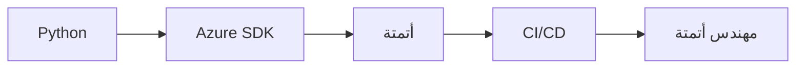

import Tabs from '@theme/Tabs';
import TabItem from '@theme/TabItem';

# 🚀 Python للسحابة

> أتمتة Azure، Azure SDK، الاختبارات — Python هي لغة المهندس السحابي.

## 🎯 أهداف التعلم

بعد إكمال هذه الوحدة، ستكون قادراً على:

- [**أتمتة Python**](01-python-cloud-automation) — أتمتة الموارد السحابية
- [**إتقان Azure SDK**](02-python-azure-sdk-mastery) — إدارة Azure برمجياً
- [**الاختبارات و CI/CD**](03-python-testing-cicd) — اختبارات احترافية

## 💡 المهارات التي ستكتسبها

Python • Azure SDK • pytest • أتمتة • CI/CD

## 📊 معلومات الوحدة

| العنصر           | القيمة           |
| ---------------- | ---------------- |
| **المستوى**      | متوسط            |
| **الوقت المقدر** | 5 ساعات          |
| **المتطلبات**    | Linux            |
| **الشهادات**     | AZ-104           |
| **المشاريع**     | سكريبت جرد Azure |
| **المختبرات**    | —                |

## 🏛️ مهمة CloudNova

> أتمتة نشر 50 خادمًا في Azure باستخدام Python. لا مزيد من النقر في البوابة.

## 🗺️ خريطة الوحدة

## 📖 الدروس

<Tabs>
<TabItem value="all" label="كل الدروس" default>

- [**أتمتة Python**](01-python-cloud-automation) — أتمتة الموارد السحابية
- [**إتقان Azure SDK**](02-python-azure-sdk-mastery) — إدارة Azure برمجياً
- [**الاختبارات و CI/CD**](03-python-testing-cicd) — اختبارات احترافية

</TabItem>
</Tabs>

## 🚀 ابدأ التعلم

[▶️ ابدأ الدرس الأول](01-python-cloud-automation)
