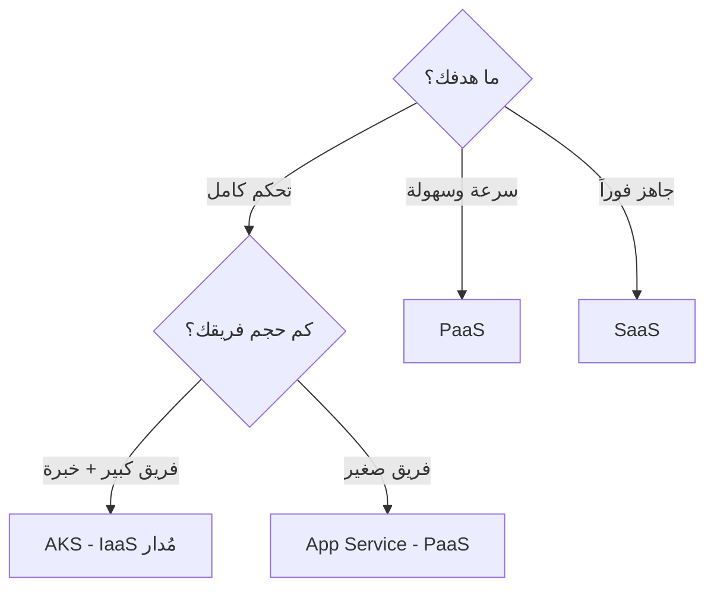
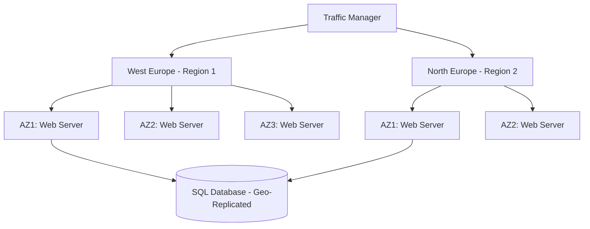
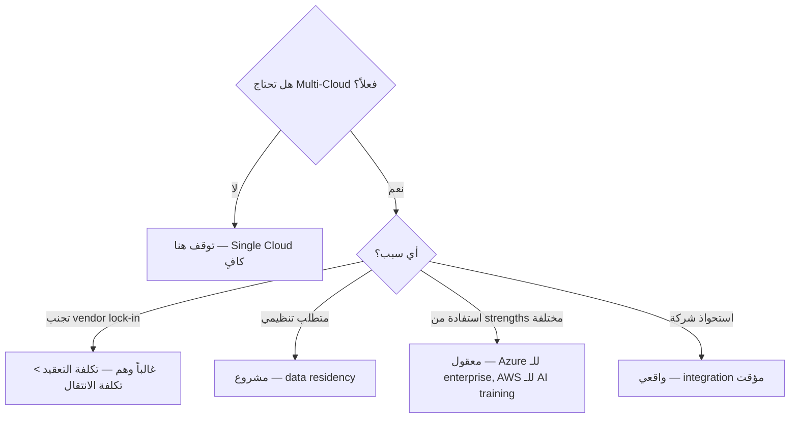

# أساسيات الحوسبة السحابية

> **"السحابة ليست 'حواسيب شخص آخر'. إنها نموذج جديد كلياً للتفكير في البنية التحتية — من الشراء المسبق إلى الدفع حسب الاستخدام."**

## 🎯 أهداف التعلم

بعد إكمال هذا الدرس، ستكون قادراً على:

- شرح نماذج الخدمة السحابية (IaaS, PaaS, SaaS) واختيار الأنسب
- تصميم بنية عالية التوفر باستخدام Regions و Availability Zones
- فهم نموذج المسؤولية المشتركة وتطبيقه
- حساب التكلفة وتحسينها (FinOps)
- اتخاذ قرارات معمارية مبنية على التكلفة والتوفر

---

## ١. لماذا السحابة؟ — الثورة الحقيقية

| قبل السحابة                       | بعد السحابة                       | التأثير على CloudNova           |
| --------------------------------- | --------------------------------- | ------------------------------- |
| شراء خوادم — يصلون بعد ٤ أسابيع   | `az vm create` — ٩٠ ثانية         | أطلقنا منتجنا في شهر بدل ٤ أشهر |
| توقع الحمل المستقبلي (دائماً خطأ) | Auto-scaling — تابع للحظة         | لا خوادم معطلة في منتصف الليل   |
| دفع ثمن الخوادم حتى لو معطلة      | Pay-per-use — ادفع فقط لما تستخدم | وفرنا ٦٠٪ من تكلفة بيئة التطوير |
| ٣ مهندسين لإدارة العتاد           | ٠ مهندسين لإدارة العتاد           | ركزنا على المنتج لا على الأسلاك |
| مركز بيانات واحد = نقطة فشل       | عشرات المراكز حول العالم          | وصلنا لعملاء في ٣ قارات         |

### 🚨 قصة CloudNova: قبل السحابة

> **٢٠١٩:** CloudNova تشتري ١٠ خوادم بـ $60,000. توقعوا ١٠,٠٠٠ مستخدم في السنة الأولى. وصل ٥٠,٠٠٠. الخوادم اختنقت. طلبوا ١٠ خوادم إضافية — تصل بعد ٦ أسابيع. ٦ أسابيع من الأداء البطيء والزبائن الغاضبين.

> **٢٠٢١:** بعد الهجرة للسحابة. Auto-scaling يضيف خوادم تلقائياً في دقائق. الحمل ارتفع ٥ أضعاف في Black Friday — النظام تكيف بدون تدخل بشري.

---

## ٢. نماذج الخدمة — IaaS vs PaaS vs SaaS

| النموذج         | أنت تدير                   | السحابة تدير                      | مثال              | تكلفة الجهد |
| --------------- | -------------------------- | --------------------------------- | ----------------- | ----------- |
| **On-Premises** | كل شيء                     | لا شيء                            | خوادمك في مكتبك   | $$$$        |
| **IaaS**        | OS، middleware، apps، data | Hardware، virtualization، network | Azure VM          | $$$         |
| **PaaS**        | Apps، data                 | OS، runtime، middleware           | Azure App Service | $$          |
| **SaaS**        | لا شيء                     | كل شيء                            | Microsoft 365     | $           |

### 🍕 تشبيه البيتزا (نعم، البيتزا تشرح كل شيء)

- **On-Premises:** تصنع البيتزا من الصفر — تشتري الدقيق، تعجن، تخبز، تغسل الصحون
- **IaaS:** تشتري بيتزا مجمدة — تخبزها في فرنك، لكن عليك مراقبتها
- **PaaS:** تطلب بيتزا — توصل لباب بيتك جاهزة، تأكل مباشرة
- **SaaS:** تذهب للمطعم — كل شيء جاهز، تدفع وتستمتع، ولا تغسل شيئاً

### 🟣 المستوى الإنتاجي — كيف تختار؟



| السيناريو                | التوصية            | لماذا؟                   |
| ------------------------ | ------------------ | ------------------------ |
| Startup بـ ٢ مطورين      | PaaS (App Service) | لا وقت لإدارة الخوادم    |
| تطبيق بـ ٥٠ Microservice | AKS (Kubernetes)   | تحتاج تنسيق معقد         |
| موقع WordPress           | PaaS (App Service) | لا داعي للتعقيد          |
| معالجة بيانات ضخمة       | IaaS (VMs كبيرة)   | تحتاج تحكم كامل بالموارد |

---

## ٣. نموذج المسؤولية المشتركة

```
🟦 Microsoft مسؤولة عن:          🟧 أنت مسؤول عن:
─────────────────────────       ────────────────────
• أمن مراكز البيانات            • بياناتك وتشفيرها
• العتاد المادي                  • نقاط النهاية والتطبيقات
• الشبكة المادية                 • الحسابات وإدارة الهوية
• المضيفين والمحاكيات            • تكوينات الأمان
                                 • الامتثال لسياساتك
```

> **الدرس الذي يتعلمه الجميع بالطريقة الصعبة:** Azure يؤمن البنية التحتية. لكن بياناتك — مسؤوليتك أنت وحدك.

### 🚨 حادثة CloudNova: قاعدة بيانات مكشوفة

> **الموقف:** فريق CloudNova نشر PostgreSQL على Azure. افترض أن "Azure يحمي كل شيء". لم يفعّل جدار الحماية. قاعدة البيانات مكشوفة على الإنترنت ٤ أيام قبل أن يكتشفها تدقيق أمني.

**الخطأ:** الفريق ظن أن نموذج المسؤولية المشتركة يعني "Microsoft تتولى الأمن". الحقيقة: Microsoft تؤمن البنية التحتية، لكن **تكوين الأمان** مسؤوليتك.

---

## ٤. المناطق ومناطق التوفر — تصميم للبقاء

```
Azure Region: West Europe
├── AZ1: مركز بيانات أمستردام — طاقة مستقلة، تبريد مستقل، شبكة مستقلة
├── AZ2: مركز بيانات روتردام — طاقة مستقلة، تبريد مستقل، شبكة مستقلة
└── AZ3: مركز بيانات لاهاي — طاقة مستقلة، تبريد مستقل، شبكة مستقلة
```

| المفهوم               | ماذا يعني                       | مثال                       |
| --------------------- | ------------------------------- | -------------------------- |
| **Region**            | منطقة جغرافية                   | West Europe، East US       |
| **Availability Zone** | مراكز بيانات مستقلة داخل Region | 3 AZ في West Europe        |
| **Fault Domain**      | رف Rack يشارك مصدر طاقة         | Rack #7 في AZ1             |
| **Update Domain**     | مجموعة تُحدّث معاً              | Update Domain 0            |
| **Region Pair**       | منطقتان مرتبطتان للتعافي        | West Europe ↔ North Europe |

### كم AZ تحتاج؟ — المصفوفة الكاملة

| الحالة        | عدد AZ          | التوفر التقريبي | التكلفة الإضافية | مثال        |
| ------------- | --------------- | --------------- | ---------------- | ----------- |
| تطوير واختبار | ١               | ~99.9%          | الأساس           | بيئة dev    |
| إنتاج عادي    | ٢               | ~99.95%         | +50%             | تطبيق SaaS  |
| إنتاج حرج     | ٣               | ~99.99%         | +100%            | بوابة دفع   |
| شديد الحرج    | ٣ + Region Pair | ~99.999%        | +300%            | نظام مستشفى |

### 🏛️ مستوى المعماري — تصميم للفشل

> **"صمم نظامك على افتراض أن مركز بيانات كاملاً سيفشل. لأنه سيفشل يوماً ما."**



---

## ٥. FinOps — فن إدارة التكلفة السحابية

### مثال: تطبيق CloudNova — التكلفة الشهرية

| المورد           | المستوى      | شهرياً    | % من الإجمالي |
| ---------------- | ------------ | --------- | ------------- |
| App Service Plan | P1v2 (٢ نسخ) | $292      | 37%           |
| Azure SQL        | GP ٢ vCores  | $375      | 48%           |
| Storage          | Hot ١٠٠GB    | $5        | &lt;1%        |
| Bandwidth        | ١TB outbound | $87       | 11%           |
| Key Vault        | Standard     | $0.30     | &lt;1%        |
| Monitor          | ٥GB logs     | $15       | 2%            |
| **الإجمالي**     |              | **~$774** | 100%          |

### 🟣 استراتيجيات التوفير — وفر حتى ٧٠٪

```bash
# ١. Reserved Instances — وفر حتى ٧٢٪
# بدل pay-as-you-go، ادفع مقدماً سنة أو ٣ سنوات
# مثال: VM يكلف $150/شهر pay-as-you-go
#       → $95/شهر مع Reserved (سنة) — وفر ٣٧٪
#       → $65/شهر مع Reserved (٣ سنوات) — وفر ٥٧٪

# ٢. Auto-shutdown — وفر ٦٥٪ من dev/test
az vm auto-shutdown -g dev-rg -n dev-vm --time 2000

# ٣. الحجم المناسب — Right-sizing
# Standard_D4s_v3 (4 cores, 16GB) → $150/شهر
# Standard_B2ms   (2 cores,  8GB) → $60/شهر
# ← إذا كان CPU average < 20%، اختر الأصغر

# ٤. احذف الموارد اليتيمة — Zombie resources
az disk list --query "[?managedBy==null].name"  # أقراص بلا خادم
az network public-ip list --query "[?ipAddress==null].name"  # IPs غير مرتبطة

# ٥. Azure Hybrid Benefit
# إذا كنت تملك Windows Server / SQL Server licenses
# → وفر حتى ٤٠٪ على Azure VMs
```

### 📊 لوحة قيادة FinOps — CloudNova

```python
# تدقيق التكلفة الأسبوعي
class FinOpsDashboard:
    def orphaned_disks_cost(self):
        """أقراص بلا خادم — مال مهدر"""
        return len(self.find_orphaned_disks()) * 15  # ~$15/شهر لكل قرص

    def unused_ips_cost(self):
        """IPs غير مستخدمة"""
        return len(self.find_unused_ips()) * 3.6     # ~$3.6/شهر لكل IP

    def oversized_vms_savings(self):
        """خوادم أكبر من الحاجة — كم نوفر بتصغيرها"""
        oversized = [vm for vm in self.vms if vm.avg_cpu < 15]
        return sum(vm.cost * 0.5 for vm in oversized)  # تقريباً نصف التكلفة

finops = FinOpsDashboard()
print(f"💰 توفير شهري ممكن: ${finops.total_savings():,.2f}")
```

---

## ٦. سيناريو CloudNova: اختيار النموذج المناسب

> **الموقف:** CloudNova تبني منصة API جديدة. فريق ٤ مطورين. ميزانية $800/شهر.

### مصفوفة القرار:

| الخيار                 | الإيجابيات                   | السلبيات                       | التكلفة         | الجهد     |
| ---------------------- | ---------------------------- | ------------------------------ | --------------- | --------- |
| **IaaS (VMs)**         | تحكم كامل                    | إدارة OS، تحديثات، نسخ احتياطي | $300 + وقت كثير | عالي      |
| **PaaS (App Service)** | لا إدارة OS، تحديثات تلقائية | أقل مرونة في التكوين           | $292            | منخفض     |
| **AKS (K8s)**          | مرونة عالية، مستقبلي         | يحتاج خبرة K8s، overhead عالي  | $400+           | عالي جداً |

**التوصية:** App Service (PaaS)

> **القاعدة الذهبية:** ابدأ بأقل تعقيد ممكن. لا تبالغ في الهندسة قبل أن تحتاج. تذكر: **YAGNI** — You Ain't Gonna Need It.

---

## 🧠 أسئلة للمراجعة النشطة

1. اشرح نموذج المسؤولية المشتركة — من المسؤول عن ماذا؟
2. كم Availability Zone تحتاج لتطبيق إنتاجي عادي؟ ولماذا؟
3. ما الفرق بين Region و Availability Zone؟
4. كيف توفر ٦٠٪ من تكلفة بيئة التطوير في السحابة؟
5. متى تختار PaaS ومتى تختار IaaS؟

## ✍️ تمرين Feynman

اشرح الفرق بين IaaS و PaaS لصاحب مطعم يريد إنشاء موقع إلكتروني. استخدم تشبيه المطبخ والمطعم.

## 🎴 بطاقات مراجعة

| السؤال                         | الإجابة                                     |
| ------------------------------ | ------------------------------------------- |
| طبقات الخدمة السحابية بالترتيب | IaaS → PaaS → SaaS (من الأعلى تحكماً للأقل) |
| كم AZ لـ 99.99% توفر؟          | ٣ Availability Zones                        |
| ما هو Region Pair؟             | منطقتان مرتبطتان للتعافي من الكوارث         |
| أداة Azure لحساب التكلفة       | Azure Pricing Calculator                    |

## 🎤 أسئلة مقابلة العمل

1. **"كيف تصمم تطبيقاً عالي التوفر في Azure؟"** ← ٣ AZ + Region Pair + Auto-scaling + Geo-replication
2. **"ما هي استراتيجيات توفير التكلفة في السحابة؟"** ← Reserved Instances, auto-shutdown, right-sizing, spot VMs
3. **"اشرح نموذج المسؤولية المشتركة."** ← Microsoft: البنية التحتية. أنت: البيانات والتكوين

---

## 🏛️ طبقة الإنتاج: حوكمة وامتثال المؤسسات

### Azure Governance Hierarchy

```
🏢 Enterprise
 └── 📁 Management Group: CloudNova Corp
      ├── 📁 Management Group: Production
      │   ├── 🔑 Subscription: CloudNova-Prod
      │   │   ├── 📦 Resource Group: app-prod-weu
      │   │   └── 📦 Resource Group: data-prod-weu
      │   └── 🔑 Subscription: CloudNova-Staging
      ├── 📁 Management Group: Development
      │   ├── 🔑 Subscription: CloudNova-Dev
      │   └── 🔑 Subscription: CloudNova-Test
      └── 📁 Management Group: Sandbox
          └── 🔑 Subscription: CloudNova-Lab

🔒 Azure Policy at Management Group level:
├── Production: require 3 AZ, deny public IP on DBs
├── Development: require auto-shutdown, allow smaller VMs
└── Sandbox: require tags, max budget $200/month
```

### Azure Policy — كود يحكم سحابتك

```json
{
  "properties": {
    "displayName": "حظر Public IP على قواعد البيانات",
    "policyRule": {
      "if": {
        "allOf": [
          { "field": "type", "equals": "Microsoft.Sql/servers" },
          { "field": "Microsoft.Sql/servers/publicNetworkAccess", "equals": "Enabled" }
        ]
      },
      "then": { "effect": "Deny" }
    }
  }
}
```

### Compliance Frameworks في السحابة

| الإطار        | ماذا يغطي                      | مثال في Azure                     |
| ------------- | ------------------------------ | --------------------------------- |
| **ISO 27001** | إدارة أمن المعلومات            | Azure Policy + Defender for Cloud |
| **SOC 2**     | أمن وتوفر وسرية بيانات العملاء | Audit logs في Log Analytics       |
| **HIPAA**     | حماية البيانات الصحية          | Encryption at rest + in transit   |
| **PCI DSS**   | أمن بيانات الدفع               | Network segmentation + WAF        |
| **GDPR**      | خصوصية البيانات الأوروبية      | Data residency في EU Regions      |

### Disaster Recovery — أنماط الإنتاج

| النمط                | Recovery Time Objective (RTO) | Recovery Point Objective (RPO) | التكلفة |
| -------------------- | ----------------------------- | ------------------------------ | ------- |
| **Backup & Restore** | ساعات                         | ٢٤ ساعة                        | $       |
| **Pilot Light**      | دقائق                         | ٥ دقائق                        | $$      |
| **Warm Standby**     | دقائق                         | ثوانٍ                          | $$$     |
| **Active-Active**    | ثوانٍ                         | صفر                            | $$$$    |

### 🚨 سيناريو CloudNova: اختبار التعافي

> **المهمة:** CTO تطلب إثبات أن CloudNova تستطيع التعافي من حذف region كامل.

```bash
# ١. توثيق خطة التعافي
# ٢. تشغيل disaster recovery drill ربع سنوي
# ٣. قياس RTO/RPO الفعلي ضد المستهدف
# ٤. توثيق الفجوات وتحسينها

# مثال: اختبار restore من backup
az sql db restore \
  --resource-group dr-test-rg \
  --server cloudnova-dr-test \
  --name CloudNovaDB \
  --dest-name CloudNovaDB-Restored \
  --time "2024-07-15T10:00:00"
```

---

## 🎨 طبقة المعماري: استراتيجيات متقدمة

### Multi-Cloud — متى؟ ولماذا؟



### Hybrid Cloud — الجسر بين الماضي والمستقبل

```
🏢 On-Premises                  ☁️ Azure
─────────────────              ──────────
Active Directory  ←──sync──→  Azure AD Connect
SQL Server        ←──replica─→ Azure SQL Managed Instance
File Server       ←──sync──→  Azure Files
VMware vSphere    ←──Azure Arc──→ Azure Management
```

### استراتيجيات الهجرة إلى السحابة (6 R's)

| الاستراتيجية              | ماذا تعني          | مثال CloudNova                          |
| ------------------------- | ------------------ | --------------------------------------- |
| **Rehost** (Lift & Shift) | انقل كما هو        | VM من on-prem → Azure VM                |
| **Replatform**            | عدّل قليلاً        | SQL Server → Azure SQL Managed Instance |
| **Refactor**              | أعد البناء للسحابة | Monolith → Microservices على AKS        |
| **Repurchase**            | استبدل بـ SaaS     | Jira Server → Jira Cloud                |
| **Retire**                | ألغِ ما لا تحتاجه  | تطبيق قديم لم يعد يستخدم                |
| **Retain**                | أبقِ on-premises   | أنظمة قديمة لا يمكن ترحيلها             |

### 🏛️ قرار معماري: متى تبقى on-premises؟

> **ليس كل شيء يجب أن ينتقل للسحابة.**

| ابقَ on-premises إذا...             | مثال                           |
| ----------------------------------- | ------------------------------ |
| **Latency أقل من 1ms مطلوب**        | نظام تداول مالي                |
| **بيانات شديدة الحساسية قانونياً**  | بيانات مخابرات                 |
| **عتاد متخصص غير متوفر في السحابة** | FPGA مخصص                      |
| **استثمار كبير حديث في on-prem**    | اشتروا خوادم قبل ٦ أشهر بـ $2M |
| **تكلفة السحابة أعلى بشكل واضح**    | حمل ثابت ٢٤/٧ بدون تقلبات      |

---

## 🛠️ تدريبات عملية

### تمرين ١: احسب التكلفة (سهل)

> استخدم [Azure Pricing Calculator](https://azure.microsoft.com/en-us/pricing/calculator/) لتصميم بيئة CloudNova:
>
> - ٢ App Service (P1v2) في West Europe
> - Azure SQL (GP, 4 vCores) مع replica في North Europe
> - ١TB Storage (Hot)
> - ٢TB bandwidth للإنترنت
>
> كم التكلفة الشهرية؟ كم توفر إذا استخدمت Reserved Instances لمدة سنة واحدة؟

### تمرين ٢: صمم خطة تعافي (متوسط)

> صمم خطة Disaster Recovery لتطبيق CloudNova:
>
> - RTO: ١٥ دقيقة
> - RPO: ٥ دقائق
> - الميزانية: $500/شهر إضافية
>
> ما الخدمات التي تحتاجها؟ كم تكلف؟

### تحدي: تدقيق أمني (متقدم)

> قُدم لك اشتراك Azure به ١٠٠+ موارد. اكتب خطة تدقيق لتكتشف:
>
> - الموارد المكشوفة على الإنترنت
> - التكاليف المهدرة
> - الثغرات الأمنية
> - موارد غير ممتثلة للـ policies

### مشروع CloudNova

> **Ticket #CN-501:** "نحن ننمو بسرعة. صمم استراتيجية multi-region لمضاعفة عدد المستخدمين."

---

## 📝 تقييم المعرفة

### ✅ تحقق من فهمك (5 أسئلة)

1. اشرح نموذج المسؤولية المشتركة — أعط مثالاً لشيء مسؤول عنه Microsoft وشيء مسؤول عنه أنت.
2. ما الفرق بين Availability Zone و Region Pair؟
3. كم AZ تحتاج لتحقيق 99.99% توفر؟ احسب عدد دقائق التعطل المسموح بها سنوياً.
4. ما هي الـ 6 R's للهجرة للسحابة؟ أعط مثالاً لكل منها.
5. كيف تمنع فريق التطوير من إنشاء موارد بدون tags في Azure؟

### 📝 اختبار (3 أسئلة مع الإجابات)

**س١:** أي استراتيجية هجرة تناسب تطبيق NET. Framework قديم لا يمكن تعديله؟

- **أ)** Refactor
- **ب)** Rehost
- **ج)** Retire

<details style="display:none">
<summary>الإجابة</summary>

**ب) Rehost (Lift & Shift).** التطبيق لا يمكن تعديله — لكن يمكن نقله كما هو إلى Azure VM. لاحقاً، يمكن replatform إلى Azure App Service عند توفر الوقت.

</details>

**س٢:** كم دقيقة تعطل في السنة = 99.95% availability؟

<details style="display:none">
<summary>الإجابة</summary>

```
365 days × 24 hours × 60 minutes = 525,600 دقيقة/سنة
(100 - 99.95)% = 0.05% تعطل
525,600 × 0.0005 = 262.8 دقيقة ≈ 4.4 ساعات/سنة
```

هذا لماذا 99.95% (٢ AZ) مقبول لتطبيقات كثيرة — ٤ ساعات تعطل سنوياً تكفي للصيانة والتعافي من الأعطال.

</details>

**س٣:** ما الفرق بين Capital Expenditure (CapEx) و Operational Expenditure (OpEx)؟

<details style="display:none">
<summary>الإجابة</summary>

|             | CapEx (On-Premises)       | OpEx (Cloud)              |
| ----------- | ------------------------- | ------------------------- |
| **الدفع**   | مقدماً — مبلغ كبير        | شهرياً — حسب الاستخدام    |
| **مثال**    | شراء خادم بـ $50,000      | VM بـ $500/شهر            |
| **المرونة** | تدفع حتى لو لم تستخدم     | تدفع فقط لما تستخدم       |
| **الضرائب** | إهلاك على ٣-٥ سنوات       | مصروف تشغيلي في نفس السنة |
| **التنبؤ**  | صعب — ماذا لو احتجت أكثر؟ | سهل — scale مع الطلب      |

التحول من CapEx → OpEx هو أحد أكبر دوافع الهجرة للسحابة.

</details>

### 🧠 استدعاء نشط (5)

1. ارسم في ذهنك هيكل Azure Management Group لشركة بـ ٣ بيئات (dev/staging/prod).
2. اشرح الفرق بين RTO و RPO بمثال: بنك مقابل مدونة شخصية.
3. ما هي ٣ طرق لتوفير ٥٠٪ من تكلفة السحابة بدون التأثير على الأداء؟
4. كيف تشرح نموذج المسؤولية المشتركة لمدير غير تقني؟
5. اذكر ٥ علامات أنك تبالغ في هندسة السحابة.

### ✍️ تمرين Feynman (موسع)

اشرح لكل من:

- **صاحب مطعم**: لماذا السحابة أفضل من شراء خادم للموقع الإلكتروني
- **طفل ١٠ سنوات**: كيف تعمل "السحابة" (من أين تأتي البيانات؟)
- **جدّك**: لماذا شركة مثل Netflix تستخدم آلاف الخوادم بدلاً من واحد كبير

### 🎴 بطاقات تعليمية (8)

| السؤال                 | الإجابة                                                  |
| ---------------------- | -------------------------------------------------------- |
| طبقات الخدمة السحابية  | IaaS → PaaS → SaaS (من تحكم كامل → صفر تحكم)             |
| كم AZ لـ 99.99%؟       | ٣ Availability Zones                                     |
| ما هو RTO؟             | Recovery Time Objective — أقصى وقت تعطل مسموح            |
| ما هو RPO؟             | Recovery Point Objective — أقصى فقدان بيانات مسموح       |
| 6 R's للهجرة           | Rehost, Replatform, Refactor, Repurchase, Retire, Retain |
| ما هو Azure Policy؟    | قواعد تحكم ما يمكن وما لا يمكن إنشاؤه في الاشتراك        |
| ما هو Region Pair؟     | منطقتان مرتبطتان للتعافي — ٣٠٠+ ميل بينهما               |
| الفرق بين CapEx و OpEx | CapEx = تدفع مقدماً. OpEx = تدفع شهرياً حسب الاستخدام    |

---

## 🎤 التحضير للمقابلة (موسع)

### System Design

**"صمم بنية تحتية سحابية لـ fintech startup تخدم مليون مستخدم."**

<details style="display:none">
<summary>👀 نموذج الإجابة</summary>

```
المتطلبات:
- High availability (99.99%)
- أمان بيانات مالية (PCI DSS)
- disaster recovery في أقل من ١٥ دقيقة
- ميزانية: $8,000/شهر

التصميم:
┌────────────────────────────────────────────┐
│              Traffic Manager                │
│       (priority: West Europe primary)       │
└─────────────┬──────────────┬───────────────┘
              │              │
    ┌─────────▼──┐   ┌──────▼─────────┐
    │ West Europe │   │ North Europe    │
    │ (Primary)   │   │ (DR)            │
    │  3 AZ       │   │  Active-Passive │
    └─────────────┘   └────────────────┘

West Europe (Primary):
├── App Service Plan P2v3 x3 (across 3 AZ)
├── Azure SQL Business Critical (3 replicas)
├── Redis Premium (active-active across 2 AZ)
├── Front Door + WAF (DDoS + OWASP protection)
├── Key Vault (HSM-backed for PCI compliance)
└── Azure Policy: deny public endpoints

North Europe (DR):
├── App Service Plan P1v3 (standby, scaled down)
├── SQL geo-replica (async replication)
└── Failover: manual approval → automatic

التكلفة التقديرية:
├── App Service: $1,200
├── SQL Database: $1,800
├── Redis: $400
├── Front Door + WAF: $300
├── Bandwidth: $800
├── Monitoring + Security: $400
├── DR (scaled down): $600
└── الإجمالي: ~$5,500/شهر ✅ (داخل الميزانية)
```

</details>

### سؤال تقني

**"كيف تشرح لمدير مالي لماذا فاتورة السحابة ارتفعت من $5K إلى $12K هذا الشهر؟"**

<details style="display:none">
<summary>👀 الإجابة</summary>

1. **لا تقل "السحابة غالية"**. قل: "استخدامنا زاد — وهذا جيد لأنه يعني نمواً."
2. **قدم البيانات**:
   - مستخدمو التطبيق: +40% هذا الشهر
   - ٣ عملاء جدد Enterprise يحتاجون dedicated environments
   - حمل Black Friday المؤقت أضاف $1,500 (مرة واحدة)
3. **أظهر ما فعلته للتحكم**:
   - انتقلنا لـ Reserved Instances — سيوفر $2,000 ابتداءً من الشهر القادم
   - أضفنا auto-shutdown لبيئة dev — وفر $800
4. **التوصية**: صافي الزيادة الدائمة ~$2,700/شهر مقابل نمو 40% في الإيرادات.

</details>

### سؤال سلوكي (STAR)

**"احكِ عن مرة خفضت فيها تكلفة السحابة دون التأثير على الأداء."**

<details style="display:none">
<summary>👀 مثال</summary>

> **S**: فاتورة Azure ارتفعت ٣٥٪ ربع سنوي دون زيادة في المستخدمين.  
> **T**: خفض التكلفة ٣٠٪ خلال ٣ أشهر.  
> **A**: نفذت تدقيق FinOps: وجدت ٢٠ VM idle بعد 8pm، ١٥ قرص غير مرتبط، و٣ قواعد بيانات test بحجم production. أضفت auto-shutdown، right-sizing، و cleanup سكريبت.  
> **R**: وفرنا ٢٨٪ ($4,200/شهر = $50,400/سنة). أعدنا استثمار التوفير في ميزات جديدة.

</details>

---

## 📚 المراجع والروابط

### دروس مرتبطة

- [Azure Fundamentals](../07-azure-core/01-azure-fundamentals) — تطبيق عملي على Azure
- [FinOps Fundamentals](../22-finops/01-finops-fundamentals) — تعمق في إدارة التكلفة
- [Identity Mastery](../23-identity/01-identity-mastery) — الأمان والمسؤولية المشتركة
- [Observability Essentials](../21-observability/01-observability-essentials) — مراقبة ما بنيته

### شهادات ذات صلة

- **AZ-900**: Azure Fundamentals — يغطي كل هذا الدرس
- **AZ-104**: Azure Administrator — تطبيق عملي للـ governance
- **AZ-305**: Azure Solutions Architect — تصميم البنى المعقدة

### مصادر خارجية

- 📖 [Azure Architecture Center](https://learn.microsoft.com/en-us/azure/architecture/)
- 📖 [Azure Well-Architected Framework](https://learn.microsoft.com/en-us/azure/well-architected/)
- 📖 [Cloud Adoption Framework](https://learn.microsoft.com/en-us/azure/cloud-adoption-framework/)
- 📺 "Azure Fundamentals Certification (AZ-900)" — John Savill

### مصطلحات التقنية في هذا الدرس

| المصطلح   | التعريف                                                    |
| --------- | ---------------------------------------------------------- |
| **IaaS**  | Infrastructure as a Service — بنية تحتية كخدمة (تحكم كامل) |
| **PaaS**  | Platform as a Service — منصة كخدمة (لا إدارة OS)           |
| **SaaS**  | Software as a Service — برمجيات كخدمة (جاهز للاستخدام)     |
| **RTO**   | Recovery Time Objective — أقصى وقت تعطل مقبول              |
| **RPO**   | Recovery Point Objective — أقصى فقدان بيانات مقبول         |
| **AZ**    | Availability Zone — مركز بيانات مستقل داخل Region          |
| **CapEx** | Capital Expenditure — إنفاق رأسمالي (شراء أصول)            |
| **OpEx**  | Operational Expenditure — إنفاق تشغيلي (دفع شهري)          |

---

[→ الدرس التالي: Azure Fundamentals](../07-azure-core/01-azure-fundamentals) | [← العودة للوحدة](01-cloud-concepts) | [🏠 الرئيسية](/)
