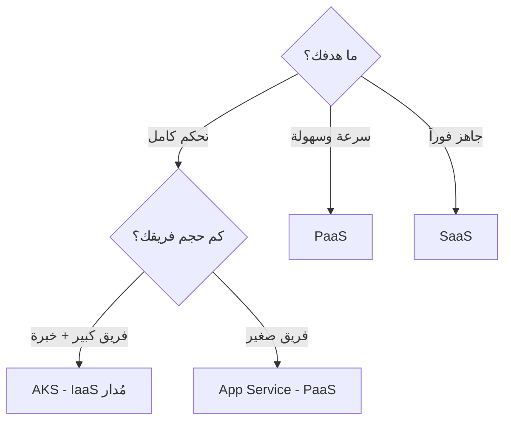
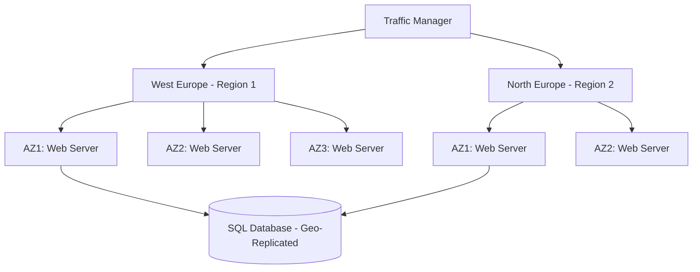

# أساسيات الحوسبة السحابية

> **"السحابة ليست 'حواسيب شخص آخر'. إنها نموذج جديد كلياً للتفكير في البنية التحتية — من الشراء المسبق إلى الدفع حسب الاستخدام."**

## 🎯 أهداف التعلم

بعد إكمال هذا الدرس، ستكون قادراً على:
- شرح نماذج الخدمة السحابية (IaaS, PaaS, SaaS) واختيار الأنسب
- تصميم بنية عالية التوفر باستخدام Regions و Availability Zones
- فهم نموذج المسؤولية المشتركة وتطبيقه
- حساب التكلفة وتحسينها (FinOps)
- اتخاذ قرارات معمارية مبنية على التكلفة والتوفر

---

## ١. لماذا السحابة؟ — الثورة الحقيقية

| قبل السحابة | بعد السحابة | التأثير على CloudNova |
|-------------|-------------|----------------------|
| شراء خوادم — يصلون بعد ٤ أسابيع | `az vm create` — ٩٠ ثانية | أطلقنا منتجنا في شهر بدل ٤ أشهر |
| توقع الحمل المستقبلي (دائماً خطأ) | Auto-scaling — تابع للحظة | لا خوادم معطلة في منتصف الليل |
| دفع ثمن الخوادم حتى لو معطلة | Pay-per-use — ادفع فقط لما تستخدم | وفرنا ٦٠٪ من تكلفة بيئة التطوير |
| ٣ مهندسين لإدارة العتاد | ٠ مهندسين لإدارة العتاد | ركزنا على المنتج لا على الأسلاك |
| مركز بيانات واحد = نقطة فشل | عشرات المراكز حول العالم | وصلنا لعملاء في ٣ قارات |

### 🚨 قصة CloudNova: قبل السحابة

> **٢٠١٩:** CloudNova تشتري ١٠ خوادم بـ $60,000. توقعوا ١٠,٠٠٠ مستخدم في السنة الأولى. وصل ٥٠,٠٠٠. الخوادم اختنقت. طلبوا ١٠ خوادم إضافية — تصل بعد ٦ أسابيع. ٦ أسابيع من الأداء البطيء والزبائن الغاضبين.

> **٢٠٢١:** بعد الهجرة للسحابة. Auto-scaling يضيف خوادم تلقائياً في دقائق. الحمل ارتفع ٥ أضعاف في Black Friday — النظام تكيف بدون تدخل بشري.

---

## ٢. نماذج الخدمة — IaaS vs PaaS vs SaaS

| النموذج | أنت تدير | السحابة تدير | مثال | تكلفة الجهد |
|---------|---------|-------------|------|------------|
| **On-Premises** | كل شيء | لا شيء | خوادمك في مكتبك | $$$$ |
| **IaaS** | OS، middleware، apps، data | Hardware، virtualization، network | Azure VM | $$$ |
| **PaaS** | Apps، data | OS، runtime، middleware | Azure App Service | $$ |
| **SaaS** | لا شيء | كل شيء | Microsoft 365 | $ |

### 🍕 تشبيه البيتزا (نعم، البيتزا تشرح كل شيء)

- **On-Premises:** تصنع البيتزا من الصفر — تشتري الدقيق، تعجن، تخبز، تغسل الصحون
- **IaaS:** تشتري بيتزا مجمدة — تخبزها في فرنك، لكن عليك مراقبتها
- **PaaS:** تطلب بيتزا — توصل لباب بيتك جاهزة، تأكل مباشرة
- **SaaS:** تذهب للمطعم — كل شيء جاهز، تدفع وتستمتع، ولا تغسل شيئاً

### 🟣 المستوى الإنتاجي — كيف تختار؟



| السيناريو | التوصية | لماذا؟ |
|-----------|---------|--------|
| Startup بـ ٢ مطورين | PaaS (App Service) | لا وقت لإدارة الخوادم |
| تطبيق بـ ٥٠ Microservice | AKS (Kubernetes) | تحتاج تنسيق معقد |
| موقع WordPress | PaaS (App Service) | لا داعي للتعقيد |
| معالجة بيانات ضخمة | IaaS (VMs كبيرة) | تحتاج تحكم كامل بالموارد |

---

## ٣. نموذج المسؤولية المشتركة

```
🟦 Microsoft مسؤولة عن:          🟧 أنت مسؤول عن:
─────────────────────────       ────────────────────
• أمن مراكز البيانات            • بياناتك وتشفيرها
• العتاد المادي                  • نقاط النهاية والتطبيقات
• الشبكة المادية                 • الحسابات وإدارة الهوية
• المضيفين والمحاكيات            • تكوينات الأمان
                                 • الامتثال لسياساتك
```

> **الدرس الذي يتعلمه الجميع بالطريقة الصعبة:** Azure يؤمن البنية التحتية. لكن بياناتك — مسؤوليتك أنت وحدك.

### 🚨 حادثة CloudNova: قاعدة بيانات مكشوفة

> **الموقف:** فريق CloudNova نشر PostgreSQL على Azure. افترض أن "Azure يحمي كل شيء". لم يفعّل جدار الحماية. قاعدة البيانات مكشوفة على الإنترنت ٤ أيام قبل أن يكتشفها تدقيق أمني.

**الخطأ:** الفريق ظن أن نموذج المسؤولية المشتركة يعني "Microsoft تتولى الأمن". الحقيقة: Microsoft تؤمن البنية التحتية، لكن **تكوين الأمان** مسؤوليتك.

---

## ٤. المناطق ومناطق التوفر — تصميم للبقاء

```
Azure Region: West Europe
├── AZ1: مركز بيانات أمستردام — طاقة مستقلة، تبريد مستقل، شبكة مستقلة
├── AZ2: مركز بيانات روتردام — طاقة مستقلة، تبريد مستقل، شبكة مستقلة
└── AZ3: مركز بيانات لاهاي — طاقة مستقلة، تبريد مستقل، شبكة مستقلة
```

| المفهوم | ماذا يعني | مثال |
|---------|----------|------|
| **Region** | منطقة جغرافية | West Europe، East US |
| **Availability Zone** | مراكز بيانات مستقلة داخل Region | 3 AZ في West Europe |
| **Fault Domain** | رف Rack يشارك مصدر طاقة | Rack #7 في AZ1 |
| **Update Domain** | مجموعة تُحدّث معاً | Update Domain 0 |
| **Region Pair** | منطقتان مرتبطتان للتعافي | West Europe ↔ North Europe |

### كم AZ تحتاج؟ — المصفوفة الكاملة

| الحالة | عدد AZ | التوفر التقريبي | التكلفة الإضافية | مثال |
|--------|--------|----------------|-----------------|------|
| تطوير واختبار | ١ | ~99.9% | الأساس | بيئة dev |
| إنتاج عادي | ٢ | ~99.95% | +50% | تطبيق SaaS |
| إنتاج حرج | ٣ | ~99.99% | +100% | بوابة دفع |
| شديد الحرج | ٣ + Region Pair | ~99.999% | +300% | نظام مستشفى |

### 🏛️ مستوى المعماري — تصميم للفشل

> **"صمم نظامك على افتراض أن مركز بيانات كاملاً سيفشل. لأنه سيفشل يوماً ما."**



---

## ٥. FinOps — فن إدارة التكلفة السحابية

### مثال: تطبيق CloudNova — التكلفة الشهرية

| المورد | المستوى | شهرياً | % من الإجمالي |
|--------|---------|--------|--------------|
| App Service Plan | P1v2 (٢ نسخ) | $292 | 37% |
| Azure SQL | GP ٢ vCores | $375 | 48% |
| Storage | Hot ١٠٠GB | $5 | &lt;1% |
| Bandwidth | ١TB outbound | $87 | 11% |
| Key Vault | Standard | $0.30 | &lt;1% |
| Monitor | ٥GB logs | $15 | 2% |
| **الإجمالي** | | **~$774** | 100% |

### 🟣 استراتيجيات التوفير — وفر حتى ٧٠٪

```bash
# ١. Reserved Instances — وفر حتى ٧٢٪
# بدل pay-as-you-go، ادفع مقدماً سنة أو ٣ سنوات
# مثال: VM يكلف $150/شهر pay-as-you-go
#       → $95/شهر مع Reserved (سنة) — وفر ٣٧٪
#       → $65/شهر مع Reserved (٣ سنوات) — وفر ٥٧٪

# ٢. Auto-shutdown — وفر ٦٥٪ من dev/test
az vm auto-shutdown -g dev-rg -n dev-vm --time 2000

# ٣. الحجم المناسب — Right-sizing
# Standard_D4s_v3 (4 cores, 16GB) → $150/شهر
# Standard_B2ms   (2 cores,  8GB) → $60/شهر
# ← إذا كان CPU average < 20%، اختر الأصغر

# ٤. احذف الموارد اليتيمة — Zombie resources
az disk list --query "[?managedBy==null].name"  # أقراص بلا خادم
az network public-ip list --query "[?ipAddress==null].name"  # IPs غير مرتبطة

# ٥. Azure Hybrid Benefit
# إذا كنت تملك Windows Server / SQL Server licenses
# → وفر حتى ٤٠٪ على Azure VMs
```

### 📊 لوحة قيادة FinOps — CloudNova

```python
# تدقيق التكلفة الأسبوعي
class FinOpsDashboard:
    def orphaned_disks_cost(self):
        """أقراص بلا خادم — مال مهدر"""
        return len(self.find_orphaned_disks()) * 15  # ~$15/شهر لكل قرص
    
    def unused_ips_cost(self):
        """IPs غير مستخدمة"""
        return len(self.find_unused_ips()) * 3.6     # ~$3.6/شهر لكل IP
    
    def oversized_vms_savings(self):
        """خوادم أكبر من الحاجة — كم نوفر بتصغيرها"""
        oversized = [vm for vm in self.vms if vm.avg_cpu < 15]
        return sum(vm.cost * 0.5 for vm in oversized)  # تقريباً نصف التكلفة

finops = FinOpsDashboard()
print(f"💰 توفير شهري ممكن: ${finops.total_savings():,.2f}")
```

---

## ٦. سيناريو CloudNova: اختيار النموذج المناسب

> **الموقف:** CloudNova تبني منصة API جديدة. فريق ٤ مطورين. ميزانية $800/شهر.

### مصفوفة القرار:

| الخيار | الإيجابيات | السلبيات | التكلفة | الجهد |
|--------|-----------|---------|--------|------|
| **IaaS (VMs)** | تحكم كامل | إدارة OS، تحديثات، نسخ احتياطي | $300 + وقت كثير | عالي |
| **PaaS (App Service)** | لا إدارة OS، تحديثات تلقائية | أقل مرونة في التكوين | $292 | منخفض |
| **AKS (K8s)** | مرونة عالية، مستقبلي | يحتاج خبرة K8s، overhead عالي | $400+ | عالي جداً |

**التوصية:** App Service (PaaS)

> **القاعدة الذهبية:** ابدأ بأقل تعقيد ممكن. لا تبالغ في الهندسة قبل أن تحتاج. تذكر: **YAGNI** — You Ain't Gonna Need It.

---

## 🧠 أسئلة للمراجعة النشطة

1. اشرح نموذج المسؤولية المشتركة — من المسؤول عن ماذا؟
2. كم Availability Zone تحتاج لتطبيق إنتاجي عادي؟ ولماذا؟
3. ما الفرق بين Region و Availability Zone؟
4. كيف توفر ٦٠٪ من تكلفة بيئة التطوير في السحابة؟
5. متى تختار PaaS ومتى تختار IaaS؟

## ✍️ تمرين Feynman

اشرح الفرق بين IaaS و PaaS لصاحب مطعم يريد إنشاء موقع إلكتروني. استخدم تشبيه المطبخ والمطعم.

## 🎴 بطاقات مراجعة

| السؤال | الإجابة |
|--------|---------|
| طبقات الخدمة السحابية بالترتيب | IaaS → PaaS → SaaS (من الأعلى تحكماً للأقل) |
| كم AZ لـ 99.99% توفر؟ | ٣ Availability Zones |
| ما هو Region Pair؟ | منطقتان مرتبطتان للتعافي من الكوارث |
| أداة Azure لحساب التكلفة | Azure Pricing Calculator |

## 🎤 أسئلة مقابلة العمل

1. **"كيف تصمم تطبيقاً عالي التوفر في Azure؟"** ← ٣ AZ + Region Pair + Auto-scaling + Geo-replication
2. **"ما هي استراتيجيات توفير التكلفة في السحابة؟"** ← Reserved Instances, auto-shutdown, right-sizing, spot VMs
3. **"اشرح نموذج المسؤولية المشتركة."** ← Microsoft: البنية التحتية. أنت: البيانات والتكوين

---

[← العودة للوحدة](index.md) | [🏠 الرئيسية](/)
