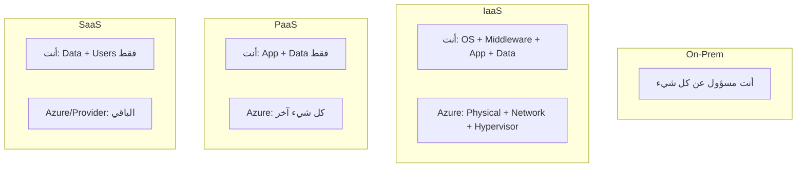

# نماذج الخدمات السحابية بعمق

> "اختيار النموذج الخاطئ قد يكلفك 10 أضعاف التكلفة الحقيقية. هذا ليس مبالغة."

## 🎯 أهداف التعلم

- تحليل عميق لـ IaaS, PaaS, SaaS, FaaS
- مصفوفة اتخاذ القرار لكل سيناريو
- فهم Shared Responsibility Model
- تحليل تكلفة لكل نموذج

## ⏱️ الوقت المقدر: 45 دقيقة | المستوى: Intermediate

---

## 🧠 الطبقة البسيطة

تخيل أنك تريد تناول البيتزا. لديك 4 خيارات:
- **IaaS**: تشتري المكونات وتخبزها بنفسك في بيتك (VM)
- **PaaS**: تذهب لمطعم "اخبز بنفسك" (App Service)
- **SaaS**: تطلب توصيل (M365)
- **FaaS**: آلة بيع بيتزا — تضع النقود تخرج بيتزا (Azure Functions)

---

## 🏗️ مصفوفة Shared Responsibility

---

## 🏗️ متى تختار ماذا؟

| السيناريو | أفضل نموذج | الخدمة في Azure |
|-----------|-----------|----------------|
| رفع تطبيق قديم | IaaS | Virtual Machines |
| تطبيق ويب جديد | PaaS | App Service |
| معالجة صور (event-driven) | FaaS | Functions |
| بريد إلكتروني للشركة | SaaS | Exchange Online |
| تدريب AI Model | IaaS | VM with GPU |
| API بسيط | FaaS | Functions |
| قاعدة بيانات | PaaS | Azure SQL |
| تحكم كامل في OS | IaaS | VM |

---

## 🏛️ تحليل التكلفة

| النموذج | تكلفة ثابتة | تكلفة تشغيلية | إجمالي/شهر |
|---------|-----------|-------------|----------|
| IaaS (B2s VM) | $30 | $10 (إدارة) | ~$40 |
| PaaS (App Service B1) | $55 | $0 | ~$55 |
| FaaS (1M requests) | $0.20 | $0 | ~$0.20 |

**لكن**: التناسب معقد. VM بـ $40 قد تشغّل 10 تطبيقات، بينما 10 App Services = $550!

---

## 🎤 مقابلة

1. **"متى تختار IaaS على الرغم من أن PaaS أسهل؟"**
2. **"كيف تحسب TCO لنقل تطبيق من on-prem إلى cloud؟"**

---

[← Cloud Concepts](./01-cloud-concepts) | [→ Multi-Cloud Strategy](./03-multi-cloud-strategy) | [🏠 الرئيسية](/)
