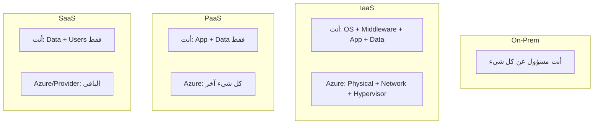
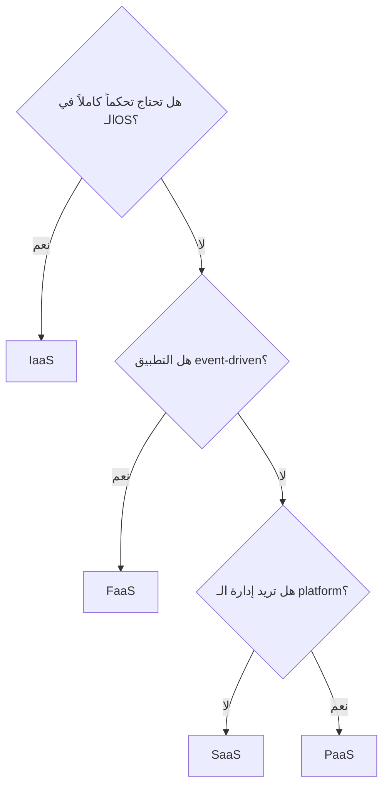

# نماذج الخدمات السحابية بعمق

> "اختيار النموذج الخاطئ قد يكلفك 10 أضعاف التكلفة الحقيقية. هذا ليس مبالغة."

## 🎯 أهداف التعلم

- تحليل عميق لـ IaaS, PaaS, SaaS, FaaS
- مصفوفة اتخاذ القرار لكل سيناريو
- فهم Shared Responsibility Model
- تحليل تكلفة لكل نموذج

## ⏱️ الوقت المقدر: 45 دقيقة | المستوى: Intermediate

---

## 🧠 الطبقة البسيطة

تخيل أنك تريد تناول البيتزا. لديك 4 خيارات:
- **IaaS**: تشتري المكونات وتخبزها بنفسك في بيتك (VM)
- **PaaS**: تذهب لمطعم "اخبز بنفسك" (App Service)
- **SaaS**: تطلب توصيل (M365)
- **FaaS**: آلة بيع بيتزا — تضع النقود تخرج بيتزا (Azure Functions)

---

## 🏗️ مصفوفة Shared Responsibility



---

## 🏗️ متى تختار ماذا؟

| السيناريو | أفضل نموذج | الخدمة في Azure |
|-----------|-----------|----------------|
| رفع تطبيق قديم | IaaS | Virtual Machines |
| تطبيق ويب جديد | PaaS | App Service |
| معالجة صور (event-driven) | FaaS | Functions |
| بريد إلكتروني للشركة | SaaS | Exchange Online |
| تدريب AI Model | IaaS | VM with GPU |
| API بسيط | FaaS | Functions |
| قاعدة بيانات | PaaS | Azure SQL |
| تحكم كامل في OS | IaaS | VM |

### شجرة القرار



---

## 🏛️ تحليل التكلفة

| النموذج | تكلفة ثابتة | تكلفة تشغيلية | إجمالي/شهر |
|---------|-----------|-------------|----------|
| IaaS (B2s VM) | $30 | $10 (إدارة) | ~$40 |
| PaaS (App Service B1) | $55 | $0 | ~$55 |
| FaaS (1M requests) | $0.20 | $0 | ~$0.20 |

**لكن**: التناسب معقد. VM بـ $40 قد تشغّل 10 تطبيقات، بينما 10 App Services = $550!

---

## 🏛️ طبقة الإنتاج: CloudNova Migration Story

عندما بدأت CloudNova، استخدمنا VMs لكل شيء. لماذا؟ لأن هذا ما كنا نعرفه.

بعد 6 أشهر:
- 3 VMs أسبوعياً تحتاج تحديثات أمنية (3 ساعات مهدرة)
- patching فاتنا → ثغرة في الإنتاج
- **القرار**: الانتقال إلى PaaS

```bash
# قبل: VM مع Nginx + Node.js يدوياً
az vm create --name web-01 --image Ubuntu2204 ...
ssh web-01 "apt update && apt install nginx nodejs..."

# بعد: App Service بنقرة واحدة
az webapp up --name cloudnova-api --runtime "NODE:20-lts" --sku B1
```

**النتيجة**: 15 ساعة شهرياً تم توفيرها. صفر patching.

---

## 🎨 طبقة المعماري

### Trade-off Matrix

| | IaaS | PaaS | FaaS | SaaS |
|---|------|------|------|------|
| **التحكم** | كامل | محدود | ضئيل | لا شيء |
| **المسؤولية** | عالية | متوسطة | منخفضة | منخفضة جداً |
| **المرونة** | عالية | متوسطة | محدودة | محدودة |
| **سرعة النشر** | أيام | ساعات | دقائق | دقائق |
| **Vendor Lock-in** | منخفض | متوسط | عالي | عالي جداً |

### متى تبقى على IaaS؟

- تطبيقات legacy مع متطلبات OS محددة
- تدريب AI models (تحتاج GPU + drivers محددين)
- متطلبات compliance صارمة (التحكم الكامل في التشفير)

### متى تنتقل إلى PaaS؟

- أي تطبيق ويب حديث
- أي API
- أي قاعدة بيانات

---

## 🛠️ تدريبات

### تمرين 1: تصنيف السيناريوهات

صنف هذه السيناريوهات (IaaS/PaaS/SaaS/FaaS):
1. موقع WordPress لشركة صغيرة → PaaS (App Service)
2. تدريب نموذج AI على 10,000 صورة → IaaS (VM with GPU)
3. معالجة ملفات PDF تلقائياً عند الرفع → FaaS
4. بريد إلكتروني لـ 500 موظف → SaaS (M365)

### تمرين 2: احسب TCO

احسب التكلفة الشهرية لـ:
- تشغيل 5 تطبيقات ويب صغيرة على 5 App Services vs VM واحدة كبيرة

### تحدي: صمم استراتيجية ترحيل

صمم خطة لترحيل تطبيق legacy (.NET Framework 4.8) إلى Azure. هل تختار IaaS أم تعيد كتابته لـ PaaS؟

---

## 📝 تقييم

### ✅ فحص المعرفة
1. ما الفرق بين IaaS و PaaS في Shared Responsibility؟
2. متى تختار FaaS بدلاً من PaaS؟
3. لماذا قد يكون IaaS أرخص من PaaS لتطبيقات متعددة؟
4. ما هو Vendor Lock-in؟ وكيف تتجنبه؟
5. أعط مثالاً حقيقياً لكل نموذج خدمة.

### 📝 اختبار
1. **تطبيق .NET Framework 4.8 القديم:** IaaS (لا يدعم PaaS)
2. **API بسيط لـ chatbot:** FaaS (Functions)
3. **تطبيق ويب حديث مع CI/CD:** PaaS (App Service)

### 🃏 بطاقات

| السؤال | الإجابة |
|--------|---------|
| IaaS | Infrastructure as a Service (VMs) |
| PaaS | Platform as a Service (App Service) |
| SaaS | Software as a Service (M365) |
| FaaS | Functions as a Service (Azure Functions) |
| Shared Responsibility | من مسؤول عن ماذا بينك وبين Azure |

---

## 🎤 مقابلة

1. **"متى تختار IaaS على الرغم من أن PaaS أسهل؟"**
   → Legacy apps، GPU workloads، compliance strict، need OS-level control

2. **"كيف تحسب TCO لنقل تطبيق من on-prem إلى cloud؟"**
   → Compute + Storage + Networking + Labor + Training + Migration costs

3. **"صمم architecture لتطبيق e-commerce على Azure"**
   → Front Door → App Service → Azure SQL + Redis Cache + Blob Storage + Functions

---

## 📚 مراجع

| النوع | الرابط |
|-------|--------|
| درس مرتبط | [Cloud Concepts](./01-cloud-concepts) |
| درس مرتبط | [Azure Fundamentals](../../07-azure-core/01-azure-fundamentals) |
| شهادة | AZ-900 (Azure Fundamentals) |

---

[← Cloud Concepts](./01-cloud-concepts) | [→ Multi-Cloud Strategy](./03-multi-cloud-strategy) | [🏠 الرئيسية](/)
