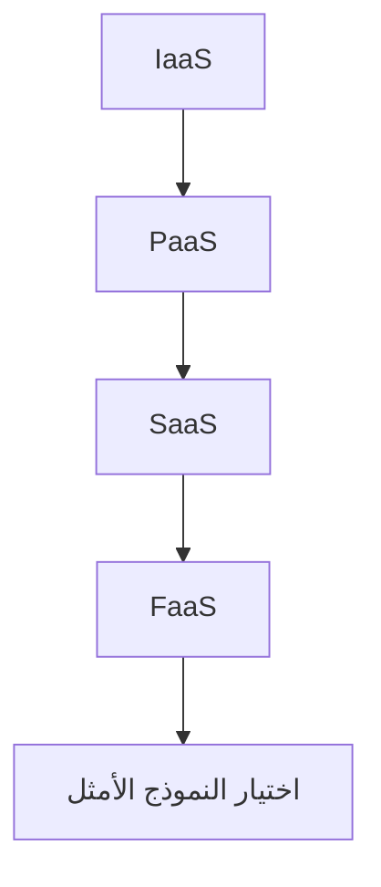

import Tabs from '@theme/Tabs';
import TabItem from '@theme/TabItem';

# 🚀 أساسيات السحابة

> IaaS، PaaS، SaaS، FaaS — نماذج الخدمة السحابية وكيف تختار الأنسب.

## 🎯 أهداف التعلم

بعد إكمال هذه الوحدة، ستكون قادراً على:

- [**مفاهيم السحابة**](01-cloud-concepts) — IaaS، PaaS، SaaS
- [**نماذج الخدمة بعمق**](02-cloud-service-models-deep) — متى تختار ماذا
- [**استراتيجية Multi-Cloud**](03-multi-cloud-strategy) — AWS + Azure + GCP

## 💡 المهارات التي ستكتسبها

نماذج الخدمة • Multi-Cloud • Cloud Economics • Well-Architected Framework

## 📊 معلومات الوحدة

| العنصر           | القيمة         |
| ---------------- | -------------- |
| **المستوى**      | مبتدئ          |
| **الوقت المقدر** | 4 ساعات        |
| **المتطلبات**    | الأسس الهندسية |
| **الشهادات**     | AZ-900         |
| **المشاريع**     | —              |
| **المختبرات**    | —              |

## 🏛️ مهمة CloudNova

> قدم تقريراً للإدارة: ما نموذج السحابة الأنسب لتطبيق CloudNova الجديد؟

## 🗺️ خريطة الوحدة

## 📖 الدروس

<Tabs>
<TabItem value="all" label="كل الدروس" default>

- [**مفاهيم السحابة**](01-cloud-concepts) — IaaS، PaaS، SaaS
- [**نماذج الخدمة بعمق**](02-cloud-service-models-deep) — متى تختار ماذا
- [**استراتيجية Multi-Cloud**](03-multi-cloud-strategy) — AWS + Azure + GCP

</TabItem>
</Tabs>

## 🚀 ابدأ التعلم

[▶️ ابدأ الدرس الأول](01-cloud-concepts)
